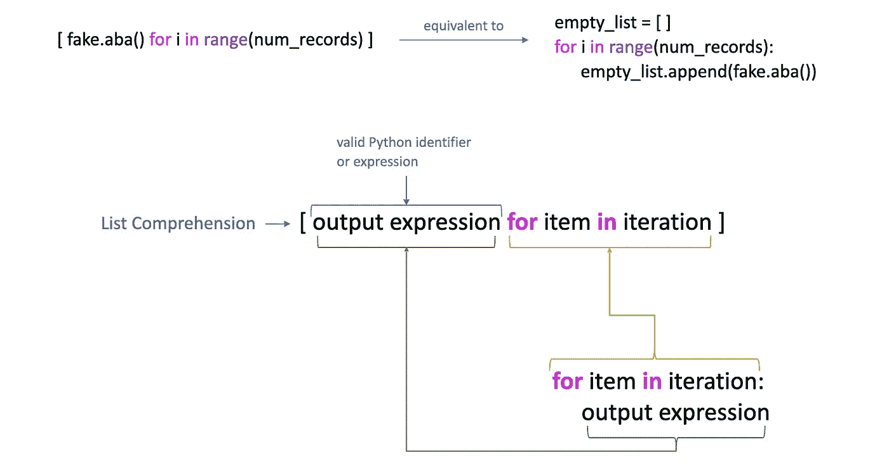
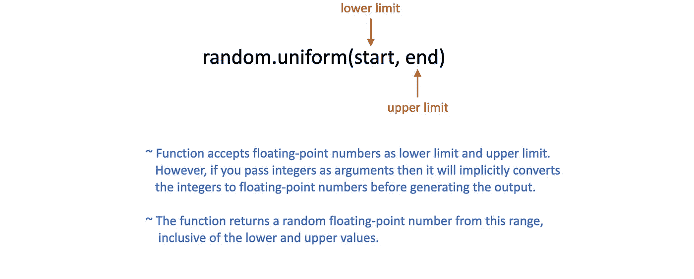

# 使用 Python 生成合成数据

> 原文：[`towardsdatascience.com/generating-synthetic-data-with-python-ea15fd0555ee`](https://towardsdatascience.com/generating-synthetic-data-with-python-ea15fd0555ee)

## 创建合成数据的全面指南

[](https://iffatm.medium.com/?source=post_page-----ea15fd0555ee--------------------------------)[](https://towardsdatascience.com/?source=post_page-----ea15fd0555ee--------------------------------) [Iffat Malik](https://iffatm.medium.com/?source=post_page-----ea15fd0555ee--------------------------------)

·发布在[Towards Data Science](https://towardsdatascience.com/?source=post_page-----ea15fd0555ee--------------------------------) ·阅读时长 14 分钟·2023 年 7 月 31 日

--


作者提供的图片

我们一次又一次地听到数据在推动增长、创新和竞争力方面的关键作用。它已经成为所有行业成功的基石。本质上，数据已成为我们每一个努力的基础，无论是撰写技术博客、教育内容、测试产品或调试软件，还是探索 AI/ML 训练模型和算法的复杂性，数据都处于所有这些任务的核心。

获得完全适合各种需求和兴趣的精确数据可能是一项艰巨的任务。在互联网上寻找你所需的确切数据既令人沮丧又耗时。即使你成功找到合适的数据，清理和处理数据的过程也可能需要宝贵的时间、资源和费用。此外，隐私问题、数据敏感性、版权和监管限制通常是重要的障碍。例如，包含敏感信息的数据集，如医疗数据、财务记录数据，或从版权网站获取的演示数据集等。

在这样的情况下，合成数据会拯救我们！在本文中，我们将探讨合成数据的全部内容，以及如何使用 2 个不同的库在 Python 中生成它。

## 什么是合成数据？

根据[维基百科](https://en.wikipedia.org/wiki/Synthetic_data)，合成数据是人工生成的数据，而非源自现实世界事件。用最简单的话来说，

> 合成数据 = 虚假数据

它是现实数据的复制，可能保持其相似性而不泄露有关真实个人、情况或实体的任何特定信息。你可能已经听说过不同的术语，包括计算机生成的数据、人工数据、AI 生成的数据或模拟数据，但本质上，它们都是或多或少相同的——虚假数据。

## 为什么需要合成数据？

你可能会想知道，既然我们已经拥有大量真实世界的数据，为什么还需要合成数据。它有多种价值，它允许我们创建看起来像真实数据但不包含任何有关人员或情况的真实信息的附加数据。合成数据帮助我们保护隐私（当真实数据不能向他人公开时），解决数据稀缺问题（当适合的数据有限或无法进行分析或研究时），并在不依赖敏感/受限的真实数据的情况下测试 AI/ML 模型，或者在受控条件下测试非常特定的行为。

还有许多其他情况需要合成数据。例如，真实数据可能难以获得或成本过高，或者数据点太少（数据集不够大，或包含的样本数量不足以有效训练模型、得出重要结论或获得准确结果）

设想一个银行希望预测其借贷部门客户的信用风险。他们需要历史数据，包括信用行为、还款历史、收入、姓名、联系方式和其他相关细节。然而，由于数据隐私问题和遵守数据保护法规如[GDPR](https://gdpr.eu/what-is-gdpr/)，以及过去数据的有限可用性和高数据获取成本，他们可能缺乏足够的数据来训练模型或通过数据分析得出结论。

仅有少量真实数据时，捕捉复杂性和信用模式变得困难，从而导致预测的潜在不准确性。为了解决这个问题，银行可以生成类似于真实客户特征和信用行为的合成数据集。这可以提高模型性能，减少过拟合风险，并提供更准确的预测，使银行能够做出明智且可靠的信用决策。

## 如何生成合成数据？

现在我们对合成数据是什么以及为什么需要它有了更多了解，接下来让我们进入下一步：如何生成它？合成数据主要有两种生成方式，

**1\. 通过复制实际数据的部分并将其用作参考，**

+   通过对原始数据集应用变换或修改来创建现有真实数据的变体。这个过程通常被称为[数据增强](https://www.mygreatlearning.com/blog/understanding-data-augmentation/)。

+   例如，在文本数据中，你可以引入一些小的变化，例如随机插入或删除文本、在保持核心含义不变的情况下重新措辞等，以扩展数据集的大小。

**2\. 通过从头创建一个全新的数据集**，

+   另外，你可以根据某些标准从头生成完全新的数据点。

+   这种方法通常用于处理敏感或私人数据，因为它确保合成数据集中没有暴露真实数据。

两种方法各有优点，可根据数据生成任务的具体要求和目标选择，如真实数据的可用性、数据隐私问题、数据的复杂性以及合成数据集的预期用途。在本文中，我们将使用第二种方法。

## 情景

想象一下，我们需要创建一个包含进行信用风险分析所需的所有信息的客户表。以下是我打算创建的字段列表，

+   ***客户 ID***：表中每个客户的唯一标识符。

+   ***客户姓名***：客户的名字。

+   ***年龄***：客户的年龄，因为这可能是信用风险评估的相关因素。

+   ***收入***：客户的收入水平，这对于评估他们偿还贷款能力至关重要。

+   ***信用评分***：基于客户的信用历史评估其信用 worthiness。

+   ***债务收入比***：客户的总债务与其收入的比例，显示其财务稳定性。

+   ***就业状态***：客户的就业状态——在职、失业、自雇等。

+   ***贷款金额***：客户申请的贷款金额。

+   ***贷款期限***：客户偿还贷款的时间长度。例如，如果贷款期限为 36 个月，客户必须在 36 个月内偿还贷款。贷款期限影响还款计划，较长的期限可能导致较低的月付款但较高的总体利息，而较短的期限可能导致较高的月付款但较低的总体利息。

+   ***付款历史***：客户在贷款和信用账户上的过往付款行为。

+   ***受抚养人数***：财务上依赖于客户的人员数量。

在 Python 中，你可以找到各种创建合成数据的库。它们提供了不同级别的复杂性和功能来生成合成数据。根据你的需求，你可以选择最适合的库。务必检查，

+   官方文档

+   社区支持

以获取这些库的最新信息。在本文中，我们将使用以下 Python 库，

+   Faker

+   随机

## 破解代码

在开始编码之前，我们先了解一下我们将要使用的库，

```py
#import required library
import random
import pandas as pd
from typing import Dict
from faker import Faker
```

+   ***Faker*** - 这是一个生成合成数据的 Python 库，提供了多种功能来创建真实看起来的个人信息。

+   ***random*** - 这是一个标准的 Python 库，提供生成随机数据的函数。它最常用于生成随机整数、浮点数和从元素列表中进行随机选择。

+   ***Pandas*** - 这是一个流行的 Python 库，用于数据操作，包括数据清理、过滤、分组、合并等任务。它设计用于处理结构化数据，如表格和时间序列数据，提供了高效的数据分析强大功能。

+   ***typing*** - 这是一个 Python 库，提供了将类型提示添加到代码中的工具。类型提示通过指定变量和函数参数的预期类型来帮助提高代码的清晰度和可读性。它在 Python 3.5 中引入。

现在，让我们开始编程吧！第一步是创建一个 *Faker* 实例。

```py
#create a Faker instance and set the locale to GB(Great Britain)
fake = Faker(['en_GB'])
```

我们为什么需要它？嗯，*Faker* 实例充当一个 *生成器*，可以创建各种类型的数据。*生成器* 是 Python 中的一个对象，它按请求一次生成一个值的序列。你可以在这里了解更多，

[](https://medium.com/swlh/writing-memory-efficient-programs-using-generators-in-python-49854bb57da6?source=post_page-----ea15fd0555ee--------------------------------) [## 使用生成器编写内存高效的 Python 程序。

### 对 Python 的生成器函数和生成器表达式的基本介绍。

medium.com](https://medium.com/swlh/writing-memory-efficient-programs-using-generators-in-python-49854bb57da6?source=post_page-----ea15fd0555ee--------------------------------)

通过使用 *Faker* 提供的函数，你可以轻松生成看起来像真的数据！你还可以在设置 *Faker* 实例时指定区域。区域指的是具有自己独特文化、语言和信息呈现方式的特定地方或国家。当我们将区域设置为特定地区时，*Faker* 生成的数据将匹配该地方的特征，比如该国家常见的名字和地址。

在上面的代码中，使用 *“en_GB”* 允许我们访问针对英国（United Kingdom）量身定制的函数，提供特定于地点的数据。

现在，进行编程的下一步，让我们创建一个生成所有所需字段的函数，按照给定的规格。

```py
def generate_customer_data(num_records: int):
    customer_data: Dict[str, list] = {
        'customer_id': [fake.aba() for i in range(num_records)],
        'customer_name': [fake.name() for name in range(num_records)],
        'age': [random.randint(18, 70) for age in range(num_records)],
        'income(£)': [random.randint(20000, 100000) for income in range(num_records)],
        'credit_score': [random.randint(300, 850) for score in range(num_records)],
        'debt_to_income_ratio': [round(random.uniform(0.1, 1.0), 2) for ratio in range(num_records)],
        'employment_status': [random.choice(['Employed', 'Unemployed', 'Self-employed']) for status in range(num_records)],
        'loan_amount': [random.randint(1000, 50000) for amount in range(num_records)],
        'loan_term': [random.choice([12, 24, 36, 48, 60]) for term in range(num_records)],
        'payment_history': [random.choice(['Good', 'Fair', 'Poor']) for history in range(num_records)],
        'number_of_dependents': [random.randint(0, 5) for dep in range(num_records)]
    }
    return customer_data
```

在上面的代码块中，

+   我们创建了一个名为 *‘generate_customer_data’* 的函数，该函数接受一个参数 *‘num_records’*，表示我们希望生成的合成客户记录的数量。

+   *‘(num_records: int)’* 指定了一个类型提示，表示该函数期望一个整数作为此参数。

+   在 *‘generate_customer_data’* 函数内部，我们正在创建一个名为 *‘customer_data’* 的字典，用于保存每个客户的合成数据。

+   *‘customer_data: Dict[str, list]’* 表示字典的 *keys* 将是字符串，而相应的 *values* 将是 *lists*。

> 我们使用类型提示来指定预期的数据类型，以便更好地理解和阅读代码。

让我们理解一下上面代码块的第一行，

```py
#customer_id:- a unique identifier for each customer in the table
'customer_id': [fake.aba() for i in range(num_records)]
```

在这里，*‘customer_id’* 是键，对应的值是一个 *list*。这一行代码使用 *Faker* 库中的 ‘*fake.aba()’* 方法生成一个 *list* 类型的客户 ID。这个方法随机生成一个 9 位数的数字，我们将用它作为唯一的客户 ID。

如果你注意到，这是一行代码，通常被称为*“一行代码”*。在这里，它被称为*列表推导式*，是一种在 Python 中编写*列表*的简洁方法。



作者提供的图片：列表推导式的常见语法

你可以在这里阅读有关 Python 支持的各种*推导式*的更多信息，

[](/comprehensions-and-generator-expression-in-python-2ae01c48fc50?source=post_page-----ea15fd0555ee--------------------------------) ## Python 中的推导式和生成器表达式

### 要了解 Python 的推导式功能，首先了解推导式的概念是很重要的…

[towardsdatascience.com

📌 **附注**

```py
#customer_id:- a unique identifier for each customer in the table
'customer_id': [fake.aba() for i in range(num_records)]

#preferred approach
'customer_id': [fake.aba() for _ in range(num_records)]
```

在代码的第二行*for*循环中，我使用了*‘_’*（*下划线*）代替*‘i’*。这两种方法都是正确的，但使用*‘_’* 是更常见和推荐的做法，当我们不打算使用循环变量时（在这种情况下，*‘i’* 是循环变量）。

这是一个更清晰的方式来表示循环变量在推导式中不相关或未被使用。这使得代码更加易读和标准，帮助他人更容易理解你的代码。如果你使用*‘i’* 作为循环变量，它可能暗示着有某种用途，导致混淆和不必要的变量赋值。因此，

> 当你不需要循环变量时，使用下划线作为占位符是一种良好的实践，使你的代码更干净、更简洁。

既然如此，由于我正在写一篇适合初学者的文章，我选择了使用循环变量。然而，传达最佳方法也是很重要的！

接下来，在类似的方式下，我为客户表生成了所有必需字段的合成信息，

+   ***‘customer_name’: [fake.name() for name in range(num_records)]***

    这段代码使用 *‘fake.name()’* 方法从 *Faker* 库生成每个客户的名称。这个方法用于生成一个随机和合成的名字，看起来像是一个真实的人名。它可以生成来自各种文化和地区的名字，包括名字和姓氏。由于在代码开头我们将区域设置为*‘en-GB’*，这确保了合成的数据与英国非常相似。

+   ***‘age’: [random.randint(18, 70) for age in range(num_records)]***

    这一行生成了一个客户年龄的列表，使用了*‘random.randint()’*函数。此函数用于生成指定范围内的随机整数。你提供两个数字作为参数——第一个是最小值，第二个是最大值。它然后返回范围内的一个随机整数，包括最小值和最大值。在我们的情况下，此函数生成每个客户的随机年龄，范围在*18*和*70*之间，包括*18*和*70*。


作者提供的图片：random.randint() 的语法

+   ***‘income’: [random.randint(20000, 100000) for income in range(num_records)]***

    这生成了一个随机收入水平的列表，使用了*‘random.randint()’*函数。如前所述，每个收入是一个随机整数，范围在*20,000*和*100,000*之间，包括*20,000*和*100,000*。

+   ***‘credit_score’: [random.randint(300, 850) for score in range(num_records)]***

    这生成了一个信用评分的列表，使用了*‘random.randint()’*函数。到目前为止，你已经理解了这个过程：它为每个客户生成一个随机的信用评分，范围在*300*和*850*之间，包括*300*和*850*。

+   ***‘debt_to_income_ratio’: [round(random.uniform(0.1, 1.0), 2) for ratio in range(num_records)],***

    这生成了一个债务收入比的列表，使用了*‘random.uniform()’*函数。此函数用于生成指定范围内的随机小数。你提供两个数字作为参数：下限和上限，然后函数会生成这两个值之间的随机小数，包括下限和上限。*‘round(random.uniform(0.1, 1.0), 2)’*表示每个比率是一个*0.1*到*1.0*之间的随机浮点数，四舍五入到两位小数。



作者提供的图片：random.uniform() 的语法

+   ***‘employment_status’: [random.choice([‘Employed’, ‘Unemployed’, ‘Self-employed’]) for status in range(num_records)],***

    这生成了一个每个客户的就业状态列表，使用了*‘random.choice()’*函数。此函数允许你从列表或任何元素序列中选择一个随机项。你提供列表或序列作为参数，函数将随机选择并返回该序列中的一个元素。在我们的背景下，每个客户的状态是从给定的选项列表中随机选择的：‘*Employed*’，‘*Unemployed*’，或*‘Self-employed’*。


作者提供的图片：random.choice() 的语法

+   ***‘loan_amount’: [random.randint(1000, 50000) for amount in range(num_records)],***

    这生成了一个每个客户的贷款金额列表，使用了*‘random.randint()’*函数。每个客户的贷款金额是*1,000*和*50,000*之间的随机整数，包括*1,000*和*50,000*。

+   ***‘loan_term’: [random.choice([12, 24, 36, 48, 60]) for term in range(num_records)],***

    这一行使用*‘random.choice()’*函数生成一个贷款期限列表。正如我们之前讨论的*‘employment_status’*，每个客户的贷款期限是从给定的选项列表中随机选择的：*12*、*24*、*36*、*48*或*60*个月。

+   ***‘payment_history’: [random.choice([‘Good’, ‘Fair’, ‘Poor’]) for history in range(num_records)],***

    这一行使用*‘random.choice()’*函数生成一个支付历史列表。每个支付历史都是从选项列表中随机选择的：*‘Good’*、*‘Fair’*或*‘Poor’*。

+   ***‘number_of_dependents’: [random.randint(0, 5) for dep in range(num_records)],***

    这生成了一个依赖人数的列表，使用*‘random.randint()’*函数。每个依赖人数是*0*到*5*之间的随机整数，包括*0*和*5*。

这个解释相当详细，是吧？现在，随着我们接近循环的结束，处理完所有客户后，我们返回包含合成数据的*‘customer_data’*字典。

现在我们已经定义了函数中每个字段的必要细节，让我们继续调用函数。但在此之前，我们将设置要生成的记录总数，并将其存储在变量*‘number_of_rows’*中。完成后，我们将使用这个值调用*‘generate_customer_data’*函数。在这里，我们生成*10000*个合成记录。

```py
#total number of records to generate
number_of_rows: int = 10000

#generate synthetic data for the Customer table
customer_data: Dict[str, list] = generate_customer_data(number_of_rows)
```

*‘customer_data: Dict[str, list]’*表示该函数以字典形式返回合成数据，其中*keys*将是*strings*，对应的*values*将是*lists*。

进入代码的最后部分，在提取所有必要的信息后，我们有选择下一步的方案。我们可以将其导出到*CSV*、*Excel*或*JSON*文件中，也可以打印出来。然而，保留数据在 pandas DataFrame 中是个好主意。这样你可以立即使用它，也可以在未来进行数据分析。使用 DataFrame，你可以执行各种操作，清理和准备数据，分析数据，并顺畅地与其他库配合使用。

```py
#create a pandas DataFrame from the dictionary 'customer_data'
df_customer: pd.DataFrame = pd.DataFrame(customer_data)

#export the synthetic data to a CSV file
outout_file: str = 'synthetic_customer_data.csv'
df_customer.to_csv(outout_file, index=False, encoding='utf-8', header="true")

print(f"Synthetic data is created according to specific requirements and saved to {outout_file}")
```

在上面的代码块中，我们使用了函数*‘generate_customer_data’*返回的字典*‘customer_data’*来创建一个 pandas DataFrame*‘df_customer’*。‘df_customer: pd.DataFrame’*表示*‘df_customer’*是*‘pd.DataFrame’*类型的变量，这意味着它是一个 Pandas DataFrame。

最后，让我们将这些数据保存到*CSV*文件中。请注意，默认情况下，文件将创建在与程序相同的目录中。

```py
#export the synthetic data to a CSV file
outout_file: str = 'synthetic_customer_data.csv'
df_customer.to_csv(outout_file, index=False, encoding='utf-8', header="true")
```

在这里，我们创建了*‘synthetic_customer_data.csv’*作为输出文件，并将其存储到变量*‘output_file’*中。‘*to_csv()’*将把 Pandas DataFrame 保存为*CSV*文件。

+   *index=False*表示 DataFrame 的索引列将不会包含在结果*CSV*文件中。默认情况下，它设置为*true*。

+   *encoding=’utf-8'* 指定了在将 DataFrame 写入 *CSV* 文件时使用的字符编码。

+   *header=”true”* 包括列名作为 *CSV* 文件中的表头行。默认情况下，设置为 *true*。

## 结论

本文旨在介绍使用 Python 生成合成数据的基础知识。通过使用各种库，如 scikit-learn、SDV、Gretel、CTGAN、faker、random 等，你可以高效地为各种用例生成数据。

尽管合成数据提供了众多好处，但它也有其缺点。一些常见的缺点包括可能无法准确复制现实世界的复杂性、准确表示稀有事件的挑战，以及如果没有仔细创建和验证可能引入的偏见。合成数据生成的有效性依赖于你的具体需求和可用的库。因此，彻底评估你的需求和可用工具的能力至关重要，因为它们直接影响生成的合成数据的准确性和有用性。

这里有一些资源可以帮助你开始使用合成数据：

+   [合成数据与真实数据](https://research.aimultiple.com/synthetic-data-vs-real-data/)

+   [合成数据 - 皇家学会](https://royalsociety.org/-/media/policy/projects/privacy-enhancing-technologies/Synthetic_Data_Survey-24.pdf)

+   [Faker 库](https://faker.readthedocs.io/en/master/)

+   [Random 库](https://python.readthedocs.io/en/stable/library/random.html)

+   [类型提示](https://docs.python.org/3.5/library/typing.html)

[Cassie Kozyrkov](https://medium.com/u/2fccb851bb5e?source=post_page-----ea15fd0555ee--------------------------------)，谷歌的首席决策科学家，撰写了关于合成数据的详尽入门指南，值得一读，

+   什么是合成数据？

+   合成数据实用指南

+   [你为什么需要合成数据？](https://kozyrkov.medium.com/why-would-you-want-synthetic-data-5e919e2cbf0c)

+   AI 生成的合成数据

+   [合成数据的利与弊](https://kozyrkov.medium.com/the-pros-and-cons-of-synthetic-data-f44ebb4d9e98)

本文使用的代码可在我的 [GitHub 仓库](https://github.com/PhoenixIM/Pure_Python/blob/master/Synthetic_Data_Generator.ipynb) 中找到，生成的输出文件‘*synthetic_customer_data.csv’* 可在 [GitHub Gist](https://gist.github.com/PhoenixIM/7ffda2f1c4d521f13a56ed9c3804fa31) 中访问。

[*成为会员并阅读 Medium 上的每一个故事*](https://medium.com/@iffatm/membership)*.*

祝学习愉快！
