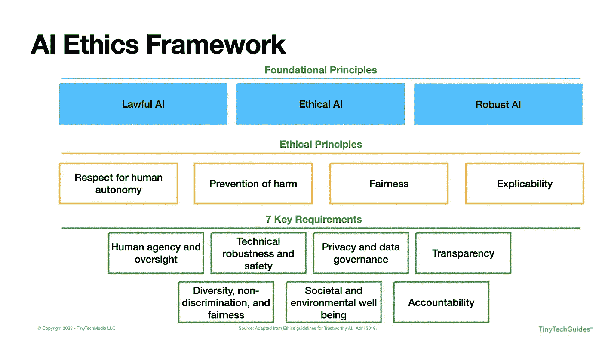

# 生成式 AI 伦理

> 原文：[`towardsdatascience.com/generative-ai-ethics-b2db92ecb909?source=collection_archive---------15-----------------------#2023-07-25`](https://towardsdatascience.com/generative-ai-ethics-b2db92ecb909?source=collection_archive---------15-----------------------#2023-07-25)

## 自主内容时代的关键考虑因素

 [David Sweenor](https://medium.com/@davidsweenor?source=post_page-----b2db92ecb909--------------------------------)

·

[关注](https://medium.com/m/signin?actionUrl=https%3A%2F%2Fmedium.com%2F_%2Fsubscribe%2Fuser%2Fec7aed1f3ef1&operation=register&redirect=https%3A%2F%2Ftowardsdatascience.com%2Fgenerative-ai-ethics-b2db92ecb909&user=David+Sweenor&userId=ec7aed1f3ef1&source=post_page-ec7aed1f3ef1----b2db92ecb909---------------------post_header-----------) 发布于 [Towards Data Science](https://towardsdatascience.com/?source=post_page-----b2db92ecb909--------------------------------) ·11 分钟阅读·2023 年 7 月 25 日

--

作者提供的照片 — 大卫·E·斯维诺

随着围绕生成式人工智能（AI）的喧嚣，关于如何负责任地实施这一变革性技术的问题越来越多。本文将回顾欧盟（EU）的 AI 伦理指南，并讨论在使用大型语言模型（LLMs）时实施 AI 伦理框架的关键考虑因素。

# 可信 AI 伦理指南

2019 年 4 月 8 日，欧盟实施了[人工智能（AI）的伦理和负责任使用框架](https://digital-strategy.ec.europa.eu/en/library/ethics-guidelines-trustworthy-ai)。报告定义了构建可信 AI 的三项指导原则：

1.  **合法性**：AI 应遵守法律法规和当地规定。

1.  **伦理**：AI 系统应具备伦理性，遵循伦理原则和价值观。

1.  **稳健**：由于 AI 可能在短时间内对大规模人群造成显著危害，它需要在技术和社会上都具备稳健性。

对于跨国公司而言，这提出了一个有趣的问题：如何在地缘政治边界之间应用这一框架，因为在世界某个地区被视为合法和伦理的做法，可能在另一个地区并不适用。许多公司采取最严格的规定，并在所有地区单方面适用。然而，“一刀切”的方法可能并不适用或可接受。

欧盟的框架见下图 1.1。

**图 1.1：欧洲联盟的 AI 伦理框架**

作者提供的图示——David E. Sweenor，TinyTechGuides 创始人

基于这三项基础原则，得出四项伦理原则和七项关键要求。这些伦理原则包括：

1.  **尊重人类自主权**：这一原则强调，人类应在与 AI 的互动中保持控制和自由。“AI 系统不应无理地使人类从属、胁迫、欺骗、操控、条件化或驱使。”[1] 从根本上讲，AI 应支持人类参与民主过程。我们已经看到[一些国家对公民实施“社会评分”](https://www.technologyreview.com/2022/11/22/1063605/china-announced-a-new-social-credit-law-what-does-it-mean/)，这应引起关注。

1.  **防止伤害**：AI 系统不应造成身体、心理或情感上的伤害。鉴于 AI 的普及性和迅速影响，重要的是要密切监控 AI 的输出，以防止“由于权力或信息的不对称”对公民、员工、企业、消费者和政府的无意操控。[2] 我们已经看到自动驾驶汽车制造商在所谓的[AI 电车难题](https://www.turing.ac.uk/blog/ais-trolley-problem-problem)中与这一原则斗争。当然，这不仅限于机器人系统；人们依赖 ChatGPT 获取医疗建议，鉴于其生成虚假信息的倾向，我们需要小心。

1.  **公平性**：AI 系统应当无偏见且不歧视，旨在“实现利益和成本的平等分配”。[3] 公平性意味着不应削弱人类选择，并且“AI 从业者应平衡竞争利益和目标，尊重手段与目的之间的比例原则”。[4] 从表面上看，这似乎很简单，但你知道吗，公平性有超过二十种数学定义？[5]

1.  **可解释性**：AI 系统需要透明、可审计、可复现和可解释。如果 AI 用于决定影响你的事情，你有权了解算法如何做出该决定。例如，如果你被拒绝了信用，AI 系统的操作员应该能够提供所有影响该决定的因素。当使用“黑箱”模型时，例如神经网络和生成对抗网络（GANs），这可能会成为问题。

这引出了七项要求：

1.  **人类代理和监督**：本质上，这一要求指出 AI 系统应该尊重人权，不应完全自主运行。AI 应该辅助，而不是替代人类决策。应有一个挑战 AI 决策的过程，并且在必要时，人类应能够覆盖 AI 的决策。这听起来不错，但当数以百计或千计的决策自动做出时，你如何有效跟踪所有这些决策以确保不会出错？

1.  **技术健壮性和安全性**：AI 系统需要安全、稳健，并能够抵御恶意行为者和网络攻击。它们应提供准确的预测，且可靠、可复现。组织必须优先考虑网络安全，并制定攻击的应急计划及系统离线时的操作方式。他们需要特别注意对抗性数据投毒，即恶意行为者修改训练数据以导致错误预测。

1.  **隐私和治理**：“AI 系统必须在整个系统生命周期内保证隐私和数据保护。”[6] AI 系统的开发者需要设置保护措施，以防止恶意数据或代码被输入系统。指南还强调，只有授权用户才能访问个人数据，这些数据必须公平、公正，并遵守整个生命周期中的所有隐私规定。组织需要思考的一个领域是什么构成“授权用户”？你看到过[Roomba 拍摄女性上厕所](https://www.technologyreview.com/2022/12/19/1065306/roomba-irobot-robot-vacuums-artificial-intelligence-training-data-privacy/)的案例吗？

1.  **透明性**：组织必须能够追溯数据的来源，了解其来源、如何收集、转化和使用。这一过程应该是可审计的，AI 输出应该是可解释的。这对数据科学家来说是一个挑战，因为可解释的模型通常不如“黑箱”算法准确。此要求还说明，人与 AI 互动时应该意识到这一点——换句话说，AI 不应该假装成真人，应该清楚我们是在与机器人互动。

1.  **多样性、非歧视和公平性**：AI 应平等对待所有群体——这可能说起来容易做起来难。该要求建议设计师应包括来自不同文化、经验和背景的人，以帮助减轻许多文化中存在的历史偏见。AI 应对所有人都可及，无论是否有残疾或其他因素。这就引发了一个问题，什么定义了“群体”？显而易见的保护类别包括年龄、种族、肤色、地区/信仰、国籍、性别、年龄、身体或精神残疾或退伍军人身份。是否还有其他因素需要考虑？如果我是保险公司，我可以对拥有“更健康”习惯的人收取比那些被认为“不健康”的人更少的费用吗？

1.  **社会和环境福祉**：AI 系统应致力于改善社会、促进民主，并创建环保和可持续的系统。仅仅因为你可以做某件事，并不意味着你*应该*做这件事。商业领袖需要批判性地考虑 AI 的潜在社会影响。训练 AI 模型的成本是什么？这些成本是否与您的环境、社会和公司治理（ESG）政策相抵触？我们已经看到社交媒体平台如 [TikTok 在向孩子推送有害内容](https://www.cnn.com/2022/12/15/tech/tiktok-teens-study-trnd/index.html)。

1.  **问责制**：AI 系统设计师应对其系统负责，这些系统应可审计，并提供一种方式，让受决策影响的人能够纠正任何不公平的决定。设计师可能会对对个人或群体造成的任何伤害负责。这引发了一个有趣的问题——如果系统出现故障，谁应负责？是基础模型的提供者，还是使用生成式 AI 的公司？

虽然这些原则表面上似乎直观，但“在这些原则的解释、重要性、涉及的问题、领域或行为者以及如何实施方面存在实质性差异。”[7]

# LLM 的 AI 伦理考虑

现在我们了解了欧盟 AI 伦理指南，让我们深入探讨 LLM 的独特考虑因素。

在上一篇博客中，[GenAIOps: Evolving the MLOps Framework](https://medium.com/towards-data-science/genaiops-evolving-the-mlops-framework-b0012f936379) 我概述了生成式 AI 和 LLM 的三项关键能力，包括：

● **内容生成**：生成式 AI 可以生成类似人类质量的内容——包括文本、音频、图像/视频甚至软件代码。现在，需要注意的是，生成的内容可能不准确——最终用户有责任确保生成的内容真实且不具误导性。开发人员需要确保生成的代码没有漏洞和病毒。

● **内容总结与个性化**：快速浏览大量文档并迅速总结内容是生成性人工智能的一个强项。除了快速创建文档、电子邮件和 Slack 消息的总结外，生成性人工智能还可以为特定个人或角色个性化这些总结。

● **内容发现与问答**：许多组织在不同的数据孤岛中分散着大量的内容和数据。许多数据和分析供应商正在利用大型语言模型（LLMs）和生成性人工智能自动发现并连接这些分散的来源。最终用户可以用普通语言查询这些数据，以理解关键点并深入探讨更多细节。

鉴于这些不同的能力，我们在创建人工智能伦理框架时需要考虑哪些因素？

# 人工干预与监督

由于生成性人工智能本质上可以自主生成内容，这可能会降低人工干预和监督的程度。你可以想象一下，你每天收到多少垃圾邮件？营销团队创建这些邮件，将它们加载到营销自动化系统中，然后按下“开始”按钮。这些系统在自动驾驶模式下运行，往往被遗忘并持续运行。

鉴于生成性人工智能可以以惊人的速度生成文本、图像、音频、视频和软件代码，我们可以采取哪些步骤来确保有人工干预；特别是在关键应用中？如果我们在自动化医疗建议、法律建议和其他更“敏感”的内容时，组织需要认真思考如何保持对这些系统的控制和监督。公司需要采取保障措施，确保做出的决策符合人类的价值观和意图。

# 技术稳健性与安全性

众所周知，生成性人工智能模型可能会生成意外或甚至有害的内容。公司需要严格测试和验证其生成性人工智能模型，以确保它们是可靠和安全的。此外，如果生成的内容有误，我们需要有机制来处理和纠正这些输出。互联网充满了糟糕和具有分裂性的内容，一些公司已经雇佣内容审核员来尝试审查可疑内容，但这似乎是一个不可能完成的任务。最近有报道称，这些内容可能对心理健康造成严重损害（[美联社新闻 — ​​肯尼亚的 Facebook 内容审核员称工作是‘折磨’。他们的诉讼可能会产生全球影响。](https://apnews.com/article/kenya-facebook-content-moderation-lawsuit-8215445b191fce9df4ebe35183d8b322)）

# 隐私与治理

生成性 AI 模型是在从互联网收集的数据上进行训练的。许多 LLM 制造商实际上并没有公开详细的训练数据细节。现在，这些模型可能在敏感或私人数据上进行训练，而这些数据本不应公开可用。看看三星，因无意中泄露专有数据而被禁止使用生成性 AI 工具（[TechCrunch — 三星在 4 月内部数据泄露后禁止使用生成性 AI 工具如 ChatGPT](https://techcrunch.com/2023/05/02/samsung-bans-use-of-generative-ai-tools-like-chatgpt-after-april-internal-data-leak/)）。如果生成性 AI 产生的输出包含或类似真实的私人数据会怎样？根据《彭博法律》，[OpenAI 最近被起诉诽谤](https://news.bloomberglaw.com/tech-and-telecom-law/openai-hit-with-first-defamation-suit-over-chatgpt-hallucination)由于 ChatGPT 的幻觉。

我们可以肯定地说，公司需要对用于训练生成性 AI 模型的数据来源有详细的了解。当你使用自己的数据对模型进行微调和适配时，你可以选择删除或匿名化这些数据。然而，如果基础模型提供者使用了不适合模型训练的数据，你仍可能面临风险。如果是这种情况，谁应负责任？

# 透明度

就其本质而言，“黑箱”模型很难解释。实际上，许多这些 LLMs 具有数十亿个参数，所以我建议它们不可解释。公司应致力于透明度，创建有关模型工作原理、局限性、风险和用于训练模型的数据的文档。同样，这说起来容易做起来难。

# 多样性、非歧视和公平

与上述相关，如果没有得到妥善训练和管理，生成性 AI 可能会产生偏见或歧视性的输出。公司可以尽力确保数据的多样性和代表性，但鉴于许多 LLM 提供者并未公开用于训练的数据，这是一项艰巨的任务。除了尽可能了解训练数据的风险和局限性之外，公司还需要建立监控系统，以检测有害内容，并设立机制以标记、阻止其分发并根据需要进行纠正。

# 社会和环境福祉

对于具有 ESG 计划的公司来说，训练 LLMs 消耗大量计算资源——即消耗相当多的电力。当你开始部署生成性 AI 功能时，组织需要关注环境足迹，并寻求减少的方法。有几位研究人员正在寻找减少模型大小和加速训练过程的方法。随着这一领域的发展，公司至少应在年报中考虑环境影响。

# 责任

这将成为未来几年内一个活跃的诉讼领域。如果生成性 AI 产生有害或误导性内容，谁应对此负责？谁在法律上负有责任？在美国法院系统中已有几个诉讼悬而未决，这些诉讼将为未来的其他诉讼奠定基础。除了有害内容之外，如果你的 LLM 生成了衍生作品呢？你的 LLM 是否在受版权或法律保护的材料上进行了训练？如果它生成了数据衍生物，法院将如何处理这一问题？随着公司实施生成性 AI 能力，应当建立控制和反馈机制，以便在出现问题时采取相应的行动。

# 摘要

生成性 AI 在革新世界运作方式方面蕴藏着巨大潜力，但其快速演变也带来了众多伦理困境。随着公司进入生成性 AI 的领域，必须深刻理解已建立的伦理指南以导航其实施。通过这样做，组织可以利用 AI 的变革力量，同时确保遵守伦理标准，防范潜在的陷阱和危害。

如果你想了解更多关于人工智能的内容，可以查看我的书籍 [《人工智能：让 AI 为你的业务服务的执行指南》在亚马逊](https://www.amazon.com/Artificial-Intelligence-Executive-Guide-Business/dp/B09X4KTYS4) 或 [在 Google Play 上的 AI 解说有声书](https://play.google.com/store/audiobooks/details/Artificial_Intelligence_An_Executive_Guide_to_Make?id=AQAAAECisyHzkM&hl=en_US&gl=US)。

[1] 欧洲委员会. 2021\. “可信 AI 的伦理指南 | 塑造欧洲的数字未来。” Digital-Strategy.ec.europa.eu. 2021 年 3 月 8 日\. [`digital-strategy.ec.europa.eu/en/library/ethics-guidelines-trustworthy-ai`](https://digital-strategy.ec.europa.eu/en/library/ethics-guidelines-trustworthy-ai).

[2] 欧洲委员会. 2021\. “可信 AI 的伦理指南 | 塑造欧洲的数字未来。” Digital-Strategy.ec.europa.eu. 2021 年 3 月 8 日\. [`digital-strategy.ec.europa.eu/en/library/ethics-guidelines-trustworthy-ai`](https://digital-strategy.ec.europa.eu/en/library/ethics-guidelines-trustworthy-ai).

[3] 欧洲委员会. 2021\. “可信 AI 的伦理指南 | 塑造欧洲的数字未来。” Digital-Strategy.ec.europa.eu. 2021 年 3 月 8 日\. [`digital-strategy.ec.europa.eu/en/library/ethics-guidelines-trustworthy-ai`](https://digital-strategy.ec.europa.eu/en/library/ethics-guidelines-trustworthy-ai).

[4] 欧洲委员会. 2021\. “可信 AI 的伦理指南 | 塑造欧洲的数字未来。” Digital-Strategy.ec.europa.eu. 2021 年 3 月 8 日\. [`digital-strategy.ec.europa.eu/en/library/ethics-guidelines-trustworthy-ai`](https://digital-strategy.ec.europa.eu/en/library/ethics-guidelines-trustworthy-ai).

[5] Verma, Sahil, 和 Julia Rubin. 2018. “公平性定义解释。”《国际软件公平性研讨会论文集 — FairWare ’18》。 [`doi.org/10.1145/3194770.3194776`](https://doi.org/10.1145/3194770.3194776)。

[6] 欧洲委员会. 2021. “值得信赖的人工智能伦理指南 | 塑造欧洲的数字未来。” Digital-Strategy.ec.europa.eu. 2021 年 3 月 8 日。 [`digital-strategy.ec.europa.eu/en/library/ethics-guidelines-trustworthy-ai`](https://digital-strategy.ec.europa.eu/en/library/ethics-guidelines-trustworthy-ai)。

[7] Jobin, Anna, Marcello Ienca, 和 Effy Vayena. 2019. “全球人工智能伦理指南概况。”《自然机器智能》1 (9): 389–99。 [`doi.org/10.1038/s42256-019-0088-2`](https://doi.org/10.1038/s42256-019-0088-2)。
