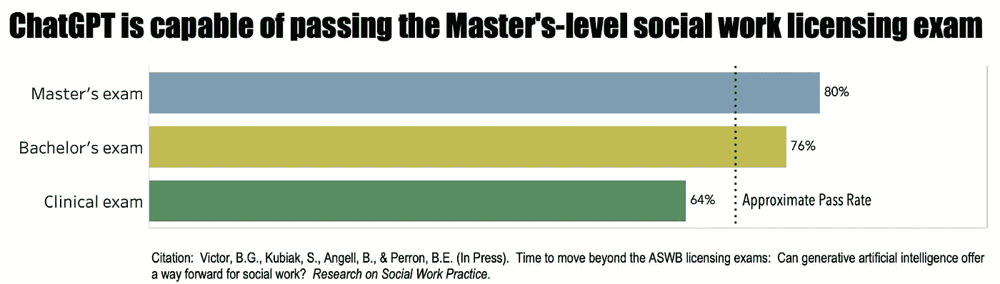

# 社会工作学生的生成式人工智能：第一部分

> 原文：[`towardsdatascience.com/generative-ai-for-social-work-students-part-i-1f19ee9cbbe1?source=collection_archive---------4-----------------------#2023-03-20`](https://towardsdatascience.com/generative-ai-for-social-work-students-part-i-1f19ee9cbbe1?source=collection_archive---------4-----------------------#2023-03-20)

## 一个范式转变

 [Brian Perron, PhD](https://b-r-i-a-n.medium.com/?source=post_page-----1f19ee9cbbe1--------------------------------)

·

[关注](https://medium.com/m/signin?actionUrl=https%3A%2F%2Fmedium.com%2F_%2Fsubscribe%2Fuser%2Fbee210a2a20&operation=register&redirect=https%3A%2F%2Ftowardsdatascience.com%2Fgenerative-ai-for-social-work-students-part-i-1f19ee9cbbe1&user=Brian+Perron%2C+PhD&userId=bee210a2a20&source=post_page-bee210a2a20----1f19ee9cbbe1---------------------post_header-----------) 发表在 [Towards Data Science](https://towardsdatascience.com/?source=post_page-----1f19ee9cbbe1--------------------------------) ·12 分钟阅读·2023 年 3 月 20 日

--

作者使用 ChatGPT 制作的 ASCII 艺术小狗。

近年来，人工智能（AI）发展迅速，产生了强大的工具，如生成式人工智能和大型语言模型。生成式人工智能是一种可以根据从现有数据中学到的模式创造新内容的人工智能，比如文本、图像或音乐。大型语言模型，如 OpenAI 的 GPT 系列，是生成式人工智能的一个子集，经过专门训练以理解和生成类人语言。这些模型变得越来越复杂，能够生成连贯、符合上下文甚至富有创造性的输出。

一年多前，我开始使用 GPT，并对其生成与人类作者难以区分的文本的能力感到惊讶。这种能力也引发了对学术不端行为的担忧。因此，我在 Medium 上撰写了一篇文章，预测 AI 辅助学术不端行为的出现。

从那时起，我密切关注生成式 AI 的发展，并探索它们如何与我对传统 AI 系统的兴趣互补。最近，我和我的同事评估了 ChatGPT 通过模拟的硕士级社会工作执照考试的能力——它做到了。我们研究的预印本可以在[这里](https://www.researchgate.net/publication/369181098_Time_to_Move_Beyond_the_ASWB_Licensing_Exams_Can_Generative_Artificial_Intelligence_Offer_a_Way_Forward_for_Social_Work)查看，并将很快在[《社会工作实践研究》](https://journals.sagepub.com/home/rsw)上发表。ChatGPT 现在能以我在一年之前无法想象的闪电速度完成各种复杂任务。

作者提供的图片。

作为社会工作专业的学生，你可能会想这些技术进步如何影响你的教育体验。AI 可以彻底改变你学习、研究和应对社会工作复杂挑战的方式。大型语言模型不仅仅是生成或重写文本。你可以利用这些模型来总结冗长的政策文件，分析定量和定性数据，生成项目评估的见解，自动化社区组织中的日常功能，创建营销材料，构建网络应用和网站——还有更多。

我坚信，通过建立对 AI 技术的扎实基础和有效使用这些技术的技能，你可以提升学习体验并开启新的职业机会。同时，如果没有正确的心态、培训和经验，这些模型对你的学习和职业生涯也会带来重大挑战和风险。

本文是一个系列的第一部分，旨在为 MSW 学生提供学习和建立 AI 技术能力的起点，重点介绍大型语言模型。第一篇文章概述了生成式 AI 在社会工作中的不同应用，并对伦理问题进行了初步讨论，后续文章将继续探讨这些问题。即将讨论的主题包括：

+   第二部分：AI 的基本知识、能力和实践

+   第三部分：通过 AI 提升教育体验的策略

+   第四部分：提示工程的艺术与科学

# 生成式 AI 在社会工作中的应用

生成式 AI 工具正作为一种变革性力量出现在各种领域，包括商业、医学和法律。尽管 AI 技术在社会工作领域刚刚开始受到关注，但现在是学生积极思考如何利用这一工具以提升和简化服务交付、赋能弱势群体、促进更加公平结果的最佳时机。

我将提供几个例子来说明我们如何使用生成式 AI。这些例子并不全面或完全代表生成式 AI 的能力。请记住，AI 技术的领域广泛且不断发展。根据谷歌和 Alphabet 的首席执行官**桑达尔·皮查伊**的说法，[AI 的能力每六个月翻一番](https://blog.google/technology/ai/bard-google-ai-search-updates/#:~:text=Today%2C%20the%20scale%20of%20the,of%20people%20around%20the%20world.)。

## ***心理健康服务***

大型语言模型在社会工作领域中的一个有前景的应用是心理健康服务。由 AI 驱动的虚拟治疗助手可以在治疗会议之间或当社会工作者不立即可用时，向客户提供支持和指导。例如，虚拟助手可以帮助客户练习应对策略、提供心理教育或提供简短的压力减轻干预。这些将是可以支持各种任务的助手，但不会替代社会工作者。

大型语言模型可以帮助社会工作者更好地理解客户的语言模式。通过分析基于文本的沟通或治疗会议的转录，AI 可以识别模式、主题和情感，这些可能为客户的情感状态、挑战和治疗进展提供有价值的见解。例如，AI 可以通过分析客户的用词选择、语调或情感表达来帮助检测抑郁、焦虑或其他心理健康问题的迹象。

大型语言模型的另一个实际应用是简化文档处理过程。社会工作者可以从帮助管理大量文书工作的工具中受益，例如撰写案例记录、治疗计划和进展报告，这些工作可能耗时且会减少与客户的接触时间。通过利用 AI，社会工作者可以减少在行政任务上花费的时间和精力，从而可以更多地专注于直接的客户护理，提升整体心理健康服务的质量。

## ***项目管理***

生成性语言模型在提升社会工作组织内程序管理方面可以发挥重要作用。管理和协调社会工作程序涉及大量以写作为主的任务，例如起草报告、创建和更新培训材料以及与利益相关者沟通。AI 驱动的工具可以利用原始数据和现有模板来生成文本，作为这些任务的起点。通过自动化初步起草过程，社会工作者可以节省时间，并专注于完善和调整内容，以确保准确反映程序的影响和成果。

这种支持可以带来更高效的报告，并更好地向利益相关者、资助者和政策制定者传达程序结果。大型语言模型还可以帮助开发和更新社会工作程序的培训材料。通过分析现有内容并融入新的研究或最佳实践，AI 可以建议对培训材料进行修订和补充，确保它们保持最新和有效。

## ***政策分析***

生成性 AI 对于从事政策分析的社会工作者来说，可以是一项宝贵的资产。政策分析是社会工作专业中的一个关键方面，涉及审查、评估和制定政策以解决社会问题。政策分析通常要求社会工作者浏览复杂且冗长的政策文件，这可能既耗时又具挑战性。大型语言模型可以帮助社会工作者更高效地综合和评估政策文件。通过提取关键信息并总结要点，AI 驱动的工具可以使社会工作者快速掌握政策要点，而无需通读整个文件。这种工作流程可以节省时间，并让社会工作者专注于分析政策的影响、优势和劣势。

生成性 AI 在政策分析中的另一个有用应用是识别现有政策中的差距和机会。通过分析和比较多个政策文件，AI 可以识别出模式、趋势以及政策可能存在的不足或不一致之处。AI 可以帮助社会工作者确定需要进一步关注或采取新方法来解决未满足的需求的领域。此外，大型语言模型可以协助社会工作者根据识别出的差距和机会生成政策建议。通过利用广泛的知识库，AI 可以建议基于证据的解决方案和最佳实践，以促进政策制定。

## ***程序评估***

程序评估通常要求社会工作者分析大量的定性和定量数据，以确定程序的成功并识别改进领域。大型语言模型可以帮助社会工作者更高效地分析程序数据，并生成可能需要时间才能显现的见解。例如，人工智能驱动的工具可以通过识别参与者的主题、模式和情感来分析定性数据，如访谈和焦点小组。因此，人工智能驱动的工具可以为社会工作者提供有关客户和其他利益相关者的经验和观点的宝贵信息，这些信息可以为程序改进提供参考。

同样，人工智能可以分析定量数据，例如程序结果测量，通过识别趋势、相关性和异常情况。通过自动化数据分析的初始阶段，社会工作者可以专注于解释结果，并运用他们的专业知识做出数据驱动的决策和建议。

通过利用人工智能驱动的数据分析生成的见解，社会工作者可以评估其项目的效率和效果，并确定改进领域。大型语言模型还可以通过建议基于证据的实践和根据类似项目或情况的分析生成潜在解决方案，帮助社会工作者探索替代策略和干预措施。

此外，生成型人工智能还可以通过生成清晰、简洁且易于理解的报告来协助沟通评估结果，从而有效地将结果和建议传达给各个利益相关者。这些过程有助于确保程序评估结果被理解和采取行动，最终实现客户和社区的更好结果。

## ***社区组织***

生成型人工智能可以在支持社区组织工作方面发挥重要作用。社区组织的一个关键方面是有效的沟通和外展，以动员个人、团体和组织围绕共同目标或问题进行行动。

大型语言模型可以帮助社会工作者创建有针对性、吸引人且具有文化敏感性的消息，这些消息能够与不同受众产生共鸣。通过根据不同社区成员的偏好、语言和关注点定制消息，人工智能驱动的工具可以提高外展活动的效果，并帮助与社区成员建立更强的联系。此外，人工智能还可以帮助识别在线对话和社交媒体中的趋势和新兴问题，使社会工作者能够保持对社区需求和优先事项的了解和回应。

生成式人工智能还可以帮助简化社区组织工作中的协作和资源管理。通过自动化创建和更新共享文档、跟踪任务进度和协调日程安排，AI 驱动的工具可以节省时间，提高组织工作整体的效率。此外，社会工作者和社区组织者可以利用 AI 分析社区资源和需求的数据，从而识别出协作的缺口和机会。这种支持使社会工作者能够就资源分配和合作伙伴关系做出明智的决策，从而最大化他们工作的影响力。

生成式人工智能可以在社区组织中提供宝贵的帮助，通过帮助开发倡导材料和政策提案来实现。这种实际应用涉及 AI 驱动的工具分析现有政策、研究和最佳实践，帮助社会工作者创建有说服力、基于证据的材料，准确传达社区的需求和优先事项。社会工作者和社区组织者可以利用这些材料与决策者、资助者以及其他利益相关者进行互动，推动系统性变革的倡导工作。

## ***国际社会工作***

生成式人工智能在国际社会工作中可以成为有价值的工具，社会工作者经常面临语言障碍和文化差异的挑战。凭借其先进的自然语言处理能力，大型语言模型可以通过提供实时翻译和生成具有文化敏感性的消息，帮助社会工作者与多样化的群体更有效地沟通。

大型语言模型可以改善跨文化理解，并促进社会工作者与他们服务的社区之间的合作。在国际社会工作中，了解全球趋势、 emerging issues 和可以为干预和政策建议提供指导的最佳实践至关重要。生成式人工智能可以帮助社会工作者访问和分析来自不同来源、国家和语言的大量信息。通过综合这些信息，AI 驱动的工具可以为社会工作者提供有价值的见解和基于证据的策略，以应对不同背景下的复杂社会问题。

生成式人工智能可以促进不同国家和环境中的社会工作专业人员之间的合作与知识交流。AI 驱动的工具可以通过促进沟通、生成研究和报告的摘要，以及识别共同的挑战和机会，帮助社会工作者分享他们的专业知识、互相学习并开发超越国界和文化的创新解决方案。

国际社会工作通常涉及在不同的文化、社会和政治背景下设计、实施和评估项目和干预措施。生成性 AI 可以通过帮助社会工作者分析背景因素、识别本地相关的策略，并评估不同环境下干预措施的有效性来支持这些努力。通过提供基于数据的见解和建议，AI 可以帮助社会工作者调整和改进他们的项目，以更好地服务于多样化的社区，并应对全球社会挑战。

生成性 AI 在社会工作中提供了有前景的机会；然而，承认这项技术的不完美至关重要。通过仔细权衡潜在的好处和弊端，我们可以确保在支持弱势群体时负责任和合乎伦理地使用它。

GPT-4 生成的不完美计算机图像

# 伦理考量

AI 工具并非完全客观，可能会延续偏见，从而加剧系统性歧视。因此，在处理与 AI 集成相关的伦理问题和影响时，需要保持警惕。在社会工作中，伦理考量至关重要，因为 AI 可能会影响到人们的生活决策。

社会工作者必须评估实施 AI 的伦理后果，确保其与职业的核心价值观一致：社会公正、尊重人类尊严和伦理责任。此外，社会工作者在倡导保护受到 AI 影响的弱势群体方面发挥着至关重要的作用，如残疾人士、边缘化社区以及儿童和青少年。作为更广泛讨论的引言，我强调两个与 AI 伦理相关的实际讨论点。

***理解和应对模型偏见***

生成性 AI 和大型语言模型从大量数据中学习，这些数据可能包含偏见。在社会工作中，我们需要预见并防范这些偏见，以避免在使用中造成伤害。社会工作者应仔细监控 AI 生成内容中的偏见，仔细检查可能支持刻板印象、传播虚假信息或表现出其他偏见的输出。

当审视 AI 伦理与促进多样性、公平性和包容性之间的紧密联系时，它们在应对 AI 系统中的偏见方面的共同目标变得显而易见。为了最小化在 AI 模型创建和实施过程中偏见出现的可能性，需要来自不同背景和视角的人员参与。鼓励在 AI 开发过程中更好地代表和参与代表性不足和边缘化社区，可以使社会工作组织和专业人士支持更具包容性的实践。

这一策略培养了伦理的 AI 实践，并有助于确保 AI 工具更好地满足各种客户群体和社区的多样化需求和经验。AI 设计师可以纳入多种视角和见解，以更好地理解和服务于广泛个体的独特需求。这种包容性方法提升了 AI 应用的整体质量，并有助于建立信任，促进 AI 开发者与他们服务的社区之间的合作。*最终*，这将导致更有效、公平和有益的 AI 解决方案。

***隐私、机密性与透明性***

在将生成式 AI 纳入社会工作实践时，保护客户隐私和机密性至关重要。用于数据分析、报告生成或客户沟通的 AI 工具必须符合严格的数据保护标准和相关隐私法律。安全存储和传输以及匿名化是防止未经授权访问的关键。社会工作者应审查 AI 生成的内容，以维护机密性和职业伦理。

透明性是使用生成式 AI 时一个重要的伦理方面。社会工作者需要与客户和利益相关者公开沟通 AI 工具的潜在影响。透明性包括解释 AI 如何参与护理，讨论其好处和局限性，以及解决相关担忧。此外，开发者和社会工作组织必须在 AI 算法的开发和使用中追求清晰度。他们应该致力于拥有透明决策过程的 AI 工具，以便社会工作者和利益相关者能够理解和评估这些工具。这种方法促进了负责任和伦理的 AI 使用，同时增强了社会工作者、客户和社区之间的信任。

# 下一步

正如我们在这篇导言文章中探讨的，生成式 AI，特别是大型语言模型，可以从根本上改变社会工作学生的教育经验，并增强该领域专业人士的实践。从心理健康服务和项目管理到政策分析、项目评估和社区组织，AI 技术提供了创新的工具和资源，可以增强社会工作者的能力。

为了有效利用 AI 进行社会工作，我们必须专注于将内容专业知识与技术技能相结合。虽然 AI 驱动的工具可以比社会工作者更高效地执行日常任务，但必须理解 AI 不能取代社会工作者。换句话说，社会工作者拥有 AI 所不具备的独特技能。

学生和专业人士都必须以负责任和伦理的方式对待这些技术。深入理解大型语言模型、它们的训练数据及其局限性，并磨练诸如提示工程等必要技能，可以帮助用户利用人工智能的力量，同时减轻潜在的不准确性和偏见。我将在本系列的后续文章中涵盖这些主题领域。

我是密歇根大学社会工作学教授，致力于准备学生并帮助非营利组织利用数据和信息技术更聪明地工作，而不是更辛苦。如果你有兴趣了解更多关于这些主题的内容，请关注我。
