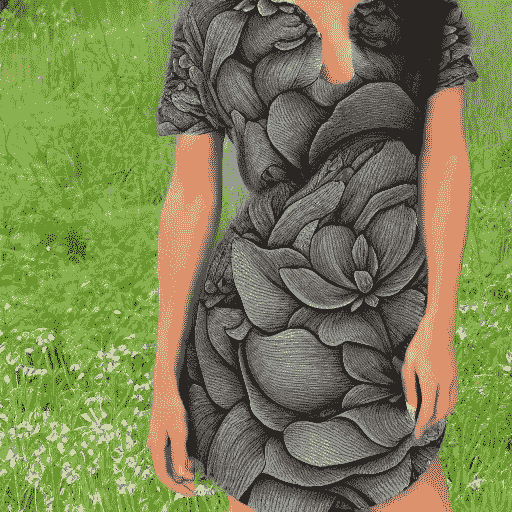
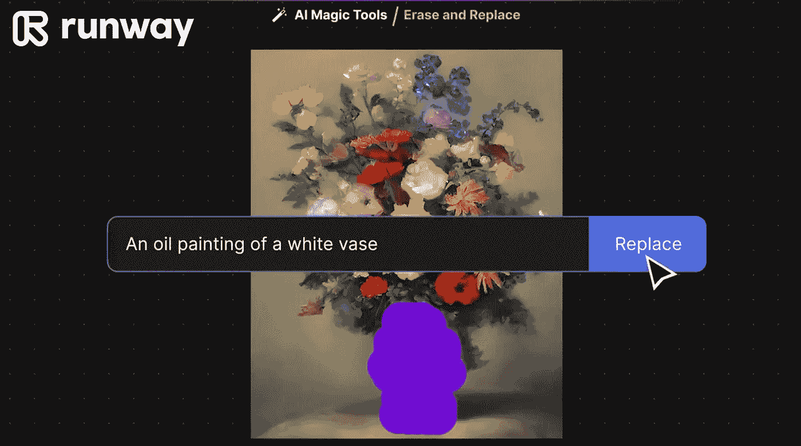

# 生成式 AI 产品策略：如何构建下一代 AI 产品

> 原文：[`towardsdatascience.com/generative-ai-product-strategy-how-to-build-next-generation-ai-products-aa12ba383689?source=collection_archive---------5-----------------------#2023-01-25`](https://towardsdatascience.com/generative-ai-product-strategy-how-to-build-next-generation-ai-products-aa12ba383689?source=collection_archive---------5-----------------------#2023-01-25)

## 垂直 AI 产品与水平 AI 产品以及可防御的商业护城河

 [Amogh Vaishampayan](https://amogh-vaishampayan.medium.com/?source=post_page-----aa12ba383689--------------------------------)

·

[关注](https://medium.com/m/signin?actionUrl=https%3A%2F%2Fmedium.com%2F_%2Fsubscribe%2Fuser%2F5ea805d911ae&operation=register&redirect=https%3A%2F%2Ftowardsdatascience.com%2Fgenerative-ai-product-strategy-how-to-build-next-generation-ai-products-aa12ba383689&user=Amogh+Vaishampayan&userId=5ea805d911ae&source=post_page-5ea805d911ae----aa12ba383689---------------------post_header-----------) 发表在 [Towards Data Science](https://towardsdatascience.com/?source=post_page-----aa12ba383689--------------------------------) ·12 分钟阅读·2023 年 1 月 25 日

--

图片由作者使用 Midjourney 生成

人工智能在 2022 年取得了如此显著的进展，以至于世界似乎终于接受了这一技术现已普及到普通人日常使用的程度。

生成型 AI 模型如 GPT3 和 Stable Diffusion 将使我们能够以以前难以想象的规模和速度进行创作。这将从根本上改变人类创造价值的方式。我们用于创作的每一个数字工具——从编码环境到视频编辑器到 3D 建模软件——都将经历剧烈的变化。

虽然展示 AI 生成的艺术作品令人印象深刻，但演示并未考虑实际的专业工作流程和行业需求。通过通用接口访问这些模型对于实验和创建社交媒体帖子是很好的，但对于不同领域的专业人士有效地完成他们的工作还远远不够。为此，我们需要将这些模型融入产品中，使其在专业工作流程中提供实际的效用。

当我作为一个对时尚业务知之甚少的人，尝试使用 Stable Diffusion 进行时尚设计时，我意识到这一点。对我来说，为时尚设计师提供一个无限创意的生成 AI 产品似乎是一个显而易见的想法。怀着热情，我使用 Stable Diffusion 生成了这张裙子图像，并与我的时尚设计师朋友分享了。

这是一张由作者使用开箱即用的 Stable Diffusion 生成的裙子图像。

“你能用这个想法设计一件这样的新裙子吗？”我问。她的回答是一个令人失望的大“不能”。除了或许可以用作灵感的情绪板之外，这张图像对她完全没有用处。

尽管 Stable Diffusion 拥有强大的生成能力，但其当前格式下的输出对时尚设计师来说并不十分有用。要让 AI 实际上带来价值，我们需要考虑如何以实际的方式利用其输出。这可能涉及对模型输入的预处理、对输出的后处理，或将其与人工生成的内容相结合。关键在于利用 AI 的独特能力，专注于解决用户的特定实际问题。让我们探索如何让这一看似神奇的新技术为我的时尚设计师朋友提供帮助。

# AI 产品策略框架

对于正在开发 AI 产品的创始人和产品领导者，我推荐两种广泛的方法——纵向和横向。**纵向**方法涉及为特定行业或细分市场的创意过程构建 AI 辅助的软件产品。时尚印刷设计和家具设计就是一些例子。每个细分市场都有不同的需求和工作流程，我们必须牢记这一点。

**水平**方法涵盖了跨行业需求的产品，比如平面设计、广告设计或法律合同起草。广告创意在从汽车到食品等各行业都是必需的。在这里，产品不需要行业特定的工具。最重要的是一个出色的用户界面，使用户可以在比以前更短的时间内进行平面设计工作，并且质量更高。

# 垂直 AI 产品

在为特定行业构建 AI 支持的产品的同时，除了部署最先进的 AI 模型，还需要构建它们特定工作流程所需的工具。下面是为时尚业生成面料印花设计的 AI 产品需要涵盖的内容-

+   用户必须能够将情绪板图像与文本提示一起作为输入提供给生成式 AI 扩散模型。情绪板和提示文本通常是通过当前高销售趋势的数据分析得出的。

+   AI 模型必须生成适用于整体印花的无缝纹理。无缝纹理是一种图像，可以在自身的上方、下方或侧边放置，而不会在图像的副本之间产生明显的接缝、连接或边界。以下是我通过调整稳定扩散代码生成的无缝纹理的示例图像。该图像由四个生成的图像并排放置而成。

作者通过微调稳定扩散生成的无缝面料印花图案

+   创造力是一个迭代的过程。设计师应该能够通过手动编辑或者在后续的 AI 生成中引入特定的修改来迭代地修改每一代 AI 的输出。

+   需要由不同角色的用户进行多层次的审批。设计主管可能需要签署最终设计。

+   最终输出的分辨率需要放大到足够高的水平。

+   最后，输出必须转换为可以发送给布料打印机的矢量文件格式。

时尚设计师需要围绕生成式 AI 模型的输出构建这种面向行业的工具。

考虑另一个 AI 辅助室内设计的例子，它通过生成图像展示了房间如何以特定风格进行改造。以下是专业室内设计师在使用[AI 室内设计](https://interiorai.com/)工具时分享反馈的[文章摘录](https://businessofhome.com/articles/we-had-designers-test-an-ai-design-tool-here-s-how-it-went) 。

> 当我们要求其创建一个“波西米亚”客厅时，霍勒斯指出算法选择了她为希望看起来相同的客户使用过的类似调色板。“我可以看到将其用作开发情绪板图像的工具，”她补充说。“所有的参考都很准确。”
> 
> Horace 说：“旁边有一个奇怪的自助餐桌，而且不知为何有两个咖啡桌，这看起来并不实用。”谈到一间中世纪风格的客厅时他表示：“外观是对的，但你不能向客户展示这个，比如，‘嘿，这是你的房间！’”
> 
> Interior AI 的空间规划技能有时还有待改进——它的浴室设计并不总是包含马桶。
> 
> 这个工具经常会生成一个房间的基本近似图，但改变了比例、去掉了窗户或将天花板降低了几英尺。

不错的浴室，但马桶在哪里？作者使用 Midjourney 生成的图像

从设计师的评论中可以清楚地看出，室内设计产品的 AI 模型需要在某些无法修改的约束条件内操作。他们的评价可以简洁地总结为一句话——

> 在依靠大量的 2D 灵感图像来形成对设计的理解时，**它对风格的把握非常准确，但对功能的掌握则较为松散。**

请注意，时尚设计师的问题和约束条件与室内设计师的完全不同。尽管如此，双方都需要针对其行业的更好功能性，而不仅仅是关注风格。

对于像 Stable Diffusion 这样的 AI 模型来说，在与行业相关的数据集上进行微调至关重要。以时尚印刷设计为例，设计师可能希望根据特定的风格、色彩搭配或情绪生成图案。通过使用少量示例对生成模型进行微调，将有助于生成更相关的设计。即使是其他深度学习模型，如用于对象识别和分割的模型，也可能需要微调，如果这些对象在开箱即用的预训练模型的训练数据中不存在。最终，我预计模型微调工具将集成到每个产品中。很可能会有一个大型公司出现，提供模型微调的 API 服务。

## **垂直 AI 产品中的护城河**

作者使用 Midjourney 生成的图像

一个产品或公司不能仅依靠 AI 模型作为唯一的竞争优势。AI 研究论文和实现代码通常是公开的。OpenAI 发布了用于文本到图像生成的 Dall-E 和 Dall-E 2 模型，随后开源的 Stable Diffusion 模型也被发布。AI 吸引了一些世界上最优秀的头脑，行业进展迅速。可以保证，总会有人最终发布比你目前实现的模型更好、更先进的新模型。

为特定行业开发 AI 产品的一个巨大优势是更容易创建一个防御性的商业护城河。为该行业构建的工具给客户带来的便利，也使得他们不太可能因为新模型的发布而离开。这为企业提供了时间来将 AI 模型输出提升到最先进的基准水平。

# 横向 AI 产品

当涉及到用于图像编辑或图形设计等行业的产品时，新型 AI 基础产品面临着来自现有巨头的艰巨挑战。这是因为像 Photoshop 这样的产品以及其他产品正在迅速引入由 AI 驱动的功能。依赖 Photoshop 广泛图像编辑工具的专业人士会更愿意使用 Photoshop 中的 AI 功能，而不是切换到其他产品。许多构建横向 AI 产品的初创公司可能因为现有巨头的大规模分发而短命。如果 AI 模型被集成到人们已经大量使用和支付的工具中，他们几乎没有动机转向其他工具。Notion 是一款拥有 2000 万用户的笔记应用，最近推出了一个 AI 写作助手。新的 AI 驱动的文字处理器可能会因为 Notion 现有的大量用户基础和网络效应而难以竞争。

任何新的横向 AI 产品的机会在于为不熟悉该领域的用户提供**好、便宜 *和* 快**的输出。流行的笑话是，与设计师合作时，你只能获得三个中的两个。

要取得成功，任何新的横向设计 AI 产品**必须**为非设计师用户提供三者俱全的功能。显而易见，该产品应易于使用。否则，用户不太可能快速获得高质量的输出。换句话说，机会在于降低进入这一创意领域的门槛，这个领域之前由熟练的专业人士主导。

Canva 是一个很好的例子，展示了这一点。Canva 使得一个会计人员能够创建一个好的活动海报。他们证明了许多设计工作，不需要设计师的高级工具，如 Photoshop。Canva 通过构建一个简单的产品，提供模板和库存内容，使得非设计师能够快速、便宜地创建出好的内容。AI 给人的感觉就像是 Canva 的再次出现，但这次是适用于每个创意领域，并且规模更大。像 GPT-3 和 Stable Diffusion 这样的生成性 AI 模型特别相关，因为非设计师用户不需要从零开始。相反，仅凭一个文本提示，他们就能获得一个远远超出他们自己所能创造的起点。

用户界面在经过大量实验后可能会经历几次根本性的变化。在许多话题上，ChatGPT 的对话界面比 Google 搜索更快速地返回准确的答案。对话界面在各种应用中看起来非常有前景。你对设计师说“颜色需要更蓝”的渴望最终会得到满足。

对于生成模型，艺术风格预设、预先调整的模型以及即席调整能力可以使用户对输出结果有更多控制。

## 横向 AI 产品的护城河

部署在高质量大数据集上训练的最佳表现模型对横向 AI 产品非常有利。由于这些产品需要在各个行业的用户中运行，投资 AI 研发以保持最先进的模型性能可能是一个强大的护城河。然而，由于竞争激烈和大量资金流入 AI，这不能成为唯一的护城河。通过用户体验、产品定位、分销、社区、网络效应、团队执行力以及快速响应用户反馈等方式可以建立额外的护城河。

RunwayML 是一个由 AI 驱动的视频创作和编辑工具，表现出色。RunwayML 通过从擦除和替换对象到自动化视频运动跟踪等功能，降低了内容创作的门槛。他们对 Stable Diffusion 的贡献意味着他们正在投资推动最先进 AI 的边界。通过这些方法的结合，RunwayML 获得了大量客户，并在其业务周围建立了长期的护城河。

来源: [RunwayML](https://runwayml.com/) 网站

Canva 的成功很大程度上归因于其作为非设计师工具的定位护城河。这个客户群体与 Adobe Photoshop 和 Illustrator 的目标用户群体不重叠，后者由熟练的设计师使用。深刻理解和接受其定位帮助 Canva 推出了设计师在培训中学习的功能，但普通用户不了解的功能，例如颜色调色板生成器和字体建议。

建立一个蓬勃发展的社区是建立护城河的一种优秀且被低估的方法。积极参与和发展社区可以提供深刻的产品反馈。这在构建适合非专家的新用户界面的功能时尤其有用。通过社区互动获得的快速反馈循环可以促进产品的快速迭代。

# 生成 AI 产品的经济影响

人工智能工具用于内容推荐、图像重照、光学字符识别和语音转文字等应用已经存在了几年，并已经成为我们每天使用的产品的一部分。活跃地协助我们的创意过程的人工智能产品潮流刚刚开始。每个人都在关心但似乎没有一个明确答案的问题是，这会对人类的工作岗位产生什么影响？这是一个非常困难的问题，没有一个单一的答案。不过，我可以肯定的是答案既不在于人工智能完全取代人类，也不在于人类的思维不可替代。在我看来，不可能有一种能经得住时间考验的确定答案。细微的答案将在两者之间，根据技术随时间的发展而不断在这两个极端之间移动。

数字艺术家一段时间以来一直在 Photoshop 中使用由人工智能提供动力的功能，例如智能背景去除和内容感知填充。它只是在幕后，没有公开宣传为人工智能。如今，生成式人工智能扩散模型能够从创意过程的第一步（让我们考虑第 0 步为决定为什么和什么来创作）开始做出贡献。虽然人工智能之前只对创意产出做出了少量贡献，但随着时间的推移，它将会做出更多的贡献。我看到这些新创作工具有两个明显的后果：

1.  它们将大大降低进入许多领域的门槛，从而导致创作者数量激增

1.  它们将使创作者在给定时间内产生更大量的产出

第一个后果意味着更多的人类就业、经济活动和货币的提升。突然间，好莱坞的工具就在每个人的口袋里。第二个后果意味着较少的人可以做许多人的工作，导致雇主裁员。这会导致灾难性的大规模失业吗？或者这些人也会成为独立的创作者？这些事情是极难预测的。每个人都认为人工智能会消灭重复的体力劳动。有创意的人是安全的。没有人认为人工智能会写代码或创作艺术。

> 世界将分为使用人工智能和不使用人工智能的人。

那些构建这些产品的人将获得巨大的回报。我们正处于一个很可能被视为人类历史上最具决定性的时期的边缘。

如果你是一位致力于建立人工智能产品的产品经理，我已经编写了一份由 3 部分组成的实用指南，告诉你如何执行：

+   [**第一部分**](https://medium.com/swlh/a-practical-guide-to-ai-product-management-part-1-5b629da25131)**:**基础知识——什么使人工智能产品管理与众不同，你是否应该在项目中使用机器学习，人工智能产品经理的先决知识

+   [**第二部分**](https://medium.com/swlh/a-practical-guide-to-ai-product-management-part-3-75f14312aa8d)**:** AI 团队管理、产品规划和开发战略

+   [**第三部分**](https://medium.com/swlh/a-practical-guide-to-ai-product-management-part-3-75f14312aa8d)**:** 模型选择、部署到生产环境、模型维护和成本管理
