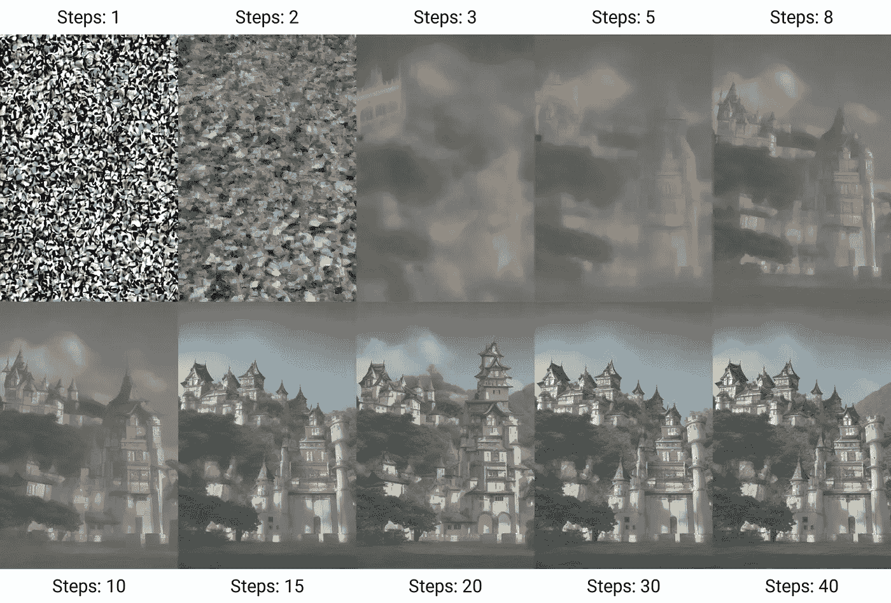

# 生成模型与噪声和结构的舞蹈

> 原文：[`towardsdatascience.com/generative-models-and-the-dance-of-noise-and-structure-e72fe7494f4f`](https://towardsdatascience.com/generative-models-and-the-dance-of-noise-and-structure-e72fe7494f4f)

## 数字梦想者构建指南

 [Manuel Brenner](https://manuel-brenner.medium.com/?source=post_page-----e72fe7494f4f--------------------------------)

·发布于 [Towards Data Science](https://towardsdatascience.com/?source=post_page-----e72fe7494f4f--------------------------------) ·阅读时间 21 分钟·2023 年 10 月 7 日

--

我喜欢想象一下，文艺复兴时期意大利的居民，充满了对人类想象力和理性可能性的热情，会对我们今天的技术感到最为震惊的是什么。[莱昂纳多·达·芬奇](https://medium.datadriveninvestor.com/there-is-no-clash-between-art-and-science-3028d0420fbe)，曾梦想飞行器，肯定会对一架空中飞翔的空客 A380 印象深刻，乘客们舒适地坐在座椅上，看电影，抱怨 Wi-Fi 不够快。

在所有在中世纪看来如同巫术的技术中，生成式 AI 的奇迹可能是最像巫术的。如果我展示给莱昂纳多·达·芬奇一台能够在几秒钟内以他的风格绘制女性肖像的设备，他在劳作了无数年之后对《蒙娜丽莎》肖像的反应会是什么？瞧：

由 DALL-E 绘制的达·芬奇风格的女性肖像。

虽然诚然，这位女性并没有像真正的蒙娜丽莎那样以诱人而神秘的微笑来展现自己（且经细致审视显得有些滑稽），但我们许多人已经遇到了令人惊叹的 AI 生成实例：从 [超现实的图像](https://twitter.com/mariswaran/status/1674505829456965633)到令人毛骨悚然的深度伪造的声音，甚至是由 AI 编写的完整文章。

生成性 AI 模型是梦想家的硅基等效体：它们能够从无到有地构想事物，**从噪声中赋予意义**。它们学会了在秩序与无序之间起舞。它们已经改变了我们对人类创造力的看法，并开启了数千种新应用的门扉，威胁到整个行业并创造了新的行业。

我们刚刚起步，这些模型中的大多数仍处于初期阶段。通过 ChatGPT 的写作、DALL-E 和 Midjourney 生成的图像，以及最近像 Stability AI 的[StableAudio](https://stability.ai/stable-audio)这样的音乐生成模型，我们正迎来一个时代，在这个时代，**我们每天输入大脑的感官信号越来越多地被 AI 以某种方式改变甚至完全生成**。

“一个画家在画布的左侧是混乱噪声的溅射，逐渐转变为右侧的结构化、美丽的数字城市。艺术风格应为半现实主义，带有一点超现实主义。光线应柔和而弥漫，营造出梦幻般的氛围。” 由 Chat-GPT 提供的提示，由 DALL-E 绘制的画作。

在这篇文章中，我想揭开这个神奇黑箱的面纱，深入探讨几类生成模型（Helmholtz 机、变分自编码器、归一化流、扩散模型、GAN 和基于 Transformer 的语言模型）的基本机制，揭示它们的内部工作原理，并探讨它们在神经科学和认知学中的起源和联系。这个话题显然太广泛，无法在一篇文章中涵盖（尽管文章比预期的要长得多），所以我试图在一些技术细节、高层次概述、连贯的叙述和进一步阅读的来源之间找到平衡，希望每个人都能从中找到一些有用的信息。

> “我无法创造的，我不能理解。”
> 
> ***— 理查德·费曼***

我们从哪里开始？

以这句常被引用的费曼名言开头有些陈词滥调，但这位大师确实有他的道理：理解与创造行为相关，因此在机器学习的早期，构建能够理解的模型也就与构建能够创造的模型相关。图灵的著名测试（也称为模仿游戏）可以看作是这个观点的一种变体：如果你成功地伪造了智能，那么你很可能发现了类似真实智能的东西。

在早期生成模型中，两个最重要的模型是 Boltzmann 机和 Helmholtz 机。

赫尔姆霍兹机器特别有趣，因为其原理与德国物理学家赫尔曼·冯·赫尔姆霍兹的极具先见之明的视角紧密相关。赫尔姆霍兹在 19 世纪末意识到，知觉更好地描述为一种从感官数据和先验知识中进行无意识推理的过程，而不是对客观现实的客观反映：认知本质上是概率性的，并受到噪声的影响，并且受到我们的期望和偏见的强烈塑造。他的观点在现代神经科学中越来越相关，例如通过卡尔·弗里斯顿的自由能原理（他明确引用了赫尔姆霍兹机器作为灵感来源）和贝叶斯大脑假说。

根据自由能原理，大脑与外部世界在一个行动-感知循环中互动，尝试从其感觉中推断世界的隐藏状态，并通过行动使其预测成真。Kfriston, CC BY-SA 3.0 <[`creativecommons.org/licenses/by-sa/3.0`](https://creativecommons.org/licenses/by-sa/3.0)>, 通过维基媒体公用领域

从贝叶斯的角度来看，这个想法是大脑维持一个世界的生成模型**p(x,z)**，其中**x**是感官观察结果，**z**是这些感官观察结果的隐藏原因/潜在解释，大脑试图捕捉这些解释，反映了世界和世界模型中的不确定性。正如我们将看到的，许多生成模型，但不是所有，都被表述为概率性潜变量模型。

在贝叶斯语言中，给定这样的模型，这归结为潜在原因的先验分布**p(z)**（如果我住在纽约市，我观察到狮子的先验期望小于观察到狗的期望），观察结果**p(x)**的整体可能性，以及感官观察和隐藏原因之间的关系。

**解析 x 和 z 之间的关系是许多生成建模的核心。**

他们的关系反映在两个重要量上：后验概率**p(z∣x)**和可能性**p(x|z)**，它们根据贝叶斯著名定律联系在一起：

后验概率**p(z∣x)**给出了在给定观察值的情况下，潜在原因的概率。由于一个称为不可处理性的问题，我们通常无法访问这一点：根据贝叶斯定理，我们需要 p(x)来计算它，这要求我们遍历所有可能的潜在原因，并检查它们如何解释**x**：

如果世界的模型复杂，这些是高维积分，因此这既不高效也完全不可能。

**推断后验概率是许多生成模型的根本挑战。**

在 Helmholtz 机器中，**后验 p(z∣x)** 是通过从数据中直接估计的，这个过程称为识别，通过学习一个近似后验 **q(x|z)** 并尽可能接近真实的 **p(z∣x)**。

估计似然 **p(x|z)** 的反向方向通常容易得多：给定一个特定的潜在变量 **z**，它只是告诉我们观察到的 **x** 的可能性。为此，我们通常不需要积分任何东西，只需直接运行模型即可。

似然性由生成网络参数化：给定一个 **z**，我们如何生成一个 **x**？如果我从一个隐藏原因开始，它对世界的影响会是什么样的？如果我想象一个人，那个人的面貌或声音会是什么样的？

在大多数生成模型中，这部分在实践中是最相关的（因为它生成图像/文本/音频）。一旦我们了解了 **z** 到 **x** 的映射是什么样的，我们可以通过采样一个 **z** 并通过生成网络传递它来生成样本。

在 Helmholtz 机器中，这两个方向都是通过神经网络参数化的，这些网络通过 **Wake-Sleep 算法** 交替训练，该算法受人类认知中类似过程的启发，在生成网络（觉醒）中比较生成样本与真实世界，并在识别网络（梦境）中将自身创作映射回其潜在状态。

识别网络 z ← x: **q(z|x)**

生成网络 z→ x: **p(x|z)**

潜在空间的结构通常有助于解释所学模型。 [解缠潜在表示](https://arxiv.org/abs/2001.04872) 并将其与可解释特征对齐在许多实际应用中都很重要，但也更普遍地用于实现更具解释性的模型。

以一个熟悉的例子来说，假设我们正在构建一个人脸图像的生成模型。按照 Helmholtz 机器的结构，我们将图像映射到潜在空间。然后我们可以尝试发现该潜在空间中有趣的变化轴。

一个有趣的变化轴可能与图像中人物的年龄有关。然后我们可以在潜在空间中强加约束（无论是在监督设置中通过提供带有年龄标签的数据，还是在无监督设置中通过识别学习到的潜在特征中的年龄，假设它导致显著的变化），以便其一个方向 **z_age** 编码嵌入图像上显示的年龄。

知道这个方向后，可以用来改变图像的年龄。如果另一个方向**z_beard**编码了有胡须的特征，我可以通过识别网络 q(z|x) 对图像 **x** 进行编码，得到一个 z，将其转换为 z’=z+a*z_age+b*z_beard，并通过生成模型 p(x|z’) 发送回去，以查看一个有胡须、年长的自己版本。

像 OpenAI 的 GLOW [这样的模型让你在他们的网站上玩耍](https://openai.com/research/glow)，但你可能已经熟悉了这种应用，例如在 Faceapp 中。

所有生成建模归结为（或多或少相关的）这种变体，尽管自 Helmholtz 机器时代以来它已显著发展，但在概率框架中捕获和重现数据的基本结构的理念依然存在。我将使用这些概念来解释过去十年中引起 AI 研究关注的一些最常见的生成模型版本。

## **变分自编码器（VAEs）**

> 现在地球是空虚和混沌的，上帝说：“要有光，”就有了光。
> 
> ***— 创世记 1:1–5 (NIV)***

VAEs 在 2013 年由 [Kingma](https://www.google.com/url?sa=t&rct=j&q=&esrc=s&cd=&ved=2ahUKEwizlfGwp8qBAxW0wQIHHfqNDdMQFnoECBMQAQ&url=https%3A%2F%2Farxiv.org%2Fabs%2F1312.6114&usg=AOvVaw0lcWUpG5O19Y_RMGqNMkr2&opi=89978449) 和 [Rezende](https://proceedings.mlr.press/v32/rezende14.html) 同时提出，并且在广泛的应用中找到了用途（从去噪到压缩到时间序列数据）。

这些方法是一个自然的起点，因为它们在精神上最接近 Helmholtz 机器：它们使用识别（编码器）和生成（解码器）网络。正如之前提到的，识别网络通过近似密度 **q(z|x)** 来近似 **后验密度** **p(z|x)**。

VAEs 的训练目标是最小化负 **证据下界（ELBO）**，这归结为找到一个尽可能接近真实后验 **p(z|x)** 的近似密度 **q(z|x)**。

在这里，我们通过以一种可以通过基于梯度的方法训练的方式对分布 **q(z|x)** 进行参数化来简单地近似分布。参数化分布可能有很多细微之处，但我们通常假设它近似为高斯分布，这意味着它具有均值 **μ** 和协方差 **σ**，构成了模型的自由参数。这些参数由神经网络直接学习（将训练数据 **x** 输入到神经网络中，输出为 **μ**）。

在 VAEs 中，近似后验 **q(z|x)** 用于绘制一个或多个随机样本，然后将这些样本代入 **ELBO**，**ELBO** 定义为从 **q** 中样本的期望值：

由于（负）**ELBO** 构成了损失，我们可以计算梯度，这反过来又让梯度下降发挥其魔力。

由于后验可能相当复杂，在实践中可能难以从中计算出良好行为的梯度，因为它们往往有很高的方差，需要许多样本。VAEs 核心的重参数化技巧巧妙地绕过了这个问题，通过将采样分为两个过程：

+   首先，从标准高斯分布 **N(0,1)** 中采样 **ϵ**。

+   然后，使用均值**μ**和标准差**σ**来变换**ϵ**，得到样本**z=μ+σ×ϵ**。

我发现重新参数化技巧特别优雅的一点是，它将每个生成过程的两个核心组件分开，无论是生成手写数字的更平凡任务，还是《圣经》引述中天与地的隐喻创建：一个由初始样本**ϵ**的“无形且空虚”噪声给出的随机组件，通过复杂的变换最终获得意义，通过解码器在观察到的世界中创造出一个模式**x**。

我在 MNIST 数据集上训练了一个简单的 VAE，绘制了一个随机初始状态，并通过解码器生成了这个看起来有点像 9 的图像。解码器隐式理解数据的结构，并从一个低维潜在状态中解码它。MNIST 数据集通过**知识共享署名-相同方式共享 3.0**许可证提供。

直观地说，ELBO 由重建项和熵项组成。由于熵在信息理论的世界中衡量信息内容的不可预测性或随机性，因此熵自然会在训练过程中起到正则化作用，在优化过程中权衡结构和噪声。如果 VAE 过于关注重建，它可能会过拟合数据，在潜在空间中捕捉到训练数据中的每一个细节（包括噪声）。但如果它过分关注熵，它可能会得到一个过于简单的潜在空间，无法捕捉数据的细微差别。

近似后验的熵与其协方差结构**σ**相关，这为我们提供了一个衡量初始样本中“无形且空虚”噪声（编码解释中的不确定性）剩余量的度量。如果我们想让整个过程变得确定性，我们可以简单地将**σ**设置为零，这样所有的不确定性都会被消除。

在一个确定性宇宙中，实际上没有真正的噪声，只有我们的模型无法捕捉的东西，或者我们缺乏必要的信息（[我爱噪声，已经在这里写了一整篇文章](https://manuel-brenner.medium.com/the-importance-of-noise-327fcab7c4fb)）。正如乔治·博克所指出的：“所有模型都是错误的，有些是有用的”，而 VAEs 学会在过度自信和不足自信之间取得平衡。

这个组织原则有助于解释为什么 VAEs 在像降维（将输入数据中的重要信息与不重要信息分离）这样的任务上自然表现优异，以及去噪。正如前面提到的，VAEs 还可以实现潜在空间的结构化表示，从而产生可解释的特征。

对于在 MNIST 上训练的 VAE，采样 2D 潜在空间的网格会导致不同数字的连续变换。由我生成的， [基于这里提供的图形代码](https://github.com/gonzalorecio/MNIST-latent-representations)。

## **归一化流 (NF)**

我听到有人称 NFs 为“强化版的重参数化技巧”，我非常喜欢这个描述。归一化流接管了 VAEs 的空白，通过将识别形式化为流的应用来完成。

NFs 通过一系列可逆变换将简单的概率分布（例如 VAEs 中通常使用的标准高斯分布 **N(0,1)**）迭代地转换为更复杂、更精细的分布。

归一化流通过应用一系列可逆变换，将样本 z0 从简单分布变形为潜在复杂的分布。 janosh，MIT <[`opensource.org/licenses/mit-license.php`](http://opensource.org/licenses/mit-license.php)>, 通过 Wikimedia Commons

VAEs 使用固定的分布和学习到的变换（均值和方差）将随机性与结构分开，而 NFs 则动态地塑造分布本身。它们通过跟踪雅可比行列式来实现这一点。这可以衡量变换的体积变化，例如，它如何收缩或拉伸空间，确保整个潜在空间以一致的方式变化。

如同 VAEs 的情况一样，一块无形的东西被塑造成形状。

关于 NFs 至少有两件很酷的事：它们是可逆的，因此允许在两个分布之间进行双向映射，这在许多情况下非常有用，例如，当试图估计密度时（因为一旦你映射回标准高斯分布 **N(0,1)**，这通常比处理复杂的不可处理后验要容易得多），或者用于 [异常检测](https://open.spotify.com/episode/1LlqI3frkyTUwuUuqRcVo1?si=3867f2171b974279)，其思想是筛选出在学习到的分布下概率较低的数据。

[OpenAI 的 GLOW](https://openai.com/research/glow)，我之前提到过，也利用这种可逆性来操控潜在空间中的特征，如微笑、年龄或胡须，并几乎实时地获得修改后的图像。

另一个很酷的特点是它们对不同几何形状和流形的适应性。一个经典的例子是对 [球面对称性](https://arxiv.org/abs/2002.02428) 的应用，使得 NFs 能够形成存在于球面上的潜在表示。由于尽管有些观点相反，地球可能是球形的，因此球面对称性非常有用，例如在运行地球天气系统的模拟时。

## **扩散模型**

> 从数据中创建噪声很简单；从噪声中创建数据是生成建模。
> 
> - [***宋等人***](https://arxiv.org/abs/2011.13456)

展开来说，扩散模型是过去几年中最成功的生成模型之一。尽管它们早在 2015 年就由[Sohl-Dickstein 等人](https://arxiv.org/abs/1503.03585)提出，但它们在[图像生成](https://arxiv.org/abs/2006.11239)方面的成功使其成为焦点，为 DALL-E、Midjourney 或 Stable Diffusion 奠定了基础。虽然它们的基本架构相当不同，但在概念上它们仍与 VAEs 和正常流相关。

扩散模型将生成过程分解为几个步骤：在每一步中，训练样本都会被噪声扰动。模型的目标是学习如何从样本中去除这些噪声。如果我之前没有足够清楚地说明噪声的迷人之处，那么在扩散模型中，它再次成为了主角。

在训练过程中，噪声会被反复添加到训练数据中。以图像为例，模型要么学习去除微小的噪声并打磨最终细节，要么在一个被扭曲的图像中完善模糊的形状：

稳定扩散中的生成过程。Benlisquare，CC BY-SA 4.0 <[`creativecommons.org/licenses/by-sa/4.0`](https://creativecommons.org/licenses/by-sa/4.0)>, 通过维基媒体公用领域

尽管识别过程没有通过识别网络直接建模，且训练目标有很大变化，但添加噪声的过程以及随后的噪声减少监测可以看作是一种识别形式，初始噪声样本则是从 p(**z_0**)中提取的初始状态。

当生成一个全新的样本时，模型可以从纯噪声开始，并在试图弄清楚噪声下可能隐藏的内容时，创造出一些新的东西：

当我向 DALL-E 请求“随机白噪声”时，它返回的内容并不是完全随机的白噪声。它不可避免地反映了其训练数据的一些结构。

**从无中生有的过程揭示了其训练数据隐含学习的分布。**

扩散模型为何如此有效仍然有待讨论。除此之外，它们被比作[基于能量的联想记忆模型](https://arxiv.org/pdf/2309.16750.pdf)（[40 年前通过 Hopfield 网络而闻名](https://www.pnas.org/doi/10.1073/pnas.79.8.2554)）。

扩散模型还涉及基于得分的生成建模思想，这一思想由[Song 等人](https://arxiv.org/abs/2011.13456)推广：与直接计算数据似然的传统方法不同，这些模型专注于近似**得分**，在这种情况下，得分表示数据似然相对于数据本身的梯度。

直观地说，得分提供了一个样本应如何更改以**提高其可能性**的方向。通过不直接计算可能性，这些模型通常避开了一些我们之前遇到的计算挑战。

得分函数可以再次通过神经网络建模。表示它的一种特别有趣的方式是通过随机微分方程（SDEs），类似于神经常微分方程（Neural ODEs），通过神经网络表示微分方程（[一种称为隐式层的东西](http://implicit-layers-tutorial.org/)）。

这在精神上类似于扩散模型的连续时间版本。从噪声开始，得分函数用于引导其朝向一个可能的样本（Stefano Ermon，他的实验室开发了这些技术，做了很棒的讲座，[这里是一个更详细的讲解](https://www.youtube.com/watch?v=Uwz7kv3GHEc&t=503s)）。

在扩散模型中，生成过程同样是随机的，在每一步都加入了一个随机成分。由于生成过程被分解成多个步骤，这允许通过向链中回溯几个步骤并重新运行过程，从而引入样本的细微变化。

我在本文缩略图中使用的画作的细微变化，由 DALL-E 生成。

在一些最受欢迎的扩散模型应用中，如 DALL-E 或 Midjourney，初始状态不一定由纯随机样本**z0**从**N(0,1)**给出，而是由视觉和语言的联合嵌入**p(z0|x)**给出，其中 x 可以是例如由强大的 CLIP（对比语言-图像预训练）嵌入提供的文本输入。

条件生成在各种多模态学习设置中具有重要价值，因为它将不同的感官模式结合成一个连贯的框架。这可能会成为未来一些最激动人心的人工智能发展的重要组成部分。

一幅印象派画作，描绘了一个 AI 大脑想象日落，感谢 DALL-E。

## **生成对抗网络（GANs）**

[GANs](https://arxiv.org/abs/1406.2661)是最近十年最受欢迎的生成模型类别之一，灵感来源于 Ian Goodfellow 和他的朋友们的一晚传奇饮酒经历。

GANs 甚至更远离了赫尔姆霍兹机器的双网络结构。如我所提到的，近似**p(z|x)**通常是生成模型的核心挑战，因此 GANs 干脆把识别抛到窗外，尝试在没有它的情况下进行生成。

GANs 也开始通过从**p(z0)**中抽取一个随机噪声向量（如在扩散模型中，[这个初始向量也可以依赖于其他信息](https://arxiv.org/abs/1411.1784)，比如文本），但随后仅训练生成网络（因为这是我们在许多应用中最感兴趣的部分），通过包含一个鉴别器，尝试使生成模型中的**p(x|z)**样本与训练数据的示例匹配。

生成网络的训练目的是产生能够欺骗鉴别器的数据。鉴别器则被训练来区分真实样本和虚假样本。

GANs 的优雅之处在于这种竞争动态：生成器在鉴别器的反馈指导下提高其生成数据的能力，而鉴别器本身则变得更擅长区分真实与虚假。这是完美的零和游戏，推动两个网络不断变得更好（有一定的深度伪造检测风险，我在这里写过）.

然而，GANs 也有自身的一系列挑战，并且由于其竞争对手，特别是扩散模型的成功，GANs 最近的流行度有所下降。训练 GANs 可能非常不稳定。如果生成器在开始时产生低质量的样本，鉴别器的工作变得太容易，这使得生成器很难改进。另一方面，如果鉴别器变得过于强大，它可能会抑制生成器的成长，导致模式崩溃，即生成器最终只产生可能输出的一个子集。

## **Transformers 和大型语言模型（**LLMs）

由于 Transformers 彻底革新了文本生成建模的格局，我不能在这里不提到它们。

简而言之，几乎所有 LLMs 都基于[transformer 架构的变体，该架构实现了 2017 年谷歌论文中的自注意力机制](https://papers.nips.cc/paper_files/paper/2017/hash/3f5ee243547dee91fbd053c1c4a845aa-Abstract.html)，关于这一点的详细信息超出了本文的范围，但在许多其他地方有解释。这种架构允许 LLMs 学习输入序列之间的复杂关系，这在文本上特别有效。

一些 Transformer 变体，如 BERT，是在掩码语言建模设置下训练的。它们接收有些标记被掩盖的序列，并被训练去识别这些掩盖的标记。这在精神上与 VAEs 中的识别非常相似，其中掩盖单词可以被解释为对输入进行噪声处理。缺失的单词被填补，因为 Transformer 已经学习了输入数据的概率分布**p(x)**，并能够理解给定上下文的最可能单词。

从生成的角度看，基于变压器的 LLM 模型会根据输入提示，建模每个潜在单词或短语在前一个单词之后的概率。这再次表达了始终存在的概率分布**p(x|z)**的一种变体。

然而，变压器中通常没有显式的隐藏变量**z**，因为提示和上下文本身就是单词。相反，自注意机制从所有观察到的单词（**x1​,x2​,…,xt**）中提取标记 p(**x_i**|(**x1​,x2​,…,xt​)**)的概率，当然还包括它在数十亿行训练数据中看到的所有单词和上下文的隐含分布。

虽然噪音并不是训练变压器的直接组成部分，但 LLM 自然地包含了一个概率成分。这很有意义，因为语言不是唯一确定的（因此，马尔可夫模型最初是在俄罗斯诗歌的基础上开发的，我在这里详细讨论），同一段文字可以用多种不同的方式表达：在生成响应或样本时，通常有几个单词适合给定的上下文，因此存在可能延续的分布 p(**x_i**|(**x1​,x2​,…,xt​)**),

选择不同单词的概率可以通过所谓的温度超参数进行缩放。根据你是寻找创意还是确定性响应，这个参数可以有效地控制“噪声”水平。像 Chat-GPT 这样的 LLM 允许你在响应时请求特定的温度。

Chat-GPT 用高温设置重新表述了这段文字：*“在变压器的旋转银河中，噪音不是主角，但 LLM 在语言的不确定节拍中舞动。构建答案不是为了找到那个单一的绝妙词汇，而是与潜在单词旋律的鸡尾酒一同狂欢 p(x_i|(x1​,x2​,…,xt​))。”*

虽然高温度使得 ChatGPT 听起来好像真的很兴奋，但这里的“高温度”类比于玻尔兹曼的热力学统计公式，该公式假设系统状态遵循指数分布，取决于系统的温度和状态的能量：

不同的 lambda 下的玻尔兹曼分布与温度呈反比关系。Newystats，CC BY-SA 4.0 <[`creativecommons.org/licenses/by-sa/4.0`](https://creativecommons.org/licenses/by-sa/4.0)>, 通过维基共享资源

与变换器的类比并非巧合：softmax 函数在自注意力机制中用于将键和值之间的缩放点积分数映射为概率。softmax 与玻尔兹曼分布具有完全相同的函数形式，在这两种情况下都用于将未归一化的分数（在玻尔兹曼分布中是能量）映射到归一化的概率分布。

就像在热力学中，温度与熵密切相关，从而也与不确定性/噪声相关。在玻尔兹曼分布中，随着温度的升高，不同能量状态的概率变得更加均匀。最大均匀性导致最大熵，因为所有状态的可能性相等。在 LLMs 中，这意味着所有可能的词汇在下一阶段都有相等的概率被预测。然而，这并不意味着生成的文本完全是随机的，即使在高温下，正如我们在上面的例子中看到的。即使在较高温度下，最可能的标记的选择仍然大多代表了连贯的语言。

如果我在这篇文章中传达了一个观点，那就是噪声在所有生成模型中发挥着至关重要的作用。生成建模是一种将无形噪声赋予结构的艺术。

近年来的经验表明，许多途径通向罗马，不同的模型可以根据目标、数据模式以及在扩展到巨大模型规模（如变换器）和使用基于梯度的方法进行训练时的实际考虑来取得有效结果。

> “我能创造的东西，我仍然不理解。”
> 
> ***— 理查德·费曼应该提到的***

先进的生成模型的巨大规模和训练数据的复杂性带来了诠释这些模型的挑战。扩散模型和变换器并没有被构建为潜变量模型，因此可能像巨大的黑箱一样，解释滞后，特别是在对其对现实世界影响的担忧日益增加的情况下。

然而，我们仍然可能学会揭示其中的一些结构，[例如 Max Tegmark 等人的这篇新论文](https://paperswithcode.com/paper/language-models-represent-space-and-time)，其中描述了在 LLMs 中发现空间和时间的中间表征，并将其比作可解释世界模型的出现。其他人则[创造性地应用认知心理学的工具](https://arxiv.org/abs/2206.14576)来理解 LLMs 的行为，就像我们试图理解人类行为的复杂性一样。

在[最近的一期播客节目](https://www.youtube.com/watch?v=-hxeDjAxvJ8)中，马克·安德森称，生成模型是否能**在合成数据上进行有意义的训练和改进**是一个价值万亿美元的问题。利用这种基本免费的数据进行训练将打开许多可能性，提供一种自我游戏（这种方法已经被 DeepMind 成功地用于 AlphaGo 和 AlphaFold）来继续调整生成模型，而无需依赖昂贵的精心策划的训练数据。安德森将这个问题与关于信号与噪声关系的信息论观点联系在一起，追溯到香农：简单地说，如何能在模型中包含比我们输入的更多的信息？

> 如果他们不喜欢，就称之为幻觉；如果他们喜欢，就称之为创造力。
> 
> ***— 马克·安德森***

生成模型是否只是模仿它们在训练数据中看到的内容？训练过程中的噪声和模型本身的噪声在多大程度上导致了一种超越训练数据的泛化（我在最近的一篇关于免费午餐定理的文章中考虑了相关问题）？毕竟，噪声在机器学习模型中被广泛用于提升泛化能力。

噪声既能导致幻觉和创造力，也能引发替代事实的幻觉和之前不存在的替代视角的创造。通过生成模型，还可以认为“信息”不仅存在于原始数据中，还存在于这些数据的组合可能性中。生成模型为我们提供了一种新颖而诱人的方式来探索这种组合空间。用马克·吐温的话来说：

> “没有真正的新想法。这个想法是不可能的。我们只是将许多旧想法放入某种心理万花筒中。我们给它转动，它们就会产生新的和有趣的组合。”
> 
> ***— 马克·吐温***

而且，既然这句话本身并不是新想法，我们可以再次回到圣经（我没想到在一篇 AI 文章中会引用两次）：

> 过去的将会重现，已做过的将会再做；在太阳底下没有新事物。
> 
> **传道书 1:9 (圣经)**

可以说，人类创造力中也能观察到噪声与结构之间的类似相互作用。在我最近的一篇关于[天才与心理视觉化](https://manuel-brenner.medium.com/genius-and-the-power-of-mental-visualization-836bf3763071)的文章中，我探讨了在大脑中，默认模式网络（斯科特·巴里·考夫曼称之为“想象网络”）的自由、无结构的思维漫游活动，往往能提供一种冲动，这种冲动随后被更为刻意、集中的练习和技能塑造为一些最令人惊叹的艺术作品和天才创作。

DALL-E 以杰克逊·波洛克的风格绘画，捕捉原始随机风格绘画的结构化随机性。

即使是最创新的艺术和科学作品，也必须用我们已经部分熟悉的语言来理解。正如维特根斯坦所指出的：没有私人语言。生成模型正在学习说我们的语言，学习逼近我们最关心的事物的**p(x)**，并通过在噪声和结构之间权衡，揭示这种分布内外的无尽新模式。它们的创造力反过来可以用来激发我们的创造力。

> “那些不愿意模仿任何东西的人，什么也不会产生。”
> 
> — ***萨尔瓦多·达利***

想到生成模型已经开始塑造我们的感官输入，质疑并推动我们对世界和心智的感知边界，以及我们对创造力和天才的理解，这一方面让人感到畏惧但也充满兴奋。

所以，我认为用 Chat-GPT 的话结束这篇文章再好不过了，它梦想成为列奥纳多·达芬奇：

> “真正的天才不仅仅在于模仿，而在于将已知与未知融合的炼金术。”
> 
> ***— 列奥纳多·达芬奇/Chat-GPT***

感谢阅读！

如果你喜欢我的写作，请[订阅以通过邮件获取我的故事](https://manuel-brenner.medium.com/subscribe)。
