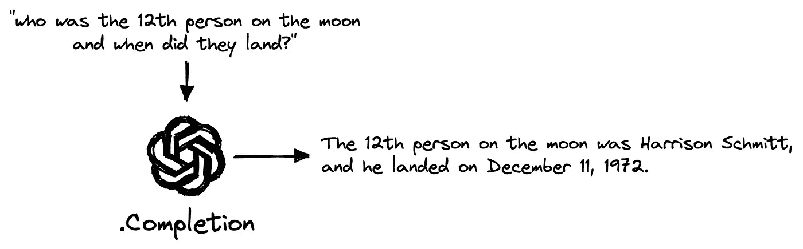
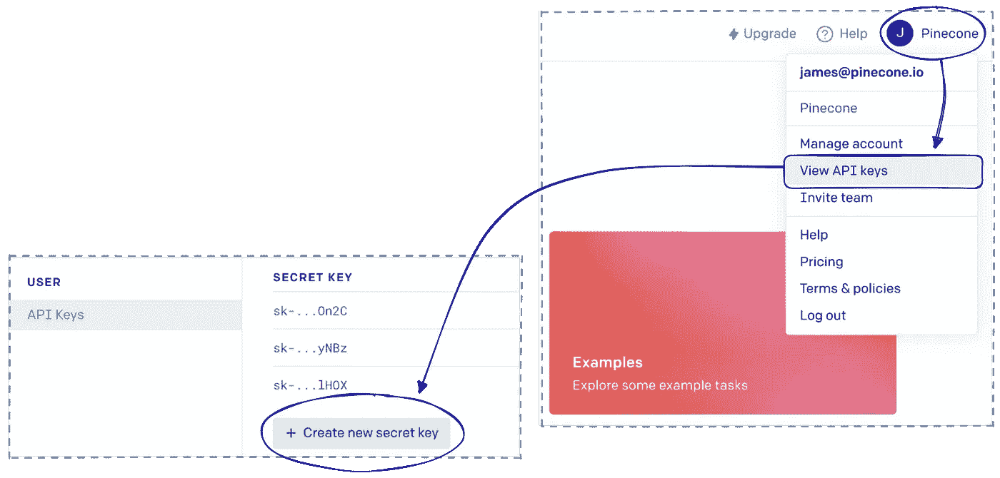
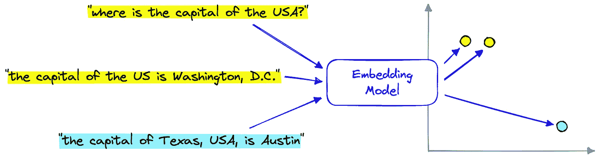
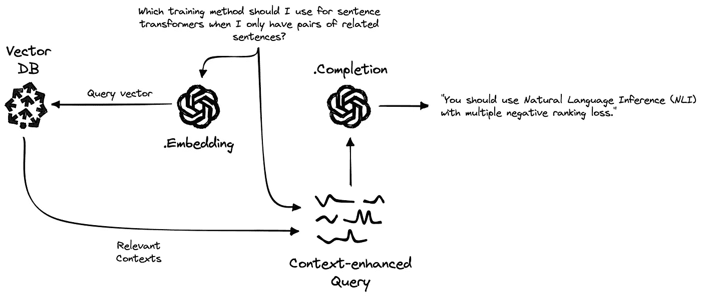

# 使用 GPT 3.5 和长期记忆的生成式问答

> 原文：[`towardsdatascience.com/generative-question-answering-with-long-term-memory-c280e237b144`](https://towardsdatascience.com/generative-question-answering-with-long-term-memory-c280e237b144)

## 探索增强检索的机器学习新世界

 [James Briggs](https://jamescalam.medium.com/?source=post_page-----c280e237b144--------------------------------)

·发布于 [Towards Data Science](https://towardsdatascience.com/?source=post_page-----c280e237b144--------------------------------) ·6 分钟阅读·2023 年 2 月 17 日

--

图片由 [Bret Kavanaugh](https://unsplash.com/@bretkavanaugh?utm_source=medium&utm_medium=referral) 在 [Unsplash](https://unsplash.com/?utm_source=medium&utm_medium=referral) 提供。*最初发布于* [*pinecone.io*](https://www.pinecone.io/learn/openai-gen-qa/)，作者在该网站工作*。

生成式人工智能在 2022 年激发了几次*“哇”*的时刻。从像 OpenAI 的 DALL-E 2、Midjourney 和 Stable Diffusion 这样的生成艺术工具，到像 OpenAI 的 GPT-3.5 这一代模型、BLOOM 以及 LaMDA 和 ChatGPT 这样的聊天机器人。

生成式人工智能（Generative AI）正经历兴趣和创新的蓬勃发展，这并不令人惊讶[1]。然而，这仅仅是生成式人工智能广泛应用的第一年：这是一个新兴领域的早期阶段，准备颠覆我们与机器互动的方式。

最具启发性的用例之一属于**G**enerative **Q**uestion-**A**nswering（GQA）。通过使用 GQA，我们可以为信息检索（IR）塑造类人互动。

我们每天都在使用信息检索系统。谷歌搜索对网络进行索引，并根据你的搜索词检索相关信息。Netflix 利用你在平台上的行为和历史推荐新的电视节目和电影，而亚马逊在产品方面也有类似的做法[2]。

这些信息检索（IR）的应用具有改变世界的潜力。然而，它们可能仅仅是我们在未来几个月和几年中看到的 IR 与生成式问答（GQA）结合的微弱回响。

想象一下，一个谷歌可以基于前 20 页的智能和深刻的摘要回答你的查询——突出关键点和信息来源。

现有技术已经使这变得可能且出乎意料的简单。本文将探讨增强检索的 GQA 及其如何与 Pinecone 和 OpenAI 一起实现。

最直接的 GQA 系统只需要用户文本查询和一个大型语言模型（LLM）。

最简单的 GQA 系统。

我们可以通过 [OpenAI](https://platform.openai.com) 访问世界上最先进的 LLM 之一。首先，我们需要注册一个 [API 密钥](https://beta.openai.com)。

注册账户后，可以通过点击你的账户（右上角）> 查看 API 密钥 > 创建新秘密密钥来创建 API 密钥。

然后我们切换到 Python 文件或笔记本，安装一些先决条件，并初始化与 OpenAI 的连接。

从这里，我们可以使用 OpenAI 完成端点来询问类似于 *“谁是第十二位登月者，他们何时着陆？”* 的问题：

我们立即得到一个准确的答案。然而，这个问题相对简单，如果我们问一个鲜为人知的话题会发生什么呢？

尽管这个答案在技术上是正确的，但它并不是一个真正的答案。它告诉我们使用监督学习方法来学习句子之间的关系。这两个事实都是正确的，但并没有回答原始问题。

有两种方法可以让我们的 LLM 更好地理解主题，并更准确地回答问题。

1.  我们对包含微调句子转换器领域的文本数据进行 LLM 微调。

1.  我们使用*检索增强生成*，即我们在 GQA 过程中添加一个信息检索组件。添加检索步骤可以让我们检索相关信息，并将其作为*二级信息来源*输入到 LLM 中。

在接下来的部分中，我们将概述如何实现**第二**种选择。

# 构建知识库

实现检索的**第二**种选择，我们需要一个外部的“*知识库*”。知识库既是存储信息的地方，又是有效检索这些信息的系统。

知识库是一个信息存储库，可以作为 GQA 模型的外部参考。我们可以将其视为 AI 系统的*“长期记忆”*。

我们将可以检索语义相关信息的知识库称为*向量数据库*。

向量数据库存储使用特定 ML 模型编码的信息的向量表示。这些模型对语言有一定的“理解”，可以将具有相似含义的段落编码到相似的向量空间，将不相似的段落编码到不同的向量空间。

我们可以通过 OpenAI 的嵌入端点实现这一点：

我们需要对许多记录重复执行嵌入过程，这些记录将作为我们管道的外部信息来源。这些记录仍需下载并准备好以进行嵌入。

## 数据准备

我们在知识库中使用的数据集是托管在 Hugging Face *Datasets*上的`jamescalam/youtube-transcriptions`数据集。它包含来自几个 ML 和技术 YouTube 频道的音频转录。我们用以下方式下载它：

数据集包含许多小的文本片段。我们需要合并几个片段，以创建包含更多有意义信息的更大文本块。

创建文本块后，我们可以开始初始化我们的知识库，并用数据填充它。

## 创建向量数据库

向量数据库是我们管道中的存储和检索组件。我们使用 Pinecone 作为我们的向量数据库。为此，我们需要[注册一个免费的 API 密钥](https://app.pinecone.io/)，并在下面输入它，以创建用于存储数据的索引。

然后我们这样嵌入和索引数据集：

我们准备将 OpenAI 的`Completion`和`Embedding`端点与我们的 Pinecone 向量数据库结合，创建一个检索增强 GQA 系统。

# OP Stack

OpenAI Pinecone（OP）技术栈是构建高性能 AI 应用（包括检索增强 GQA）的越来越受欢迎的选择。

我们在*查询时间*的管道包括以下内容：

1.  OpenAI `Embedding`端点用于创建每个查询的向量表示。

1.  Pinecone 向量数据库用于从以前索引的上下文数据库中搜索相关的段落。

1.  OpenAI `Completion`端点用于生成自然语言答案，考虑到检索到的上下文。

我们首先使用相同的编码器模型对查询进行编码，以创建查询向量`xq`。

查询向量`xq`用于通过`index.query`查询 Pinecone，并与之前索引的段落向量进行比较，以找到最相似的匹配项——在上面的`res`中返回。

使用这些返回的上下文，我们可以构建一个提示，指示生成 LLM 根据检索到的上下文回答问题。为了简单起见，我们将在一个名为`retrieve`的函数中完成所有这些工作。

请注意，为了可读性，生成的*扩展查询*（`query_with_contexts`）已被缩短。

从`retrieve`中，我们生成一个更长的提示（`query_with_contexts`），其中包含一些指令、上下文和原始问题。

然后，提示通过 OpenAI 的`Completion`端点输入生成 LLM。像以前一样，我们使用`complete`函数处理所有内容。

由于额外的*“源知识”*（直接输入模型的信息），我们消除了 LLM 的幻觉——生成了准确的回答。

除了提供更多的事实性回答外，我们还有 Pinecone 提供的*信息来源*用于生成我们的回答。将其添加到下游工具或应用中可以帮助提高用户对系统的信任，让用户确认所提供信息的可靠性。

这就是关于检索增强型**生成式问答**（GQA）系统的演示。

如前所示，单独使用大型语言模型（LLMs）效果非常好，但在面对更小众或具体的问题时却常常表现不佳。这通常会导致*幻觉*，这些幻觉不易被发现，且可能会被系统用户忽视。

通过为我们的 GQA 系统添加*“长期记忆”*组件，我们可以利用外部知识库来提高系统的准确性和用户对生成内容的信任。

自然，这类技术具有广泛的潜力。尽管它是一项新技术，但我们已经在[YouChat](https://blog.you.com/introducing-youchat-the-ai-search-assistant-that-lives-in-your-search-engine-eff7badcd655)、一些[播客搜索应用](https://huberman.rile.yt)中看到它的应用，并且有传闻称它将成为对抗谷歌的挑战者[3]。

任何需要信息的地方都有可能出现颠覆，而检索增强型 GQA 代表了利用当前过时信息检索系统的最佳机会之一。

[1] E. Griffith, C. Metz, [《人工智能的新领域蓬勃发展，即使在技术低迷时》](https://www.nytimes.com/2023/01/07/technology/generative-ai-chatgpt-investments.html)（2023），纽约时报

[2] G. Linden, B. Smith, J. York, [《亚马逊推荐：物品间协作过滤》](https://www.cs.umd.edu/~samir/498/Amazon-Recommendations.pdf)（2003），IEEE

[3] T. Warren, [《微软通过将 ChatGPT 与 Bing 搜索整合来挑战谷歌》](https://www.theverge.com/2023/1/4/23538552/microsoft-bing-chatgpt-search-google-competition)（2023），The Verge

*最初发表于* [*https://www.pinecone.io*](https://www.pinecone.io/learn/openai-gen-qa/) *。*

**所有图片均为作者提供，除非另有说明**
