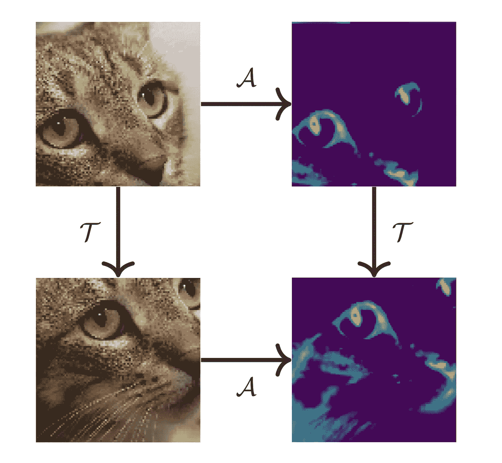
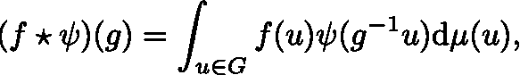
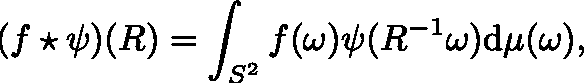
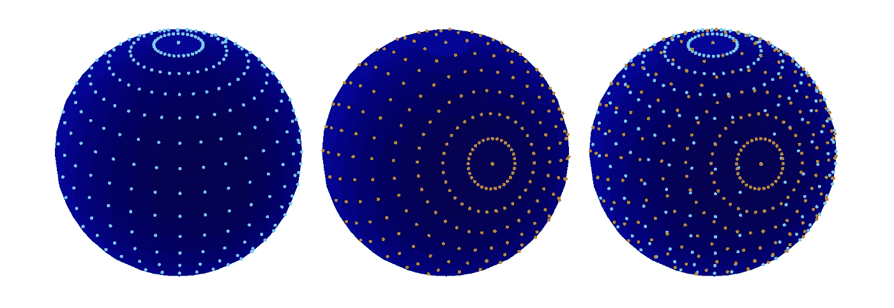
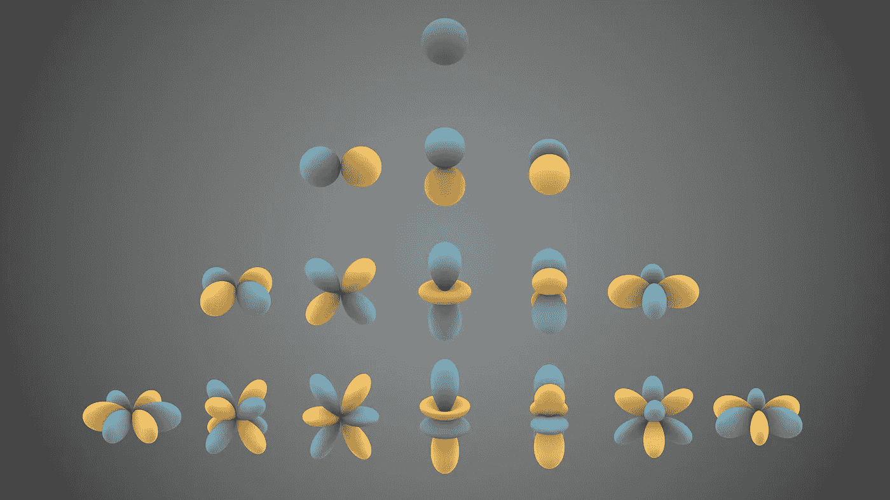
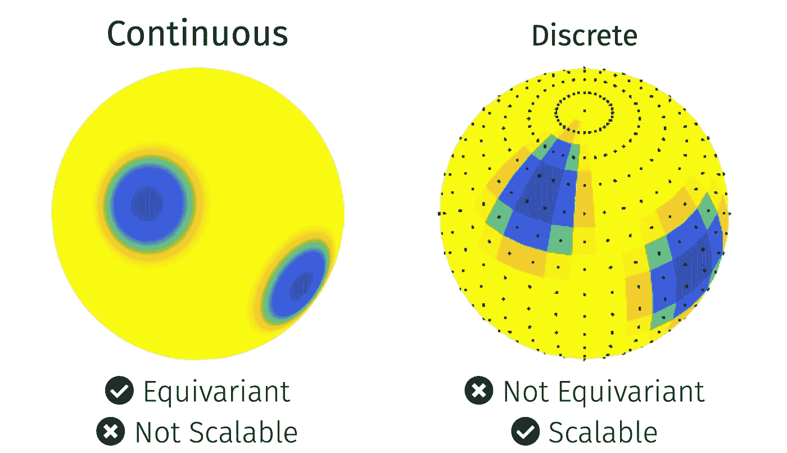

# 群体上的几何深度学习

> 原文：[`towardsdatascience.com/geometric-deep-learning-on-groups-cec82eb9366?source=collection_archive---------17-----------------------#2023-03-06`](https://towardsdatascience.com/geometric-deep-learning-on-groups-cec82eb9366?source=collection_archive---------17-----------------------#2023-03-06)

## Continuous vs discrete approaches on the sphere

 [Jason McEwen](https://jasonmcewen.medium.com/?source=post_page-----cec82eb9366--------------------------------)

·

[关注](https://medium.com/m/signin?actionUrl=https%3A%2F%2Fmedium.com%2F_%2Fsubscribe%2Fuser%2Fea87e920245&operation=register&redirect=https%3A%2F%2Ftowardsdatascience.com%2Fgeometric-deep-learning-on-groups-cec82eb9366&user=Jason+McEwen&userId=ea87e920245&source=post_page-ea87e920245----cec82eb9366---------------------post_header-----------) 发表在 [Towards Data Science](https://towardsdatascience.com/?source=post_page-----cec82eb9366--------------------------------) ·6 min read·Mar 6, 2023

--

*理想情况下，群体上的几何深度学习技术应该能够编码对群体变换的等变性，以提供良好的表示空间和出色的性能，同时也要具备计算效率。然而，没有一种方法能够同时提供这两种理想的属性。连续的方法提供了优秀的等变性，但计算成本非常高。离散的方法通常计算效率相对较高，但牺牲了等变性。我们指出了未来能够兼具这两者优点的技术。*

照片由 [Serg Antonov](https://unsplash.com/@antonov?utm_source=medium&utm_medium=referral) 提供，发布在 [Unsplash](https://unsplash.com/?utm_source=medium&utm_medium=referral)

群体上的深度学习是几何深度学习一个快速增长的领域（参见我们最近的 TDS 文章 *几何深度学习简要介绍*）。[群体](https://en.wikipedia.org/wiki/Group_theory)包括具有全局对称性的同质空间，其中最典型的例子是球面。

几何深度学习在群体上的实际应用很普遍，尤其是在球面上。例如，球形数据在许多应用中出现，不仅在数据直接获取自球面时（例如地球上的数据或通过 360° 相机捕捉全景照片和视频时），还包括考虑球面对称性时（例如分子化学或磁共振成像）。

> 我们需要在群体上既高效又可扩展到大规模高分辨率数据集的深度学习技术。一般来说，这个问题仍然没有解决。

一个球形数据的例子。[照片由 [NASA](https://unsplash.com/@nasa?utm_source=medium&utm_medium=referral) 提供，来自 [Unsplash](https://unsplash.com/?utm_source=medium&utm_medium=referral)]

# 目标

深度学习技术之所以如此有效，部分原因是现代架构中编码的归纳偏差。

一个特别强大的归纳偏差是编码数据已知满足的对称性（如我们 TDS 文章 *爱因斯坦可以教我们什么关于机器学习**）所阐述的）。例如，卷积神经网络（CNNs）编码了平移对称性，或更确切地说，平移等变性，如下图所示。

平移等变性的说明。给定一张图像（左上），应用卷积核（𝒜）以获得特征图（右上），然后平移（𝒯）特征图（右下），等同于首先平移图像（左下），然后应用卷积核（右下）。[原始图形由作者创建。]

在深度学习架构中编码等变性会产生行为良好的特征空间，使得学习可以非常有效地进行。

因此，对于群体上的几何深度学习，我们希望编码对各种群体变换的等变性，这通常会带来非常好的性能。然而，在一般的群体设置中，这变得非常计算密集——在许多情况下是不可行的。

> 如何在深度学习架构中以计算上可扩展的方式编码等变性是一个活跃的研究领域。

# 群体卷积

卷积的概念，负责 CNN 架构在平面图像上的巨大成功，自然地编码了等变性，并且可以推广到群体设置。

群上信号（即数据、特征图）*f* 与滤波器 *𝝭* 的群卷积表示为

其中 *g* 是群 *G* 的一个元素，而 d*µ(u)* 是积分的（Haar）测度。上述表达式与更常见的平面设置中的卷积完全类似。我们对滤波器进行变换（对于平面 CNN 来说是平移），与感兴趣的信号相乘，然后求和，即积分。

在球面上，我们考虑由 3D 旋转给出的变换，因此球面上的信号卷积表示为

其中 *R* 表示旋转，*ω* 为球面坐标。

一旦定义了群上的卷积，我们就可以以类似于标准平面 CNN 的方式在群上构建 CNN。即，通过组合卷积和逐点非线性激活（还包括适当地构建在群上的池化和归一化层）。

问题仍然是：我们如何在实践中计算群卷积？

> 一方面，我们希望实现能够准确捕捉卷积上的等变性特性。另一方面，我们希望实现具有高计算效率。如我们将看到的，现有方法通常只能捕捉这些要求中的一个，而不能同时满足两个要求。

# 离散球面 CNN 方法

现有的方法可以大致分为离散和连续方法。

离散方法处理数据的离散版本，通常是像素或图形表示，这通常具有很高的计算效率。然而，通常不存在规则的离散化。

以球面为例，众所周知，球面的规则离散化并不存在。因此，没有方法可以以不变于旋转的方式对球面进行离散化，如下图所示。

在球面上旋转一组像素会得到一组不能与现有集合重叠的像素。这在球面的所有采样中都是正确的。[原始图形由作者创建。]

在离散空间上直接定义的操作无法严格捕捉等变性。

> 因此，离散方法在计算性能上具有优势，但代价是等变性。

# 连续球面 CNN 方法

作为上述离散方法的替代方案，也可以考虑信号的连续表示。

球面上的函数可以通过球面谐波的展开表示（如下图所示）。对于带限信号，可以在有限的样本集合中捕捉到信号的所有信息内容，从中可以准确地计算球面谐波系数[1]。这类似于著名的[奈奎斯特-香农采样定理](https://en.wikipedia.org/wiki/Nyquist%E2%80%93Shannon_sampling_theorem)扩展到球面。

球面谐波函数。[图像来源于 [Wikimedia Commons](https://en.wikipedia.org/wiki/Spherical_harmonics#/media/File:Spherical_Harmonics.png)。]

由于球面是一个紧致流形，其谐波空间是离散的。因此，通过使用有限的球面谐波空间表示，可以访问底层的连续信号。

各种球面 CNN 架构已经被构建，其中卷积通过其谐波表示来计算[2–6]。通过访问底层的连续信号，这些方法实现了卓越的等变性。然而，它们涉及反复执行球面谐波变换，这在计算上是昂贵的。

> 连续方法准确捕捉旋转等变性，但计算要求高。

# 二分法：离散 vs 连续方法

如上所示，离散和连续方法之间存在一种二分法，如下图所示。理想情况下，我们希望技术既具有等变性又具有计算可扩展性。

然而，连续方法提供等变性，但计算成本很高。另一方面，离散方法通常计算效率较高，但牺牲了等变性。

连续和离散几何深度学习技术在群体上的二分法。[原始图由作者创建。]

# 破除二分法

我们期望在群体上进行几何深度学习的技术能够提供等变性（这通常转化为良好的表示空间和卓越的性能），同时也具有计算可扩展性。

> 在我们的下一篇文章中，我们将描述一种新的混合离散-连续（DISCO）方法，最近被 ICLR 接受，这种方法正好实现了这些目标[7]。通过保持表示的一些组件为连续的，我们实现了卓越的等变性，而其他组件则被离散化以提供高效的可扩展计算。

# 参考文献

[1] McEwen & Wiaux, *A novel sampling theorem on the sphere*, IEEE TSP (2012), [arXiv:1110.6298](https://arxiv.org/abs/1110.6298)

[2] Cohen, Geiger, Koehler, Welling, *Spherical CNNs*, ICLR (2018), [arxiv:1801.10130](https://arxiv.org/abs/1801.10130)。

[3] Esteves, Allen-Blanchette, Makadia, Daniilidis, *学习 SO(3)等变表示的球面卷积神经网络*，ECCV（2018），[arXiv:1711.06721](https://arxiv.org/abs/1711.06721)。

[4] Kondor, Lin, Trivedi, *Clebsch-Gordan 网络：一种完全傅里叶空间的球面卷积神经网络*，NeurIPS（2018），[arXiv:1806.09231](https://arxiv.org/abs/1806.09231)

[5] Cobb, Wallis, Mavor-Parker, Marignier, Price, d’Avezac, McEwen, *高效的广义球面卷积神经网络*，ICLR（2021），[arXiv:2010.11661](https://arxiv.org/abs/2010.11661#)

[6] McEwen, Wallis, Mavor-Parker*，*球面上的散射网络：用于可扩展和旋转等变的球面卷积神经网络*，ICLR（2022），[arXiv:2102.02828](https://arxiv.org/abs/2102.02828)

[7] Ocampo, Price, McEwen, *通过离散-连续（DISCO）卷积实现可扩展和等变的球面卷积神经网络*，ICLR（2023），[arXiv:2209.13603](https://arxiv.org/abs/2209.13603)
