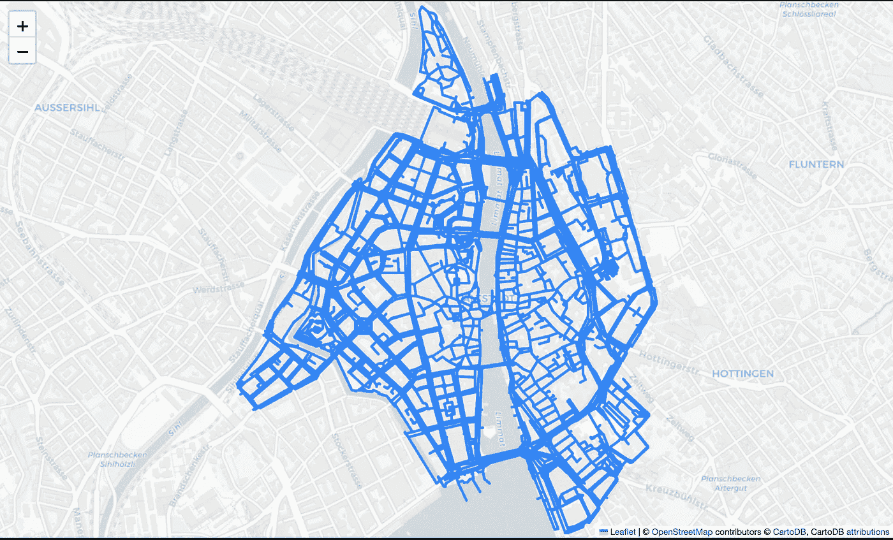
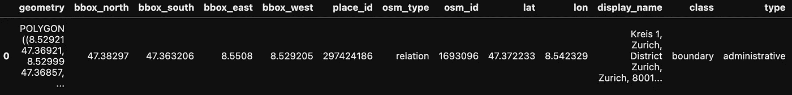
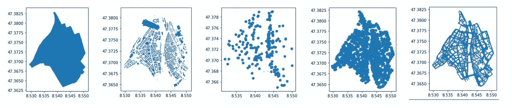
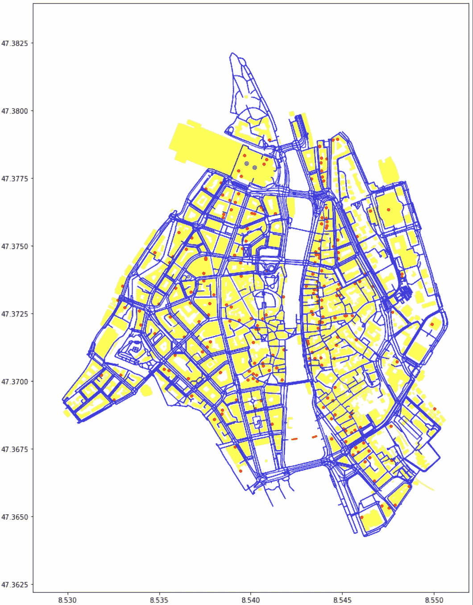
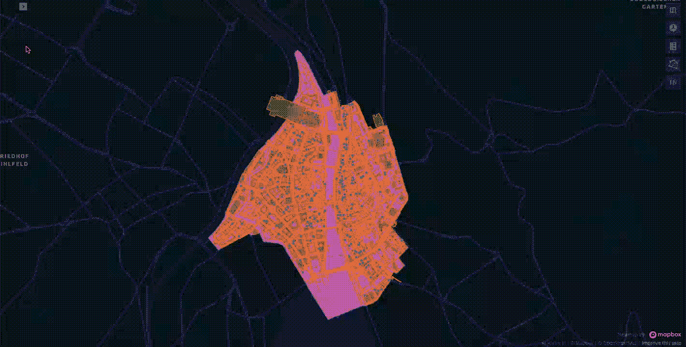
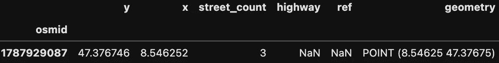
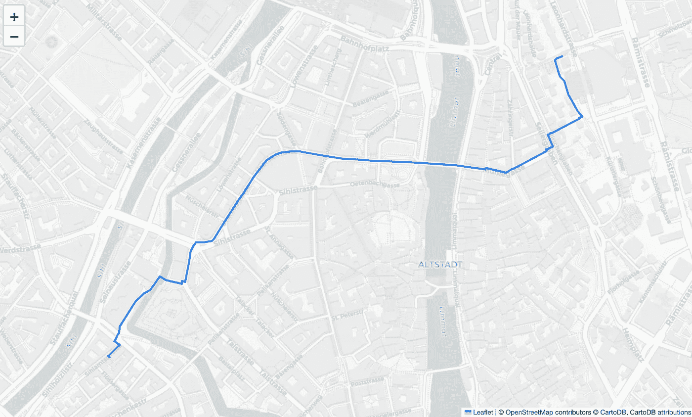
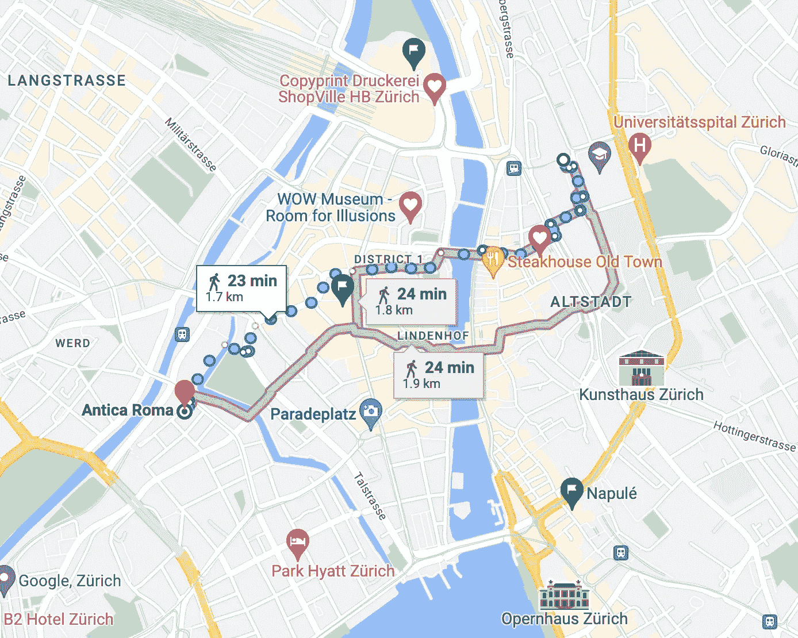

# Python 中的地理空间数据分析

> 原文：[`towardsdatascience.com/geospatial-data-analysis-in-python-d8fa8dd23a6c`](https://towardsdatascience.com/geospatial-data-analysis-in-python-d8fa8dd23a6c)

## 使用 OSMnx 和 Kepler.gl 开始进行地理数据分析

[](https://pierpaoloippolito28.medium.com/?source=post_page-----d8fa8dd23a6c--------------------------------)[](https://towardsdatascience.com/?source=post_page-----d8fa8dd23a6c--------------------------------) [Pier Paolo Ippolito](https://pierpaoloippolito28.medium.com/?source=post_page-----d8fa8dd23a6c--------------------------------)

·发表于[Towards Data Science](https://towardsdatascience.com/?source=post_page-----d8fa8dd23a6c--------------------------------) ·6 分钟阅读·2023 年 5 月 3 日

--


照片由[Aaron Burden](https://unsplash.com/@aaronburden?utm_source=medium&utm_medium=referral)拍摄，来源于[Unsplash](https://unsplash.com/?utm_source=medium&utm_medium=referral)

# 介绍

地理空间数据无处不在，并用于各种不同的应用场景（例如，根据位置计算房地产风险、设计新建筑开发、规划货物运输以及寻找不同地点之间的可能路线）。

地理空间数据通常以两种可能的格式存储：**栅格**和**矢量**：

+   栅格数据将数据表示为像素矩阵（因此具有固定分辨率）。在这种表示中，每个像素可以分配不同的值，多个栅格叠加在一起可以进一步增强同一图像。例如，同一图像可以使用 3 个通道/波段（例如 RGB——红色、绿色、蓝色）或使用单一通道进行存储。

+   矢量可以用于抽象现实世界的几何形状，使用点、线、多边形等元素，并且通常可以与表示它们的对象的一些有用元数据一起存储（例如名称、地址、所有者等）。由于它们作为数学对象存储，因此可以在不损失分辨率的情况下放大矢量。

矢量数据通常存储在 SVG 和 Shapefiles 等文件格式中，而栅格数据则存储在 TIFF、JPG、PNG 等格式中。

在处理地理空间数据时，通常需要进行许多不同形式的操作/转换，一些例子包括：

+   从非表格/原始二进制格式转换为矢量/栅格。

+   将连续数据分桶为离散类别。

+   从数据中提取多边形/特征。

+   处理无数据和离群值。

+   在不同坐标系统中重投影。

+   生成较低分辨率的数据概览，以处理不同的缩放级别，并避免图像渲染过载。

如果你对图像数据在机器学习系统中的具体应用感兴趣，可以在[我的上一篇文章](https://pierpaolo28.github.io/blog/blog39/)中找到更多信息。

# 演示

作为本文的一部分，我们现在将通过实际演示来分析地理空间矢量数据，以识别特定位置并计算到达该位置的最短路径。本文中使用的所有代码（以及更多！）可在[我的 GitHub](https://github.com/pierpaolo28)和[Kaggle 账户](https://www.kaggle.com/pierpaolo28)上找到。

首先，我们需要确保在环境中安装了所有必要的依赖。

```py
pip install osmnx
pip install folium
pip install keplergl
```

在这个例子中，我们将探索瑞士苏黎世的 Altstadt 区。利用***OSMnx***，只需使用两行代码就可以检索并可视化我们需要的数据（图 1）。[OSMnx](https://osmnx.readthedocs.io/en/stable/)实际上是为了以最简单的方式提取和使用[OpenStreetMap](https://www.openstreetmap.org/#map=6/42.088/12.564)数据而设计的。OpenStreetMap 是由志愿者社区维护的全球免费地理数据库。

```py
import osmnx as ox
import networkx as nx
import matplotlib.pyplot as plt
import folium
from keplergl import KeplerGl

place_name = "Altstadt, Zurich, Switzerland"

graph = ox.graph_from_place(place_name)

ox.plot_graph_folium(graph)
```



图 1：待检查区域的图表（图片来源：作者）。

我们现在可以深入探讨获取数据的不同方法。首先，我们可以获得我们所表示区域的多边形作为探索的基础。一旦获取了数据，它将以[***Geo Pandas***](https://geopandas.org/en/stable/)数据框的形式呈现，其中包含关于该区域的所有关键信息（图 2）。Geo Pandas 是一个开源库，专门设计用于扩展 Pandas 的功能，以处理地理空间数据。

为了创建任何可视化表示，***geometry***列用作参考点，每一行都表示在地图上创建对象所需的所有坐标（例如多边形、线、点、多边形）。在这个例子中，[***Well-known text***](https://en.wikipedia.org/wiki/Well-known_text_representation_of_geometry) ***(WKT)***被用作表示我们的矢量几何对象的文本标记语言，但通常也可以使用其他格式，如***GeoJSON***。此外，GeoSeries 中的每个值都存储在[***Shapely Object***](https://shapely.readthedocs.io/en/stable/manual.html)中，以便尽可能容易地执行操作和转换。

```py
area = ox.geocode_to_gdf(place_name)
area.head()
```



图 2：GeoPandas 数据集示例（图片来源：作者）。

此时，我们可以重复相同的程序，以检索我们希望在地图上绘制的不同兴趣点。在这种情况下，假设我们正在苏黎世的 Altstadt 度假，我们想要查看所有前往餐厅的选项。为了简化我们的研究，我们可以获取所有代表街道的节点和边缘，以及所有可用的建筑物和餐馆，以便我们在地图上进行定位。

```py
buildings = ox.geometries_from_place(place_name, tags={'building':True})
restaurants = ox.geometries_from_place(place_name, 
                                       tags={"amenity": "restaurant"})
nodes, edges = ox.graph_to_gdfs(graph)
```

一旦我们加载了所有数据，我们可以独立绘制每个特征（图 3）。



图 3：区域、建筑物、餐馆、节点和边缘表示（作者提供的图像）。

使用下面的`code`，这可以最终在下方的单一图表中漂亮地总结出来（图 4）。

```py
fig, ax = plt.subplots(figsize=(10, 14))
area.plot(ax=ax, facecolor='white')
edges.plot(ax=ax, linewidth=1, edgecolor='blue')
buildings.plot(ax=ax, facecolor='yellow', alpha=0.7)
restaurants.plot(ax=ax, color='red', alpha=0.9, markersize=12)
plt.tight_layout()
```



图 4：分析摘要（作者提供的图像）。

为了使我们的分析更具互动性，我们还可以使用额外的库，例如***KeplerGL***。[KeplerGL](https://kepler.gl/)是由 Uber 开发的开源地理空间工具箱，用于创建高性能的基于网页的地理应用程序。

使用 KeplerGL，我们可以轻松地将地图叠加在真实的全球地图上，并实时应用各种转换和过滤（图 5）。

```py
K_map = KeplerGl()
K_map.add_data(data=restaurants, name='Restaurants')
K_map.add_data(data=buildings, name='Buildings')
K_map.add_data(data=edges, name='Edges')
K_map.add_data(data=area, name='Area')
K_map.save_to_html()
```



图 5：带 KaplerGL 的互动分析摘要（作者提供的图像）。

现在我们已经构建了地图，并且有了一个互动工具来检查这些数据，我们可以最终尝试将研究范围缩小到一个餐厅。在这种情况下，我们首先将重点限制在意大利餐馆，然后选择 Antica Roma 作为我们的选择地点。

现在，我们只需要指定我们的初始位置坐标和目的地，以开始寻找最佳的步行路径（图 6）。

```py
it_resturants = restaurants.loc[restaurants.cuisine.str.contains('italian')
                                  .fillna(False)].dropna(axis=1, how='all')
resturant_choice = it_resturants[it_resturants['name'] == 'Antica Roma']
orig = list(graph)[993]
dest = ox.nearest_nodes(graph, 
          resturant_choice['geometry'][0].xy[0][0],
          resturant_choice['geometry'][0].xy[1][0])
nodes[nodes.index == orig]
```



图 6：起始位置表示（作者提供的图像）。

为了完成这项任务，我们可以使用[***Networkx***](https://networkx.org/) ***shortest_path function*** 来自动运行[***Dijkstra 算法***](https://en.wikipedia.org/wiki/Dijkstra%27s_algorithm) 并尝试优化我们的路径以最小化其总体长度（图 7）。

```py
route = nx.shortest_path(graph, orig, dest, weight='length')
ox.plot_route_folium(graph, route, route_linewidth=6, node_size=0)
```



图 7：到达目的地的最短路径（作者提供的图像）。

最后，为了验证我们的研究，我们可以尝试在 Google Maps 上执行相同的查询，如下所示，结果非常接近！（图 8）。



图 8：Google Maps 到达目的地的最短路径（作者提供的图像）。

# 结论

总结一下，在这篇文章中，我们首先介绍了地理空间数据如何在企业中使用，它通常是如何存储和处理的，并通过一个实际示例来识别两个不同点之间的最短路径。当然，我们也可以使用基于 UI 的工具进行类似的分析，比如[OpenStreetMap 应用](https://www.openstreetmap.org/#map=14/47.3408/8.5400)或[Google Maps](https://www.google.ch/maps/)，虽然学习这些基础知识仍然非常有价值，因为它们可以应用于许多其他形式的网络问题（例如[旅行推销员问题](https://en.wikipedia.org/wiki/Travelling_salesman_problem)）。

# 联系方式

如果你想了解我最新的文章和项目，可以[在 Medium 上关注我](https://pierpaoloippolito28.medium.com/subscribe)并订阅我的[邮件列表](http://eepurl.com/gwO-Dr)。以下是我的一些联系方式：

+   [Linkedin](https://uk.linkedin.com/in/pier-paolo-ippolito-202917146)

+   [个人网站](https://pierpaolo28.github.io/)

+   [Medium 个人资料](https://towardsdatascience.com/@pierpaoloippolito28)

+   [GitHub](https://github.com/pierpaolo28)

+   [Kaggle](https://www.kaggle.com/pierpaolo28)
