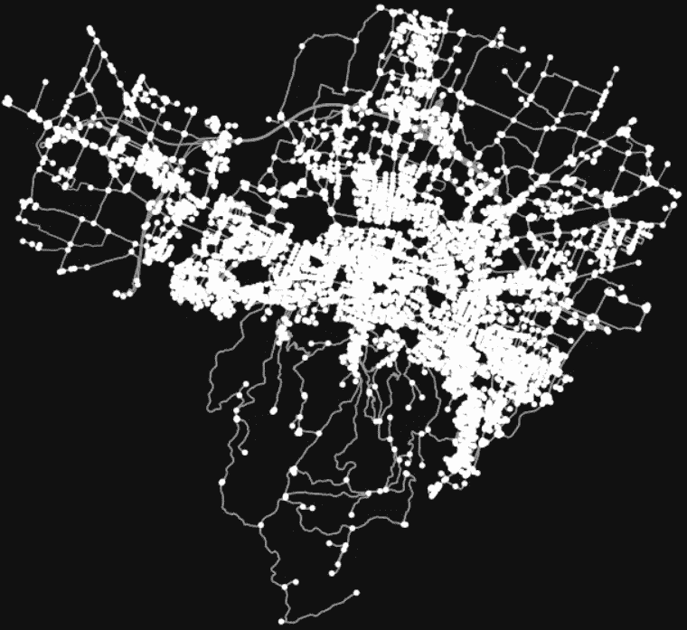
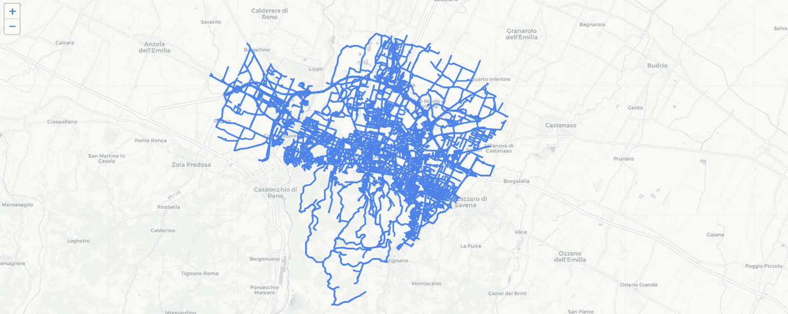
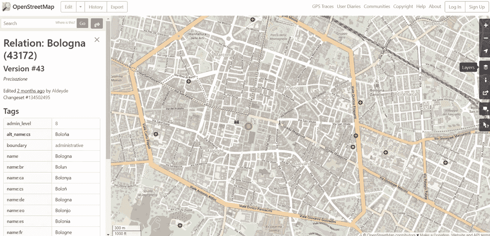
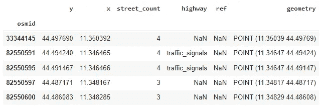
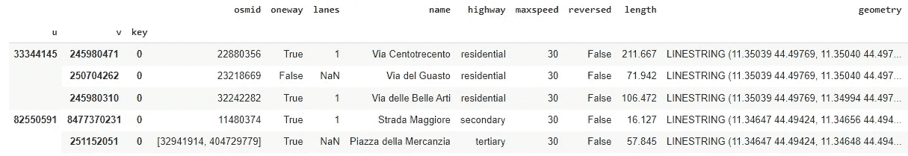
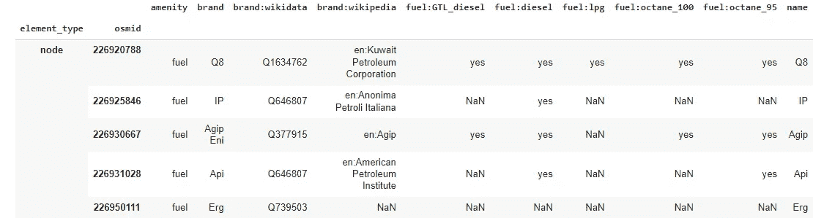
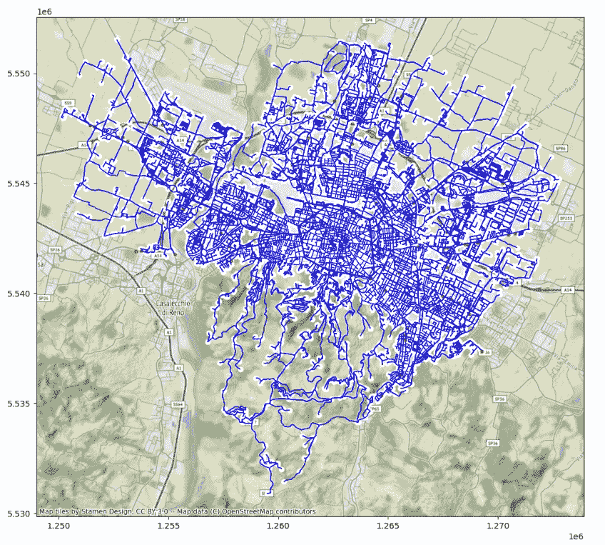
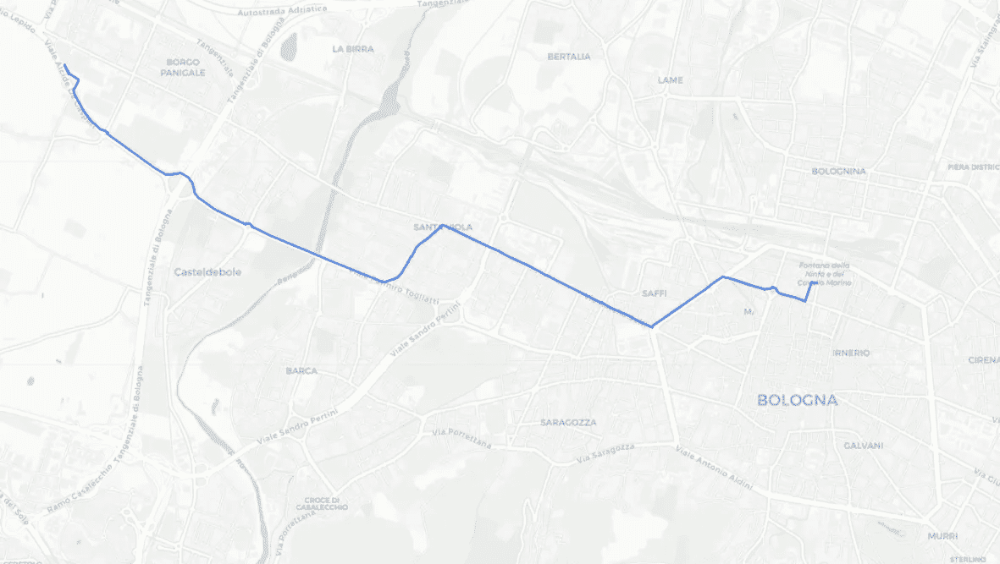

# 使用 OSMnx 进行地理空间数据分析

> 原文：[`towardsdatascience.com/geospatial-data-analysis-with-osmnx-8a300d77b592`](https://towardsdatascience.com/geospatial-data-analysis-with-osmnx-8a300d77b592)

## 学习如何使用 Python 下载、分析和可视化 OpenStreetMap 数据

[](https://eugenia-anello.medium.com/?source=post_page-----8a300d77b592--------------------------------)[](https://towardsdatascience.com/?source=post_page-----8a300d77b592--------------------------------) [尤金妮亚·安内洛](https://eugenia-anello.medium.com/?source=post_page-----8a300d77b592--------------------------------)

·发布于 [Towards Data Science](https://towardsdatascience.com/?source=post_page-----8a300d77b592--------------------------------) ·6 分钟阅读·2023 年 6 月 16 日

--


照片由 [Denys Nevozhai](https://unsplash.com/@dnevozhai) 提供，来源于 [Unsplash](https://unsplash.com/photos/7nrsVjvALnA)

*这是关于地理空间数据分析系列的第四篇文章：*

1.  *使用 QGIS 进行地理空间数据分析*

1.  *OpenStreetMap 入门指南*

1.  *使用 GeoPandas 进行地理空间数据分析*

1.  *使用 OSMnx 进行地理空间数据分析（本文）*

1.  [*数据科学家的地理编码*](https://www.datacamp.com/tutorial/geocoding-for-data-scientists)

1.  [*使用 Geemap 进行地理空间数据分析*](https://www.kdnuggets.com/geospatial-data-analysis-with-geemap)

在之前的教程中，我涵盖了地理空间数据分析的各个方面。我首先展示了不使用任何代码的地理空间数据实际示例，以帮助你深入理解这些概念。地理空间数据分析是一个普遍存在的领域，涉及处理一种特殊类型的数据——地理空间数据。

这包括将位置添加到非地理数据中。文中充满了示例。你可以想到咖啡馆、医院、道路、河流、卫星图像等。即使你用 Google Maps 搜索一个地点，你也在与地理空间数据互动。

这次我将专注于从 OpenStreetMap 下载、可视化和分析数据。OpenStreetMap 是最大的免费且可编辑的地理数据库，来自世界各地的志愿者共同参与这个庞大的项目。这个教程得益于一个名为 OSMnx 的 Python 包。让我们开始吧！

**目录：**

+   **OSMNx 简介**

+   **下载和可视化 OSM 数据**

+   **将图形转换为 GeoDataframe**

+   **提取兴趣点**

+   **寻找最短路径**

## **OSMNx 简介**

OSMnx 是一个用于下载、分析和可视化 OpenStreetMap 网络数据的库。它依赖于两个库，[NetworkX](https://networkx.org/)和[GeoPandas](https://geopandas.org/en/stable/)。特别地，它利用 NetworkX 库中的`graph`模块来检索网络数据。

此外，它允许我们与两个 OpenStreetMap API 进行交互：

+   [**Nomatism**](https://nominatim.org/)用于地理编码，即通过名称和地址查找位置。

+   [**Overpass API**](https://wiki.openstreetmap.org/wiki/Overpass_API)用于提取兴趣点，如高速公路、学校和公园。

## **下载和可视化 OSM 数据**

我们可以直接使用 OSMNx，而不是从网站或 Geofabrik 手动下载数据。

首先，我们需要导入四个库，这些库将在教程中稍后使用：

```py
import osmnx as ox
import folium
import contextily as cx
import matplotlib.pyplot as plt
```

除了 OSMnx 和 matplotlib，我们还将利用**folium**，它以创建交互式地图而闻名，以及**contextily**来添加背景地图。这一点对获得现实地图非常重要。

像之前一样，我们将读取并可视化博洛尼亚的 OSM 街道网络数据，博洛尼亚是意大利最大的城市之一。

```py
PLACE_NAME = 'Bologna, Italy'
G = ox.graph_from_place(PLACE_NAME, network_type='drive')
ox.plot_graph(G) 
```



博洛尼亚的黑白可视化

从黑白可视化中，我们可以观察到代表节点的点和描绘线路的线条。与 OpenStreetMap 网站相比，它可能显得非常静态和基础。Folium 通过其强大的可解释地图来拯救我们：

```py
ox.plot_graph_folium(G)
```



使用 Folium 获得的博洛尼亚地图

这要好得多，你不觉得吗？亮丽的颜色和与地图交互的可能性是使用 Google Maps 去未知地方时至关重要的特点。

如果你更仔细地查看 OpenStreetMap 网站，你会发现默认情况下是标准图层。除了标准图层，还有其他图层，比如 Cycle Map 和 Transport Map。我们可以根据目的利用不同的图层，这一点非常令人惊叹。



如果我们对自行车情有独钟，我们会更关注 Cycle Map。只需一行代码就能实现：

```py
G = ox.graph_from_place(PLACE_NAME, network_type='bike')
```

在接下来的部分，我们将考虑标准图形。

## 将图形转换为 GeoDataframe

处理图形不像处理 Dataframes 和 GeoDataframes 那样直观。因此，我们可能需要将图形转换为 GeoDataframe：

```py
area,edges = ox.graph_to_gdfs(G)
area.head()
```



```py
edges.head()
```



你会发现我们得到了两个 GeoDataframe，一个用于节点，一个用于边。查看几何形状就会很清楚。区域 geodataframe 只有一对坐标，即纬度和经度，而包含边的 geodataframe 中有两对坐标。

## **提取兴趣点**

在进行数据科学项目时，我们尝试通过在互联网上搜索开放数据来为数据集添加信息。从 OSM 数据中，可以提取 **兴趣点**（POI），这些是根据我们的分析目的我们可能会觉得有趣的地方。示例包括餐馆、教堂、博物馆和公园。

例如，我们想要分析博洛尼亚的交通情况，以优化和减少运输成本。在这种情况下，了解高速公路、加油站、停车场以及其他可能成为瓶颈的地方将非常有用。

让我们来看看城市中的所有加油站。这可以通过将 [燃料](https://wiki.openstreetmap.org/wiki/Tag:amenity=fuel?uselang=en) 作为 amenity 键的值来实现。

```py
fuel_stations = ox.geometries_from_place(
    PLACE_NAME,
    {"amenity": "fuel"},
)
fuel_stations.head()
```



由于我们已经提取了所有加油站，通过可视化地图来理解它们的位置会更有用。此外，我们可以添加基础地图来更好地 contextualize 我们的结果。

```py
area_crs = area.to_crs('3857')
edges_crs = edges.to_crs('3857')
fuel_stations_crs = fuel_stations.to_crs('3857')

fig, ax = plt.subplots(figsize=(10, 14))
area_crs.plot(ax=ax, facecolor='white')
edges_crs.plot(ax=ax, linewidth=1, edgecolor='blue')
fuel_stations_crs.plot(ax=ax, color='red', alpha=0.9, markersize=12)
plt.tight_layout()
cx.add_basemap(ax,crs=area_crs.crs.to_string())
```



太棒了！我们可以注意到大多数加油站集中在城市边缘。此外，我们可以区分不同组的服务站，这些在测量中心外交通时需要考虑。

## **找到最短路线**

OSMnx 库的另一个有用功能是能够计算两个点之间的最短路径。

```py
origin = (
    ox.geocode_to_gdf("Parco della Montagnola, Bologna, Italy") 
    .to_crs(edges.crs)  
    .at[0, "geometry"]  
    .centroid  
)

destination = (
    ox.geocode_to_gdf("Esso, Bologna, Italy")
    .to_crs(edges.crs)
    .at[0, "geometry"]
    .centroid 
)

origin_node_id = ox.nearest_nodes(G, origin.x, origin.y)
destination_node_id = ox.nearest_nodes(G, destination.x, destination.y)
```

这是通过 shortest_path() 方法实现的，该方法默认使用 **Dijkstra 算法** 来计算源节点和目标节点之间的路径。

```py
route = ox.shortest_path(G, origin_node_id, destination_node_id)
route
#[400881920,
# 250763178,
# 250763179,
# 250763533, ...
# 1694666466]
```

我们还可以尝试在同一地图上可视化图形和最短路径：

```py
ox.plot_route_folium(G, route, route_linewidth=6, node_size=0)
```



看吧！这就像我们使用了 Google Maps 来寻找路线一样，不过我们利用了 OSMnx 库的功能来进行查找。

## 最后的想法：

这是一份指南，让你了解如何使用 Python 操作 OSM 数据。我发现 OSMnx 是处理 OpenStreetMap 数据的最完整的 Python 库。当然，它更适合探索较小的地方，比如城市。如果数据集较大，最好使用更专业的软件，比如 QGIS 来进行可视化。如果你尝试过其他库来处理 OSM 数据，请在评论中分享。如果你想查看代码，可以点击 [这里](https://jovian.com/eugeniaring/geospatial-osm-osmnx)。感谢阅读！祝你有美好的一天！

**有用的资源：**

+   [OSMnx 文档](https://osmnx.readthedocs.io/en/stable/)

+   [兴趣点](https://wiki.openstreetmap.org/wiki/Points_of_interest)

+   [OSMnx: 用于街道网络的 Python](https://geoffboeing.com/2016/11/osmnx-python-street-networks/)

+   [自动化 GIS 过程](https://autogis-site.readthedocs.io/en/latest/lessons/lesson-6/network-analysis.html)

你喜欢我的文章吗？[*成为会员*](https://eugenia-anello.medium.com/membership) *并每天获得无限的数据科学文章访问权限！这是一种间接支持我的方式，对你没有额外费用。如果你已经是会员，* [*订阅*](https://eugenia-anello.medium.com/subscribe) *以便每当我发布新的数据科学和 Python 指南时接收邮件！*
