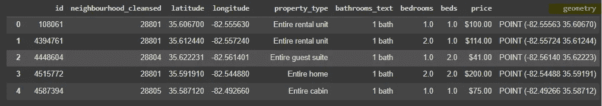
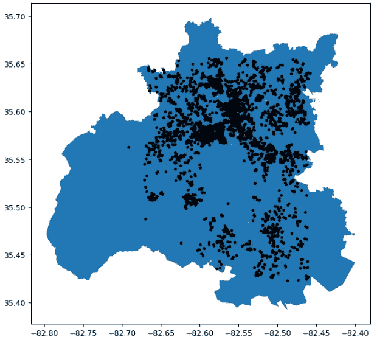
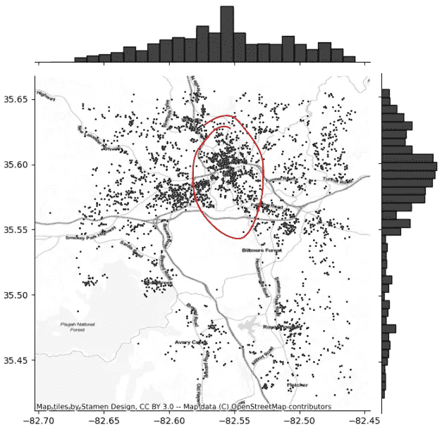
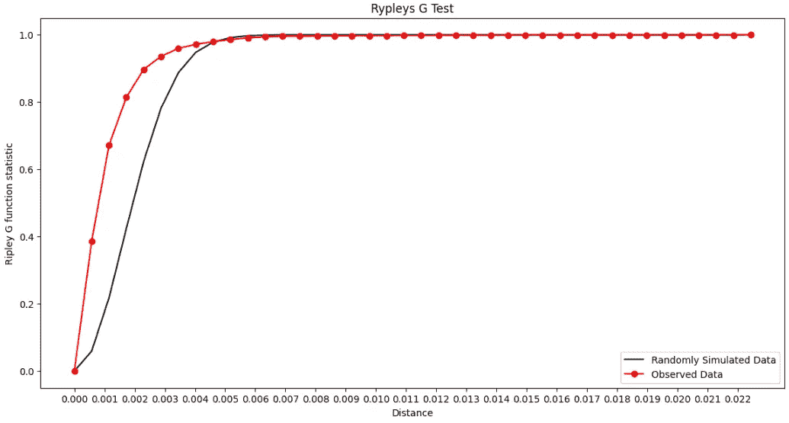
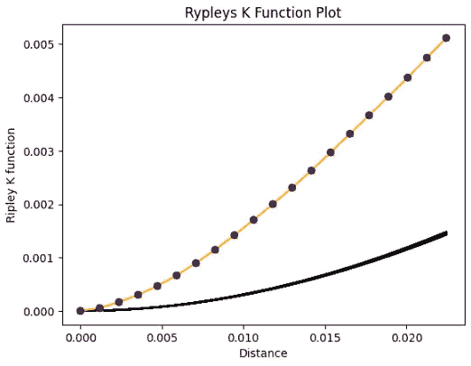

# 地理空间数据科学：点模式分析

> 原文：[`towardsdatascience.com/geospatial-data-science-points-pattern-analysis-a61e04a6ddb8`](https://towardsdatascience.com/geospatial-data-science-points-pattern-analysis-a61e04a6ddb8)

## 在 Python 中执行地理空间点模式分析的快速教程。

[](https://gustavorsantos.medium.com/?source=post_page-----a61e04a6ddb8--------------------------------)[](https://towardsdatascience.com/?source=post_page-----a61e04a6ddb8--------------------------------) [Gustavo Santos](https://gustavorsantos.medium.com/?source=post_page-----a61e04a6ddb8--------------------------------)

·发表于 [Towards Data Science](https://towardsdatascience.com/?source=post_page-----a61e04a6ddb8--------------------------------) ·阅读时间 8 分钟·2023 年 9 月 25 日

--


图片由 [Bernard Hermant](https://unsplash.com/@bernardhermant?utm_source=unsplash&utm_medium=referral&utm_content=creditCopyText) 在 [Unsplash](https://unsplash.com/photos/Jlh7u4NjNAQ?utm_source=unsplash&utm_medium=referral&utm_content=creditCopyText) 提供

# 介绍

地理空间数据科学是数据领域的一个子领域，处理考虑事件发生在空间中的位置的数据点分析。

假设我们拥有一家销售智能手机的零售连锁店。我们的连锁店有几个配送中心，我们即将开设几家新店。我们可以在哪里开设这些新店？

这样的洞察可能来自地理空间分析，这种分析会向我们展示销售的集中地点，如果销售在某些地方更高或更低，以及其他洞察。

当我们想确保查看的是一个地理上集中的数据集时，点模式分析就会进入这个游戏。就像我们数据科学家的工作一样，点模式涉及到创建一个假设并通过应用于数据的统计方法来消除许多不确定性，以确认这个假设。在这种情况下，也不例外。这里有几个统计测试需要完成，本文将展示这些测试。

顺便提一下，我们最近在我的博客中研究了地理空间数据科学。如果你对这个主题了解不多，这里有两篇不错的读物可以在你深入阅读之前参考。

[](/analyzing-geospatial-data-with-python-7244c1b9e302?source=post_page-----a61e04a6ddb8--------------------------------) ## 使用 Python 分析地理空间数据

### 一个包含 Python 代码的实用数据分析帖子。

[towardsdatascience.com [](/analyzing-geospatial-data-with-python-part-2-hypothesis-test-fe3f3f18fc82?source=post_page-----a61e04a6ddb8--------------------------------) ## 使用 Python 分析地理空间数据（第二部分 — 假设检验）

### 学习阿什维尔 AirBnb 房源的地理空间假设检验。

[towardsdatascience.com

# 编码

## 包

让我们从这次练习中使用的包开始。如果你的环境中没有安装它们，别忘了使用`pip install`或`conda install`（对于 Anaconda 用户），然后跟上包名。

```py
import pandas as pd
import numpy as np
import geopandas as gpd
import seaborn as sns
import matplotlib.pyplot as plt
import contextily

# Spatial Stats
from pointpats import distance_statistics, QStatistic, random, PointPattern
```

## 数据集

使用的数据集再次是*AirBnb*在美国北卡罗来纳州阿什维尔市的房源数据。数据可以从网站 [`insideairbnb.com/`](http://insideairbnb.com/) 的一个独立项目中获取，任何人都可以前往下载数据集进行分析。这些数据在 [创意共享署名 4.0 国际许可协议](http://creativecommons.org/licenses/by/4.0/) 下开放。

我已经下载了文件 [listings.csv.gz](http://data.insideairbnb.com/united-states/nc/asheville/2023-06-18/data/listings.csv.gz)。

要将数据加载到 Python 会话中，这里是代码。第一个代码片段是来自 Pandas 的简单`read_csv()`，我们预先确定了希望从原始数据中提取哪些列。然后，我们使用`gpd.GeoDataFrame`将数据集转换为`Geopandas`对象类型，指定用作 X 轴和 Y 轴的列，以及地理坐标系统（`crs` *— 使用 4326，它与 GPS 系统相同，是最常见的参考系统之一*）。

```py
# Import the file to this exercise
# Open listings file
listings = pd.read_csv('/content/listings.csv',
                       usecols=['id', 'property_type', 'neighbourhood_cleansed',
                                'bedrooms', 'beds', 'bathrooms_text', 'price',
                                'latitude','longitude'])

# Convert the file to GeoPandas
points_gpd = gpd.GeoDataFrame(listings,
                              geometry= gpd.points_from_xy(
                                  x=listings.longitude,
                                  y=listings.latitude),
                              crs= "EPSG:4326")
```

基本上，将数据转换为 Geopandas 就是创建这个列`geometry`和对象类型。



Geopandas 数据集。图片由作者提供。

很好。完成这些后，我们来快速看看地图。代码很简单，创建了一个图形`fig`和两个坐标轴`ax`，因为会有两个图：一个是底图，另一个是点图。

```py
#Quick check gpd dataframe
fig, ax = plt.subplots(figsize=(8,8))
# zorder=1 is the plot below
asheville.plot(ax=ax, color=None, zorder=1)
# zorder=2 is the top layer
points_gpd.plot(ax=ax, zorder=2, color='black', markersize=8)
```

这段代码生成了下一个图表。



**阿什维尔，北卡罗来纳州**的 Airbnb 房源列表。图片由作者提供。

很酷。地图看起来不错，但没有提供太多信息。现在让我们增强分析。

## 点模式

当考虑点模式分析时，我们可以做的第一个分析是检查这些数据点在地理上的集中程度。

这里，`seaborn`库可以提供帮助。方法`jointplot`将散点图与边缘的直方图结合起来。这是分析中的一个绝妙补充，因为它通过查看条形图较高的地方，给我们提供了点的集中情况和位置的见解。

要创建它，我们可以传递来自`geometry`列的 x 和 y，加上数据集（`data`）、点的大小（`s`）、`color`和图形的`height`。下一个片段是将基图添加到此联合图中，可以使用`contextily`，将联合图变量传递给该方法。

```py
# Check concentration of the points
plot2 = sns.jointplot(
    x= points_gpd.geometry.x,
    y= points_gpd.geometry.y,
    data= points_gpd,
    s=5, height=7, color='k')

# Add a basemap to the jointplot
contextily.add_basemap( plot2.ax_joint,
                       crs="EPSG:4326",
                        source= contextily.providers.Stamen.TonerLite)
```

结果是我们看到了这个漂亮的地图。



在北卡罗来纳州阿什维尔的基础地图上的联合图。图片由作者提供。

我喜欢这个图。通过它，我们可以快速获得一些有价值的见解。用红色标记的市中心区域（及其周边）确实是列表集中所在的地方。然后我们还可以注意到，随着离该区域越来越远，列表数量减少并变得更加稀疏。

这完全有意义。我们来想一想：Airbnb 是一个让人们租赁房屋或卧室的平台。这些租赁房产通常位于住宅区，因为它们的主要用途是作为居住场所，而非商业场所。而房屋社区的地点通常位于城市基础设施周围的区域，比如商场、超市、药店、银行等。由于山区偏远地区的房屋建设更具挑战，因此预计那里也会有较少的位置点。

## 统计检验

现在我们已经绘制了联合图并获得了一些有用的见解，但我们仍然需要测试点的分布模式，以确定它们是否在统计上存在聚类。我是说，这些点也可能只是偶然聚集在一起的。谁知道呢。

所以，为了测试并确保你在处理的是一个模式，有两个很好的检验：

+   **Ripley 的 G：** 这个检验会检查一个点到其最近邻的距离的累积分布。因此，该检验测量从给定房屋到邻居 1、2、3、……、n 的距离，并将这些距离的分布与模拟的随机点分布进行比较。如果我们观察到观察到的数据在特定空间中的行为与模拟不同，我们可以得出结论：数据有一定模式，因此是聚类的。

+   **Ripley 的 K：** 这个检验进行类似的测试，将观察到的数据与随机模拟分布进行比较。与 G 检验的不同之处在于，K 检验考虑了数据中的所有距离，而不仅仅是最近的邻居。

> Ripley 的 G 检验距离最近邻的分布。Ripley 的 K 检验整个数据集的距离分布。

## Ripley 的 G

现在我们来学习如何执行这些检验。首先是 G 检验。这个检验写起来相对简单，但运行时间可能较长，取决于数据集的大小。在这里，检验获取了 40 个邻居的距离。运行大约花了 6 分钟。

```py
# Coding Ripley's G (6 mins to run)
ripley_g = distance_statistics.g_test(points_gpd[['longitude', 'latitude']].values,
                                      support=40,
                                      keep_simulations= True)
```

要绘制结果，代码片段如下。我们为每次模拟的中位数绘制一条黑线，为每个数据点绘制一条红线与统计数据。

```py
# Plot G test
plt.figure(figsize=(20,7))
# Simulated Data line plot
plt.plot(ripley_g.support,
         np.median(ripley_g.simulations, axis=0),
         color='k', label= 'Randomly Simulated Data')
# Ripley Stat plot for Observed data
plt.plot(ripley_g.support,
         ripley_g.statistic, marker='o',
         color='red', label= 'Observed Data')
# Plot setup
plt.legend(loc=4)
plt.xlabel('Distance')
plt.xticks( np.arange(0.0, 0.023, 0.001) )
plt.ylabel('Ripley G function statistic')
plt.title('Rypleys G Test')
plt.show()
```

结果是，代码显示了下一个图形。



Ripley 的 G 检验。图片由作者提供。

我们可以看到，对于距离 0 和 0.003，观察到的数据增长速度快于模拟数据，确认了数据集中存在显著的空间模式。

## Ripley 的 K

第二个检验是 K 检验。这个检验使用了*完全空间随机性的原假设*和*数据中存在空间模式的备择假设*。

运行 K 检验和其他检验一样简单。不过，该检验的计算开销更大。在 Google Colab 上运行一个会话花费了超过 30 分钟。

```py
# Coding Ripley's K
ripley_k = distance_statistics.k_test(points_gpd[['longitude', 'latitude']].values,
                                      keep_simulations= True)

# Plot K test

# Simulated Data line plot
plt.plot(ripley_k.support,
         ripley_k.simulations.T,
         color='k', alpha=.1)
# Ripley Stat plot for Observed data
plt.plot(ripley_k.support,
         ripley_k.statistic, marker='x',
         color='orange')

# p<0.05 = alternative hypothesis: spatial pattern
plt.scatter(ripley_k.support,
            ripley_k.statistic,
            cmap='viridis', c=ripley_k.pvalue < .05,
            zorder=4)
# Plot setup
plt.xlabel('Distance')
plt.ylabel('Ripley K function')
plt.title('Rypleys K Function Plot')
plt.show()
```

上面的代码将给我们下一个图表。



Ripley 的 K 检验。图片由作者提供。

再次强调，观察到的数据远高于模拟数据，确认了我们的空间模式。

# 在你离开之前

在这篇文章中，我们学习了如何为地理空间点模式确认创建一些统计检验。

一旦我们将一些数据点绘制在地图上，它们可能仅仅是偶然地被聚集在一起，而没有明确的模式。但确认地理空间模式的好方法是运行**Ripley 的 G**和**Ripley 的 K**检验。

这些检验可以帮助确认在例如北卡罗来纳州阿什维尔市的高价和低价簇中是否存在模式。因此，如果你要出租物业，你将知道在该市每个街区的最佳竞争价格。

现在，你可以在我的 GitHub 仓库中下载代码并应用到你的数据中。

[## Studying/Python/Geospatial/Points_Pattern_Python.ipynb at master · gurezende/Studying](https://github.com/gurezende/Studying/blob/master/Python/Geospatial/Points_Pattern_Python.ipynb?source=post_page-----a61e04a6ddb8--------------------------------)

### 这是一个包含我对新软件包的测试和研究的仓库 - Studying/Python/Geospatial/Points_Pattern_Python.ipynb…

[github.com](https://github.com/gurezende/Studying/blob/master/Python/Geospatial/Points_Pattern_Python.ipynb?source=post_page-----a61e04a6ddb8--------------------------------)

如果你喜欢我的内容，不要忘记关注我或在[LinkedIn](https://www.linkedin.com/in/gurezende/)上找到我。

[## Gustavo Santos - Medium](https://medium.com/@gustavorsantos?source=post_page-----a61e04a6ddb8--------------------------------)

### 在 Medium 上阅读 Gustavo Santos 的文章。他是一名数据科学家。我从数据中提取见解，以帮助个人和公司…

[medium.com](https://medium.com/@gustavorsantos?source=post_page-----a61e04a6ddb8--------------------------------)

# 参考文献

[JORDAN, David S. [2023]. *Applied Geospatial Data Science with Python*. 1 ed. Pactk Publishing.](https://www.amazon.com/Applied-Geospatial-Data-Science-Python/dp/1803238127/ref=asc_df_1803238127/?tag=hyprod-20&linkCode=df0&hvadid=598352683676&hvpos=&hvnetw=g&hvrand=1787360199645971497&hvpone=&hvptwo=&hvqmt=&hvdev=c&hvdvcmdl=&hvlocint=&hvlocphy=1020988&hvtargid=pla-1875036424962&psc=1)

[](https://www.hindawi.com/journals/isrn/2013/753475/?source=post_page-----a61e04a6ddb8--------------------------------) [## 统计检验 Ripley 函数的泊松原假设拒绝

### Ripley 函数是表征点模式空间结构的经典工具。它被广泛应用于…

www.hindawi.com](https://www.hindawi.com/journals/isrn/2013/753475/?source=post_page-----a61e04a6ddb8--------------------------------) [](https://github.com/pysal/pointpats/blob/main/notebooks/distance_statistics-numpy-oriented.ipynb?source=post_page-----a61e04a6ddb8--------------------------------) [## pointpats/notebooks/distance_statistics-numpy-oriented.ipynb at main · pysal/pointpats

### PySAL 中的平面点模式分析。通过在 GitHub 上创建帐户来贡献于 pysal/pointpats 的开发。

github.com](https://github.com/pysal/pointpats/blob/main/notebooks/distance_statistics-numpy-oriented.ipynb?source=post_page-----a61e04a6ddb8--------------------------------)
