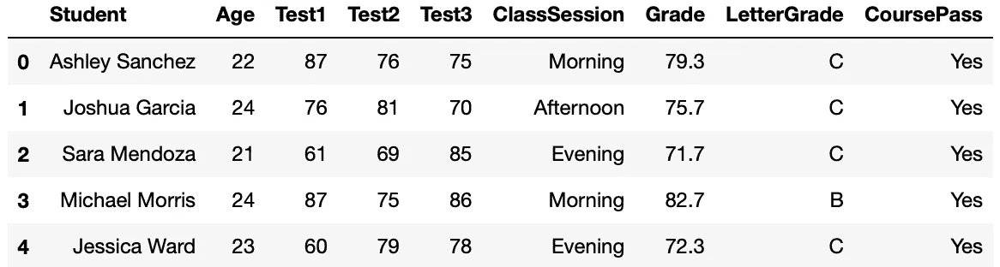
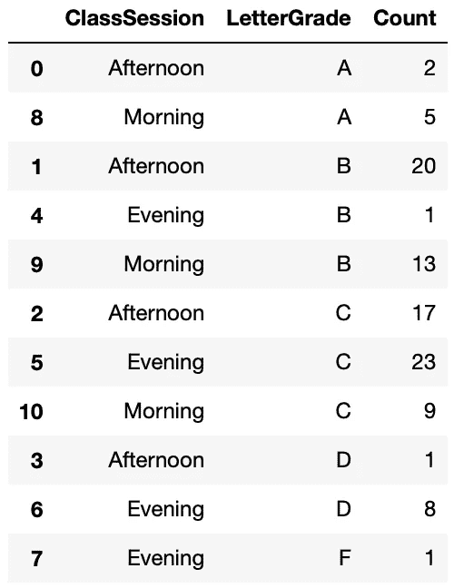

# 从 Pandas GroupBy 中获得最大收益

> 原文：[`towardsdatascience.com/get-the-most-from-pandas-groupby-fa2b6db3eccc`](https://towardsdatascience.com/get-the-most-from-pandas-groupby-fa2b6db3eccc)

## 从基础示例到实际练习

[](https://medium.com/@kurt.klingensmith?source=post_page-----fa2b6db3eccc--------------------------------)[](https://towardsdatascience.com/?source=post_page-----fa2b6db3eccc--------------------------------) [Kurt Klingensmith](https://medium.com/@kurt.klingensmith?source=post_page-----fa2b6db3eccc--------------------------------)

·发表于 [Towards Data Science](https://towardsdatascience.com/?source=post_page-----fa2b6db3eccc--------------------------------) ·6 min read·2023 年 10 月 6 日

--


[Alex Suprun](https://unsplash.com/@sooprun?utm_source=unsplash&utm_medium=referral&utm_content=creditCopyText) 在 [Unsplash](https://unsplash.com/photos/A53o1drQS2k?utm_source=unsplash&utm_medium=referral&utm_content=creditCopyText) 上的照片。

Python 的 pandas 库包含许多用于查询和操作数据的有用工具，其中之一是强大的 GroupBy 函数。该函数允许按各种类别对观察值进行分组，并以多种方式进行聚合。

这可能一开始听起来有些困惑，但本指南将详细介绍如何使用该函数及其各种功能。该操作包括：

+   GroupBy 的介绍。

+   将 GroupBy 应用于实践数据集。

+   各种 GroupBy 技术。

+   实际练习和应用。

## 代码和数据：

本文档中使用的数据和完整的 Python 代码的 Jupyter notebook [可在链接的 GitHub 页面](https://github.com/kurtklingensmith/GroupBy)上获取。下载或克隆该仓库以跟随操作。本指南使用了由作者为本文生成的合成数据和虚假姓名；数据可在链接的 GitHub 页面上获取。

代码需要以下库：

```py
# Data Handling
import pandas as pd
import numpy as np

# Data visualization
import plotly.express as px
```

## 1.1. 开始使用——数据加载和 GroupBy 基础

第一步是加载数据集：

```py
# Load Data:
df = pd.read_csv('StudentData.csv')
df.head(3)
```

这将得到以下数据框，包含了参加了一系列学校测试的学生的信息。它包括他们的年龄、三次测试分数、上课时间、平均成绩、字母等级以及他们是否通过了：


作者截图

Pandas 的 GroupBy 允许将数据框分割成感兴趣的元素，并对其应用某种函数。思考 GroupBy 的最简单方法是提出一个 GroupBy 操作可以解决的问题。一个简单的起点是问有多少学生通过了课程：

```py
df.groupby('CoursePass')['CoursePass'].count()
```

在上述代码行中，GroupBy 对“CoursePass”列进行分组，然后对“CoursePass”列执行计数函数。这返回一个简单的计数：


截图由作者提供。

这与 value_counts() 操作非常相似，执行方式如下：

```py
df.CoursePass.value_counts()
```


截图由作者提供。

这只是一个好的开始，但 GroupBy 可以执行更多高级操作。让我们查看多个列以及关于学生数据的更复杂问题。

## 1.2\. 使用多个列的 GroupBy()

假设我们想知道每节课程（下午、晚上和早晨）有多少学生及格。以下 GroupBy 代码可以迅速回答这个问题：

```py
df.groupby(['ClassSession', 'CoursePass'])['CoursePass'].count()
```

上述代码按“ClassSession”和“CoursePass”列进行分组，同时返回每个 CoursePass 状态（“是”或“否”）的计数。结果是：


截图由作者提供。

注意，括号内列的顺序很重要。交换“ClassSession”和“CoursePass”的顺序会得到以下结果：

```py
df.groupby(['CoursePass', 'ClassSession'])['ClassSession'].count()
```


截图由作者提供。

在进一步探索 GroupBy 的更高级应用之前，让我们看看如何清理输出以获得更好的展示效果。

## 1.3\. 清理 GroupBy 输出

有几种方法可以将标准 GroupBy 输出转换为更干净的 dataframe 格式。让我们以其中一个示例为例，将“.to_frame()”添加到代码末尾：

```py
df.groupby(['ClassSession', 'CoursePass'])['CoursePass'].count().to_frame()
```


截图由作者提供。

注意，这会返回多层列而没有索引。同时注意到有两个列名为“CoursePass”。要展平列、调整名称并添加索引，请使用以下代码：

```py
df.groupby(['ClassSession', 'CoursePass'])['CoursePass'].count().reset_index(name='Count')
```

这会返回如下结果：


截图由作者提供。

将 reset_index() 添加到操作中会展平列并添加索引；在 reset_index() 中传递一个名称可以将计数列（在此情况下为“CoursePass”）命名为“Count”。如果未在 reset_index() 中重命名列，则会因两个列名为“CoursePass”而返回错误。

这可以通过完全隐藏索引进一步改进：

```py
df.groupby(['ClassSession', 'CoursePass'])['CoursePass'].count().reset_index(name='Count').style.hide_index()
```

输出是：


截图由作者提供。

接下来，让我们查看更高级的 GroupBy 函数。

## 1.4\. 高级 GroupBy 功能

GroupBy 可以创建所选列的对象。下面的代码基于两个感兴趣的列创建了一个 GroupBy 对象；对该对象应用 mean() 函数，并传递另外两列，返回这些列的均值：

```py
# Create a groupby object:
dfGroupby = df.groupby(['LetterGrade', 'CoursePass'])
dfGroupby[['Test1', 'Test2']].mean()
```

结果是：


截图由作者提供。

注意输出是如何按“LetterGrade”和“CoursePass”列分组的，并返回“Test1”和“Test2”列的平均值，这两个列是从初始 GroupBy 对象中选择用于 mean() 函数的。

通过使用多个聚合，这可以提升到更高级的水平。考虑以下代码：

```py
dfGroupby = df.groupby(['LetterGrade', 'CoursePass'])
dfGroupby[['Grade', 'Age']].agg(['mean', 'min', 'max']).reset_index()
```

这返回：


作者截图。

上述代码回答了几个问题：按 LetterGrade 和 CoursePass 排序，每个学生的平均值、最小值和最大值的成绩以及每个学生的平均值、最小值和最大值的年龄？

创建 GroupBy 对象并非总是必要的；agg() 函数可以回答相当复杂的问题。假设我们想要通过 CoursePass 和 ClassSession 进行筛选，以查找每个学生的平均年龄和成绩；以下代码提供了答案：

```py
df.groupby(['CoursePass', 'ClassSession']).agg({'Age':'mean', 'Grade':'mean'})
```

输出是：


作者截图。

aggregate 函数还可以传递 numpy 操作：

```py
data = df.groupby(['CoursePass', 'ClassSession'])['Grade'].agg([np.mean, np.max, np.min]).reset_index()

data = data.rename(columns={'mean':'AverageGrade',
                            'amax':'HighestGrade',
                            'amin':'LowestGrade'})

data.style.hide_index()
```

这产生了：


作者截图。

aggregate 函数也可以直接重命名列：

```py
df.groupby(['CoursePass', 'ClassSession'])\
        .agg(AverageGrade=('Grade', 'mean'),
             HighestGrade=('Grade', 'max'),
             LowestGrade=('Grade', 'min'))
```

这返回：


作者截图。

GroupBy 的语法可能性数量意味着对有关数据框的复杂问题，可能存在一个优雅的代码解决方案。现在我们已经探讨了基础知识，让我们看看如何应用 GroupBy 的一些实际示例。

## 2\. 练习：快速可视化成绩计数

**要求：** 给定学生课程的测试成绩，在一个图表上可视化每个班级会话中每个字母成绩的总数。

让我们先看看数据：

```py
df.head()
```



作者截图。

需求关注的是字母成绩和班级会话；这意味着 GroupBy 将按 ClassSession 和 LetterGrade 列排序。需求还需要总数；让我们使用 count() 函数看看返回的结果：

```py
session = df.groupby(['ClassSession', 'LetterGrade'])['LetterGrade'].count().reset_index(name='Count')

session = session.sort_values(by='LetterGrade', ascending = True)

session
```



作者截图。

上述代码按班级会话和字母成绩对数据进行了分组，同时计算了每个分组组合中每个字母成绩的出现次数。sort_values() 代码按字母成绩 A 到 F 排序。剩下的就是可视化数据：

```py
# Generate plot:
plot = px.histogram(session,
               y='Count',
               x='LetterGrade',
               color='ClassSession')
plot.update_layout(
    title={'text': "Grade Distribution\
                    <br><sup>Number of Grades by Type and Class Session</br>",
           'xanchor': 'center',
           'yanchor': 'top',
           'x': 0.47},
    xaxis_title='Letter Grade',
    yaxis_title='Count')
plot.show()
```

这生成了以下图：


作者截图。

只需几行代码，问题就得到了解答！

## 3\. 结论。

Pandas 的 GroupBy 函数是一个强大的工具，可以快速对数据框中的特定数据分组执行聚合和数学操作。通常，一次函数执行就足以回答一个看似复杂的问题。掌握 GroupBy 的使用为数据科学家提供了一个有效的数据准备和处理工具。随意使用提供的笔记本和 [链接到 GitHub 页面上的代码](https://github.com/kurtklingensmith/GroupBy)，进一步尝试 GroupBy 的功能吧！
