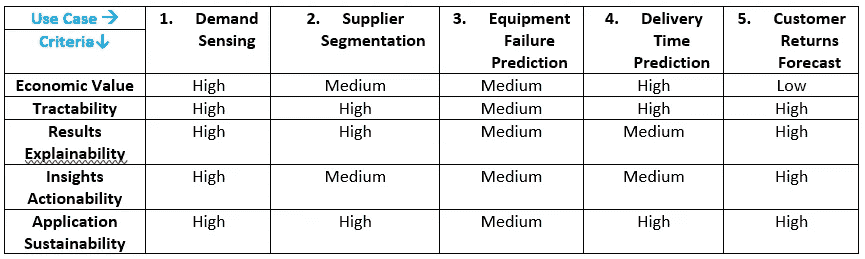

# 从 AI/ML 入手，构建智能供应链

> 原文：[`towardsdatascience.com/getting-started-with-ai-ml-to-build-intelligent-supply-chains-76829f492ef8`](https://towardsdatascience.com/getting-started-with-ai-ml-to-build-intelligent-supply-chains-76829f492ef8)

## 您应该如何考虑在供应链中应用 AI/ML 技术，以最大化投资回报？

 [Ramkumar K](https://medium.com/@rkumar5680?source=post_page-----76829f492ef8--------------------------------)

·发表于 [Towards Data Science](https://towardsdatascience.com/?source=post_page-----76829f492ef8--------------------------------) ·7 分钟阅读·2023 年 4 月 10 日

--

图片由 [Volodymyr Hryshchenko](https://unsplash.com/@lunarts?utm_source=medium&utm_medium=referral) 提供，发布在 [Unsplash](https://unsplash.com/?utm_source=medium&utm_medium=referral)

# 背景

供应链优化是一个广泛的研究领域。在供应链中，有大量用例可以从 AI/ML 技术的应用中受益。组织往往难以确定从何入手以及如何开始。供应链高管通常寻求投资团队（已经非常紧张）的时间和精力，以从这些方法中获得最大价值。在本文中，我们探讨了一组小而多样的用例，作为供应链组织进入 AI/ML 领域的起点。供应链领导者可以期望从这些应用中获得高程度的成本和效率改善。

我们将供应链管理分为五个组成部分：计划、采购、生产、交付、逆向物流，并概述了与这五个组成部分对应的 *需求感知*、*供应商细分*、*设备故障预测*、*交付时间预测*、*客户退货预测* 的用例。根据经济价值、可追踪性、结果可解释性、洞察可操作性和应用可持续性等标准，我们对每个用例的整体效益进行了定性评估。

# 用例探索

*智能供应链* 集成了数据、自动化和先进的分析技术，为供应链的不同部分带来效率和成本降低。它通过提升客户体验，成为组织的战略优势来源。通常，它由优化和 AI/ML 技术的组合支持。我们探讨了五个用例，并将其映射到供应链管理的五个要素：计划 → 采购 → 制造 → 交付 → 逆向物流。

1\. 短期需求感知（计划）：库存管理是供应链中至关重要的活动。营运资本和存储成本与库存水平相关，而库存水平又依赖于准确预测需求等因素。高水平的预测准确性有助于通过在正确的地点和时间生产合适数量的产品来减少库存成本和缺货情况。这有助于优化仓库中的库存，降低安全库存水平，从而减少成本，同时避免可能导致长期业务和收入损失的缺货现象。一个启用了 AI 的应用可以识别客户订单中的模式，并将某些领先指标与短期需求相关联，从而比传统方法更准确。通过实时订单信息，我们可以自动化当前和下一个月的需求预测，并定期更新。

2\. 供应商细分（采购）：大型组织可能有数百或数千个供应商，这些供应商是其供应链的重要组成部分。不同的原材料以不同的数量从供应商处采购。为了在增加供应可靠性的同时降低采购成本，应用不同的策略于不同的供应商将会非常有帮助。考虑到供应商数量众多，将供应商分为几个关键组将会很有益。这种细分可以实现对原材料价格、数量和供应时间的有针对性的合同谈判，从而优化支出。一个启用了 AI 的应用可以基于特征如数量、价格、战略关系和可靠性来细分供应商，使采购专家能够对一个集群内的供应商采用类似的采购策略。此细分可以每月或每季度更新，以适应供应商的变化。

3. 设备故障预测（制造）：由于可靠性故障导致的计划外停机在制造操作中很常见。这往往会影响产品库存位置，并可能导致客户履约延迟。预测这些停机可能发生的时间可以帮助工厂采取措施减少设备故障风险，或提前准备库存以应对停机。这些预测和相应的缓解措施可以帮助避免缺货和收入损失，同时推动对预防性维护选项的投资，以避免昂贵的维修。启用人工智能的应用可以将设备故障与关键测量（如产量、压力、温度等）相关联，提供故障发生时间的见解。根据测量的粒度，该应用可能每天或每几天运行一次，以评估故障风险。

4. 交货时间预测（交付）：准时交付给客户是衡量供应链表现的关键指标，这直接影响客户体验。组织会测量这一指标，并根据历史延迟趋势积极尝试改进。能够准确预测交货时间可以帮助在要求的时间内将产品送到客户手中，从而避免糟糕的客户体验和由此带来的商业损失，并避免因迟交而产生的罚款和其他费用。启用人工智能的应用可以基于开始日期和时间、季节、承运人、来源和目的地等属性预测交货时间。这样的预测可以使每次发货时保持客户知情，提升客户体验和客户留存。此外，这还提供了优化路线和选择表现更佳的承运人的机会。

5. 客户退货预测（逆向物流）：由于未达到质量规格或运输延迟等原因，客户会退回一定比例的销售产品。为了准备退货运输、储存和处理，公司需要准确估算退回产品的数量。这有助于减少储存和处理成本。启用人工智能的应用可以根据过去几周的客户发货量提供退货的总体量。此预测可以每周更新一次。

# 用例优先级排序

我们通过五个关键标准来评估这些用例：经济价值、可处理性、结果可解释性、洞察行动性和应用可持续性。经济价值包括任何成本节约或收入损失避免。可处理性指的是数据的可用性以及提供合理时间内预测的稳健 AI/ML 方法。结果可解释性指的是如何使用业务驱动因素向利益相关者解释观察和预测。洞察行动性描述了组织在 AI/ML 应用结果上的行动能力。最后，应用可持续性描述了长期积极维护和更新 AI 应用输入的可行性。

(i) *经济价值*：由于运输量巨大，我们预计*需求感知*和*交货时间预测*的经济价值为‘高’。对于*供应商细分*和*设备故障预测*，由于采取措施的零散性，其经济价值评估为‘中’；而由于客户退货量相对较低，因此选择了‘低’评估。

(ii) *可处理性*：根据用例数据规模和我们拥有的计算能力，大多数用例的可处理性预期为‘高’，除了*设备故障预测*，如果故障发生不够频繁，可能会数据有限。

(iii) *结果可解释性*：推荐对*需求感知*和*客户退货预测*应用多元线性回归，这会获得‘高’的可解释性评分。对*供应商细分*应用无监督方法（如 k-means 聚类）可以显示每个簇中的特征接近，因此可解释性标记为‘高’。对*设备故障预测*和*交货时间预测*应用更复杂的集成方法（如随机森林、Xgboost）则导致‘中’的可解释性。

(iv) *洞察行动性*：对于*需求感知*和*客户退货预测*，行动性标记为‘高’，因为这是基于预测变化来改变生产和处理的内部决策；而*交货时间预测*和*供应商细分*的洞察则需要与外部方（包括承运人和供应商）谈判，这可能会限制我们的灵活性。对于*设备故障预测*，行动性为‘中’，我们可能能够采取措施降低风险，但可能无法完全消除故障。

(v) *应用可持续性*：假设五个用例中的四个具有较高的可持续性，因为数据可能以适当的速度生成，允许频繁更新 AI/ML 应用，除了*设备故障预测*，可能数据有限。

从下表汇总的这些用例来看，*需求感知* 在所有这些标准中评分最高——在这种情况下，建议从这个用例的 AI/ML 应用开始。

*用例定性评分对比多个标准*

# 结论

在许多行业中，AI/ML 技术在供应链和业务优化中的应用仍然是一个新兴领域。采取“爬行、行走、奔跑”的方法来整合 AI/ML 进入操作并非不合理。通过“低垂的果实”来展示 AI/ML 为团队创造价值的有效性，可以产生飞轮效应。然而，重要的是在较小的成功基础上构建可持续的长期商业模式，使 AI/ML 融入价值链的每个方面。

感谢阅读。希望你觉得有用。欢迎将你的评论发送至 rkumar5680@gmail.com。我们可以在 [LinkedIn](https://medium.com/@rkumar5680/:%20https:/www.linkedin.com/in/ramkumar-karuppiah-4458414/) 上联系。
