# 开始使用 Databricks

> 原文：[`towardsdatascience.com/getting-started-with-databricks-11af3db4f595`](https://towardsdatascience.com/getting-started-with-databricks-11af3db4f595)

## Databricks 初学者指南

[](https://spierre91.medium.com/?source=post_page-----11af3db4f595--------------------------------)[](https://towardsdatascience.com/?source=post_page-----11af3db4f595--------------------------------) [Sadrach Pierre, Ph.D.](https://spierre91.medium.com/?source=post_page-----11af3db4f595--------------------------------)

·发布于 [Towards Data Science](https://towardsdatascience.com/?source=post_page-----11af3db4f595--------------------------------) ·9 分钟阅读·2023 年 5 月 8 日

--


图片由 [Alexander Grey](https://www.pexels.com/@mccutcheon/) 提供，来源于 [Pexels](https://www.pexels.com/photo/assorted-color-bricks-1148496/)

[Databricks](https://www.databricks.com/) 使数据科学家能够轻松创建和管理用于研究、实验和部署的笔记本。像 Databricks 这样的平台的吸引力包括与云服务的无缝集成、模型维护工具和可扩展性。

Databricks 对于模型实验和维护非常有用。Databricks 拥有一个机器学习库，称为 [MLflow](https://mlflow.org/docs/latest/index.html)，提供了用于模型开发和部署的有用工具。使用 MLflow，你可以记录模型以及与模型相关的元数据，例如性能指标和超参数。这使得运行实验和分析结果变得非常简单。

许多 Databricks 功能对于在机器学习工作流中的步骤进行扩展非常有用，例如数据加载、模型训练和模型日志记录。[Koalas](https://koalas.readthedocs.io/en/latest/user_guide/index.html) 是 Databricks 中一个更高效的替代 pandas 的库。[Pandas 用户定义函数](https://spark.apache.org/docs/3.1.2/api/python/reference/api/pyspark.sql.functions.pandas_udf.html)（UDF）允许你以分布式的方式应用自定义函数，这些函数通常计算成本较高，这可以显著减少运行时间。Databricks 还允许你在更大的机器上配置作业，这对于处理大型数据和繁重计算非常有用。此外，模型注册表允许你运行和存储数百甚至数千个模型的实验结果。这在扩展研究人员开发并最终部署的模型数量方面非常有用。

在本文中，我们将介绍一些 Databricks 的基础知识。首先，我们将通过一个简单的数据科学工作流程来构建一个流失分类模型。然后，我们将看看如何使用 Koalas 和 Pandas UDF 等工具来加快特定操作的速度。最后，我们将看到如何使用 Mlflow 来帮助我们运行实验并检查结果。

在这里，我们将使用[Telco 流失数据集](https://www.kaggle.com/datasets/blastchar/telco-customer-churn)。该数据包含一个虚构电信公司客户的账单信息。它指定了客户是否停止或继续使用服务，即流失。该数据公开可用，并可以在[Apache 2.0 许可证](https://www.apache.org/licenses/LICENSE-2.0)下免费使用、分享和修改。

## 入门指南

首先，访问[Databricks](https://www.databricks.com/try-databricks?itm_data=SiteWide-Footer-Trial#account)网站并点击“免费试用”：


截图由作者拍摄

您应该看到以下内容：

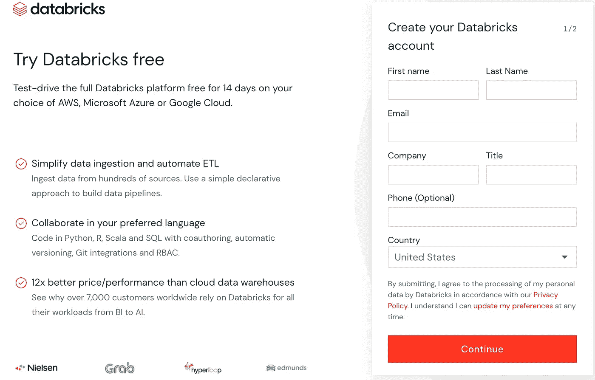

截图由作者拍摄

输入您的信息并点击继续。接下来，系统会提示您选择一个云平台。本文不会涉及任何外部云平台。在右侧面板底部点击“开始使用社区版”。

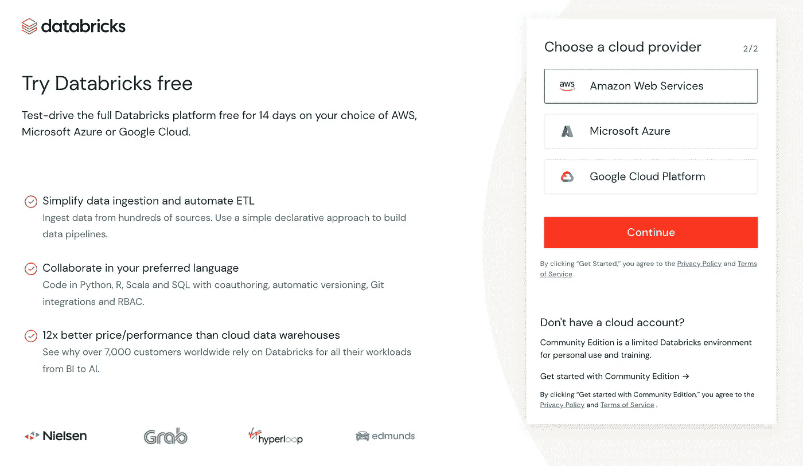

截图由作者拍摄

接下来，按照步骤创建一个社区版账户。

## 导入数据

让我们从左侧面板中的“数据”选项卡开始：

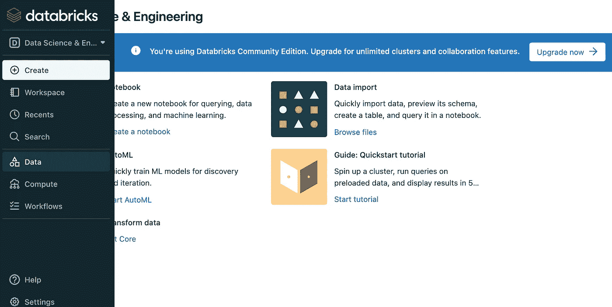

截图由作者拍摄

接下来点击“数据”，然后点击“创建表”：

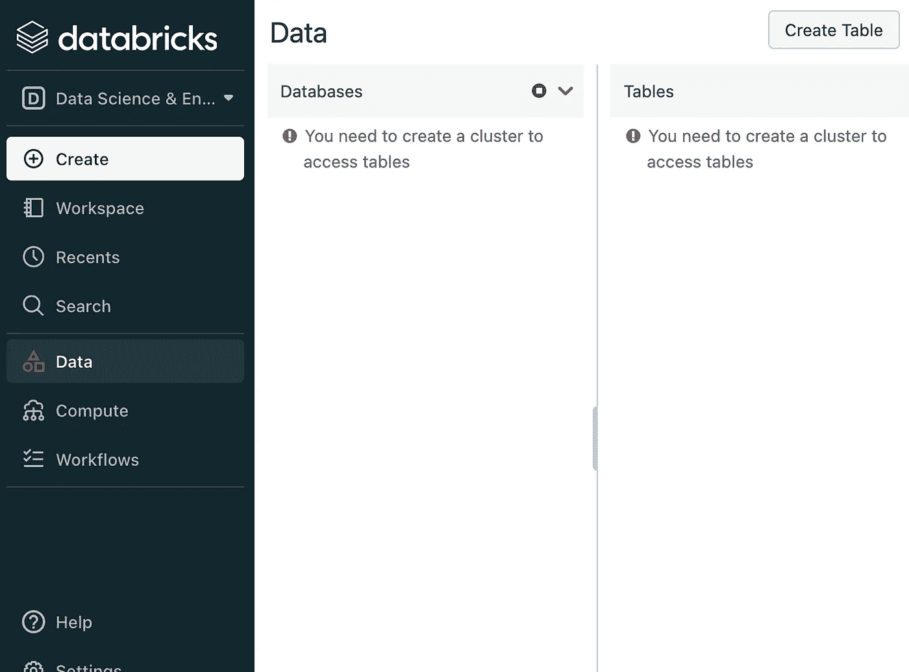

截图由作者拍摄

接下来，将流失 CSV 文件拖放到标记为“拖放文件上传，或点击浏览”的区域。

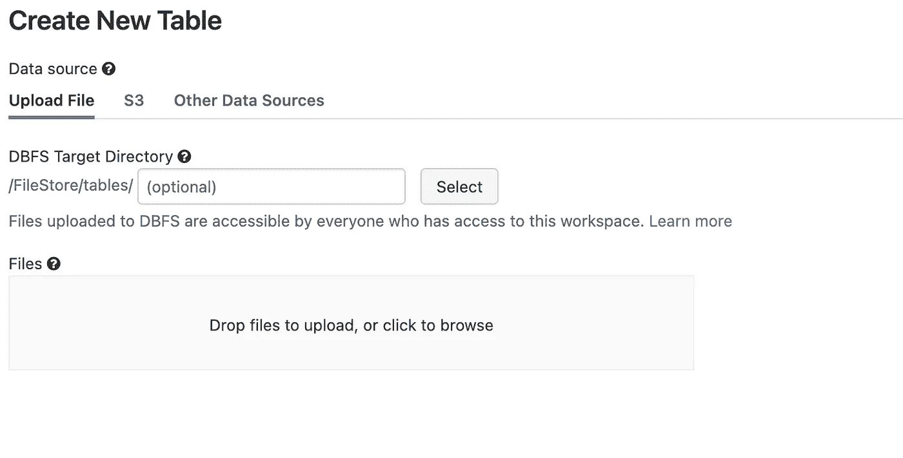

截图由作者拍摄

上传 CSV 后，您应该看到以下内容：

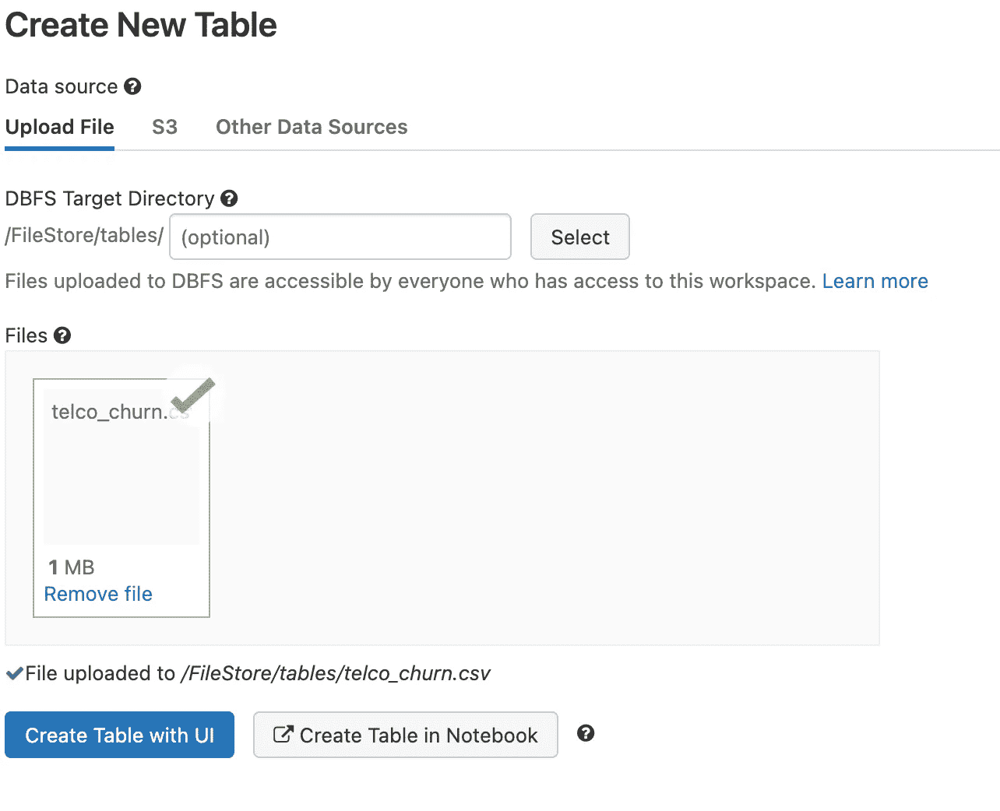

截图由作者拍摄

接下来点击“在笔记本中创建表”。一个 Databricks 文件存储（DBFS）示例笔记本，将弹出并包含将文件写入 Databricks 文件存储的逻辑：

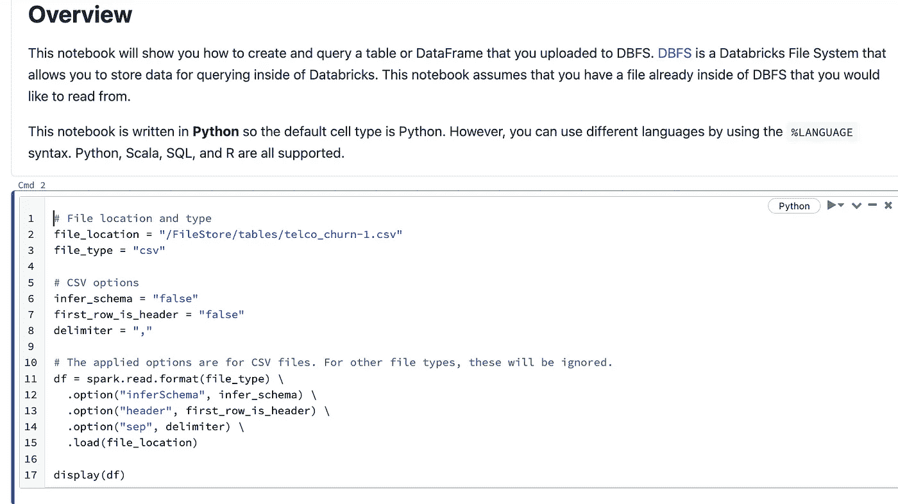

截图由作者拍摄

DBFS 允许 Databricks 用户上传和管理数据。该系统是分布式的，因此非常适合存储和管理大量数据。

第一个单元指定了读取我们上传的流失数据的逻辑：

```py
# File location and type
file_location = "/FileStore/tables/telco_churn-1.csv"
file_type = "csv"

# CSV options
infer_schema = "false"
first_row_is_header = "false"
delimiter = ","

# The applied options are for CSV files. For other file types, these will be ignored.
df = spark.read.format(file_type) \
  .option("inferSchema", infer_schema) \
  .option("header", first_row_is_header) \
  .option("sep", delimiter) \
  .load(file_location)

display(df)
```

如果我们运行这个单元，我们会得到以下结果：

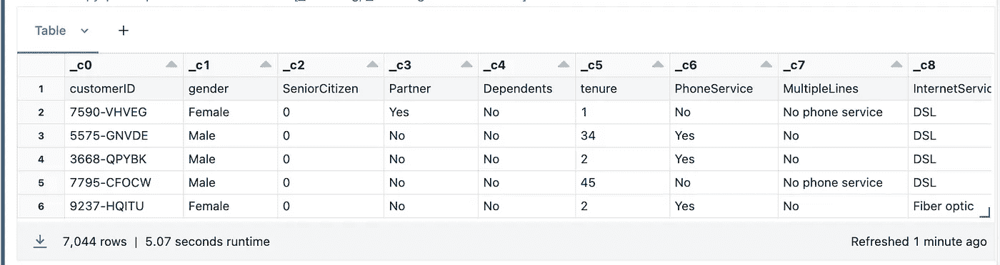

截图由作者拍摄

我们看到表格中包含了一些不太有用的列名（_c0, _c1，等等）。为了解决这个问题，我们需要指定 first_row_is_header= “true”：

```py
first_row_is_header = "true"
```

当我们运行这个单元时，我们现在得到：

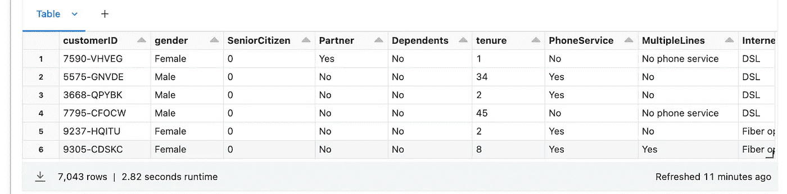

截图由作者拍摄

如果你点击表格，可以向右滚动查看数据中的额外列：

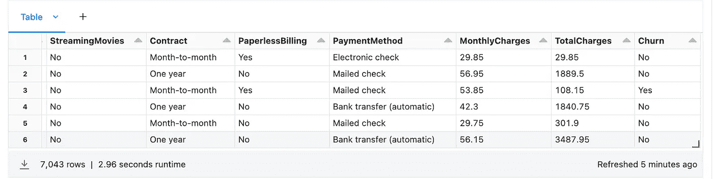

截图由作者拍摄

## 构建分类模型

我们接下来使用在 Databricks 中上传的数据构建流失分类模型。在左侧面板中点击“创建”：

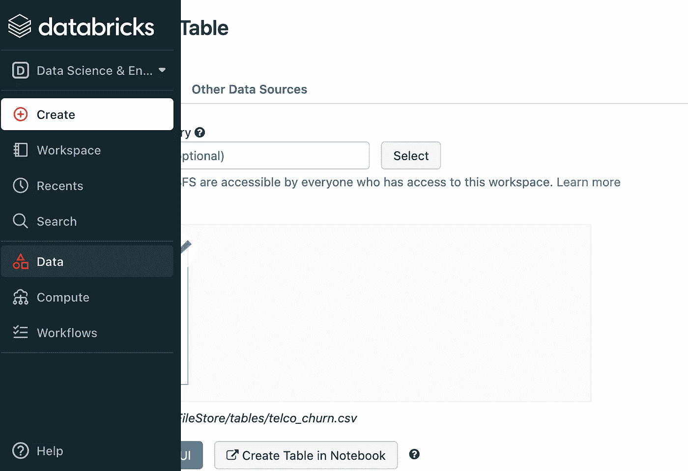

截图由作者拍摄

接下来点击笔记本：

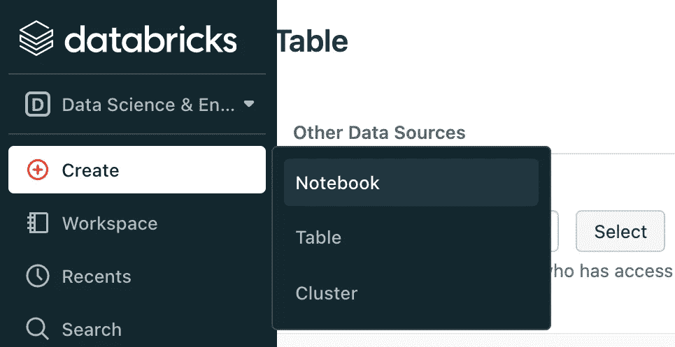

截图由作者拍摄

我们将笔记本命名为“churn_model”：

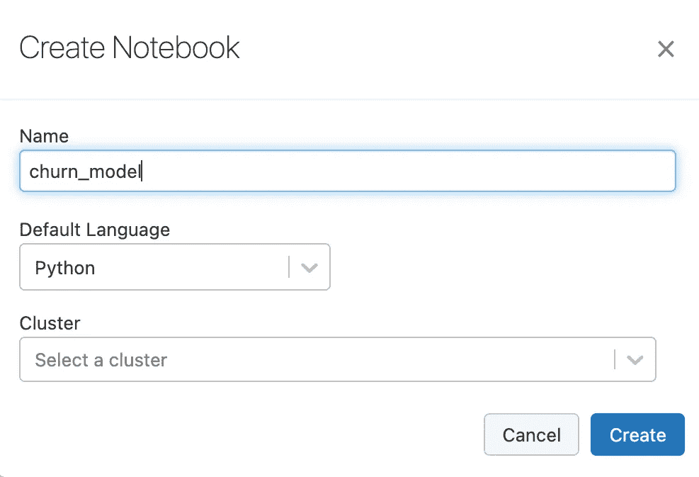

截图由作者拍摄

现在我们可以复制 DBFS 示例笔记本中的逻辑，以便访问数据：

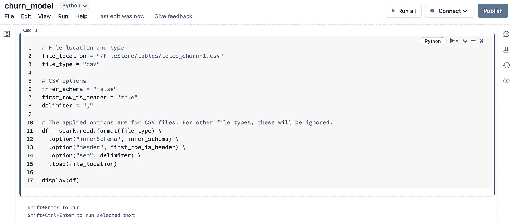

截图由作者拍摄

接下来，我们将 Spark 数据框转换为 Pandas 数据框：

```py
df_pandas = df.toPandas()
```

我们来构建一个 [Catboost](https://catboost.ai/en/docs/) 分类模型。Catboost 是一种基于树的集成机器学习算法，它使用梯度提升来提高集成中连续树的性能。

我们来通过 pip 安装 Catboost 包。我们在笔记本顶部的一个单元格中执行此操作：

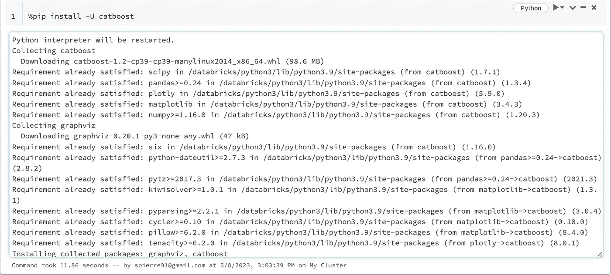

截图由作者拍摄

接下来，我们构建一个 Catboost 流失分类模型。我们将使用任期、每月费用和合同来预测流失结果。我们将流失列转换为二进制值：

```py
import numpy as np 
df_pandas['churn_label'] = np.where(df_pandas['Churn']== 'No', 0, 1)
X = df_pandas[["tenure", "MonthlyCharges", "Contract"]]
y = df_pandas['churn_label']
```

Catboost 允许我们直接处理分类变量，无需将其转换为机器可读的代码。为此，我们只需定义一个包含分类列名称的列表：

```py
cats = ["Contract"]
```

在定义 Catboost 模型对象时，我们将 cat_features 参数设置为此列表。我们将数据分为训练集和测试集：

```py
from sklearn.model_selection import train_test_split

X_train, X_test, y_train, y_test = train_test_split(X, y, test_size=0.2, random_state=42)
```

然后我们可以训练 Catboost 模型。我们将使用默认参数值：

```py
model = CatBoostClassifier(cat_features= cats, random_state=42)
model.fit(X_train, y_train)
y_pred = model.predict(X_test)
```

我们可以评估模型性能：

```py
from sklearn.metrics import accuracy_score, precision_score
accuracy = accuracy_score(y_pred, y_test)
precision = precision_score(y_pred, y_test)

print("Accuracy: ", accuracy )
print("Precision: ", precision )
```


截图由作者拍摄

## Koalas

这里我们将一个 Spark 数据框转换为 Pandas 数据框。这对于我们的小数据集来说很好，但随着数据量的增加，Pandas 变得缓慢且效率低下。Pandas 的替代方案是 [Koalas](https://koalas.readthedocs.io/en/latest/user_guide/index.html) 库。Koalas 是 Databricks 开发的一个分布式版本的 Pandas。要使用 Koalas，我们可以在笔记本顶部使用 pip 安装 Databricks：

```py
%pip install -U databricks
```

我们从 databricks 导入 Koalas：

```py
from databricks import koalas as ks
```

要将我们的 Spark 数据框转换为 Koalas 数据框，我们可以执行以下操作：

```py
df_koalas = ks.DataFrame(df)
df_koalas.head()
```

## Pandas UDF

Pandas UDF 是 Databricks 中的另一个有用工具。它允许你以分布式方式应用函数到数据框上。这对于提高对大数据框进行计算的效率非常有用。例如，我们可以定义一个函数，该函数接受一个数据框并构建一个 Catboost 模型。然后我们可以使用 Pandas UDF 在分组或分类层次上应用这个函数。让我们为每个互联网服务值构建一个模型。

首先，我们需要定义 Pandas UDF 的函数和模式。模式简单地指定了列名及其数据类型：

```py
from pyspark.sql.functions import pandas_udf, PandasUDFType

churn_schema = StructType(
    [
        StructField("tenure", FloatType()),
        StructField("Contract", StringType()),
        StructField("InternetService", StringType()),
        StructField("MonthlyCharges", FloatType()),
        StructField("Churn", FloatType()),
        StructField("Predictions", FloatType()),

    ]
)
```

接下来我们将定义我们的函数。我们将把之前定义的逻辑简单地包含在一个名为‘build_model’的函数中。为了使用 Pandas UDF，我们添加装饰器‘@pandas_udf’：

```py
@pandas_udf(churn_schema, PandasUDFType.GROUPED_MAP)
def build_model(df: pd.DataFrame) -> pd.DataFrame:
```

我们还可以在我们的函数中包含模型构建逻辑。我们还会将预测和真实流失值存储在我们的数据框中：

```py
@pandas_udf(churn_schema, PandasUDFType.GROUPED_MAP)
def build_model(df: pd.DataFrame) -> pd.DataFrame:
    df['churn_label'] = np.where(df['Churn']== 'No', 0, 1)
    X = df[["tenure", "MonthlyCharges", "Contract"]]
    y = df['churn_label']
    cats = ["Contract"]
    X_train, X_test, y_train, y_test = train_test_split(X, y, test_size=0.2, random_state=42)
    model = CatBoostClassifier(cat_features= cats, random_state=42)
    model.fit(X_train, y_train)
    y_pred = model.predict(X_test)
    output = X_test
    output['Prediction'] = y_pred
    output['Churn'] = y_test
    output['InternetService'] = df['InternetService']
    output['churn_label'] = df['churn_label']
    return output
```

最后，我们可以将这个函数应用到我们的数据框中。让我们将我们的 Koalas 数据框转换回 spark 数据框：

```py
 df_spark = df_koalas.to_spark()
churn_results = (
df_spark.groupBy('InternetService').apply(build_model))
```

然后我们可以将生成的 spark 数据框转换为 Pandas 数据框（也可以转换回 Koalas），并显示前五行：

```py
churn_results = churn_results.toPandas()
churn_results.head()
```

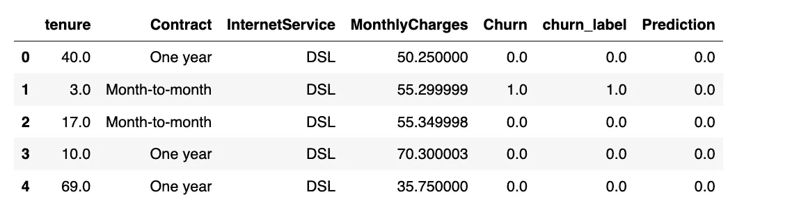

作者截图

即使我们存储了预测结果，你也可以使用 Pandas UDF 来存储你在数据框计算结果中获得的任何信息。一个有趣的练习是将准确度评分和精确度评分包含在输出的 spark 数据框中，每个互联网服务值都有。

## 开始使用 MLflow

在 Databricks 中，另一个有用的工具是 MlFlow。MlFlow 允许你轻松运行、记录和分析实验。在本演示中，我们将使用之前在笔记本中定义的第一个模型对象。让我们在笔记本的顶部使用`pip install Mlflow`：

```py
%pip install -U mlflow
```

并导入 Mlflow：

```py
import mlflow
```

让我们通过设置实验名称继续：

```py
mlflow.set_experiment(
      f"/Users/spierre91@gmail.com/churn_model"
  )
```

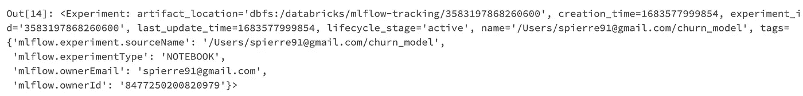

作者截图

我们可以记录的一件事是 Catboost 特征重要性，这将帮助我们分析哪些特征对预测流失重要：

```py
feature_importance = pd.DataFrame(
      {"variable": model.feature_names_, "importance": model.feature_importances_}
  )
feature_importance.to_csv("/feature_importance.csv")
```

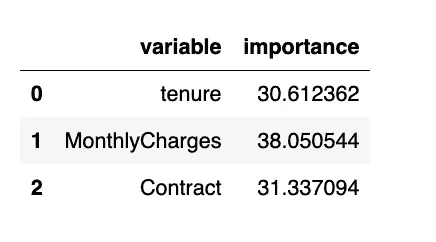

作者截图

然后我们可以使用`log_model`方法记录我们的 Catboost 模型：

```py
with mlflow.start_run(run_name=f"churn_model"):
    mlflow.sklearn.log_model(model, "Catboost Model")
```

我们收到通知，说明“已记录 1 次实验运行到 Mlflow”：

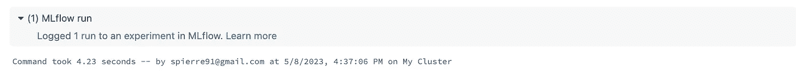

作者截图

我们可以点击运行并查看以下内容：

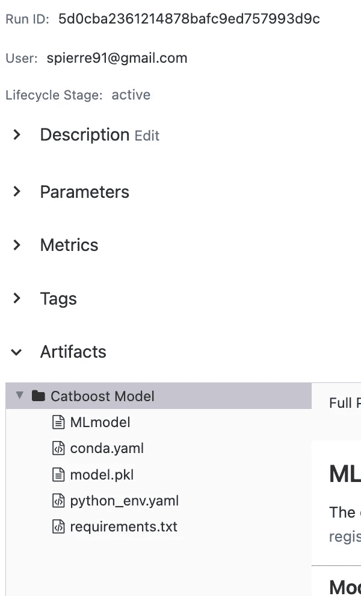

作者截图

在这里我们可以看到模型性能和模型工件（如特征重要性）的指标。我们将很快展示如何在 Mlflow 中记录这两者。

我们还可以点击实验：

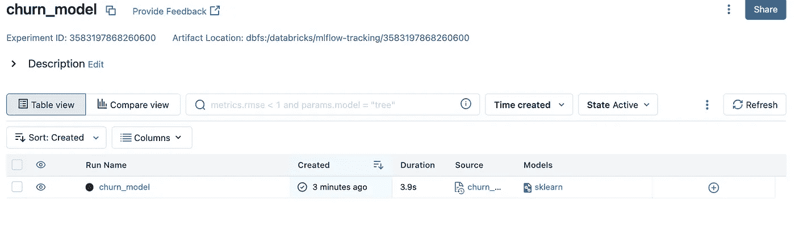

作者截图

这里我们可以看到与实验相关的每次运行。这对于跟踪实验如修改 Catboost 参数、训练数据、工程特征等非常有用。

最后，让我们将特征重要性记录为工件，将准确度分数和精确度分数记录为指标，并将分类输入列表记录为参数：

```py
with mlflow.start_run(run_name=f"churn_model"):
    mlflow.sklearn.log_model(model, "Catboost Model")
    mlflow.log_artifact("/feature_importance.csv")
    mlflow.log_metric("Precison", precision)    
    mlflow.log_metric("Accuracy", accuracy)       
    mlflow.log_param("Categories", cats)
```

如果我们点击运行，我们可以看到记录了特征重要性、准确度分数和精确度分数，以及分类输入：

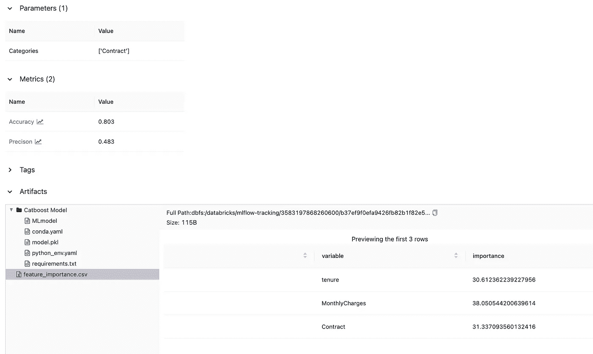

作者截图

Databricks notebook 中的代码已移植到一个 ipython 文件，并可以在[GitHub](https://github.com/spierre91/medium_code/blob/master/data_bricks_tutorials/churn_model.ipynb)上获取。

## 结论

在这篇文章中，我们讨论了如何开始使用 Databricks。首先，我们展示了如何将数据上传到 DBFS。然后，我们创建了一个 notebook，并展示了如何在 notebook 中访问上传的文件。接着，我们讨论了 Databricks 中的一些工具，这些工具可以帮助数据科学家和研究人员扩展数据科学解决方案。首先，我们展示了如何将 spark 数据框转换为 Koalas 数据框，后者是 Pandas 的更快替代品。然后，我们展示了如何使用 Pandas UDF 将自定义函数应用于 spark 数据框。这对于需要在大型数据框上执行的重计算任务非常有用。最后，我们展示了如何记录与建模实验相关的指标、参数和工件。对这些工具的熟悉对于从事数据科学、机器学习和机器学习工程的人员来说非常重要。
