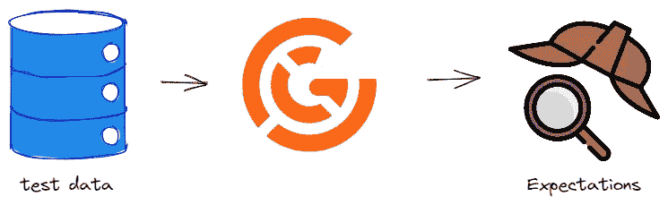

# 《开始使用 Great Expectations：Python 数据验证指南》

> 原文：[`towardsdatascience.com/getting-started-with-great-expectations-a-guide-to-data-validation-in-python-95a8ffc2b747?source=collection_archive---------7-----------------------#2023-07-12`](https://towardsdatascience.com/getting-started-with-great-expectations-a-guide-to-data-validation-in-python-95a8ffc2b747?source=collection_archive---------7-----------------------#2023-07-12)

## 学习如何通过 Python 中的几行代码来防止数据质量问题

 [Eugenia Anello](https://eugenia-anello.medium.com/?source=post_page-----95a8ffc2b747--------------------------------)

·

[关注](https://medium.com/m/signin?actionUrl=https%3A%2F%2Fmedium.com%2F_%2Fsubscribe%2Fuser%2F86fdc517c278&operation=register&redirect=https%3A%2F%2Ftowardsdatascience.com%2Fgetting-started-with-great-expectations-a-guide-to-data-validation-in-python-95a8ffc2b747&user=Eugenia+Anello&userId=86fdc517c278&source=post_page-86fdc517c278----95a8ffc2b747---------------------post_header-----------) 发表在 [Towards Data Science](https://towardsdatascience.com/?source=post_page-----95a8ffc2b747--------------------------------) · 5 分钟阅读 · 2023 年 7 月 12 日

--

图片由 [Link Hoang](https://unsplash.com/@linkhoang) 提供，来自 [Unsplash](https://unsplash.com/photos/UoqAR2pOxMo)

当你在公司进行数据科学项目时，通常不会有独特的测试集，这与大学和研究中的情况不同，而是会不断收到来自客户的新更新样本。

在将机器学习模型应用于新样本之前，你需要验证其数据质量，例如列名、列类型以及字段的分布，这些应该与训练集和旧测试集相匹配。

当数据脏乱且特征超过 100 个时，手动分析数据可能非常耗时。幸运的是，有一个救命的 Python 库，叫做**Great Expectations**。我引起了你的兴趣吗？让我们开始吧！

## 什么是**Great Expectations**？

作者插图。来源：[flaticon](https://www.flaticon.com/free-icon/detective_695877?term=sherlock+holmes&page=1&position=4&origin=search&related_id=695877)。

**Great Expectations**是一个开源的 Python 库，专注于解决数据管理的三个重要方面：

+   **验证数据**，通过检查其是否符合一些重要条件或期望
