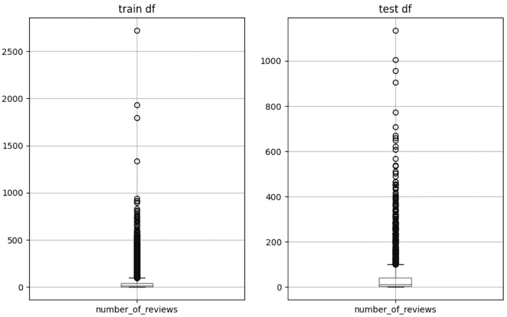
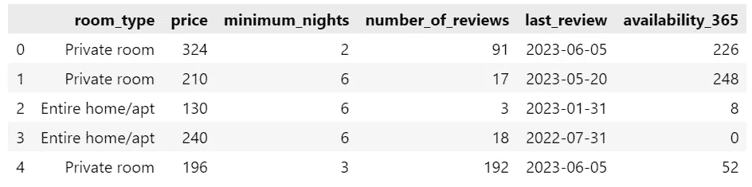

# 入门 Great Expectations：Python 中的数据验证指南。

> 原文：[`towardsdatascience.com/getting-started-with-great-expectations-a-guide-to-data-validation-in-python-95a8ffc2b747`](https://towardsdatascience.com/getting-started-with-great-expectations-a-guide-to-data-validation-in-python-95a8ffc2b747)

## 学习如何用几行 Python 代码防止数据质量问题。

[](https://eugenia-anello.medium.com/?source=post_page-----95a8ffc2b747--------------------------------)[](https://towardsdatascience.com/?source=post_page-----95a8ffc2b747--------------------------------) [Eugenia Anello](https://eugenia-anello.medium.com/?source=post_page-----95a8ffc2b747--------------------------------)

·发表于 [Towards Data Science](https://towardsdatascience.com/?source=post_page-----95a8ffc2b747--------------------------------) ·阅读时间 5 分钟·2023 年 7 月 12 日

--


照片来源：[Link Hoang](https://unsplash.com/@linkhoang) 在 [Unsplash](https://unsplash.com/photos/UoqAR2pOxMo)

当你与公司合作进行数据科学项目时，通常没有唯一的测试集，不像大学和研究那样，而是不断从客户那里收到更新的样本。

在将机器学习模型应用于新样本之前，你需要验证其数据质量，例如列名、列类型以及字段分布，这些应该与训练集和旧测试集相匹配。

手动分析数据可能非常耗时，尤其是当数据很脏且具有超过 100 个特征时。幸运的是，有一个救命的 Python 库，叫做**Great Expectations**。这是否引起了你的兴趣？让我们开始吧！

## 什么是 Great Expectations？


作者插图。来源：[flaticon](https://www.flaticon.com/free-icon/detective_695877?term=sherlock+holmes&page=1&position=4&origin=search&related_id=695877)。

Great Expectations 是一个开源 Python 库，专门解决管理数据的三个重要方面：

+   **验证数据**是否符合一些重要条件或期望。

+   **自动化数据分析**，快速测试数据而无需从头开始。

+   **格式化文档**，包含期望和验证结果。

在本教程中，我们将专注于验证数据，这在处理实际数据时是主要问题之一。

## 阿姆斯特丹的 Airbnb 房源

我们将分析由 [Inside Airbnb](http://insideairbnb.com/get-the-data/) 提供的 Airbnb 列表数据。我们将使用来自 [阿姆斯特丹](http://data.insideairbnb.com/the-netherlands/north-holland/amsterdam/2023-06-05/visualisations/reviews.csv) 的数据集。数据集已经分为训练集和测试集。正如你从数据集的名称中可能猜到的那样，目标是预测房源价格。如果我们仅关注评论数量，我们可以注意到测试数据的评论数量变异性大于训练集的评论数量。



作者插图

我们应该问自己一个问题：“我们还遗漏了哪些差异？让我们开始使用这个库吧！

**目录：**

+   **需求**

+   **加载文件**

+   **创建期望**

## 需求

在安装库之前，建议 [安装 Python 3 并创建虚拟环境](https://www.digitalocean.com/community/tutorial-collections/how-to-install-python-3-and-set-up-a-programming-environment)。在激活环境后，我们可以安装 Python 库：

```py
pip install great_expectations
```

你还需要从 [Kaggle](https://www.kaggle.com/datasets/samuelcortinhas/house-price-prediction-seattle) 下载数据以跟随教程。文件应包含在“data”文件夹中。

## 加载文件

就像在 Pandas 中一样，great expectations 库也有相应的方法来导入 CSV 文件：

```py
import pandas as pd
import great_expectations as gx
```

```py
test_df = gx.read_csv('data/test.csv')
```

如果你有其他类型的数据，比如 JSON、parquet 和 XLSX，你可以直接使用 Pandas 方法。

```py
test_df.head()
```



作者插图

这是对我们测试数据和我们将在下一步分析的变量的快速概述。

## 创建期望

在这个库中，[期望值](https://legacy.docs.greatexpectations.io/en/latest/reference/core_concepts/expectations/expectations.html#expectations) 由几个测试组成，验证你的数据质量。这个库的优点是你不需要手动检查，因为已经实现了 300 多个具有直观名称的期望值。

1.  **检查列名是否与之前相同**

假设客户给我们发送了一个新样本，我们想检查它是否包含与训练集相同的列名。如果你问 ChatGPT，Pandas 中有很多方法可以做到这一点，但使用 great expectations 有一种更直观的方法：

```py
l_train_column_names = ['id','neighbourhood','room_type','price',
 'minimum_nights','number_of_reviews','last_review','availability_365']
```

```py
test_df.expect_table_columns_to_match_set(column_set=l_train_column_names)
```

输出：

```py
{
  "success": false,
  "meta": {},
  "exception_info": {
    "raised_exception": false,
    "exception_traceback": null,
    "exception_message": null
  },
  "result": {
    "observed_value": [
      "availability_365",
      "last_review",
      "minimum_nights",
      "number_of_reviews",
      "price",
      "room_type"
    ],
    "details": {
      "mismatched": {
        "missing": [
          "id",
          "neighbourhood"
        ]
      }
    }
  }
}
```

从结果中，我们可以看到该方法找到了大部分列，除了 id 和 neighbourhood 字段。由于条件没有完全满足，"success" 键的值为 false。

**2\. 检查 last_review 中是否没有空值**

缺失值是处理真实数据时的主要问题之一：

```py
test_df.expect_column_values_to_not_be_null('last_review')
```

输出：

```py
{
  "success": false,
  "meta": {},
  "exception_info": {
    "raised_exception": false,
    "exception_traceback": null,
    "exception_message": null
  },
  "result": {
    "element_count": 1522,
    "unexpected_count": 143,
    "unexpected_percent": 9.395532194480946,
    "unexpected_percent_total": 9.395532194480946,
    "partial_unexpected_list": []
  }
}
```

从这个测试中，我们可以看到该列中有 143 个缺失值。

**3\. 检查 minimum_nights 的类型是否为整数**

这可能看起来平淡无奇，但你可能会发现错误，因为模型是在不同类型的列上训练的。因此，这个期望对于避免浪费时间是有用的：

```py
test_df.expect_column_values_to_be_in_type_list('minimum_nights', ['int'])
```

输出：

```py
{
  "success": true,
  "meta": {},
  "exception_info": {
    "raised_exception": false,
    "exception_traceback": null,
    "exception_message": null
  },
  "result": {
    "observed_value": "int64"
  }
}
```

期望得到了遵守，突出显示为`"success":true`。

**4\. 检查最大价格是否在特定区间内**

我们之前已经看到价格在训练集和测试集中的分布不同。我们尝试调查最大价格是否在 413 和 12000 之间，这分别对应训练集的第 90 百分位数和最大值：

```py
test_df.expect_column_max_to_be_between(column='price', min_value=413,  max_value=12000)
```

输出：

```py
{
  "success": true,
  "meta": {},
  "exception_info": {
    "raised_exception": false,
    "exception_traceback": null,
    "exception_message": null
  },
  "result": {
    "observed_value": 7900,
    "element_count": 1522,
    "missing_count": null,
    "missing_percent": null
  }
}
```

输出结果告诉我们，最大价格为 7900，并且在该区间内。

## 最后的思考：

我刚刚介绍了 Great Expectations 的概述，以介绍其主要功能：期望。你可以从[官方网站](https://greatexpectations.io/expectations/?filterType=undefined&gotoPage=undefined&showFilters=undefined&viewType=undefined)探索其他声明性语句或期望。在下一篇文章中，我将介绍数据分析和所有期望的可视化自动化，并汇集在一个文档中。你可以在[这里](https://github.com/eugeniaring/Medium-Articles/blob/main/MLOps/great_expectation_start.ipynb)找到 GitHub 代码。感谢阅读！祝你有美好的一天！

*免责声明：该数据集的许可为 4.0 国际 (CC BY 4.0)*

## 有用的资源：

+   [Great Expectations 的文档](https://legacy.docs.greatexpectations.io/en/latest/guides/tutorials/explore_expectations_in_a_notebook.html)

+   [Great Expectations 的 GitHub 页面](https://github.com/great-expectations/great_expectations)
