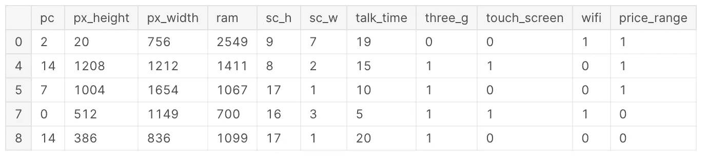
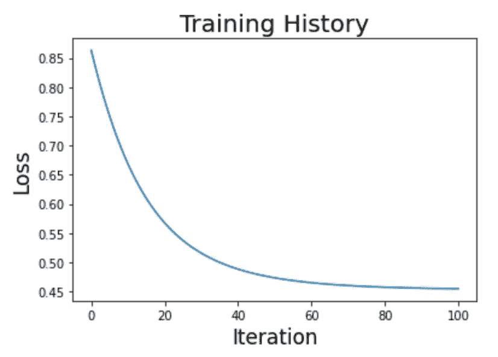
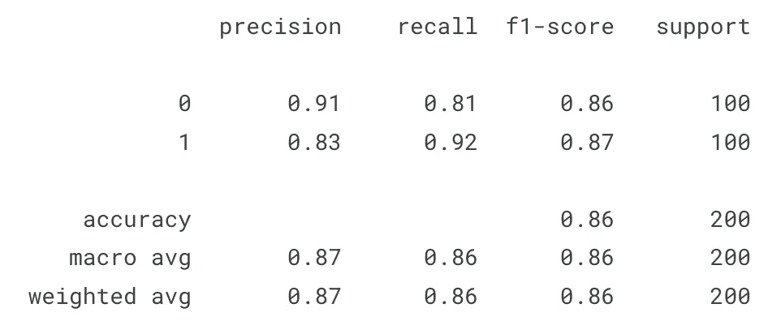

# 开始使用 JAX

> 原文：[`towardsdatascience.com/getting-started-with-jax-a6f8d8d0e20`](https://towardsdatascience.com/getting-started-with-jax-a6f8d8d0e20)

## 推动高性能数值计算和机器学习研究的未来

[](https://pierpaoloippolito28.medium.com/?source=post_page-----a6f8d8d0e20--------------------------------)[](https://towardsdatascience.com/?source=post_page-----a6f8d8d0e20--------------------------------) [Pier Paolo Ippolito](https://pierpaoloippolito28.medium.com/?source=post_page-----a6f8d8d0e20--------------------------------)

·发表于 [Towards Data Science](https://towardsdatascience.com/?source=post_page-----a6f8d8d0e20--------------------------------) ·阅读时间 5 分钟·2023 年 7 月 7 日

--


由 [Lance Asper](https://unsplash.com/@lance_asper?utm_source=medium&utm_medium=referral) 提供的照片，来源于 [Unsplash](https://unsplash.com/?utm_source=medium&utm_medium=referral)

# 介绍

JAX 是 Google 开发的一个 Python 库，用于在任何类型的设备（CPU、GPU、TPU 等）上进行高性能数值计算。JAX 的主要应用之一是机器学习和深度学习研究开发，尽管该库主要设计用于提供执行通用科学计算任务（高度维度矩阵操作等）的所有必要功能。

考虑到特别关注高性能计算，JAX 被设计为在 XLA（加速线性代数）的基础上极其快速。XLA 实际上是一个编译器，旨在加速线性代数操作，并且可以在 TensorFlow 和 Pytorch 等其他框架的后台工作。此外，JAX 数组被设计为遵循与 Numpy 相同的原则，使得迁移旧的 Numpy 代码到 JAX 变得非常容易，并通过 GPU 和 TPU 获得性能提升。

JAX 的主要特点包括：

+   **即时编译（JIT）**：JIT 和加速硬件使 JAX 比普通的 Numpy 快得多。使用 *jit()* 函数可以编译并缓存自定义函数与 XLA 内核。通过缓存，我们将增加首次运行函数的总体执行时间，从而大幅减少随后的运行时间。在使用缓存时，确保在需要时清除缓存以避免过时结果（例如，全局变量变化）是很重要的。

+   **自动并行化**：异步调度使得 JAX 向量可以延迟计算，仅在访问时才生成内容（在计算完成之前控制权返回程序）。此外，为了实现图优化，JAX 数组是不可变的（类似的概念包括延迟计算和图优化，适用于 Apache Spark）。*pmap()* 函数可以用于在多个 GPU/TPU 上并行计算。

+   **自动矢量化**：可以使用 *vmap()* 函数进行自动矢量化以并行化操作。在矢量化过程中，算法从对单个值的操作转变为对一组值的操作。

+   **自动微分**：*grad()* 函数可以用于自动计算函数的梯度（导数）。特别是，JAX 自动微分使得在深度学习领域之外开发通用的微分程序成为可能。可以通过递归、分支、循环进行微分，执行高阶微分（例如，雅可比矩阵和海森矩阵），并使用前向和反向模式微分。

因此，JAX 能为我们提供构建先进深度学习模型所需的所有基础，但没有提供一些最常见深度学习操作（例如，损失/激活函数、层等）的开箱即用的高级工具。例如，在 ML 训练过程中学到的模型参数可以存储在 JAX 的 Pytree 结构中。考虑到 JAX 提供的所有优势，不同的深度学习框架已经在其基础上构建，例如 Haiku（由 DeepMind 使用）和 Flax（由 Google Brain 使用）。

# 演示

作为本文的一部分，我们将看到如何使用 JAX 和 [Kaggle 移动价格分类数据集](https://www.kaggle.com/datasets/iabhishekofficial/mobile-price-classification) [1] 来解决一个简单的分类问题，以预测手机的价格范围。本文中使用的所有代码（以及更多！）都可以在 [我的 GitHub](https://github.com/pierpaolo28) 和 [Kaggle 账户](https://www.kaggle.com/pierpaolo28) 上找到。

首先，我们需要确保在环境中安装了 JAX。

```py
pip install jax
```

目前，我们已经准备好导入必要的库和数据集（图 1）。为了简化分析，我们不使用所有标签中的类别，而是过滤数据以仅使用 2 个类别，并减少特征的数量。

```py
import pandas as pd
import jax.numpy as jnp
from jax import grad
from sklearn.preprocessing import StandardScaler
from sklearn.model_selection import train_test_split
from sklearn.metrics import classification_report
import matplotlib.pyplot as plt

df = pd.read_csv('/kaggle/input/mobile-price-classification/train.csv')
df = df.iloc[:, 10:]
df = df.loc[df['price_range'] <= 1]
df.head()
```



图 1：移动价格分类数据集（图片由作者提供）。

数据集清理完成后，我们可以将其划分为训练集和测试集，并标准化输入特征，以确保它们都位于相同范围内。此时，输入数据也被转换为 JAX 数组。

```py
X = df.iloc[:, :-1]
y = df.iloc[:, -1]

X_train, X_test, y_train, y_test = train_test_split(X, y, 
                                                    test_size=0.20, 
                                                    stratify=y)

X_train, X_test, y_train, Y_test = jnp.array(X_train), jnp.array(X_test), \
                                   jnp.array(y_train), jnp.array(y_test)

scaler = StandardScaler()
scaler.fit(X_train)
X_train = scaler.transform(X_train)
X_test = scaler.transform(X_test)
```

为了预测手机的价格范围，我们将从零开始创建一个逻辑回归模型。为此，我们首先需要创建几个辅助函数（一个用于创建 Sigmoid 激活函数，另一个用于二元损失函数）。

```py
def activation(r):
    return 1 / (1 + jnp.exp(-r))

def loss(c, w, X, y, lmbd=0.1):
    p = activation(jnp.dot(X, w) + c)
    loss = jnp.sum(y * jnp.log(p) + (1 - y) * jnp.log(1 - p)) / y.size
    reg = 0.5 * lmbd * (jnp.dot(w, w) + c * c) 
    return - loss + reg 
```

我们现在准备创建训练循环并绘制结果（图 2）。

```py
n_iter, eta = 100, 1e-1
w = 1.0e-5 * jnp.ones(X.shape[1])
c = 1.0
history = [float(loss(c, w, X_train, y_train))]
for i in range(n_iter):
    c_current = c
    c -= eta * grad(loss, argnums=0)(c_current, w, X_train, y_train)
    w -= eta * grad(loss, argnums=1)(c_current, w, X_train, y_train)
    history.append(float(loss(c, w, X_train, y_train)))
```



图 2: 逻辑回归训练历史（作者提供的图片）。

一旦对结果感到满意，我们可以将模型在我们的测试集上进行测试（图 3）。

```py
y_pred = jnp.array(activation(jnp.dot(X_test, w) + c))
y_pred = jnp.where(y_pred > 0.5, 1, 0) 
print(classification_report(y_test, y_pred))
```



图 3: 测试数据分类报告（作者提供的图片）。

# 结论

如本简要示例所示，JAX 具有非常直观的 API，紧密遵循 Numpy 的约定，同时使得在 CPU/GPU/TPU 上使用相同的代码成为可能。利用这些构建块，可以创建高可定制的深度学习模型，这些模型在设计时已优化以提高性能。

# 联系方式

如果你想保持更新我的最新文章和项目，请[在 Medium 上关注我](https://pierpaoloippolito28.medium.com/subscribe)并订阅我的[邮件列表](http://eepurl.com/gwO-Dr)。以下是我的一些联系方式：

+   [Linkedin](https://uk.linkedin.com/in/pier-paolo-ippolito-202917146)

+   [个人网站](https://pierpaolo28.github.io/)

+   [Medium 个人主页](https://towardsdatascience.com/@pierpaoloippolito28)

+   [GitHub](https://github.com/pierpaolo28)

+   [Kaggle](https://www.kaggle.com/pierpaolo28)

# 参考文献

[1] “移动价格分类”（ABHISHEK SHARMA）。访问地址：[`thecleverprogrammer.com/2021/03/05/mobile-price-classification-with-machine-learning/`](https://thecleverprogrammer.com/2021/03/05/mobile-price-classification-with-machine-learning/)（MIT 许可证: [`github.com/alifrmf/Mobile-Price-Prediction-Classification-Analysis/tree/main`](https://github.com/alifrmf/Mobile-Price-Prediction-Classification-Analysis/tree/main)）
