# 多模态入门

> 原文：[`towardsdatascience.com/getting-started-with-multimodality-eab5f6453080`](https://towardsdatascience.com/getting-started-with-multimodality-eab5f6453080)

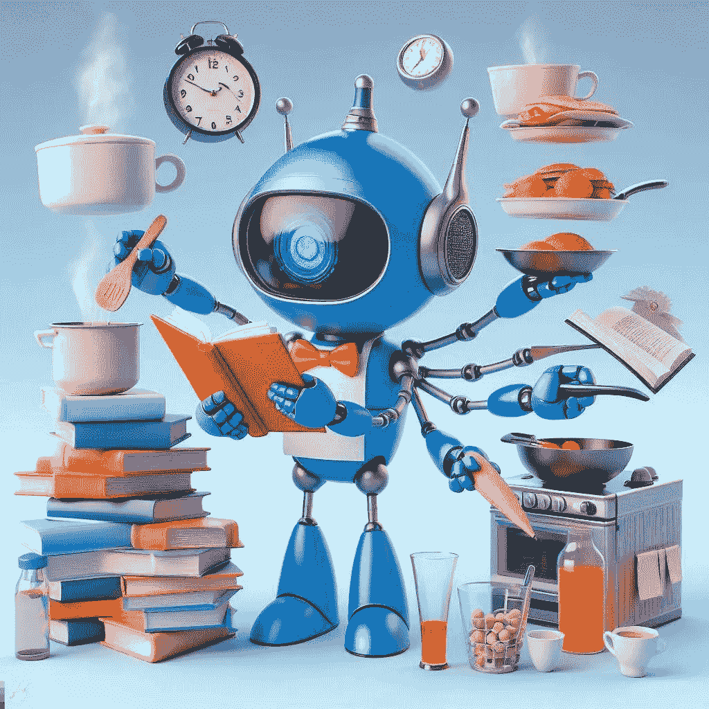

图片由 Microsoft Designer 创建

## 理解大型多模态模型的视觉能力

 [Valentina Alto](https://valentinaalto.medium.com/?source=post_page-----eab5f6453080--------------------------------)

·发表于[Towards Data Science](https://towardsdatascience.com/?source=post_page-----eab5f6453080--------------------------------) ·阅读时间 9 分钟·2023 年 12 月 27 日

--

生成 AI 的最新进展使得大型多模态模型（LMMs）的发展成为可能，这些模型能够处理和生成不同类型的数据，例如文本、图像、音频和视频。

LMMs 与“标准”大型语言模型（LLMs）共享一般化和适应能力，这些能力是大型基础模型所特有的。然而，LMMs 能够处理超越文本的数据，包括图像、音频和视频。

大型多模态模型的一个最突出的例子是 GPT4V(ision)，它是生成预训练变换器（GPT）系列的最新迭代。GPT-4 可以执行各种需要自然语言理解和计算机视觉的任务，例如图像字幕生成、视觉问答、文本到图像合成以及图像到文本翻译。

GPT4V（以及其更新版本 GPT-4-turbo vision）展现了非凡的能力，包括：

+   数值问题的数学推理：

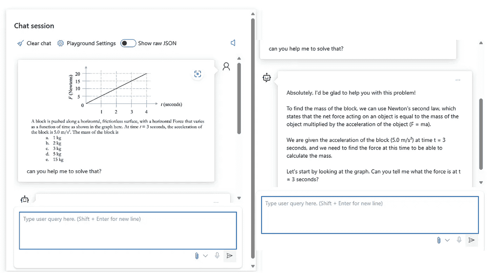

图片由作者提供

+   从草图生成代码：

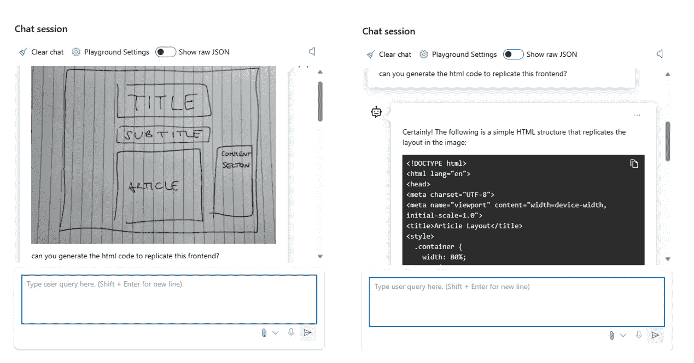

图片由作者提供

+   OCR：

图片由作者提供

+   艺术遗产的描述：

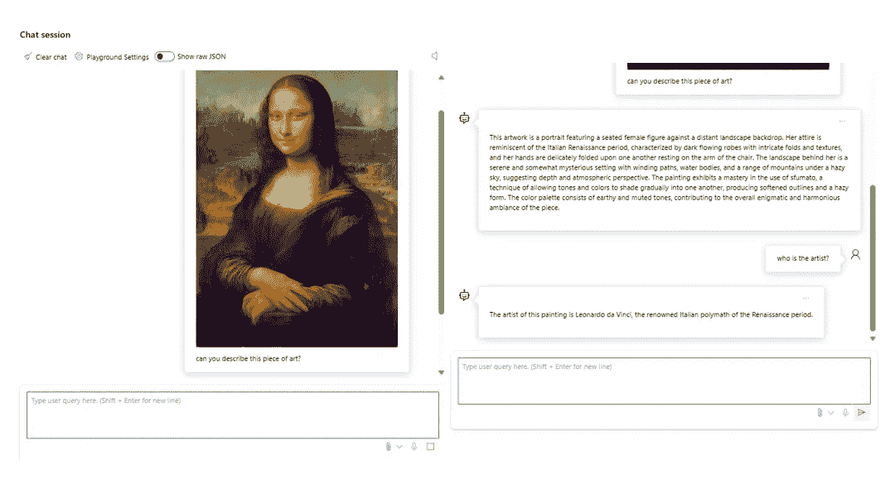

图片由作者提供

以及许多其他功能。

在这篇文章中，我们将重点关注 LMMs 的视觉能力，以及它们如何与标准计算机视觉算法不同。

## 什么是计算机视觉

计算机视觉（CV）是人工智能（AI）领域的一部分，它使计算机和系统能够从数字图像、视频和其他视觉输入中获取有意义的信息。它使用机器学习和神经网络来教会计算机看、观察和理解。其目标是模仿人类视觉系统，自动化人类视觉系统能够完成的任务。例如，计算机视觉可以用于识别图像中的物体、检测事件、估计 3D 姿势和修复图像。

由于计算机视觉依赖于神经网络，这些网络不过是数学模型，我们需要将图像转换为数值输入，以便它们可以被我们的模型处理。

图像是像素的多维数组。对于灰度图像，这是一个 2D 数组，每个像素对应于不同的灰色阴影。对于彩色图像，它是一个 3D 数组（高度、宽度和颜色通道），每个颜色通道（红色、绿色、蓝色 — RGD）都有一个单独的 2D 像素强度数组。

每个像素强度是一个数值。最常见的情况是这个值范围从 0（黑色）到 255（白色）。这些像素的组合构成了我们视觉上感知到的图像。

以下插图展示了一个 RGD 图像的例子（注意：像素值仅作为示例，并不代表真实值）。

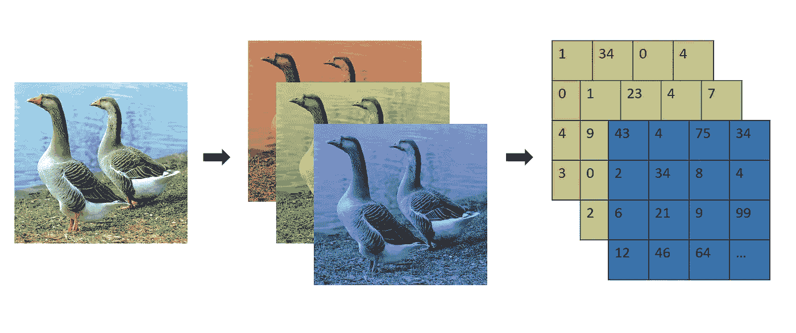

图片由作者提供

现在的问题是如何预处理这些多维数组，使得计算机视觉模型能够理解它们并尽可能保留信息。

在多模态模型出现之前，计算机视觉通常依赖于为特定任务设计和训练的专用模型，如目标检测、人脸识别、场景分割和光学字符识别。在这个领域中，**卷积神经网络**是最受欢迎的模型之一。

## 卷积神经网络

卷积神经网络不过是展示了至少一层数学操作**卷积**的神经网络。

卷积是两个矩阵之间的逐元素乘法（分别代表一个专门用于检测特定特征的滤波器和处理图像的同样大小的区域），并对输出结果进行最终的求和。

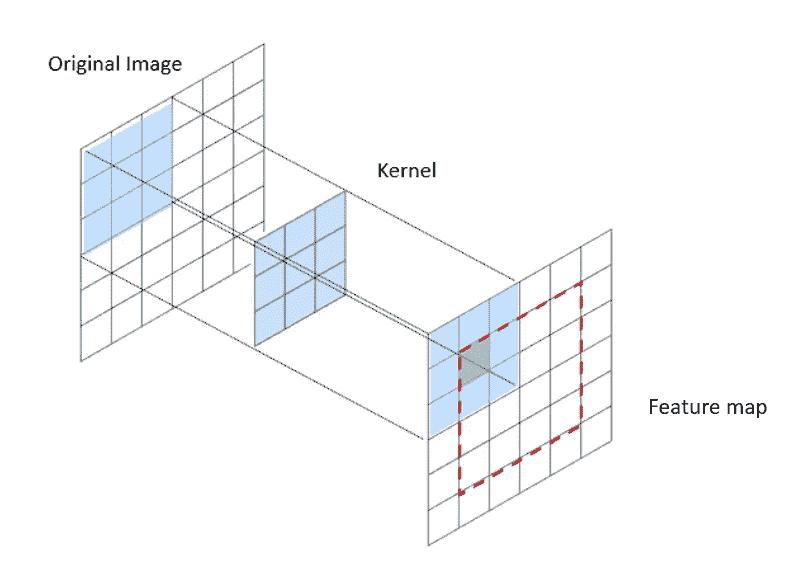

图片由作者提供

让我们将以下插图作为一个例子。

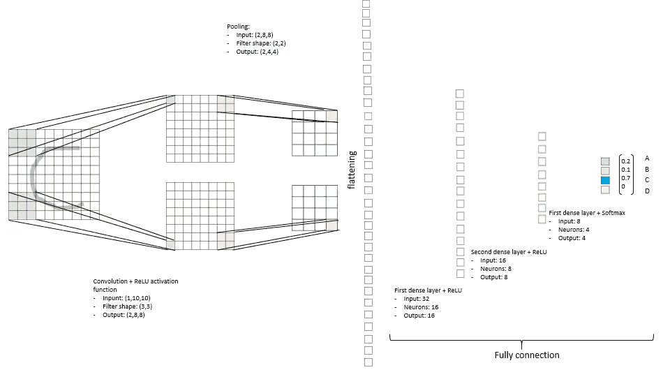

图片由作者提供

在图中，我检查了一个简单的任务：我们有一个由四个字母组成的字母表——A、B、C 和 D——并且我们的算法被要求识别输入字母（在我们的例子中是‘C’）。输入图像通过一个专门的滤波器（例如，用于角点检测）进行处理，然后降维、展平，并通过全连接层处理。

## 视觉转换器

Vision Transformer（原始论文[这里](https://arxiv.org/pdf/2010.11929.pdf)）作为 CNN 的第一个替代方案被提出，它与 LLM 共享核心架构（编码器/解码器）。

与传统的转换器一样，在这种情况下核心机制也是**注意力**（原始论文[这里](https://arxiv.org/abs/1706.03762)），它允许模型在进行预测时选择性地关注输入序列的不同部分。这个概念通过教模型关注输入数据的某些部分并忽略其他部分，从而更好地解决当前任务。

**变革性的**注意力机制在转换器中的一个方面是，它摆脱了递归（可以在[这里](https://medium.com/analytics-vidhya/recurrent-neural-networks-97f3b034e70)了解更多关于递归神经网络（RNN）的内容）和卷积，这些都是以前模型广泛依赖的。转换器是第一个完全依赖注意力来计算输入和输出表示的模型，而不使用序列对齐的 RNN 或卷积。这使得转换器能够捕捉句子中单词之间更广泛的关系，并学习输入的更微妙的表示。

在视觉转换器中，图像的处理方式与 CNN 不同。实际上，一张图像被划分为所谓的补丁，通常为 16x16 像素大小。然后，每个补丁被展平为 1D 向量并进行标记，就像我们在标准转换器（如 GPT-3.5）中处理文本数据一样。

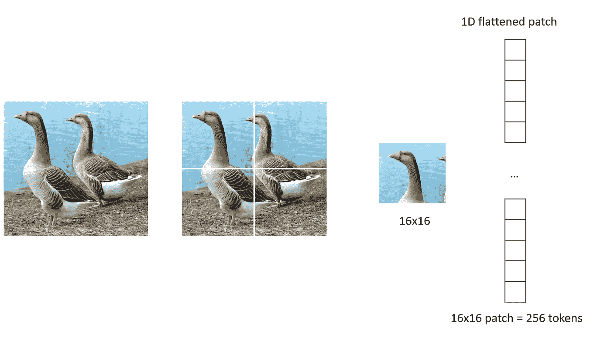

作者提供的图像

现在，这些经过标记的补丁将被输入到视觉转换器模型中，并通过**线性投影层**进一步转换为低维向量，这样我们可以在保留信息的同时减少内存和计算能力的需求。此外，与标准转换器一样，每个标记都通过**位置嵌入层**与其在图像整体上下文中的位置指示器相关联。

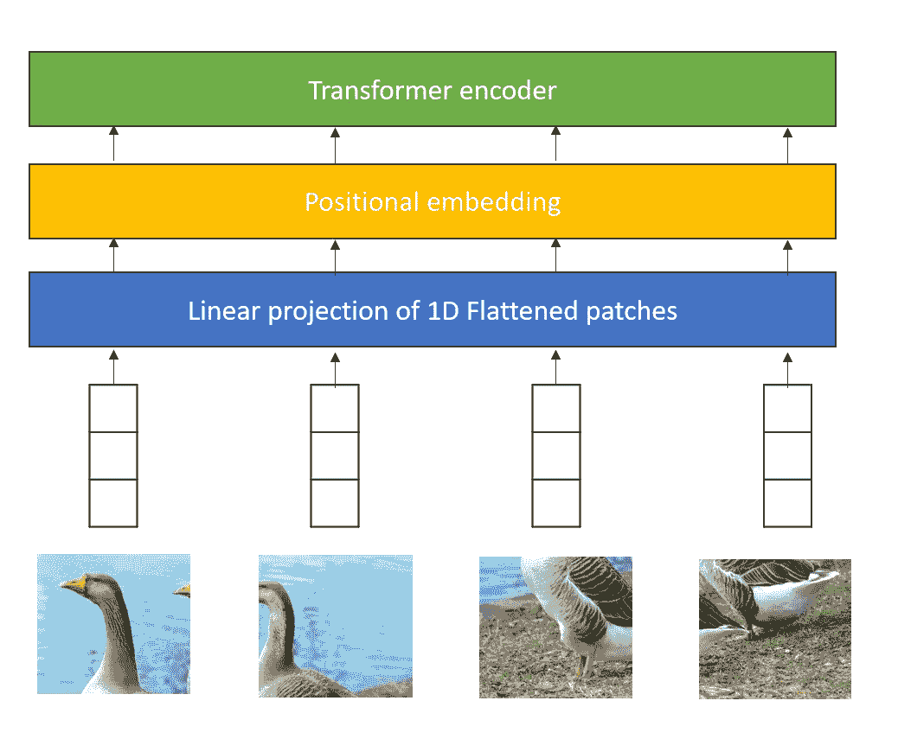

作者提供的图像

最终，位置嵌入的标记被传递到模型的主要块，即转换器编码器。下面你可以看到一个视觉转换器的插图（在这个案例中，场景是分类任务）：

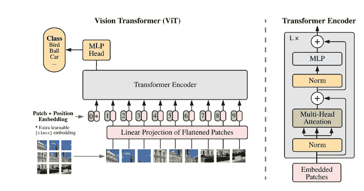

来源: [`arxiv.org/pdf/2010.11929v2.pdf`](https://arxiv.org/pdf/2010.11929v2.pdf)

如你所见，转换器编码器展示了上述**注意力机制**。

## 总结

其思想是将图像的嵌入投影到与语言相同的潜在空间中，这样，当给定由图像和文本组成的人类输入时，模型能够从覆盖图像和文本的嵌入空间中获取相关的上下文。

OpenAI 引入的第一个图像和文本模型是 CLIP（对比语言-图像预训练）。

**CLIP**

[CLIP](https://openai.com/research/clip)是 OpenAI 开发的一个模型，旨在同时理解图像和文本。它就像是连接图像世界和文字世界的桥梁。

想象一下你有一堆图像和句子，你想将每张图像与最能描述它的句子匹配。这就是 CLIP 的核心功能。它被训练以理解哪些图像和句子彼此相似。

CLIP 的酷炫之处在于它不需要专门针对某个任务进行训练就能表现良好。例如，如果你有一组 CLIP 从未见过的新图像和句子（即所谓的零样本方法），它仍然可以很好地将它们匹配起来。这是因为 CLIP 从大量数据中学习了对图像和文本的普遍理解。

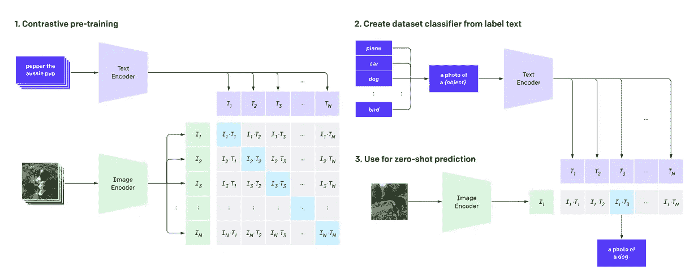

来源：[CLIP: 连接文本和图像 (openai.com)](https://openai.com/research/clip)

尽管 CLIP 仍然是一个预测模型，但最先进的 LMMs 旨在作为 AI 助手与人类互动。换句话说，它们是指令模型。

**LLaVA**

一个很好的助手 LMM 的例子是开源模型[LLaVA (Large Language and Vision Assistant)](https://llava-vl.github.io/)，它结合了前面提到的 CLIP 用于图像编码和基础 LMM [Vicuna](https://lmsys.org/blog/2023-03-30-vicuna/)，用于指令理解。

LLaVA 的思想是拥有一个线性层，将 CLIP 生成的图像特征连接到语言模型 Vicuna 的词嵌入空间中。

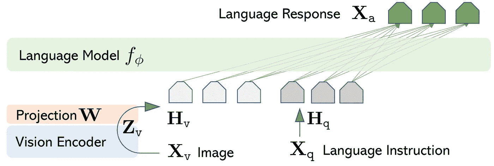

来源：[2304.08485.pdf (arxiv.org)](https://arxiv.org/pdf/2304.08485.pdf)

为此，研究人员引入了一个可训练的投影矩阵 W，它将图像特征转换为与语言模型处理的词嵌入具有相同维度的嵌入向量。

**Kosmos-1**

另一个例子是 Kosmos-1，由微软研究院在[这篇论文](https://arxiv.org/pdf/2302.14045.pdf)中介绍。该模型的理念是使用一个变压器解码器以统一的方式感知通用模态：输入被展平为 1D 令牌向量，并用特殊的开始和结束序列标记（文本如*<s>text</s>*，图像如*<image>image</image>*）标记。一旦标记化，输入通过嵌入模块（特定于数据格式）进行编码，然后输入解码器。

在他们的论文中，作者描述了模型的训练过程，其中包括以下数据语料库：

+   **单模态文本语料库** → 用于**表示学习**（即，产生有意义的语言表示，保持其潜在语义结构）和一般语言任务，例如遵循指令、上下文学习等。

+   **图像-文本对** → 作为模型将图像与其描述关联的桥梁

+   **交错的图像-文本数据** → 需要进一步将一般模态的感知与语言模型对齐，并提高模型的少样本能力。

下面的图片展示了一些 Kosmos-1 的能力示例：

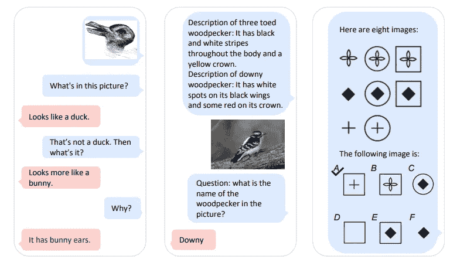

来源: [2302.14045.pdf (arxiv.org)](https://arxiv.org/pdf/2302.14045.pdf)

总体而言，创建一个图像和词汇的共同嵌入空间的趋势，使模型能够“感知”这两种数据格式——文本和图像——正在为强大的大型多模态模型铺平道路。此外，像 CLIP 这样的预训练模型被广泛用于生成图像表示，然后可以进一步转换为词嵌入空间。

## 超越视觉

一般来说，多模态模型的主要思想是创建不同模态中给定概念的一致表示。在前一部分中，我们看到如何使用视觉变换器将图像嵌入到潜在空间中的低维向量中。同样，我们可以为每种模态创建编码器，并使用目标函数来鼓励模型为相似的数据对生成相似的嵌入。

比如，我们可以考虑模型 [MACAW-LLM](https://github.com/lyuchenyang/Macaw-LLM)，这是一个多模态语言模型，能够处理图像、视频、音频和文本数据，基于 CLIP（图像和视频）、[Whisper](https://openai.com/research/whisper)（音频）和[LLaMA](https://ai.meta.com/blog/large-language-model-llama-meta-ai/)（文本）的基础构建。

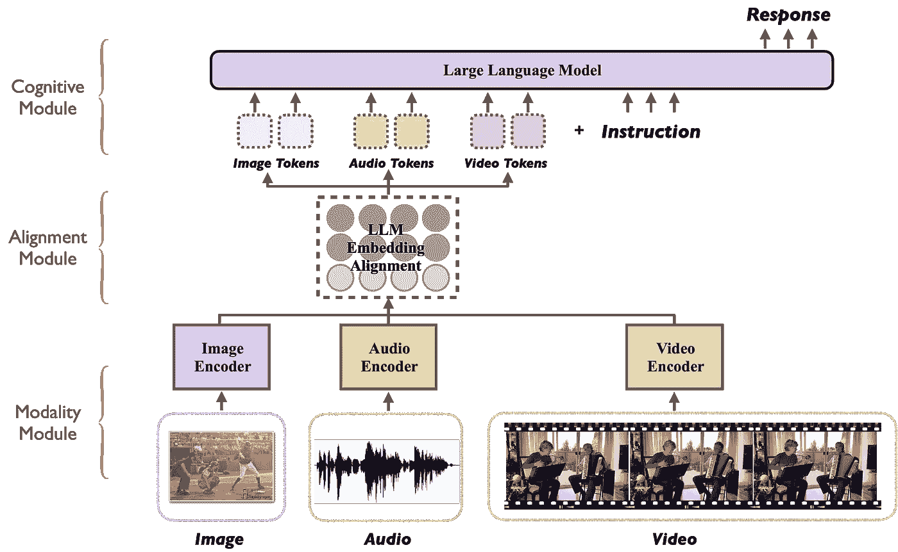

来源: [lyuchenyang/Macaw-LLM: Macaw-LLM: 多模态语言建模，集成图像、视频、音频和文本 (github.com)](https://github.com/lyuchenyang/Macaw-LLM)

如你所见，不同的嵌入模块被用来生成“共享”的嵌入空间，该空间与 LLM 使用的词嵌入空间（在本例中为 Meta AI 的 LLaMA）对齐。

## 结论

多模态正在为新一波应用和用例铺平道路。这也是实现[人工通用智能（AGI）](https://openai.com/blog/planning-for-agi-and-beyond)概念的进一步里程碑，因为它使 AI 系统越来越容易像人类一样“感知”。

不用说，大型多模态模型在伦理考量方面带来了更大的责任：偏见、歧视、隐私侵犯以及许多其他风险都是 LMM 研究的核心，现在比以往任何时候都更加需要关注[人类对齐](https://openai.com/blog/introducing-superalignment)。

## 参考文献

+   [`arxiv.org/pdf/2010.11929.pdf`](https://arxiv.org/pdf/2010.11929.pdf)

+   [`arxiv.org/abs/1706.03762`](https://arxiv.org/abs/1706.03762)

+   [`medium.com/analytics-vidhya/recurrent-neural-networks-97f3b034e70`](https://medium.com/analytics-vidhya/recurrent-neural-networks-97f3b034e70)

+   [lyuchenyang/Macaw-LLM：Macaw-LLM：图像、视频、音频和文本整合的多模态语言建模 (github.com)](https://github.com/lyuchenyang/Macaw-LLM)

+   [2302.14045.pdf (arxiv.org)](https://arxiv.org/pdf/2302.14045.pdf)

+   [CLIP：连接文本和图像 (openai.com)](https://openai.com/research/clip)

+   [`ai.meta.com/blog/large-language-model-llama-meta-ai/`](https://ai.meta.com/blog/large-language-model-llama-meta-ai/)

+   [`openai.com/blog/introducing-superalignment`](https://openai.com/blog/introducing-superalignment)

+   [`openai.com/blog/our-approach-to-alignment-research`](https://openai.com/blog/our-approach-to-alignment-research)
