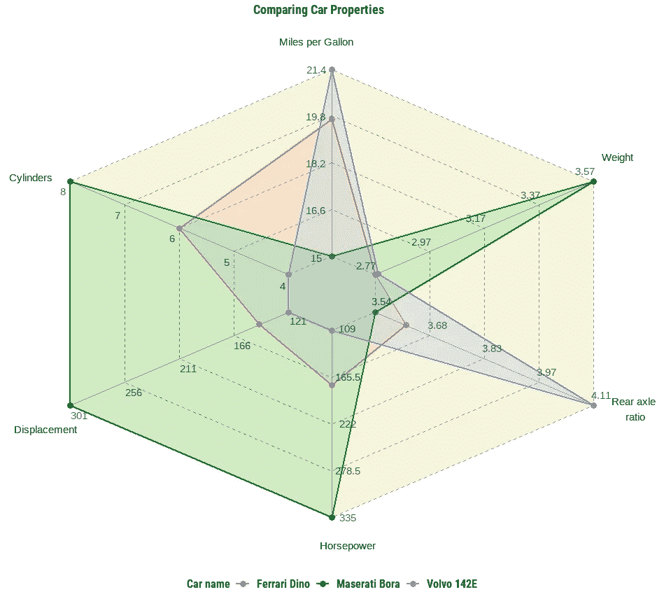
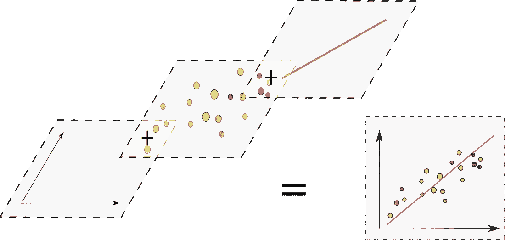
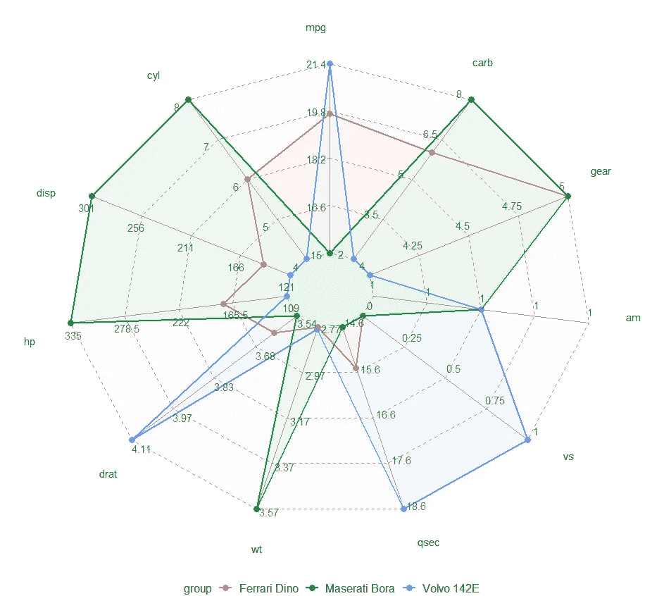
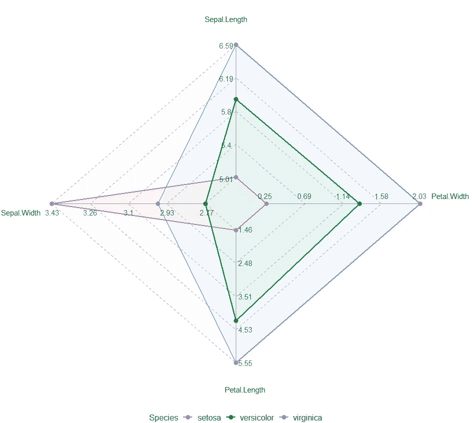
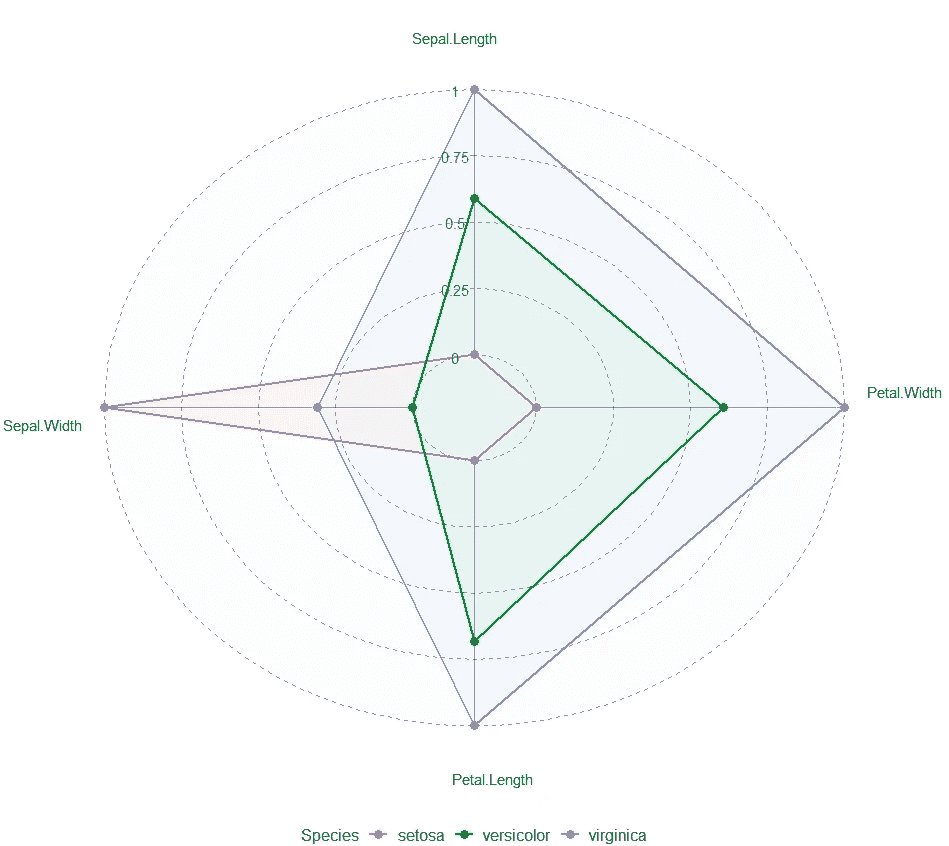
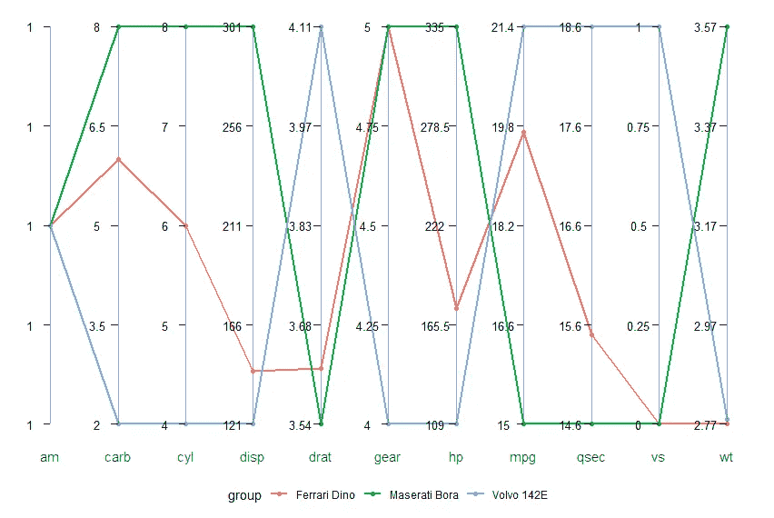
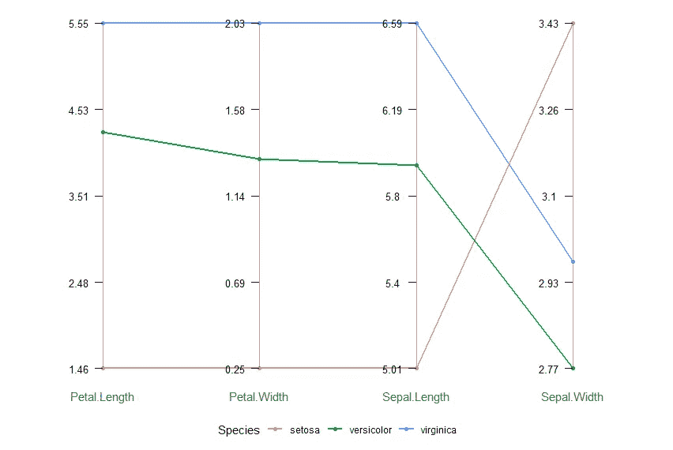

# 在 R 中使用 ggvanced 包的蜘蛛图和并行图

> 原文：[`towardsdatascience.com/ggvanced-a-package-for-generating-advanced-data-visualizations-on-top-of-the-ggplot2-package-2a935763a4b?source=collection_archive---------11-----------------------#2023-06-20`](https://towardsdatascience.com/ggvanced-a-package-for-generating-advanced-data-visualizations-on-top-of-the-ggplot2-package-2a935763a4b?source=collection_archive---------11-----------------------#2023-06-20)

## 一个用于有效可视化多个变量的 R 包

[](https://medium.com/@zvonimir.boban.mef?source=post_page-----2a935763a4b--------------------------------)[](https://towardsdatascience.com/?source=post_page-----2a935763a4b--------------------------------) [Zvonimir Boban](https://medium.com/@zvonimir.boban.mef?source=post_page-----2a935763a4b--------------------------------)

·

[关注](https://medium.com/m/signin?actionUrl=https%3A%2F%2Fmedium.com%2F_%2Fsubscribe%2Fuser%2Fe31978768a4e&operation=register&redirect=https%3A%2F%2Ftowardsdatascience.com%2Fggvanced-a-package-for-generating-advanced-data-visualizations-on-top-of-the-ggplot2-package-2a935763a4b&user=Zvonimir+Boban&userId=e31978768a4e&source=post_page-e31978768a4e----2a935763a4b---------------------post_header-----------) 发表在 [Towards Data Science](https://towardsdatascience.com/?source=post_page-----2a935763a4b--------------------------------) · 5 分钟阅读 · 2023 年 6 月 20 日[](https://medium.com/m/signin?actionUrl=https%3A%2F%2Fmedium.com%2F_%2Fvote%2Ftowards-data-science%2F2a935763a4b&operation=register&redirect=https%3A%2F%2Ftowardsdatascience.com%2Fggvanced-a-package-for-generating-advanced-data-visualizations-on-top-of-the-ggplot2-package-2a935763a4b&user=Zvonimir+Boban&userId=e31978768a4e&source=-----2a935763a4b---------------------clap_footer-----------)

--

[](https://medium.com/m/signin?actionUrl=https%3A%2F%2Fmedium.com%2F_%2Fbookmark%2Fp%2F2a935763a4b&operation=register&redirect=https%3A%2F%2Ftowardsdatascience.com%2Fggvanced-a-package-for-generating-advanced-data-visualizations-on-top-of-the-ggplot2-package-2a935763a4b&source=-----2a935763a4b---------------------bookmark_footer-----------)

一张漂亮的蜘蛛图。图像作者。

# 动机

在我的一个数据分析项目中，我发现自己需要一种有效的方法来同时比较多个变量中的各组数据。当然，首先想到的是条形图，但我想要一些更引人注目、更有趣的东西。在浏览了一些网页后，我决定尝试两个主要的候选图表——蜘蛛图和并行图。

在这种情况下，我通常会寻找一个专门的 R 包来生成所需的可视化，但这次，这种方法让我一无所获。

一种谎言——更有经验的 R 用户可能会这么说！这样的可视化已经可以通过`fsmb`和`ggradar`等包获得雷达图，或通过`ggally`获得平行图。

然而，除了仅仅对组之间的变量进行排名比较外，我还希望同时显示每个变量的值范围。你猜对了，前面提到的这些包没有提供这一功能。所以，我决定自己动手制作一个 :)

# ggvanced 包

`ggvanced`是一个 R 包，用于创建高级多变量图表，如蜘蛛图/雷达图和平行图。这些可视化是在`ggplot2`包的基础上创建的。`ggplot2`包的美妙之处在于其底层的图形语法，允许通过将多个图层堆叠在一起创建图形。这一强大的概念使我们能够创建几乎任何可视化，只要我们知道如何编码。



使用图形语法方法创建可视化。图片由作者提供。

该软件包目前在[GitHub](https://github.com/Ringomed/ggvanced)上提供，并可以通过在 R 中输入`devtools::install_github("Ringomed/ggvanced")`命令进行安装，然后调用`library(ggvanced)`。

如果你对图表构建的细节感兴趣，我在最近的一篇文章中展示了从头开始构建蜘蛛图的逻辑，所以可以查看下面的故事或 GitHub 上的详细文档。

[如何在 R 中使用 ggplot2 绘制蜘蛛图](https://towardsdatascience.com/how-to-make-a-spider-chart-in-r-using-ggplot2-85a4f1898cab?source=post_page-----2a935763a4b--------------------------------) [## 如何在 R 中使用 ggplot2 绘制蜘蛛图]

### 蜘蛛图/雷达图的逐步构建

[如何在 R 中使用 ggplot2 绘制蜘蛛图](https://towardsdatascience.com/how-to-make-a-spider-chart-in-r-using-ggplot2-85a4f1898cab?source=post_page-----2a935763a4b--------------------------------)

对于其他人，下面是一些示例，详细介绍了该软件包函数的功能。

# 使用 ggspider()的蜘蛛图

`ggspider()`函数创建蜘蛛图，这些图可以是一个共享的轴，轴的范围被缩放到[0,1]，或者是每个显示的类别都有一个显示实际值的独立轴。让我们通过几个示例来测试这个函数。首先，我们需要将数据格式化，使第一列包含组标识符，其余列包含描述变量。我们将使用内置的`mtcars`和`iris`数据集。

```py
library(tidyverse)

mtcars_summary <- mtcars %>% 
  tibble::rownames_to_column(var = "group") %>%  
  tibble::as_tibble() %>% 
  tail(3)

iris_summary <- iris %>% 
  dplyr::group_by(Species) %>% 
  dplyr::summarise(across(everything(), mean))
library(ggvanced)
```

## `比较汽车属性`

```py
ggspider(mtcars_summary)
```



图片由作者提供。

汽车之间的主要差异立刻显现出来。正如预期的，与如 Ferrari 和 Maserati 这样的赛车相比，Volvo 的马力（hp）要少得多，而且在完成四分之一英里（qsec）时所需时间要长得多，但在每加仑英里数（mpg）方面则更加经济。

## `可视化 Iris 物种之间的差异`

```py
ggspider(iris_summary)
```



图片由作者提供。

就像汽车示例一样，蛛网图非常有效于确定鸢尾花物种之间的差异。我们可以立即看到，Versicolor 和 Virginica 物种非常相似，它们的花瓣和萼片长度与宽度的比例基本相同，唯一不同的是花的总大小。相比之下，Setosa 物种的萼片宽度要大得多。

## 雷达图

这个功能还允许通过指定参数`scaled = TRUE`并使用`polygon = FALSE`切换到圆形，来创建具有单一公共比例轴的传统雷达图。

```py
ggspider(iris_summary, scaled = TRUE, polygon = FALSE)
```



其他函数参数更多地是美学方面的，涵盖了字体大小、标签位置等方面。更多详细信息，请参考函数文档。

# `使用 ggparallel() 绘制平行图`

虽然从美学角度我更喜欢蛛网图，但平行图可以更容易地发现变量之间的趋势。当数据集中有许多变量或观测值时，这一点尤其明显。

```py
ggparallel(mtcars_summary)
```



图片由作者提供。

```py
ggparallel(iris_summary)
```



图片由作者提供。

# 调整美学

上述图表只是最基础的版本。当然，它们可以像其他任何`ggplot2`图表一样“加点修饰”。下面是经过几次修改后的`ggvanced`蛛网图示例。


图片由作者提供。

当然，还有相应的代码。享受吧！:)

```py
library(tidyverse)
library(ggvanced)
library(sysfonts)
library(showtext)

sysfonts::font_add_google("Roboto Condensed")
showtext_auto()

mtcars_gr <- mtcars %>%
  tibble::rownames_to_column(var = "group") %>%
  tibble::as_tibble() %>%
  tail(3) %>%
  rename("Miles per Gallon" = mpg, "Cylinders" = cyl,
         "Displacement" = disp, "Horsepower" = hp,
         "Rear axle\n ratio" = drat, "Weight" = wt) %>%
  dplyr::select(1:7)

ggspider(mtcars_gr, axis_name_offset = 0.15, background_color = "beige", fill_opacity = 0.15) +
  labs(col = "Car name", title = "Comparing Car Properties") +
  theme(plot.title = element_text(hjust = 0.475, face = "bold"),
        legend.title = element_text(face = "bold"),
        text = element_text(family = "Roboto Condensed", face = "bold"))
```

# 结论

在这篇文章中，我介绍了`ggvanced`的关键函数和选项——这是我为了满足 R 中对更高级的蛛网图和平行图的需求而制作的一个包。

这篇文章通过几个例子讲解了每个函数，然后展示了在一些额外定制后的最终效果。

我希望这个包对你有用，就像对我一样。如果你有任何定制可视化的需求，请留下评论，我会尽力为其创建一个单独的函数。:)
