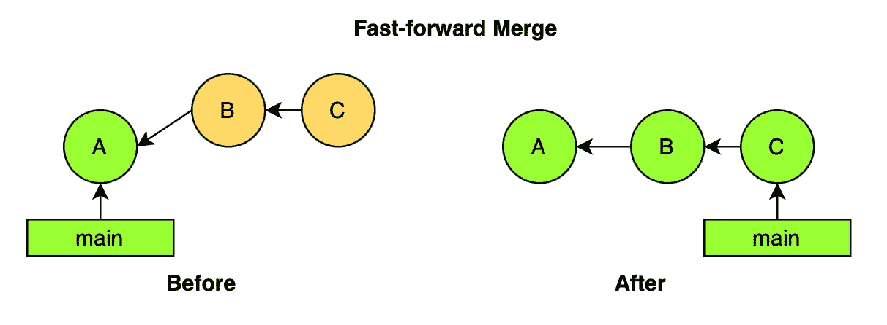
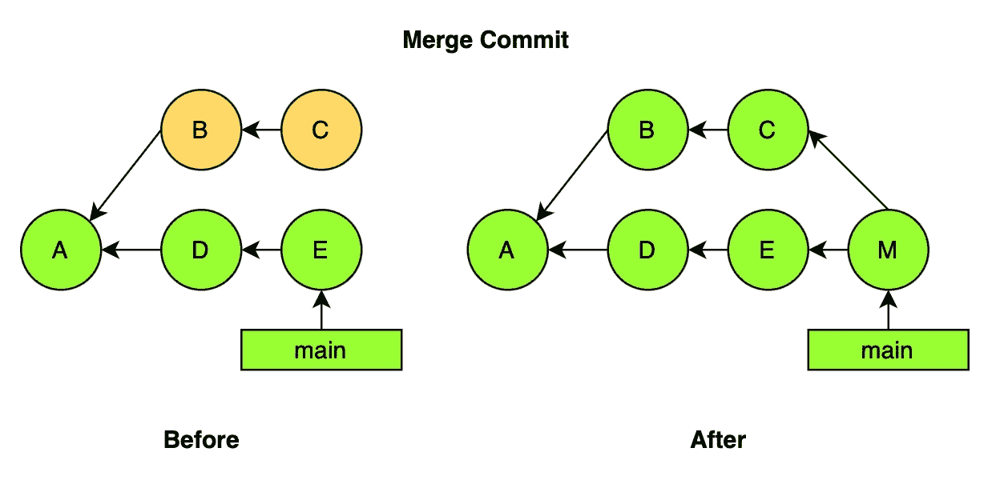
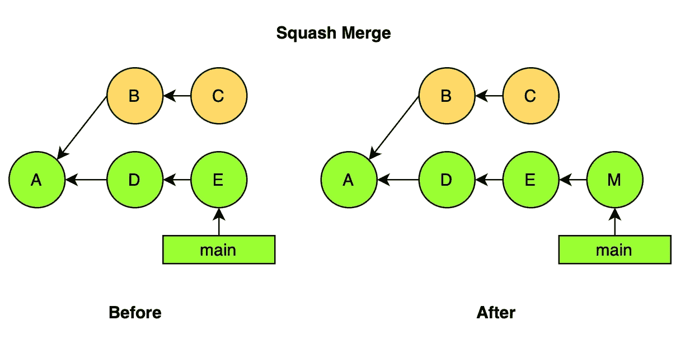
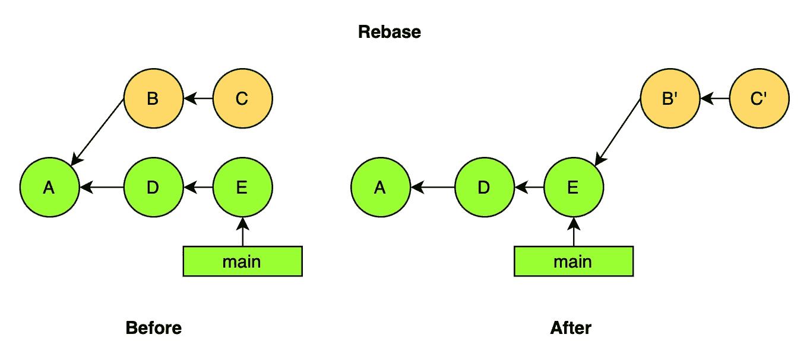

# Git 101 — 从术语到架构及工作流

> 原文：[`towardsdatascience.com/git-101-from-terminologies-to-architecture-and-workflows-78cb6d735798`](https://towardsdatascience.com/git-101-from-terminologies-to-architecture-and-workflows-78cb6d735798)

## Git 背后的原理及如何高效使用 Git

[](https://kayjanwong.medium.com/?source=post_page-----78cb6d735798--------------------------------)[](https://towardsdatascience.com/?source=post_page-----78cb6d735798--------------------------------) [Kay Jan Wong](https://kayjanwong.medium.com/?source=post_page-----78cb6d735798--------------------------------)

·发表于 [Towards Data Science](https://towardsdatascience.com/?source=post_page-----78cb6d735798--------------------------------) ·阅读时间 7 分钟·2023 年 5 月 21 日

--


图片由 [Roman Synkevych](https://unsplash.com/@synkevych?utm_source=medium&utm_medium=referral) 提供，来源于 [Unsplash](https://unsplash.com/?utm_source=medium&utm_medium=referral)

所以你已经学习并了解了 `git add`、`git commit` 和 `git push`，但每一步实现了什么——在你的 *本地* 和 *远程* 仓库中发生了什么？你可以使用哪些不同的合并策略和分支策略来利用 Git 的强大功能做更多事情？

在阅读了许多仅展示 Git 命令的文章之后，我认为了解 Git 的架构对于真正理解和欣赏 Git 的运作是重要的。本文将涉及 Git 的基本术语，逐步建立到 Git 架构，最后介绍一些常见的 Git 工作流，供你在下一个编码项目中考虑采纳！

# 目录

+   [什么是 Git](https://medium.com/p/78cb6d735798/#34c1)

+   [Git 术语](https://medium.com/p/78cb6d735798/#d4b5)

+   [Git 架构](https://medium.com/p/78cb6d735798/#3d8c)

+   [分支、合并及合并冲突](https://medium.com/p/78cb6d735798/#c5e6)

+   [Git 工作流](https://medium.com/p/78cb6d735798/#414a)

# 什么是 Git

简而言之，Git 是一种帮助进行版本控制的工具，使团队能够以敏捷的方式管理他们的代码——从跟踪代码更改历史到处理代码更改冲突等等。

更进一步，Git 还可以与持续集成持续部署（CICD）工具一起使用，因为代码库维护良好且有版本控制（如果正确使用）。使用如 GitHub Actions 等工具可以在代码更改时自动触发部署——但这不在本文讨论范围之内。

> **注意**：GitHub、GitLab 和 Bitbucket 是 Git 仓库的托管服务，不应与 Git 本身混淆！

# Git 术语

在深入了解 Git 架构之前，一些术语经常被提到，了解它们会有帮助。

+   **仓库**：存储文档和代码的数据结构，由一系列提交组成

+   **分支**：独立的项目开发线

+   **提交**：项目的一个版本；项目的快照

+   **拉取请求**：请求将一个分支合并到另一个分支

+   **合并**：将独立分支的工作结合在一起

总结起来，在项目工作中，你通常会*分支*出去进行更改，并在完成后*提交*更改。之后，你将发起一个*拉取请求*，以便将你的分支与主要的*仓库*进行*合并*。

> 独立分支和拉取请求的存在允许团队在保持稳定仓库的同时扩展他们的工作

Git 操作中也有一些术语。注意有一个概念是*本地*和*远程*，将在后面的部分进行解释。

+   **克隆**：远程仓库的本地副本

+   **分叉**：将远程仓库复制到自己的账户，两者都是远程仓库

+   **获取**：从远程仓库检索新对象和引用

+   **拉取**：从远程仓库获取并合并提交到本地

+   **推送**：向远程仓库添加新对象和引用

+   **储藏**：保存工作区中的文件以备后用

# Git 架构

如前面部分所述，存在*本地*和*远程*的概念。**远程仓库**指的是项目所有提交的位置，通常托管在数据中心或云端（例如 GitHub）。**本地仓库**，则指的是项目在本地机器（例如笔记本电脑）上的提交位置，由三个独立的“区域”组成，

+   **工作区**：单个提交的目录和文件的位置

+   **暂存区**：计划下次提交的文件的位置

+   **本地仓库**：项目所有提交的位置

具体操作时，当你执行`git checkout`时，它会将目录和文件放入*工作区*。在进行更改后，执行`git add`会将修改的文件转移到*暂存区*。然后你可以执行`git commit`为更改添加消息，并将更改提交到*本地仓库*。最后，执行`git push`将*本地仓库*中的更改推送到*远程仓库*。

# 分支、合并和合并冲突

## 分支策略

一个分支是一组回溯到项目首个提交的提交，通常用于在团队成员之间隔离工作，因为他们可以在独立的分支上工作。

有两种类型的分支。**短期分支**包含对项目的小更改，例如实现新功能、修复错误、热修复等。而**长期分支**可以持续到项目的整个生命周期，例如主分支、开发分支或发布分支。

理想情况下，分支在合并后应被删除，以防止分支数量持续增加。在意外删除的情况下，分支可以恢复 — 仅当分支存在于某人的本地仓库中时。

## 合并策略

合并将多个独立分支的工作结合起来。使用小而频繁的合并是一个好的实践，以避免合并冲突。有 4 种合并类型 — 并且合并策略通常取决于团队的提交历史策略。

**快进（FF）合并**



图 1: 快进合并示例 — 作者提供的图片

+   将基础分支标签移动到合并分支的尖端。

+   只有在没有对基础分支进行其他提交的情况下才可能 — 否则在执行任何 `git push` 之前先执行 `git pull`。

+   这被认为是最严格的合并策略，因为它确保代码修改始终兼容，因为最新的更改总是首先被获取。

**合并提交**



图 2: 合并提交示例 — 作者提供的图片

+   将合并分支的提交结合起来，导致非线性的提交图，因为合并提交有多个父级。

+   当多个提交被合并且两个分支以不同方式更改相同内容时，这可能会导致合并冲突。

+   这是 Git 的自动行为。

**压缩合并**



图 3: 压缩合并示例 — 作者提供的图片

+   将合并分支的尖端合并到基础分支的尖端（可以使用快进合并或合并提交），并将多个提交合并成一个提交。

+   这可能导致删除的提交，因为提交 B 和 C 最终会在删除分支时被垃圾回收。

+   **需要谨慎操作！** 这会重写提交历史，我们不应重写已共享的历史。

**变基**



图 4: 变基示例 — 作者提供的图片

+   将合并分支中的提交移动到新的父级，并且提交将由于不同的祖先链而具有不同的 ID。

+   合并分支中的“新”提交可以快速前进，不需要合并提交。

+   在进行变基时，当两个分支以不同方式更改相同内容时，这可能会导致合并冲突。

+   **需要谨慎操作！** 这会重写提交历史，我们不应重写已共享的历史。

## 合并冲突

从前面的部分，我们注意到合并提交和变基可能导致合并冲突，即两个分支以不同方式更改相同内容的情况。

解决合并冲突涉及 3 次提交——基础分支的顶端、合并分支的顶端，以及基础和合并分支之间的共同祖先。冲突部分由冲突标记围绕，如下所示，

```py
<<<<<<< HEAD
The version in the base branch
=======
The version in the merge branch
>>>>>>> feature/merge-branch
```

在尝试合并时，具有冲突的文件会被 Git 修改并放置在工作树中。合并冲突必须在暂存、提交和再次合并之前手动解决。

# Git 工作流

除了决定为你的项目实施的合并策略类型外，还有基于团队偏好、团队规模、项目规模等的 4 种 Git 工作流类型。

## 基本工作流 / 集中式工作流

+   **类型**: 单一中央代码库（无分支）

+   **如何**: 每个成员克隆代码库，在本地处理代码，提交并将更改推送到中央代码库。

+   适合小型项目和小型团队，因为没有代码审查或拉取请求的参与。

## 特性分支工作流

+   **类型**: 单一中央代码库（带有功能分支）

+   **如何**: 每个成员为每个新功能创建一个分支，并将完成的更改合并到主分支。

+   推荐的工作流，因为涉及代码审查、拉取请求和讨论。

## 分叉工作流

+   **类型**: 多个远程代码库（通过分叉）

+   **如何**: 团队成员分叉（fork）代码库，创建代码库的一个副本。成员不需要对原始代码库具有写权限，并且可以随意修改分叉的代码库，以添加功能或将代码库调整到其他用例或项目中。

+   这种工作流允许代码库的维护者接受来自任何开发者的提交，而无需授予他们访问官方代码库的权限，这对开源项目非常有用。

## Gitflow 工作流

+   **类型**: 单一中央代码库（带有短期和长期分支）

+   **如何**: 对于功能或热修复，使用短期分支，对于开发和发布，使用长期分支。功能分支从开发分支创建，完成后合并回开发分支。对于发布，将开发分支中的功能合并回主分支，只有主分支用于发布。

+   该工作流允许通过发布和热修复安全地持续发布项目。

使用 Git 是必不可少的，只要你在处理任何代码库时。即使有或没有项目团队，版本控制仍然很重要来管理你的代码！希望这篇文章能揭示 Git 的内部工作原理，包括 Git 架构、不同的分支和合并策略，以及你可以在项目中使用的不同工作流。

# 相关链接

+   Git 文档: [`git-scm.com/doc`](https://git-scm.com/doc)

+   使用 Git 进行版本控制（Coursera）: [`www.coursera.org/learn/version-control-with-git`](https://www.coursera.org/learn/version-control-with-git)
