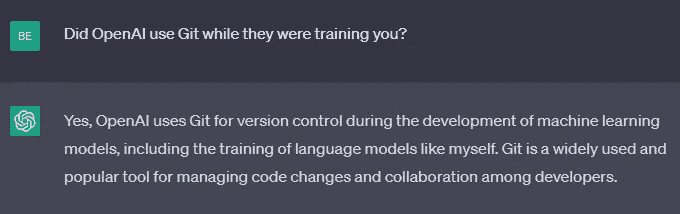

# 现代数据科学家的 Git：你不能忽视的 9 个 Git 概念

> 原文：[`towardsdatascience.com/git-for-the-modern-data-scientist-9-git-concepts-you-cant-ignore-b4eaf7a154c2?source=collection_archive---------0-----------------------#2023-05-06`](https://towardsdatascience.com/git-for-the-modern-data-scientist-9-git-concepts-you-cant-ignore-b4eaf7a154c2?source=collection_archive---------0-----------------------#2023-05-06)

## 通过生动的视觉效果解释

 [Bex T.](https://ibexorigin.medium.com/?source=post_page-----b4eaf7a154c2--------------------------------)

·

[关注](https://medium.com/m/signin?actionUrl=https%3A%2F%2Fmedium.com%2F_%2Fsubscribe%2Fuser%2F39db050c2ac2&operation=register&redirect=https%3A%2F%2Ftowardsdatascience.com%2Fgit-for-the-modern-data-scientist-9-git-concepts-you-cant-ignore-b4eaf7a154c2&user=Bex+T.&userId=39db050c2ac2&source=post_page-39db050c2ac2----b4eaf7a154c2---------------------post_header-----------) 发表在 [Towards Data Science](https://towardsdatascience.com/?source=post_page-----b4eaf7a154c2--------------------------------) · 12 分钟阅读 · 2023 年 5 月 6 日 

--

图片由我用 Midjourney 制作

## 介绍

大多数数据科学家在使用 Git 时感觉像是鱼离开了水。有些软件工程师只谈论 Git 相关的事情，而有些数据科学家每次都说“啊？”（我真希望我能加上声音效果）。

今天就结束这种情况！由于 Git 是协作的重要工具，我将详细介绍数据科学家必须熟悉的*九*个最关键的 Git 概念，掌握这些概念对他们来说就像记住自己手背上的事一样。

我可以保证，下次有人谈论 Git 或版本控制时，你不会假装理解地点头。

开始吧！

## 第 1000 次…

你可能已经听过几百次了，但我还是再重复一遍，以免遗漏：

> *Git 是开发机器学习和人工智能系统中最重要的工具之一。*

图片由我提供
