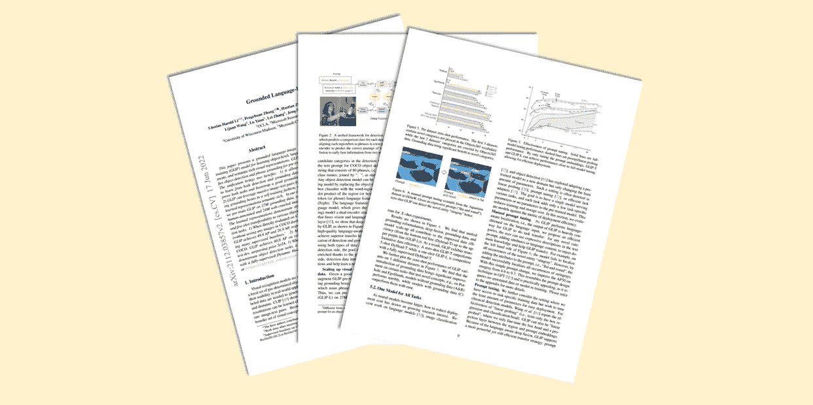

# GLIP: 将语言-图像预训练引入目标检测

> 原文：[`towardsdatascience.com/glip-introducing-language-image-pre-training-to-object-detection-5ddb601873aa?source=collection_archive---------1-----------------------#2023-09-01`](https://towardsdatascience.com/glip-introducing-language-image-pre-training-to-object-detection-5ddb601873aa?source=collection_archive---------1-----------------------#2023-09-01)

## [🚀Sascha’s Paper Club](https://towardsdatascience.com/tagged/saschas-paper-club)

## Grounded Language-Image Pre-training by L. H. Li et. al.

 [Sascha Kirch](https://medium.com/@SaschaKirch?source=post_page-----5ddb601873aa--------------------------------)

·

[Follow](https://medium.com/m/signin?actionUrl=https%3A%2F%2Fmedium.com%2F_%2Fsubscribe%2Fuser%2F5c38dace9d5e&operation=register&redirect=https%3A%2F%2Ftowardsdatascience.com%2Fglip-introducing-language-image-pre-training-to-object-detection-5ddb601873aa&user=Sascha+Kirch&userId=5c38dace9d5e&source=post_page-5c38dace9d5e----5ddb601873aa---------------------post_header-----------) 发表在 [Towards Data Science](https://towardsdatascience.com/?source=post_page-----5ddb601873aa--------------------------------) ·9 min read·Sep 1, 2023

--

今天我们将深入探讨一篇建立在 CLIP 在语言-图像预训练领域巨大成功的基础上，并将其扩展到目标检测任务的论文：GLIP——**G**rounded **L**anguage-**I**mage **P**re-training。我们将介绍论文的关键概念和发现，并通过提供更多的背景信息和对图像及实验结果的注释，使其易于理解。让我们开始吧！

图片来自 [出版物](https://arxiv.org/abs/2112.03857) 由 [Sascha Kirch](https://medium.com/@SaschaKirch) 创作

> **论文：** [Grounded Language-Image Pre-training](https://arxiv.org/abs/2112.03857) 作者
> 
> Liunian Harold Li 等，2021 年 12 月 7 日
> 
> **资源：** [GitHub](https://github.com/microsoft/GLIP)
> 
> **类别：** 表示学习、物体检测、短语定位、基础模型
> 
> [**其他教程**](https://medium.com/@SaschaKirch/list/paper-walkthroughs-by-sascha-kirch-89c7847da8e2)**：**
> 
> [BYOL] — [CLIP] — [[Depth Anything](https://medium.com/towards-data-science/depth-anything-a-foundation-model-for-monocular-depth-estimation-8a7920b5c9cc?sk=fc6197edd68e6137c3396c83e50f65cb)] — [Segment Anything] — [DINO] — [DDPM]

# 大纲

1.  背景与上下文

1.  声称的贡献

1.  方法

1.  实验

1.  进一步阅读与资源

# 背景与上下文
