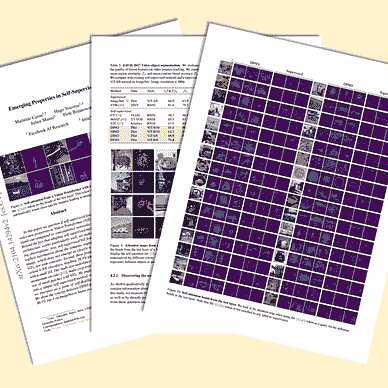

# GLIP：将语言-图像预训练引入物体检测

> 原文：[`towardsdatascience.com/glip-introducing-language-image-pre-training-to-object-detection-5ddb601873aa`](https://towardsdatascience.com/glip-introducing-language-image-pre-training-to-object-detection-5ddb601873aa)

## [🚀Sascha’s Paper Club](https://towardsdatascience.com/tagged/saschas-paper-club)

## Grounded Language-Image Pre-training 由 L. H. Li 等人著

 [Sascha Kirch](https://medium.com/@SaschaKirch?source=post_page-----5ddb601873aa--------------------------------)

·发布于 [Towards Data Science](https://towardsdatascience.com/?source=post_page-----5ddb601873aa--------------------------------) ·阅读时间 9 分钟·2023 年 9 月 1 日

--

今天我们将深入探讨一篇建立在**CLIP**语言-图像预训练成功基础上的论文，并将其扩展到物体检测任务：GLIP——**G**rounded **L**anguage-**I**mage **P**re-training。我们将涵盖论文的关键概念和发现，通过提供更多背景信息和对图像及实验结果的注释，帮助大家更容易理解。让我们开始吧！

图片来源于 [publication](https://arxiv.org/abs/2112.03857) 由 [Sascha Kirch](https://medium.com/@SaschaKirch) 创作

> **论文：** [Grounded Language-Image Pre-training](https://arxiv.org/abs/2112.03857) 由
> 
> Liunian Harold Li 等，2021 年 12 月 7 日
> 
> **资源：** [GitHub](https://github.com/microsoft/GLIP)
> 
> **类别：** 表示学习、物体检测、短语定位、基础模型
> 
> [**其他讲解**](https://medium.com/@SaschaKirch/list/paper-walkthroughs-by-sascha-kirch-89c7847da8e2)**：**
> 
> [BYOL] — [CLIP] — [[Depth Anything](https://medium.com/towards-data-science/depth-anything-a-foundation-model-for-monocular-depth-estimation-8a7920b5c9cc?sk=fc6197edd68e6137c3396c83e50f65cb)] — [Segment Anything] — [DINO] — [DDPM]

# 大纲

1.  背景与上下文

1.  声明的贡献

1.  方法

1.  实验

1.  进一步阅读与资源

# 背景与上下文

GLIP **（G**rounded **L**anguage-**I**mage **P**re-training）是一个多模态语言-图像模型。类似于 CLIP (**C**ontrastive **L**anguage-**I**mage **P**re-Training)，它通过对比预训练学习语义丰富的表示，并在其模态间进行对齐。虽然 CLIP 在图像级别上学习这些表示，这意味着一句话描述整张图像，GLIP 旨在将这种方法扩展到对象级别的表示，即一句话可能对应图像中的多个对象。识别文本提示中的单个令牌与图像中对象或区域的对应关系的任务称为 *短语基础*。因此，GLIP 中的“Grounded”一词。

因此，GLIP 的目标是：

1.  统一短语基础和对象检测，用于大规模预训练。

1.  提供一个灵活的框架进行零-shot 对象检测，其中“灵活”意味着不局限于固定的类别集合。

1.  构建一个预训练模型，可以无缝迁移到各种任务和领域，以零-shot 或少-shot 的方式。

*你可以用这样的模型做什么？* 你可以使用文本提示在给定的输入图像中找到对象或感兴趣的区域。最棒的是：你不受限于预定义的类别。

图 1：GLIP 对不同图像和提示格式的输出。 [图片来源](https://arxiv.org/abs/2112.03857) + [Sascha Kirch](https://medium.com/@SaschaKirch) 的注释

你可以进一步处理这些检测结果（例如，将其输入到跟踪系统中）或创建一个包含特定类别的自定义数据集，用于训练你自己的监督检测系统。不仅可以覆盖稀有或非常特定的类别，还可以节省大量创建人工标签的时间和成本。正如我们稍后将看到的，GLIP 的作者有一个类似的想法，通过引入教师-学生框架进一步提升性能。

GLIP 已经被许多其他深度学习项目和领域采纳。例如，[GLIGEN（Grounded-Language-to-Image-Generation）](https://arxiv.org/abs/2301.07093)使用 GLIP 来条件化潜在扩散模型的图像生成，以提高可控性。此外，GLIP 还与其他模型（如[DINO（**D**ETR with **I**mproved de**N**oising anch**O**r](https://arxiv.org/abs/2301.07093)）结合使用

将[盒子](https://arxiv.org/abs/2203.03605)和[SAM（Segment Anything Model）](https://arxiv.org/abs/2304.02643)分别扩展到[GroundingDINO](https://arxiv.org/abs/2303.05499)和[Grounded-Segment-Anything](https://github.com/IDEA-Research/Grounded-Segment-Anything)。[GLIPv2](https://arxiv.org/abs/2206.05836)通过视觉语言理解扩展了最初的 GLIP 模型，不仅改进了短语定位，还使视觉问答任务成为可能。

[Sascha Kirch](https://medium.com/@SaschaKirch?source=post_page-----5ddb601873aa--------------------------------)

## 由 Sascha Kirch 提供的论文解析

[查看列表](https://medium.com/@SaschaKirch/list/paper-walkthroughs-by-sascha-kirch-89c7847da8e2?source=post_page-----5ddb601873aa--------------------------------)7 篇故事

# 声明的贡献

1.  大规模预训练以结合短语定位和目标检测

1.  提供对目标检测和短语定位的统一视角

1.  深度跨模态融合以学习高质量的语言感知视觉表示，并实现卓越的迁移学习性能。

1.  提出在深度视觉语言融合（如 GLIP）中，提示调优比在浅层融合网络（如 CLIP）中更有效

# 方法

对 GLIP 可以做的事情有一个粗略的了解后，让我们更详细地查看这篇论文。

## 架构概述

从高层次来看，GLIP 的架构在某种程度上与 CLIP 的架构非常相似，因为它也包括一个文本编码器、一个图像编码器以及某种对文本和图像特征相似性的对比学习。GLIP 的架构如图 2 所示。

图 2：框架架构。 [图片来源](https://arxiv.org/abs/2112.03857) + [Sascha Kirch](https://medium.com/@SaschaKirch) 注释

GLIP 在文本和图像编码器之后添加了一个语言-图像感知的深度融合模块。该模块执行跨模态注意力并提取进一步的特征。对生成的区域特征和单词特征计算余弦相似性。在训练过程中，匹配对的相似性被最大化，而不匹配对的相似性被最小化。与 CLIP 中匹配对位于相似性矩阵对角线上的情况不同，在 GLIP 中，匹配不是在句子级别进行的，而是在（子）词级别进行的，通常导致非对角线位置。

## 短语定位表述为对象检测问题

作者指出，短语定位（即将单词与图像中的对象/区域关联起来）的问题可以表述为对象检测目标，其中标准的损失目标是：

定位损失关注的是预测边界框的质量，这取决于格式，可能是框的大小和位置。分类损失是在统一过程中关键的一部分。通过计算文本-图像特征的相似性得分的 logits，而不是图像分类器的 logits，可以使用相同的损失目标进行训练。

## 不同的模型变体

训练了五种不同的模型，以展示作者设计选择和模型规模的效果：

图 3：模型变体。 [图片来源](https://arxiv.org/abs/2112.03857) + [Sascha Kirch](https://medium.com/@SaschaKirch) 注释

## 教师-学生预训练

为了提升 GLIP 的性能，作者在人工标注的数据 GoldG 上训练了 GLIP-T (C) 模型（见图 3），以从互联网的文本-图像对中生成定位数据。他们称这个模型为教师模型，并随后训练一个学生模型，将教师模型使用的数据加上教师生成的数据输入给学生模型。见图 4 了解更多说明。

> 注意：尽管使用了教师和学生的术语，但这与知识蒸馏中的过程不同，知识蒸馏中一个较小的学生模型被训练以匹配较大教师模型的输出。

图 4：教师-学生预训练。图片由[Sascha Kirch](https://medium.com/@SaschaKirch) 提供

有趣的是，正如我们在实验中看到的，学生在许多（但不是所有）数据集上超越了教师，无论是零样本检测还是少样本检测。*为什么会这样？* 论文假设，即使教师提供了低置信度的预测（他们称之为“有根据的猜测”），它仍然会成为学生所使用的生成数据集中的真实值（他们称之为“监督信号”）。

 [## 每当 Sascha Kirch 发布新内容时获取电子邮件 🚀

### 每当 Sascha Kirch 发布新内容时获取电子邮件 🚀 如果你想了解更多关于深度学习的内容或只是想保持更新……

medium.com](https://medium.com/@SaschaKirch/subscribe?source=post_page-----5ddb601873aa--------------------------------)

# 实验

GLIP 论文展示了各种实验和消融研究，主要关注于：

1.  零样本领域转移

1.  数据效率

1.  提示工程

我对一些结果和它们的呈现方式有一些疑问，我会在注释中指出这些问题。我不想贬低 GLIP 的成就，而是持批判的眼光来看待它。

现在让我们深入细节！

## 零样本领域转移

首先，我们将查看零样本领域转移的结果。在这个任务中，目标是分析预训练的 GLIP 模型在不同数据集（即 COCO 和 LVIS）上的表现，与那些经过监督训练的模型的基线进行比较。然后，对预训练的 GLIP 进行进一步的微调，并在测试数据集上进行评估。

在图 5 中，我们看到 COCO 上的零样本领域转移结果。我们看到所有 GLIP 模型在零样本性能上优于监督的 Faster RCNN。我们还看到 GLIP-L 超越了之前的 SOTA（在论文发布时）。我们看到较大的学生模型 GLIP-L 超越了教师模型 GLIP-T（C）。

图 5：COCO 上的零样本领域转移和微调。[图片来源](https://arxiv.org/abs/2112.03857) + [Sascha Kirch](https://medium.com/@SaschaKirch) 的注释

接下来，我列出了在阅读这些结果和论文中提出的声明时的疑虑，论文中提到 GLIP-L 超越了最佳监督模型 SoftTeacher。

1.  具有比 SoftTeacher 更好指标的模型是 GLIP-L，领先 0.2 分。这一小的差距可能不是 GLIP 新方法的结果，而可能是由于训练超参数的一些差异。

1.  GLIP-L 甚至没有使用从教师模型生成的数据（Cap4M 或 Cap24M），他们将其展示为一个好的解决方案。

1.  GLIP-L 在比 SoftTeacher 更大的训练数据集上进行训练。

我认为不同 GLIP 模型和他们自己训练的 DyHead-T 的结果比较是完全可以的，只是在不同方法和模型在不明确或不同约束下比较时，我总是有一些疑虑。

在图 6 中，我们可以看到 [LVIS](https://www.lvisdataset.org/) 数据集上的零样本领域迁移性能。我们可以看到，最大的 GLIP 模型 GLIP-L 超越了所有其他呈现的监督模型。

图 6：零样本领域迁移到 LVIS。 [图片来源](https://arxiv.org/abs/2112.03857) + 注释由 [Sascha Kirch](https://medium.com/@SaschaKirch) 提供

最后，GLIP 在 Flickr30K 实体上的短语定位性能与 MDETR 进行了比较（见图 7）。两种学生模型，GLIP-T 和 GLIP-L，都超越了 MDETR 基线。

图 7：Flickr30K 实体上的短语定位性能。 [图片来源](https://arxiv.org/abs/2112.03857) + 注释由 [Sascha Kirch](https://medium.com/@SaschaKirch) 提供

## 数据效率

另一个实验关注数据效率。这个实验旨在展示当在一定数量的任务特定数据上微调一个预训练模型时，性能（以平均精度衡量）如何变化。在图 8 中，这些模型在 13 个不同的数据集上进行了评估，其性能作为在 13 个数据集上的平均精度进行报告。结果包括 0-shot、1-shot、3-shot、5-shot、10-shot 和“all”-shot（我怀疑“all”-shot 是否是完整微调的官方术语，但我想你明白我的意思 😅）。

图 8：数据效率。 [图片来源](https://arxiv.org/abs/2112.03857) + 注释由 [Sascha Kirch](https://medium.com/@SaschaKirch) 提供

## 提示工程

与 CLIP 类似，作者还报告了模型性能与输入文本提示的表述之间的相关性。他们提出了两种技术来提高预训练模型的性能，无需重新训练模型的权重：

1.  手动提示调整

1.  提示调整

手动提示调整的想法是提供额外的描述性词语来提供更多的上下文，见图 9：

图 9：手动提示调整示例。 [图片来源](https://arxiv.org/abs/2112.03857) + 注释由 [Sascha Kirch](https://medium.com/@SaschaKirch) 提供

手动提示调整始终可以用来提高性能，这意味着无论模型是完全微调还是在零样本或少样本场景中使用，效果都不会受到影响。

第二种方法，提示调整，需要访问下游任务的真实标签，特别适用于每个检测任务只有一个提示的场景（例如：“检测汽车”）。在这种情况下，这个提示会首先通过文本编码器转换成特征嵌入。然后，图像编码器和深度融合模块被冻结，仅使用真实标签优化输入嵌入。优化后的嵌入将作为模型输入，文本编码器可以被移除。

图 10 显示了对各种 GLIP 模型进行此提示调整的结果。当应用于具有深度融合模块的模型时，提示调整几乎与微调模型权重的效果相同。

图 10：提示调整的有效性。[图片来源](https://arxiv.org/abs/2112.03857) + [Sascha Kirch](https://medium.com/@SaschaKirch) 的注释

# 进一步阅读和资源

如本文开头所述，GLIP 已被广泛应用于大量项目中。

以下是一些建立在 GLIP 基础上的论文：

1.  [GLIPv2：统一定位和视觉语言理解](https://arxiv.org/abs/2206.05836)

1.  [GLIGEN：开放集基础文本到图像生成](https://arxiv.org/abs/2301.07093)

1.  [Grounding DINO：将 DINO 与 Grounded 预训练结合以进行开放集物体检测](https://arxiv.org/abs/2303.05499)

如果你想深入了解 GLIP 的实现以及其他建立在 GLIP 基础上的有趣项目，这里有一个仓库列表：

+   [GLIP 官方实现](https://github.com/microsoft/GLIP)

+   [用于玩弄 GLIP 的 Python Notebook](https://colab.research.google.com/drive/12x7v-_miN7-SRiziK3Cx4ffJzstBJNqb?usp=sharing)

+   [GroundingDINO：结合 GLIP 和 DINO](https://github.com/IDEA-Research/GroundingDINO)

+   [Grounded-Segment-Anything：结合 GroundingDINO 和 SAM](https://github.com/IDEA-Research/Grounded-Segment-Anything)

这是我关于 CLIP 基础模型的文章之一，采用与本文相同的总结方法：

 ## CLIP 基础模型

### 论文总结——从自然语言监督中学习可转移的视觉模型

towardsdatascience.com
