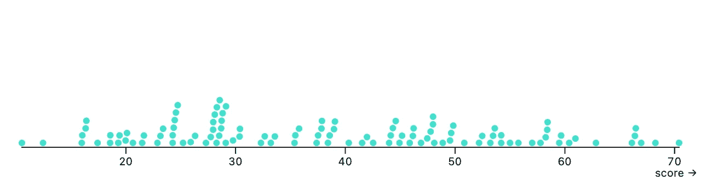
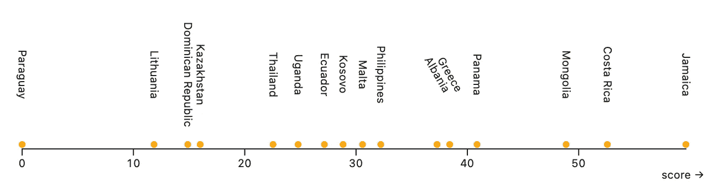
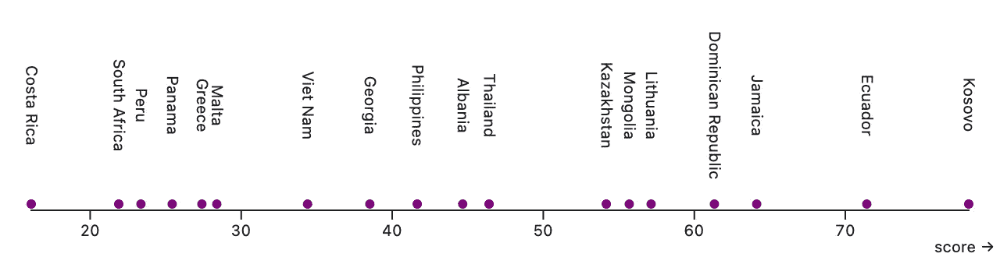
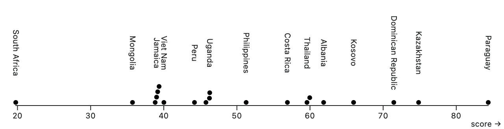
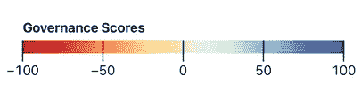
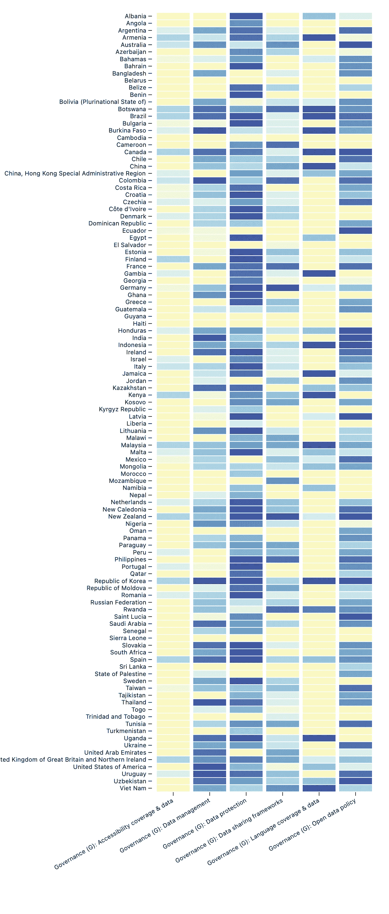
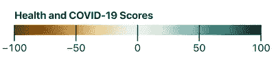
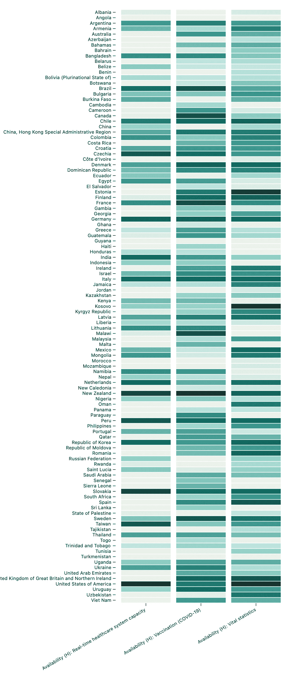

# 全球数据晴雨表：目前全球开放数据的状态如何？

> 原文：[`towardsdatascience.com/global-data-barometer-whats-the-current-state-of-open-data-in-the-world-2841e80503c2?source=collection_archive---------9-----------------------#2023-07-26`](https://towardsdatascience.com/global-data-barometer-whats-the-current-state-of-open-data-in-the-world-2841e80503c2?source=collection_archive---------9-----------------------#2023-07-26)

## 各国在多大程度上采用了为公共利益服务的数据政策和系统？

 [Dea Bardhoshi](https://deabardhoshi.medium.com/?source=post_page-----2841e80503c2--------------------------------)

·

[关注](https://medium.com/m/signin?actionUrl=https%3A%2F%2Fmedium.com%2F_%2Fsubscribe%2Fuser%2Fd61c58ba988e&operation=register&redirect=https%3A%2F%2Ftowardsdatascience.com%2Fglobal-data-barometer-whats-the-current-state-of-open-data-in-the-world-2841e80503c2&user=Dea+Bardhoshi&userId=d61c58ba988e&source=post_page-d61c58ba988e----2841e80503c2---------------------post_header-----------) 发表在[Towards Data Science](https://towardsdatascience.com/?source=post_page-----2841e80503c2--------------------------------) ·8 min read·2023 年 7 月 26 日

--

图片由[Stephen Picilaidis](https://unsplash.com/@stephen16?utm_source=medium&utm_medium=referral)提供，来源于[Unsplash](https://unsplash.com/?utm_source=medium&utm_medium=referral)

我最近读了一本关于全球城市开放数据政策采用的书。它叫做[超越透明](https://beyondtransparency.org)（在此链接公开提供），包含了展示早期 2010 年代开放数据政策成功与障碍的案例研究。正如书名所暗示的那样，提供可访问和免费的数据集是迈向更透明政府的一步，但不仅仅如此。这本书讨论了这些数据如何推动创新、提高政府效率，并鼓励新的公民习惯，例如更多的市民参与。数据专业人士，包括工程师和数据科学家，也围绕这些新数据集形成了自己的解决方案，建立了更好的模型和应用程序。要了解这些新的公民技术生态系统的一些示例，可以查看[构建更智能的芝加哥](https://beyondtransparency.org/chapters/part-1/building-a-smarter-chicago/)章节以及来自 Data SF 或芝加哥数据门户网站的分析工作！另一个个人喜欢的章节是[数据驱动的城市](https://beyondtransparency.org/chapters/part-4/beyond-open-data-the-data-driven-city/)，讲述了如何通过收集 311 电话来帮助纽约市建模紧急服务和资源分配。

自 2010 年代以来，数百个国家已经通过了自己的开放数据法律。[全球数据晴雨表](https://globaldatabarometer.org)（[许可证：知识共享署名 4.0](https://globaldatabarometer.org/open-data/)）衡量了 109 个国家的开放数据状态，回答“**各国在多大程度上管理公共利益数据？**” 这项研究使用了定量指标和定性描述的结合，以提供世界在开放数据方面的清晰图景。这是一项极为详尽的工作，所以我认为花一些时间通过这个故事来探索它的一部分是很有趣的。

**快速说明**：对于这个故事，我使用了 Observable notebooks（基于 JS）来进行可视化，并使用 Jupyter 进行数据处理；两个链接在文末。

让我们开始吧！

## 指数概览：各国的排名如何？

总体国家指数范围从 0（不存在）到 100（展示最佳实践）。

开放数据总体指数（作者提供的图片）

上图显示了相当大的差异。得分最高的国家（70 分）是美国，而得分最低的（10 分）是土库曼斯坦，而平均分数为 38.51。该指数通过检查每个国家在 4 个方面或“支柱”上的开放数据实践来生成：治理、能力、可用性以及使用和影响。对于每个支柱，国家提供了关于特定元素（例如数据保护框架）的**存在**、**元素**（质量相关特征和开放数据特征）以及**程度**（特定框架在一个国家的局限性和适用性）的信息。研究还跟踪每个支柱的次级指标，每个指标的得分满分为 100。因此，总体指数得分为 100 将代表所有这些主要和次级指标的“规范理想”。

## 得分相似的国家在指标上仍有巨大的差异

让我们关注那些指数接近平均值（35 至 45）的国家。其中有 20 个，包括阿尔巴尼亚和科索沃，以及来自世界各地的国家：牙买加、哈萨克斯坦、巴拉圭、菲律宾、秘鲁、泰国和南非等。

尽管整体指数相似，但当查看它们在各模块中的平均分数时，它们的表现并不那么一致。气象仪除了柱状评分外，还汇总了主题或模块评分，这 7 个模块涵盖了以下领域的开放数据实践：健康与 COVID-19、土地、公共财政、采购、气候行动、政治诚信和公司信息。以下是这 20 个国家在**气候行动**、**政治诚信**和**采购**模块的情况：

气候行动（图片由作者提供）

政治诚信（图片由作者提供）

采购（图片由作者提供）

许多国家存在不一致：

+   牙买加在气候行动方面得分最高，但在采购方面仅得到了较低的分数。深入查看气候指标发现，牙买加通过其统计机构提供环境数据，包括“降雨量、阳光、污染事件、温室气体、受保护森林面积、海平面”等指标，并且“没有数据缺口的证据”。然而，在采购方面，规划阶段没有公开信息，数据质量较低：没有包含中标公司的名称/标识符或“合同支出”信息。

+   在阿尔巴尼亚，详细的采购信息可以在线获取（[链接在这里](http://www.app.gov.al/regjistri-i-realizimeve/)），但合同实施情况没有涵盖，数据仅部分为机器可读。政治融资数据也可用，但不包含政党和候选人的收入数据或历史跟踪信息。

在所有这些模块上取得进展将导致政府更加透明和高效。例如，拥有更好的采购数据可以让公民分析资金在项目各阶段的支出情况或推动更公平的分配。同样，透明的游说数据和资产申报可以促进政治诚信的问责。气候信息使公众能够了解生物多样性、排放或脆弱性等方面的情况。

## 治理框架存在但大多是碎片化的

**治理**是数据集的主要支柱之一。它回答的问题涉及评估指导数据保护和管理的政策和框架的状态。治理研究跟踪了几个指标：其中一个是“开放数据政策”，还有“数据保护”、“数据共享框架”、“数据管理”等。以下是各国在这些**治理指标**上的得分情况：

109 个国家的治理指标（作者提供的图片）

很多国家在数据保护、开放数据政策或数据管理等指标上表现中等。约 92%的调查政策具有共同的开放数据定义，72%的国家设有某种数据管理框架，90%的国家提供数据保护法规（报告 [这里](https://globaldatabarometer.org/wp-content/uploads/2022/05/GDB-Report-English.pdf)）。许多国家在数据同意、申诉权利、访问或更正等问题上提供了部分或完全的法规。

虽然存在数据治理框架的形式，但全球开放数据显示，各国仍然面临严重限制。例如，只有 24%的框架涉及位置数据问题，只有 31%涉及算法决策（报告中也有 [相关信息](https://globaldatabarometer.org/wp-content/uploads/2022/05/GDB-Report-English.pdf)）。这些国家大多数位于欧洲和北美：这两个地区共有 17 个国家回答“是”的问题为“框架是否明确涵盖了位置相关数据的保护”，以及 31 个国家中有 20 个回答“框架是否涉及算法决策”。

最后两个指标，可访问性和语言覆盖率，评估确保数据对残疾人士可访问以及在每个国家的官方语言中可用的法规。后一项对有多种语言的国家尤为重要，但仍然是碎片化的：109 个国家中有 13 个在这一类别中得分 100（拥有法律效力的框架）。

## 处理 COVID-19 响应是一项挑战，但也是数据治理的一个机会

COVID-19 疫情测试了许多数据系统，特别是地方级别的系统。研究不仅衡量了疫苗接种数据的可用性，还包括实时医疗数据（如 ICU 床位）和重要统计数据。重要统计数据包括出生和死亡信息、历史跨度以及这些数据在国内的本地可用情况。这里是一个展示各国表现的热图：

健康与 COVID-19 模块得分（图片作者提供）

在数据集中大多数国家的疫苗接种数据都可以获取，但也存在一些问题。只有大约 50%的可用数据集按年龄分解，约 33%按性别分解（[报告统计](https://globaldatabarometer.org/wp-content/uploads/2022/05/GDB-Report-English.pdf)）。此外，实时医疗数据仅在约 50%的国家中可用，而且提供可用床位信息的国家更少。在一些国家，这类数据只有在疫情期间首次提供，这使得各国可以开始在未来更好地构建医疗报告。

用户探索数据的难易程度如何？深入分析显示，在 109 个国家中，有 61 个国家没有提供允许公民访问重要统计数据的官方开放工具。同样，109 个国家中有 63 个没有提供官方且可获取的 COVID-19 疫苗接种数据。57 个国家还未提供机器可读的数据（如 CSV 格式），而这对于数据的方便分发和再现至关重要。

## 未来开放数据的前景是什么？（及资源）

报告的一个主要结论是全球层面开放数据环境相对缺乏（回顾整体平均指数：38/100）。正如我们在这个故事中所看到的，拥有完善的开放数据法律是至关重要的。除了全球数据晴雨表正在进行的研究，还有其他库追踪全球开放数据问题的新立法。由 The Gov Lab 提供的[开放数据现状](https://repository.opendatapolicylab.org)就是其中之一。所以，查看一下按部门或合作类型划分的法律吧！

总体而言，《全球数据晴雨表》报告揭示了在采纳这些法律时面临的实际挑战，包括数据空白或数据不可获取的问题。我们研究的一个显著例子是健康数据的发布和管理，特别是在紧急情况下，如 COVID-19，及时信息至关重要。然而，这个例子也展示了新的挑战如何推动数据促进透明度，并让公民保持知情，这非常有前景！总体而言，报告指出了每个国家需要关注的非常具体的领域，提供了具有背景的策略以改善数据收集，同时仍提供了关于开放数据当前挑战的宏观视角。

这里是笔记本（[Jupyter](https://github.com/DeaBardhoshi/Data-Science-Projects/blob/main/Open%20Data%20Explorations.ipynb) 和 [Observable](https://observablehq.com/d/dd1708e2804b56cf)）。

感谢阅读！
