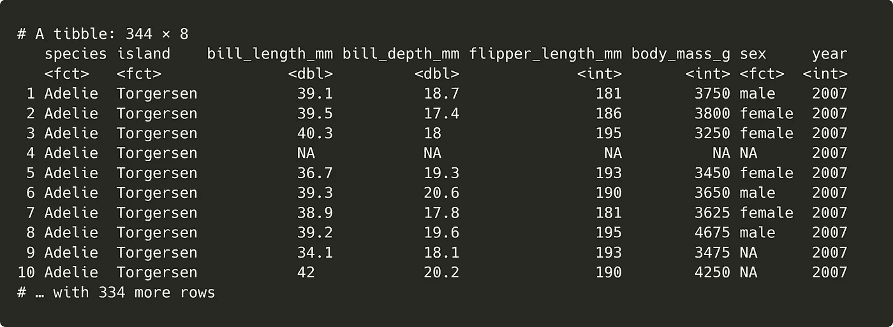
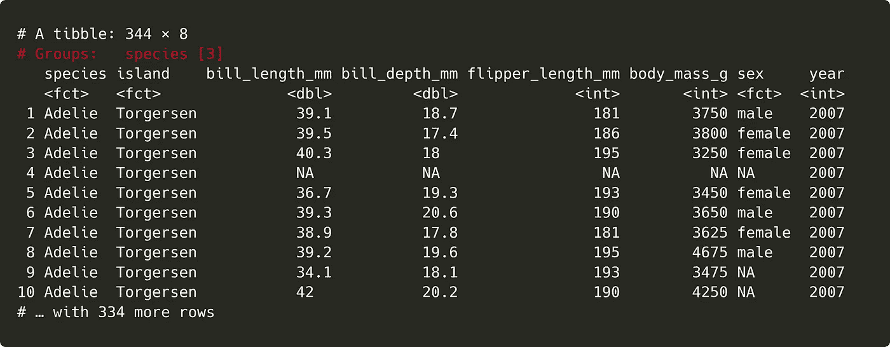
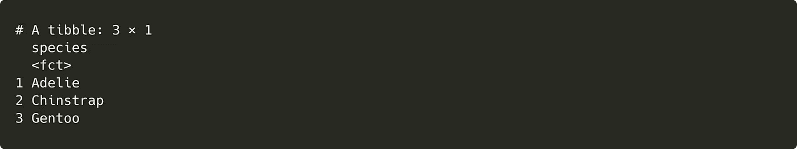
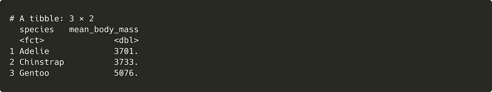
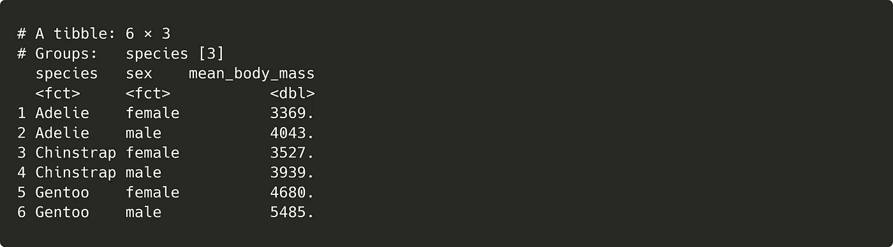
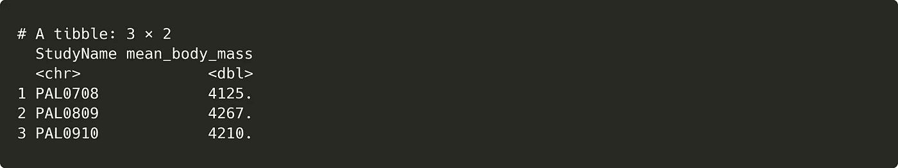
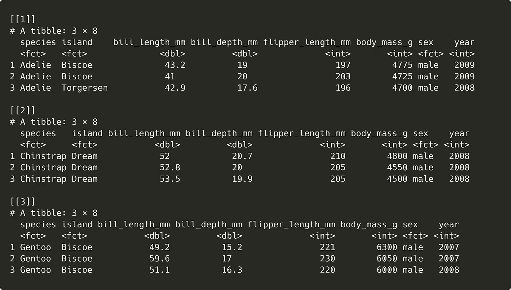

# 如何在 R 中分组数据：超越“group_by”

> 原文：[`towardsdatascience.com/going-beyond-group-by-how-to-group-data-in-r-af30f19c1ff2`](https://towardsdatascience.com/going-beyond-group-by-how-to-group-data-in-r-af30f19c1ff2)

## 从初学者到高级用户，掌握这些分组工作流程

[](https://roryspanton.medium.com/?source=post_page-----af30f19c1ff2--------------------------------)[](https://towardsdatascience.com/?source=post_page-----af30f19c1ff2--------------------------------) [Rory Spanton](https://roryspanton.medium.com/?source=post_page-----af30f19c1ff2--------------------------------)

·发表于 [Towards Data Science](https://towardsdatascience.com/?source=post_page-----af30f19c1ff2--------------------------------) ·8 分钟阅读·2023 年 2 月 15 日

--


[Camille San Vicente](https://unsplash.com/@camillesanvicente?utm_source=medium&utm_medium=referral)拍摄的照片，来源于 [Unsplash](https://unsplash.com/?utm_source=medium&utm_medium=referral)

数据分组允许你对数据集的子集进行操作，而不是对整个数据集进行操作。处理分组数据是数据分析中的一个关键方面，并且在数据科学中有着几乎无限的应用。

在 R 中创建和操作分组有很多方法。在本文中，我将解释 dplyr 包中的分组工作流程，从基础到更高级的功能。

到最后，你应该掌握从分组数据中提取有价值见解所需的所有工具。本文中的所有代码也可以在 [GitHub](https://github.com/roryspanton/medium-code/blob/master/grouping/grouping.R) 上找到。

# dplyr 中的基本分组

在 dplyr 中分组数据时，你主要会使用`group_by`函数。你可以用它来指定一个或多个变量以进行数据分组。以下是一个使用 palmerpenguins 包中的 penguins 数据集的示例。你可以通过运行`install.packages("palmerpenguins")`来安装这个包。加载包后，通过`library(palmerpenguins)`，你将能够按名称访问`penguins`数据集，如下所示。

```py
library(tidyverse)
library(palmerpenguins)

# The Palmer Penguins dataset
penguins
```



对数据集进行快速查看，可以帮助我们识别适合分组的分类变量。在这里，我们可以按物种分组，这是一个有三个水平的因素。在控制台查看分组数据时，我们可以看到列名上方清晰地打印出分组结构。我已用红色标出。

```py
# Grouping by species
penguins_species <- penguins %>%
  group_by(species)

penguins_species
```



我们还可以通过`group_keys`函数访问数据中的分组变量的名称和级别。在对分组数据使用此函数时，它会返回一个 tibble，其中每个分组变量作为一列，每个组级别作为一行。

```py
# Getting the grouping structure with group_keys
group_keys(penguins_species) 
```



现在数据已分组，我们可以对其应用其他函数。分组数据的一个常见用途是使用`summarise`函数计算总结统计量。在下面的示例中，`summarise`返回每种企鹅的平均体重。这为我们提供了一个简洁的总结表格，几乎不需要额外的努力。

```py
# Getting the mean body mass for each group
penguins_species %>%
  summarise(mean_body_mass = mean(body_mass_g, na.rm = TRUE))
```



你还可以对分组数据使用其他 dplyr 函数，如`mutate`、`filter`、`select`等。虽然深入探讨所有这些函数可能需要整篇文章，但 dplyr [分组数据说明文档](https://dplyr.tidyverse.org/articles/grouping.html)是了解这些函数如何处理分组数据的有用指南。

## 按多个变量进行分组

按多个变量对数据进行分组的过程很简单；只需在`group_by`中添加另一个变量名称。例如，可以按物种和性别对`penguins`数据进行分组。

```py
# Grouping by more than one variable
penguins %>%
  filter(!is.na(sex)) %>%
  group_by(species, sex) %>%
  summarise(mean_body_mass = mean(body_mass_g, na.rm = TRUE))
```



首先，我们过滤掉性别列中的 NA 值，然后按物种和性别进行分组。对这个新分组的数据使用相同的总结函数，会给出每个分组变量的两个级别组合的平均体重测量值。

# 在 group_by 中创建变量

从`group_by`的基本用法开始，我们可以进入更高级的分组工作流程。

一个有用但被低估的 dplyr 功能是你可以在`group_by`中创建新的分组变量。

假设我们想要获取所有未在`penguins`数据中编码的因子的企鹅的总结统计量。例如，`penguins`数据集由三个研究的观察结果组成，但清理后的数据中不包含研究标识符。我们如何计算每个研究中企鹅的平均体重？

一个明显的解决方案是为数据中的每一行创建一个带有研究标识符的新变量，按该变量分组，然后总结。

```py
penguins %>%
  mutate(StudyName = penguins_raw$studyName) %>%
  group_by(StudyName) %>%
  summarise(mean_body_mass = mean(body_mass_g, na.rm = TRUE))
```



然而，你可以通过使用以下语法在`group_by`中创建分组变量，将前两步合并为一步：

```py
penguins %>%
  group_by(StudyName = penguins_raw$studyName) %>%
  summarise(mean_body_mass = mean(body_mass_g, na.rm = TRUE))
```

这给出的结果与长格式版本完全相同，同时节省了宝贵的空间。这使得它成为在分析中缩短长管道序列的一个绝妙技巧。

# 使用 group_split 按组拆分数据

你可能会遇到需要将组拆分为单独 tibble 的情况。例如，你可以将企鹅数据中的每种物种写成一个单独的数据文件。为此，你需要`group_split`。

顾名思义，`group_split`将数据拆分成单独的 tibbles；每个分组变量 species 的每个级别对应一个。它将这些 tibbles 作为列表返回，我们可以将其传递到一个单独的函数中，逐个写入每个文件。

```py
# Split up penguins data by species
species_list <- penguins %>%
  group_split(species)

# Get the names of each species
species_names <- group_keys(penguins_species) %>%
  pull(species)

# Write the separate datasets to csv, giving unique names
map2(species_list, species_names, ~ write_csv(.x, paste0(.y, ".csv")))
```

为了在这里写出文件名，我们进一步利用`group_keys`函数获取分组变量的每个级别的名称。使用`pull`然后将这些名称转换成一个向量，我们可以将其传递到`write_csv`函数中。

然后，我们对`species_list`中的每个数据集应用`write_csv`函数，为每个 csv 文件指定一个来自`species_names`的合适文件名。`map2`函数使我们能够对每个数据集重复此操作。

像这样使用`group_split`可以节省大量的手动过滤和编写工作。否则可能是一个繁琐的任务（特别是在数据集中有更多组的情况下），通过最小的努力也能完成。

# 使用`with_groups`暂时分组

有时，当为一个目的分组数据时，我们随后希望丢弃分组结构以继续进行进一步的分析。标准的做法是使用`ungroup`函数。在下面的例子中，我们按体重筛选每种物种中最大的三只企鹅。在这个操作后取消分组结构去掉了分组结构。

```py
heavy_penguins <- penguins %>%
  group_by(species) %>%
  slice_max(body_mass_g, n = 3, with_ties = F) %>%
  ungroup()

group_keys(heavy_penguins)
# A tibble: 1 × 0
```

然而，通过一个变量进行分组、操作数据，然后再取消分组可能会给你的代码添加不必要的步骤。幸运的是，有一种更简短的方法可以使用`with_groups`函数暂时执行分组操作。

首先，你在`.groups`参数中指定一个分组变量。然后，你指定一个你想对每个组应用的函数，使用 tidyverse 特定的语法。例如，在这个例子中，我使用波浪号（~）符号表示我想应用的函数。然后，我继续编写我的函数，使用“.”符号作为数据的占位符。

这种语法对于那些学习了 tidyverse 的 purrr 包中的 map 函数的人来说是熟悉的。这些函数允许你重复其他函数，以列表或向量的每个元素作为输入。它们非常值得学习，并有助于理解 tidyverse 包中的高级功能。

## 如何在 R 中使用 Map 函数进行数据科学

### 从 tidyverse 中学习强大的函数式编程工具

towardsdatascience.com

运行`with_groups`给我们提供了与较长的“`group_by`, `slice`, `ungroup`”工作流程相同的输出。检查输出，我们可以看到`with_groups`在应用我们的函数后删除了数据中的分组结构，就像之前的例子一样，使得在完整数据集上进行进一步分析成为可能。

```py
heavy_penguins_temp <- penguins %>%
  with_groups(.groups = species, ~ slice_max(., body_mass_g, n = 3, with_ties = F))

group_keys(heavy_penguins_temp)
# A tibble: 1 × 0
```

## 附加：使用 group_map 应用分组函数

虽然 `with_groups` 与 `map` 函数有些语法上的相似，但也有一个专门为分组数据设计的 `map` 特例；即 `group_map`。我们可以通过使用它重复前面的 `slice_max` 函数来检查它的行为。

`group_map` 适用于已经分组的数据。它将每个分组操作的结果作为列表中的单独 tibbles 返回，类似于 `group_split` 的结果。你也可能注意到输出中没有物种列。这是因为 `group_map` 默认会从输出中删除分组变量。然而，也可以通过添加参数 `.keep = TRUE` 来保留它们。

```py
penguins %>%
  group_by(species) %>%
  group_map(~ slice_max(., body_mass_g, n = 3, with_ties = F))
```



在我自己的代码中，我不常使用 `group_map`，通常选择更常规的 `map` 函数或更简单的分组工作流程。不过，在你以分组数据开始并希望得到转换后、分开的数据集的情况下，它是一个简洁的快捷方式。

# 总结：何时使用每个 dplyr 分组函数

总结：dplyr 中的分组函数是从数据中提取大量价值的一种好方法，几乎不费力。回顾一下它们的用途：

+   `group_by` 向数据集添加一个或多个分组。你可以在 `group_by` 内创建分组变量，

+   `group_keys` 返回 tibble 的分组结构

+   `ungroup` 从数据中移除分组

+   `group_split` 将数据集按组拆分为不同的 tibbles

+   `with_groups` 临时将数据分组以执行单一操作

+   `group_map` 将函数应用于分组数据，并将每个组的结果作为列表返回

即使你只使用 `group_by`，也可以进行各种汇总统计、组内过滤等操作。许多 R 用户单独使用这个函数也能很好地完成工作。

也就是说，进一步探索我们已经探讨的其他分组工作流程，会给你更多选项。如果你在下次分组数据时使用它们，你将节省更多空间并减少分析步骤。

想要阅读我关于编程、数据科学等的所有文章吗？在[这个链接](https://medium.com/@roryspanton/membership)注册成为 Medium 会员，即可全面访问我所有的文章以及 Medium 上的其他故事。这也直接帮助我，因为我会从你的会员费用中获得一小部分贡献，对你没有额外费用。

你还可以通过[这里订阅](https://roryspanton.medium.com/subscribe)，每次我发布新文章时，直接将所有新文章送到你的收件箱。感谢阅读！
