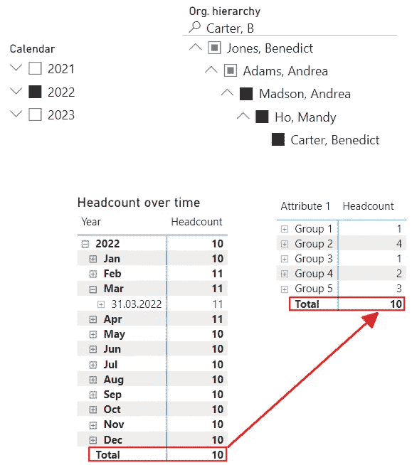

# 使用 DAX 中的库存度量迈出下一步

> 原文：[`towardsdatascience.com/going-the-next-step-with-stock-measures-in-dax-cb49d4e21c13`](https://towardsdatascience.com/going-the-next-step-with-stock-measures-in-dax-cb49d4e21c13)

## *使用库存度量时，我们可能会遇到一些奇怪的效果。让我们看看这种情况是如何出现的以及如何解决它。*

[](https://medium.com/@salvatorecagliari?source=post_page-----cb49d4e21c13--------------------------------)[](https://towardsdatascience.com/?source=post_page-----cb49d4e21c13--------------------------------) [Salvatore Cagliari](https://medium.com/@salvatorecagliari?source=post_page-----cb49d4e21c13--------------------------------)

·发表于[Towards Data Science](https://towardsdatascience.com/?source=post_page-----cb49d4e21c13--------------------------------) ·7 min read·2023 年 11 月 28 日

--


照片由[Firmbee.com](https://unsplash.com/@firmbee?utm_source=medium&utm_medium=referral)提供，来源于[Unsplash](https://unsplash.com/?utm_source=medium&utm_medium=referral)

# 介绍

当数据不能在时间上进行汇总时，通常使用库存计算。

例如，随着时间的推移将我的银行账户余额累加起来会是个坏主意。对我来说可能是个好主意，但对我的银行来说不是。

目前，我正在为一个客户项目创建一个人力资源数据的报告解决方案。

一个关键指标是人员数量，它也是一个库存度量，因为我们已经在事实表中按月份存储了人员数量。

这看起来是一个简单的任务。

但有时我们必须多走一步才能得到正确的结果。

现在，让我们深入了解一下。

# 基础库存度量

首先，库存度量的正确名称是半加性度量。这是因为，如上所述，它们不会在时间上汇总数据，而是在所有其他维度上汇总。

计算人员数量的基础半加性度量是简单的：

```py
Headcount =
VAR LastDataDay = LASTNONBLANK('Date'[Date]
                              ,[Headcount (Base)])

RETURN
CALCULATE([Headcount (Base)]
          ,LastDataDay
          )
```

度量[Headcount (Base)]包含简单的聚合（SUM）来获取所需结果。

我总是使用基础度量，以便可以包含附加逻辑，这些逻辑可以在后续度量中重复使用。

一个例子是，当用户希望查看以千或百万为单位的数据时，使用缩放因子，而不需要 Power BI 中的自动显示单位，这会添加奇怪的缩放因子，如千的 T 或百万的 M。

然后，我使用[LASTNONBLANK()](https://dax.guide/lastnonblank/)函数获取人员数量（基础）度量的最后一个结果日期。该函数的结果随后作为筛选器应用于 CALCULATE()调用中，以获得最终结果。

你可以在 [DAX Patterns](https://www.daxpatterns.com/) 上找到对此解决方案的详尽解释。文章链接在下面的参考文献部分。

在那里，你可以找到我写的另一篇文章的链接，当时我遇到了其他半累加度量的场景。

这是我们虚构组织层级中一名经理的员工人数结果：


图 1 — 我们的基础度量的结果（作者绘制）

如你所见，员工人数在一月与二月以及四月与五月之间发生了变化。

尽管如此，总计仍然显示最后已知的员工人数，即十。

到目前为止，一切正常。

# 奇怪的结果

在我的情况下，每个员工都被分配到一个组。

当我使用相同的度量来查看员工在这些组之间的分布时，我得到了这个结果：



图 2 — 按组分割的员工人数（作者绘制）

初看起来似乎没问题。

但当我将每一行的值相加时，得到的是十一。

为什么会这样？

当你考虑每行的筛选上下文时，你会找到答案。

继续之前，先考虑一下。

.

.

.

.

原因是我们查看的是整年度的数据。

看一下下面的图示，它展示了员工人数按组随时间的发展：


图 3 — 按组的全年员工人数视图（作者绘制）

当我们查看每个月时，我们可以看到，四月底时“组 1”中的一名员工离开了公司。因此，他会在离开前算作一个员工人数。

但我们在二月份有了一名新员工加入“组 4”。

到年底时，团队仍有十名成员。这是仅查看年底员工人数时的视图。

基础度量总计为十，因为该度量在按组时没有知识（未应用筛选）。

但在按组计算结果时，"组 1"的最后已知结果是四月份的结果。这个结果在查看整个年度时会显示在按组结果中。

我可以通过稍微更改度量来证明这一点：


图 4 — 修改度量的检查结果（作者绘制）

正如你在第一行所看到的，来自员工人数（基础）度量的最后一个有结果的日期是 2022 年 4 月 30 日。

这是查看“组 1”时，来自员工人数（基础）度量的最后一个有结果的日期。

因此，“组 1”的一名成员被列入结果中。

和许多其他情况一样，这涉及到定义的问题：

+   当我们查看整个年度时，我们会发现，在年度的某个时刻，我们有一名员工在“组 1”中。

+   当我们仅查看年底的最后一天时，不应该得到“组 1”的结果。

如果第一种定义是正确的，我们应该隐藏总计行，因为它会混淆用户。

如果第二种定义是正确的，我们应该将度量更改为仅显示年底的员工人数。

# 迈出下一步

为了实现第二个定义，我定义了一个新的 Measure，逻辑如下：

1.  当前 Filter 上下文中的最后一个日期是什么？

1.  Fact 表中最后一个包含数据的日期是什么？

1.  如果当前 Filter 上下文中的最后一个日期不包含数据（Point 2 < Point 1），则显示 Fact Table 中的最后已知数据。

1.  如果当前 Filter 上下文中的最后一个日期包含数据（Point 2 >= Point 1），则显示当前 Filter 上下文中最后一个日期的结果。

这是我想出的 Measure：

```py
Headcount (By End of Period) =
VAR LastActiveDate = LASTDATE('Date'[Date])

VAR LastDateKeyWithData = CALCULATE(MAX('FactOrg'[DateKey])
                                  ,REMOVEFILTERS('FactOrg')
                                  )

VAR LastDateWithData = LOOKUPVALUE('Date'[Date]
                                  ,'Date'[DateKey]
                                  ,LastDateKeyWithData
                                  )

RETURN
  IF (LastDateWithData < LastActiveDate
    ,CALCULATE([Headcount (Base)]
              ,REMOVEFILTERS('Date')
              ,'Date'[DateKey] = LastDateKeyWithData)
    ,CALCULATE([Headcount (Base)]
              ,LastActiveDate
              )
  )
```

我必须在 Measure 中添加检查，以避免在查看没有 31 月 12 日数据的年份时得到空结果。

这个 Measure 返回以下结果：


图 5 — 新 Measure 的结果（图示作者提供）

如预期的那样，查看整年时，Group 1 没有员工数。

但在查看每个月时，它返回正确的结果：


图 6 — 按月显示的新 Measure 结果（图示作者提供）

这个 Measure 适用于任何周期，如季度、学期或周。

# 警告

这个 Measure 只有在我们知道数据映射到每个周期的最后一天时才有效。

如果数据映射到其他日期，这个 Measure 将返回错误的结果。

同样适用于混合数据的情况，其中一些数据点映射到每个周期的最后一个日期，而其他数据点则没有。

我在下面链接的关于 Semi-Additive Measures 的文章中解释了这种情况。

所以，这完全取决于所需结果的定义和哪个解决方案是正确的。

# 结论

知道结果的定义对避免结果不合逻辑并且用户可能将结果解释为错误的情况至关重要。

这是最糟糕的情况，因为它可能会严重影响产品的接受度。

我们在测试过程中注意到这个“问题”，并决定使用上述提到的解决方案。

但我们将进一步讨论这个解决方案是否真的是正确的。

通常，没人会想到这些情况，直到我们遇到它们。所以，下次你在构建带有 Semi-Additive Measures 的报告时遇到这些情况时，不要担心。但记得也要测试这些情况。

这又是一个例子，说明理解 Filter 上下文如何应用的所有含义是至关重要的。

这种理解在尝试理解 DAX Measure 的结果时至关重要。

然而，将这种结果解释给不理解这种技术概念的利益相关者是具有挑战性的。

通常，他们希望在所有情况下都能得到：按行的正确结果和总计中的正确结果。

在这种情况下，我必须进一步解决这些需求。但每次在 Measure 中添加更多复杂逻辑时，我总是感到矛盾。

我不愿意，因为这样做很复杂，别人很难理解我为什么要这么做。这增加了对解决方案的维护工作。有时，我甚至经历了客户删除复杂逻辑的情况，因为没人能理解它。

我试图说服我的利益相关者达成妥协，以便在没有复杂和非常自定义的逻辑的情况下获得最佳的可接受结果。


照片由[John Barkiple](https://unsplash.com/@barkiple?utm_source=medium&utm_medium=referral)拍摄，发布于[Unsplash](https://unsplash.com/?utm_source=medium&utm_medium=referral)

# 参考资料

数据是用虚构的名字自生成的。

我通过将一个名字和姓氏的列表互相乘积生成了这个完整的列表。

我通过将员工列表与我日期表中每个月最后日期的列表（CROSS JOIN）相乘生成了事实表。

DAX-Patterns 上的半加法计算：

[半加法计算](https://www.daxpatterns.com/semi-additive-calculations/?source=post_page-----cb49d4e21c13--------------------------------)

### 计算报告在时间段开始或结束时的值对任何 BI 开发人员来说都是一个挑战……

[DAX Patterns 上的半加法计算](https://www.daxpatterns.com/semi-additive-calculations/?source=post_page-----cb49d4e21c13--------------------------------)

我的第一篇文章关于解决半加法度量中的特定挑战：

DAX 中的半加法度量的优化

### 在之前的文章中，我解释了有关半加法度量的一些细节。这里有一些关于这个话题的更多提示

每当 Salvatore Cagliari 发布文章时，都会收到一封邮件。通过注册，你将创建一个 Medium 账户，如果你还没有的话……

### 每当 Salvatore Cagliari 发布文章时，都会收到一封邮件。通过注册，你将创建一个 Medium 账户，如果你还没有的话……

[Medium 上的订阅](https://medium.com/@salvatorecagliari/subscribe?source=post_page-----cb49d4e21c13--------------------------------)
