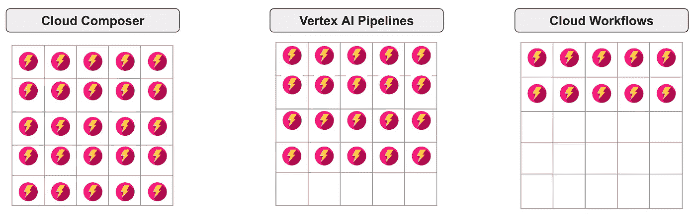

# Google Cloud 中替代 Cloud Composer 的选择

> 原文：[`towardsdatascience.com/google-cloud-alternatives-to-cloud-composer-972836388a3f?source=collection_archive---------7-----------------------#2023-04-13`](https://towardsdatascience.com/google-cloud-alternatives-to-cloud-composer-972836388a3f?source=collection_archive---------7-----------------------#2023-04-13)

## 意见

## 不要用大炮打小蚊子

 [Marc Djohossou](https://marcgeremie.medium.com/?source=post_page-----972836388a3f--------------------------------)

·

[关注](https://medium.com/m/signin?actionUrl=https%3A%2F%2Fmedium.com%2F_%2Fsubscribe%2Fuser%2Fd99fd7fe99ef&operation=register&redirect=https%3A%2F%2Ftowardsdatascience.com%2Fgoogle-cloud-alternatives-to-cloud-composer-972836388a3f&user=Marc+Djohossou&userId=d99fd7fe99ef&source=post_page-d99fd7fe99ef----972836388a3f---------------------post_header-----------) 发表在 [Towards Data Science](https://towardsdatascience.com/?source=post_page-----972836388a3f--------------------------------) ·4 min read·Apr 13, 2023

--

作者提供的图片，Fire Logo Designed By Freepik¹

你知道吗？作为 Google Cloud 用户，有许多服务可供选择来编排你的作业。长期以来，批处理作业的自然选择一直是 Cloud Composer。然而，这种情况不一定会继续下去。本文介绍了 Google Cloud 中用于作业编排的两个 Cloud Composer 替代方案。

本文的主要内容如下：

> 云调度器 Cloud Composer 的优势应用场景
> 
> Cloud Composer 的两个替代方案
> 
> 优势与劣势对比
> 
> 总结

## 云调度器 Cloud Composer 的优势应用场景

作业调度器需要满足一些要求才能称为作业调度器。个人而言，我期望在一个作业调度器中至少看到以下三点：

+   首先，调度器必须能够协调任何具有依赖关系的任务组，无论这些任务执行什么作业。

+   其次，调度器必须支持任务之间的数据共享。

+   第三，调度器必须允许定期执行作业和按需执行作业。
