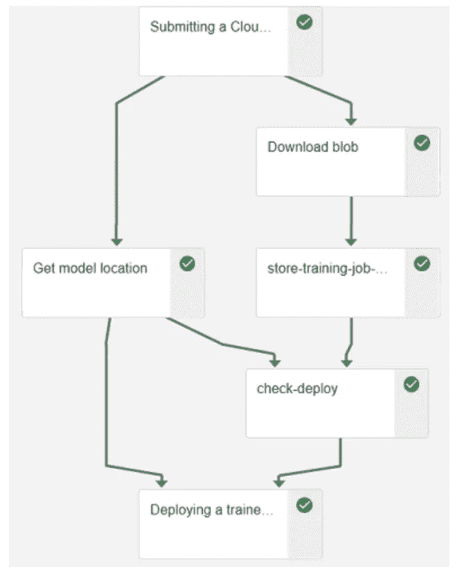
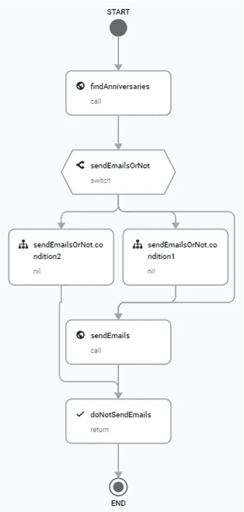
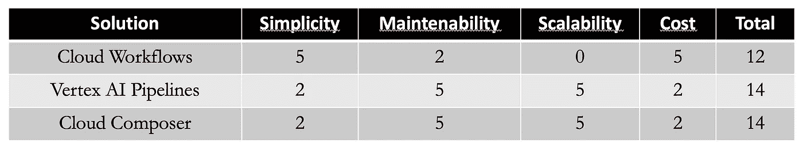

# Google Cloud 的 Cloud Composer 替代品

> 原文：[`towardsdatascience.com/google-cloud-alternatives-to-cloud-composer-972836388a3f`](https://towardsdatascience.com/google-cloud-alternatives-to-cloud-composer-972836388a3f)

## 观点

## 不要用锤子打苍蝇

 [Marc Djohossou](https://marcgeremie.medium.com/?source=post_page-----972836388a3f--------------------------------)

·发表于 [Towards Data Science](https://towardsdatascience.com/?source=post_page-----972836388a3f--------------------------------) ·4 分钟阅读·2023 年 4 月 13 日

--

作者提供的图片，火焰标志设计由 Freepik¹

你知道吗，作为 Google Cloud 的用户，你可以选择许多服务来编排你的作业？对于批处理作业，Cloud Composer 长时间以来一直是自然的选择。然而，这种情况不必持续下去。本文介绍了 Google Cloud 中两个替代 Cloud Composer 的作业编排工具。

本内容的主要主题如下：

> Cloud Composer 表现出色的用例
> 
> Cloud Composer 的两个替代品
> 
> 优势与劣势基准
> 
> 总结

## Cloud Composer 表现出色的用例

一个作业编排工具需要满足一些要求才能称之为编排工具。就个人而言，我期望在一个作业编排工具中至少看到 3 点：

+   首先，一个编排工具必须能够编排任何具有任务间依赖关系的任务组，无论这些任务执行什么工作

+   其次，一个编排工具必须支持任务间的数据共享

+   第三，一个编排工具必须允许周期性作业执行和按需作业执行

[Cloud Composer](https://cloud.google.com/composer?hl=en) 满足上述 3 个标准及更多。它是一个功能强大的全面编排工具，基于 [Apache Airflow](https://airflow.apache.org/)，支持像回填、补充、任务重跑和 [动态任务映射](https://airflow.apache.org/docs/apache-airflow/stable/authoring-and-scheduling/dynamic-task-mapping.html) 等良好功能。

> 权力是危险的。权力吸引最坏的人，腐蚀最优秀的人（爱德华·阿比）

权力是危险的。这一说法对 Cloud Composer 同样适用。我总是建议尝试更简单的解决方案（更多内容在接下来的部分），将 Cloud Composer 保留用于复杂的情况。在我看来，以下是使用 Cloud Composer 完全合理的一些情况：

1.  你需要运行一个大规模的作业编排系统，涉及数百或数千个作业

1.  你有任务之间存在复杂和/或动态依赖关系的作业。例如，你的作业的最终结构取决于作业中第一个任务的输出。

1.  你有具有非平凡触发规则和约束的任务。例如，你希望任务在其任何上游任务失败后立即触发。

## Cloud Composer 的两个替代方案

在寻找 Cloud Composer 的作业编排器时，还有更简单的解决方案可以考虑。

**替代方案 1：Vertex AI Pipelines**

Vertex AI Pipeline 中的管道运行示例，图片来源于作者

[Vertex AI Pipelines](https://cloud.google.com/vertex-ai/docs/pipelines?hl=en) 是基于[Kubeflow Pipelines](https://www.kubeflow.org/docs/components/pipelines/)（它基于 Kubernetes）的作业编排器。它是一个无服务器产品，这意味着无需创建虚拟机或集群。尽管该编排器最初用于机器学习（ML）管道，但它足够通用，可以适应任何类型的作业。在我看来，将 Vertex AI Pipelines（更广泛地说，Kubeflow Pipelines）绑定到 ML 上更像是一种陈词滥调，反而影响了该解决方案的受欢迎程度。

**替代方案 2：Cloud Workflows (+ Cloud Scheduler)**

Cloud Workflows 中的工作流运行示例，图片来源于作者

Cloud Workflows 是一种无服务器、轻量级的服务编排器。它有两个主要要求：

1.  需要编排的任务必须是基于 HTTP 的服务（通常使用[Cloud Functions](https://cloud.google.com/functions)或[Cloud Run](https://cloud.google.com/run?hl=en)）

1.  作业的调度外部化到[Cloud Scheduler](https://cloud.google.com/scheduler?hl=en)

人们通常会使用它来编排 API 或微服务，从而避免单体架构。

## 优势与劣势基准

当需要在多个选项中做出选择时，通常将选项根据明确的成功标准进行排名是个好主意。我在这里选择了 4 个标准（0：差 — 2：一般 — 5：好）

1.  **简洁性**：团队学习和使用该解决方案的难易程度如何？

1.  **可维护性**：在工作流创建后，修改工作流的难易程度如何？

1.  **可扩展性**：当工作流数量增加时，解决方案的稳定性如何？

1.  **成本**

> **注意**：请注意，标准以及评估是主观的，仅代表我的观点

解决方案比较，图片来源于作者

由于其陡峭的学习曲线，Cloud Composer 不是最容易上手的解决方案。尽管如此，Cloud Workflows 本身没有任何处理能力，这也是为什么它总是与其他服务如 Cloud Functions 或 Cloud Runs 一起使用的原因。此外，调度必须由 Cloud Scheduler 处理。

就可维护性和可扩展性而言，Cloud Composer 是佼佼者，因为它具有无限的可扩展性，并且系统非常可观察，所有组件都有详细的日志和指标。在这方面，Cloud Composer 紧随其后的是 Vertex AI Pipelines。

就成本而言，Cloud Composer 是最昂贵的，而 Cloud Workflows 在这三者中无疑是最便宜的解决方案。

## 总结

根据你对工作流编排的需求，Google Cloud 中可能有比 Cloud Composer 更合适的解决方案。一方面，Cloud Workflows 便宜得多，并且满足了工作流编排器的所有基本要求。另一方面，Vertex AI Pipelines 更加集成到 Kubernetes 中，对于已经对 Kubernetes 有较好了解的团队来说，可能更容易上手。

感谢您的时间，请继续关注更多内容。

[1] [www.freepik.com](http://www.freepik.com/)
