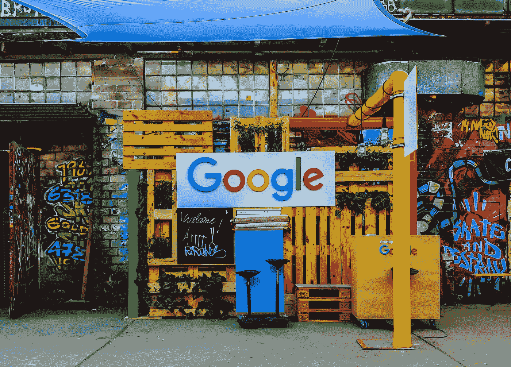

# Google Foobar Challenge: 第 3 级

> 原文：[`towardsdatascience.com/google-foobar-challenge-level-3-f487fa3f204b?source=collection_archive---------6-----------------------#2023-11-30`](https://towardsdatascience.com/google-foobar-challenge-level-3-f487fa3f204b?source=collection_archive---------6-----------------------#2023-11-30)

## 探索二进制数字、动态规划和马尔可夫链

 [Katy Hagerty](https://medium.com/@katyhagerty19?source=post_page-----f487fa3f204b--------------------------------)

·

[关注](https://medium.com/m/signin?actionUrl=https%3A%2F%2Fmedium.com%2F_%2Fsubscribe%2Fuser%2F94ed6e69690&operation=register&redirect=https%3A%2F%2Ftowardsdatascience.com%2Fgoogle-foobar-challenge-level-3-f487fa3f204b&user=Katy+Hagerty&userId=94ed6e69690&source=post_page-94ed6e69690----f487fa3f204b---------------------post_header-----------) 发表在 [Towards Data Science](https://towardsdatascience.com/?source=post_page-----f487fa3f204b--------------------------------) · 9 分钟阅读 · 2023 年 11 月 30 日

--

照片由[Rajeshwar Bachu](https://unsplash.com/@rajeshwerbatchu7?utm_source=medium&utm_medium=referral)提供，来源于[Unsplash](https://unsplash.com/?utm_source=medium&utm_medium=referral)

# 什么是 Foobar Challenge？🧐

Foobar Challenge 是由 Google 主办的编码挑战，可以使用 Python 或 Java 完成。我用 Python 完成了这个挑战。挑战有自己的服务器，包含特定的终端风格命令。问题分为 5 个难度级别。每个问题必须在一定的时间限制内解决。较高难度的级别会给予更多的时间。

要了解更多关于 Foobar Challenge 的信息，我推荐阅读我之前的文章，其中提供了 Level 1 问题的概述和详细解析。

 ## Google Foobar Challenge: Level 1

### 这是对神秘编码挑战的介绍以及问题的详细解析

[towardsdatascience.com

第 3 级是开始变得严肃的阶段。第 1 级和第 2 级测试了基础内容，解决这些问题大约需要 15 分钟。第 3 级测试了问题解决技能，需要数小时的研究。与之前的级别不同，我并不立即知道如何解决这些问题。我不得不多次阅读问题，并在纸上列出测试用例。此外，我还必须进行研究，并且…
