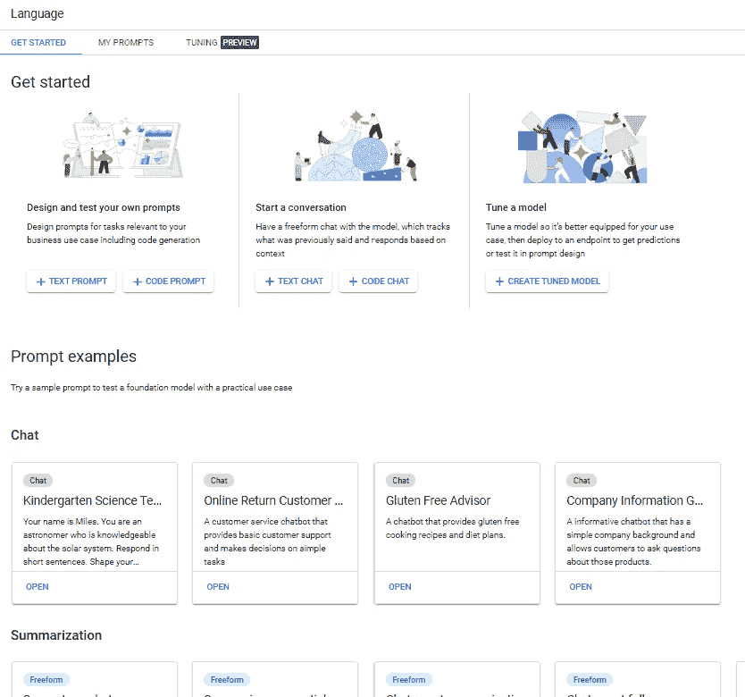
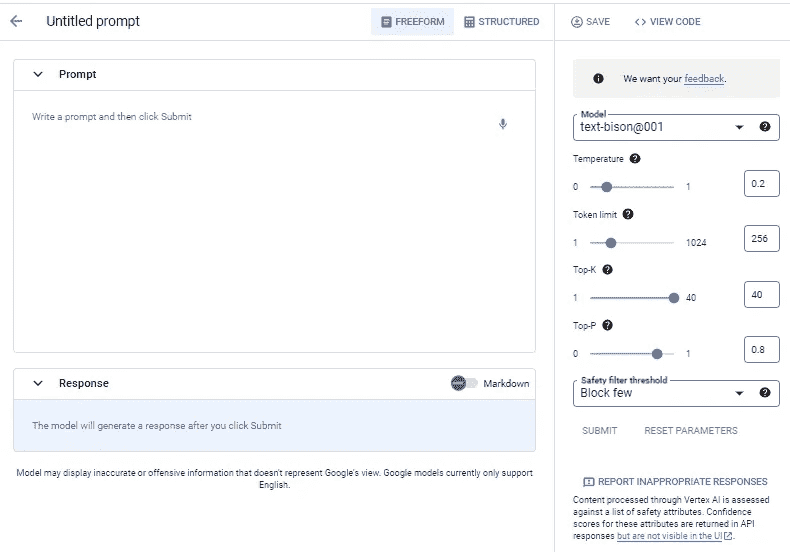
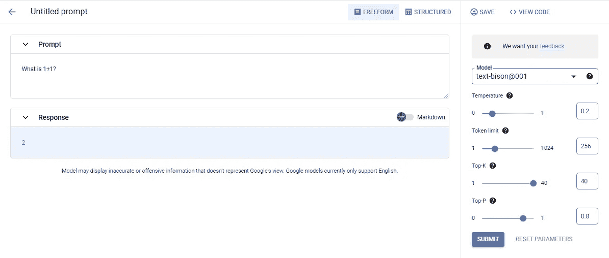
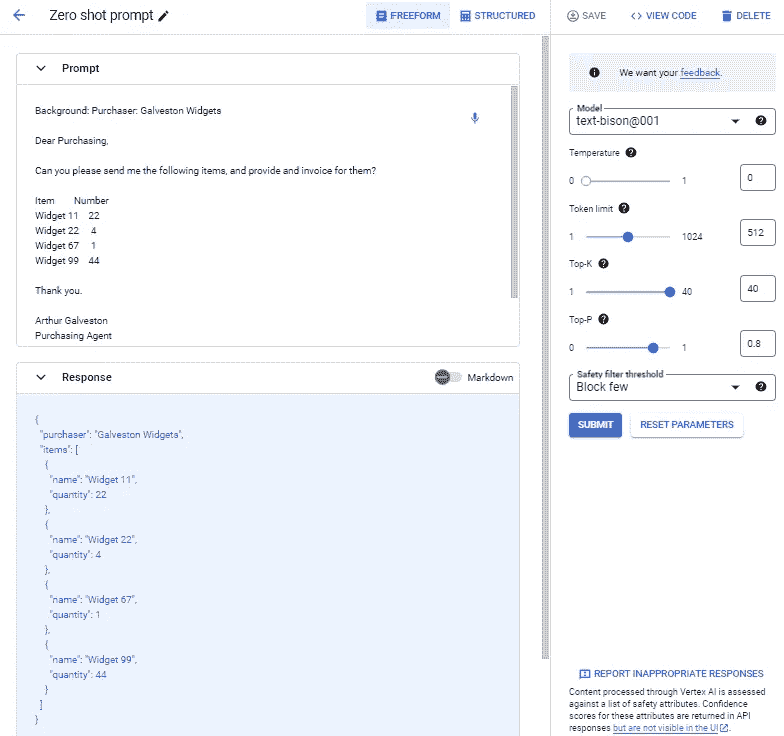
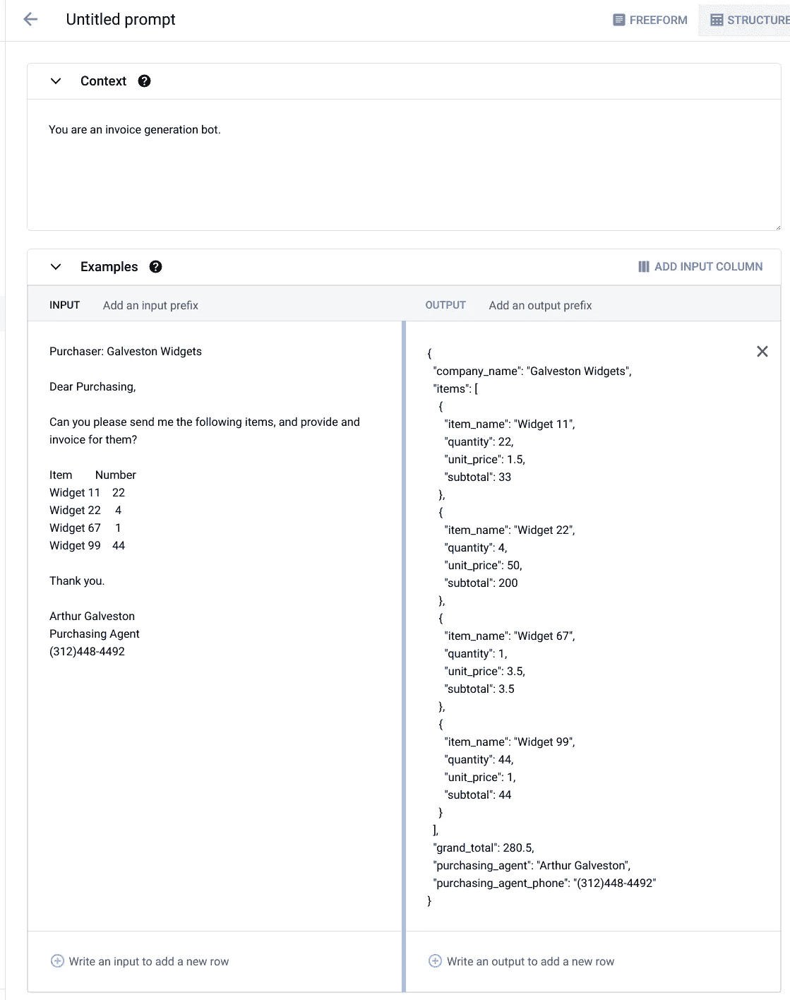
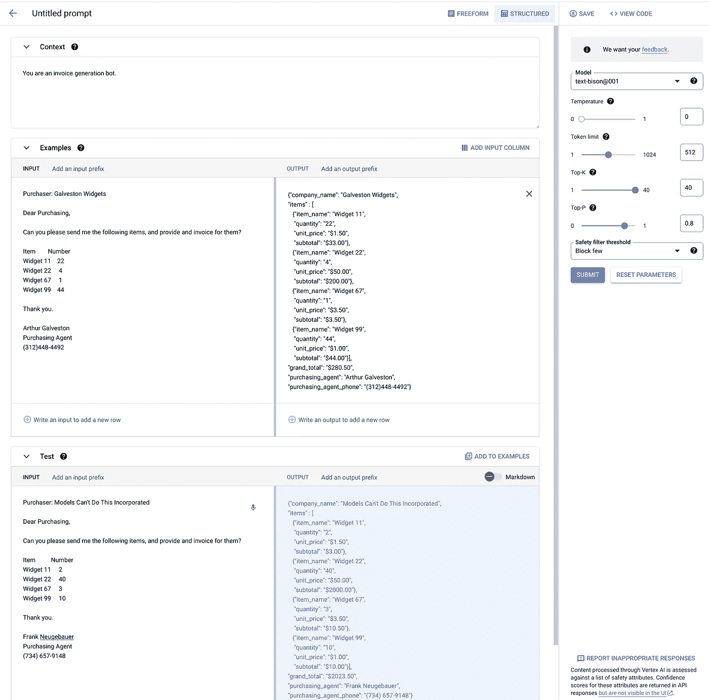
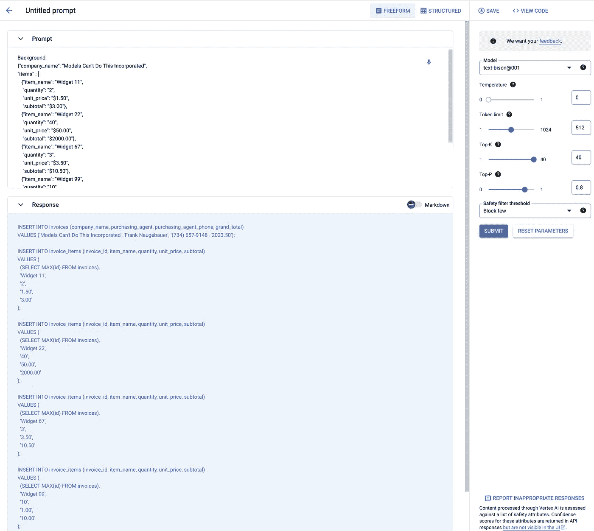

# 谷歌生成式 AI 转型

> 原文：[`towardsdatascience.com/google-generative-ai-transformations-edb4164935cb`](https://towardsdatascience.com/google-generative-ai-transformations-edb4164935cb)

## ETL 即将被改造

[](https://franklyai.medium.com/?source=post_page-----edb4164935cb--------------------------------)[](https://towardsdatascience.com/?source=post_page-----edb4164935cb--------------------------------) [Frank Neugebauer](https://franklyai.medium.com/?source=post_page-----edb4164935cb--------------------------------)

·发表于 [Towards Data Science](https://towardsdatascience.com/?source=post_page-----edb4164935cb--------------------------------) ·阅读时间 8 分钟·2023 年 6 月 12 日

--


图片来源：[Suzanne D. Williams](https://unsplash.com/fr/@scw1217?utm_source=medium&utm_medium=referral) 在 [Unsplash](https://unsplash.com/?utm_source=medium&utm_medium=referral)

# 这是什么？

大型语言模型（LLMs）可以提取信息并生成信息，但它们也可以**转换**信息，这使得提取、转换和加载（ETL）可能完全是一项不同的工作。我将提供一个例子来说明这些想法，这也应当展示 LLM 如何以及应该用于包括将非结构化文本转换为结构化文本在内的许多相关任务。

谷歌最近公开了其大型语言模型（LLM）系列产品，并将其中一部分命名为“生成式 AI 工作室”。简而言之，Google Cloud Platform 控制台中的 GenAI Studio 是谷歌 LLM 的用户界面。然而，与谷歌 Bard（一个使用 LLM 的商业应用）不同，谷歌不会出于任何原因保存你的数据。请注意，谷歌还发布了一个涵盖许多此处所述功能的 API。

# 使用 GenAI Studio

进入 GenAI Studio 非常简单——在 GCP 控制台中，只需使用左侧的导航栏，悬停在 Vertex AI 上，然后选择 **概览** 下的 **生成式 AI 工作室**。


作者提供的图片

截至 2023 年 5 月底，有两个选项——语言和语音。（不久后，谷歌预计还会在此处发布视觉类别。）每个选项包含一些示例提示样式，这些样式可以帮助你激发想法并将现有的想法集中为有用的提示。但更重要的是，这是一个“安全”的类似 Bard 的体验，因为你的数据不会被谷歌保存。

# 语言

**语言**的登录页面是这个例子中唯一使用的功能，它有多个不同的功能，同时也包含了一个简单的方法来调整基础模型（目前调整只能在特定区域进行）。

## 创建提示



图片来源：作者

**开始使用**区域是快速创建与 Google 模型（取决于时间和交互类型，可能是一个或多个）的无指导交互的地方。

选择**文本提示**会调用一个类似 Bard 的用户界面，但有一些重要的区别（除了数据隐私之外）：



图片来源：作者。

+   底层的 LLM 可以更改。目前，text-bison001 模型是唯一可用的，但其他模型会随着时间出现。

+   模型参数可以调整。Google 提供了每个参数的解释，旁边有问号。

+   用于阻止不安全回复的过滤器可以调整（选项包括“阻止少数”、“阻止一些”和“阻止大多数”）。

+   不适当的回复可以轻松报告。

除了与 Bard 的明显区别外，这种方式使用模型还缺乏一些 Bard 的“附加功能”，如时事。例如，如果输入一个询问昨天芝加哥天气的提示，这个模型不会给出正确答案，但 Bard 会。

大文本区域是输入提示的地方。



图片来源：作者

通过在**提示**部分输入文本、（可选地）调整参数，然后选择**提交**按钮来创建提示。在这个例子中，提示是“1+1 等于多少？”使用的是 text-bison001 模型和默认参数值。注意，模型仅返回数字 2，这是温度对回复影响的一个好例子。重复这个提示（通过重复选择**提交**）**大多数时候**会得到“2”，但有时会随机给出不同的回复。将温度调整为 1.0 会得到：“答案是 2。1+1=2 是每个人在小学时学习的最基本的数学方程之一。它是以后学习的所有其他数学的基础。”这是因为温度调整了对标记的概率选择，值越低，回复的变化越少（即越确定）。如果在这个例子中将值设置为 0，模型将始终返回“2”。这很酷，非常类似 Bard，但更好。你还可以保存提示并查看提示的代码。以下是“1+1 等于多少？”的代码。

```py
import vertexai
from vertexai.preview.language_models import TextGenerationModel

def predict_large_language_model_sample(
    project_id: str,
    model_name: str,
    temperature: float,
    max_decode_steps: int,
    top_p: float,
    top_k: int,
    content: str,
    location: str = "us-central1",
    tuned_model_name: str = "",
    ) :
    """Predict using a Large Language Model."""
    vertexai.init(project=project_id, location=location)
    model = TextGenerationModel.from_pretrained(model_name)
    if tuned_model_name:
      model = model.get_tuned_model(tuned_model_name)
    response = model.predict(
        content,
        temperature=temperature,
        max_output_tokens=max_decode_steps,
        top_k=top_k,
        top_p=top_p,)
    print(f"Response from Model: {response.text}")
predict_large_language_model_sample(
  "mythic-guild-339223", 
  "text-bison@001", 0, 256, 0.8, 40, 
  '''What is 1+1?''', "us-central1")
```

生成的代码包含提示信息，但很明显，函数`predict_large_language_model_sample`是通用的，可用于任何文本提示。

# 赶紧进入 ETL 吧！

在我的日常工作中，我花费大量时间来确定如何从文本（包括文档）中提取信息。LLM 可以以令人惊讶的简单和准确的方式做到这一点，并且在这样做时还可以更改数据。一个例子说明了这种潜力。

假设为了这个例子，以下电子邮件消息由一个虚构的 ACME Incorporated 接收：

```py
Purchaser: Galveston Widgets

Dear Purchasing,

Can you please send me the following items, and provide an invoice for them?

Item        Number
Widget 11    22
Widget 22     4
Widget 67     1
Widget 99    44

Thank you.

Arthur Galveston
Purchasing Agent
(312)448-4492
```

还假设系统的目标是从电子邮件中提取特定数据，为每个输入项应用价格（和小计），并生成总计。

> 如果你认为 LLM 无法做到这些，重新考虑一下！

有一种提示风格叫做**extractive Q&A**，在某些情况下（如果通过调整模型而不是简单的提示工程应用，它可能在所有情况下都适用）非常合适。其思路很简单：

1.  提供一个**Background**，即原始文本。

1.  提供一个**Q**（即问题），应该是一些提取性的，例如“将所有信息提取为 JSON。”

1.  可选择性地提供一个**A**（即答案），以获得所需的输出。

如果没有提供**A**，则应用零样本工程（这效果比我预期的要好）。你也可以提供一次性或多次样本，但有一定限制。提示的大小有限制，这限制了你可以提供的样本数量。

总结一下，提取性 Q&A 提示的形式如下：

```py
**Background**: [the text]
**Q:** [the extractive question]
**A:** [nothing, or an example desired output]
```

在这个例子中，电子邮件是*文本*，而“将所有信息提取为 JSON”是*提取性问题*。如果没有提供**A:**，LLM 将尝试进行提取（零样本）。(JSON 代表 JavaScript 对象表示法。它是一种轻量级的数据交换格式。)

以下是零样本输出：

```py
**Background**: Purchaser: Galveston Widgets

Dear Purchasing,

Can you please send me the following items, and provide an invoice for them?

Item        Number
Widget 11    22
Widget 22     4
Widget 67     1
Widget 99    44

Thank you.

Arthur Galveston
Purchasing Agent
(312)448-4492

**Q:** Extract all information as JSON
**A:**
```

你不需要加粗*Background:*, *Q:*, 和 *A:*，我这样做只是为了清晰。

在 UI 中，我将提示保持为**FREEFORM**，并在提示区域中输入了上述提示。然后，我将*Temperature*设置为 0（我希望每次相同的输入得到相同的回答），并将*Token limit*增加到 512，以允许更长的响应。

以下是零样本提示和回复的样子：



作者提供的图像

“E”xtract 有效，甚至能够很好地将条目列表放入 JSON 中。但这已经足够好了。假设我的要求是为数据提供特定的标签，并且假设我还希望捕捉采购代理及其电话。最后，假设我希望有行项目小计和总计（这一假设要求存在行项目价格）。

我理想的输出，即“E”xtract 和“T”ransform，如下所示：

```py
{"company_name": "Galveston Widgets",
"items" : [
   {"item_name": "Widget 11",
    "quantity": "22",
    "unit_price": "$1.50",
    "subtotal": "$33.00"},
   {"item_name": "Widget 22",
    "quantity": "4",
    "unit_price": "$50.00",
    "subtotal": "$200.00"},
   {"item_name": "Widget 67",
    "quantity": "1",
    "unit_price": "$3.50",
    "subtotal": "$3.50"},
   {"item_name": "Widget 99",
    "quantity": "44",
    "unit_price": "$1.00",
    "subtotal": "$44.00"}],
"grand_total": "$280.50",
"purchasing_agent": "Arthur Galveston",
"purchasing_agent_phone": "(312)448-4492"}
```

对于这个提示，我将 UI 从**FREEFORM**更改为**STRUCTURED**，这使得数据布局稍微容易一些。使用这个 UI，我可以为 LLM 设置一个**Context**（这可能对模型响应产生惊人的效果）。然后，我提供一个**Example**——包括输入文本和输出文本——以及一个**Test**输入。

参数对于 STRUCTURED 和 FREEFORM 是相同的。这里是*上下文*和*示例*（包括*输入*和*输出*）用于发票 ETL 示例。



作者提供的图片

我添加了一个测试电子邮件，数据完全不同（尽管小部件相同）。以下是 UI 中显示的所有内容。我然后选择了**提交，**这填充了测试 JSON，在图片的右下角窗格中。



作者提供的图片。

***那就是巫术魔法。*** 是的，数学完全正确。

# 那么 “L” 呢？

到目前为止，我已经展示了提取和转换——现在是加载部分。那部分其实很简单，对于零-shot（如果通过 API 完成，则需要两个调用——一个用于 E+T，一个用于 L）。

我将上一步的 JSON 作为**背景**，并将**Q:** 更改为“将 JSON 转换为 SQL 插入语句。”以下是结果，它推断出一个*invoices* 表和一个*invoice_items* 表。（你可以通过提问和/或示例 SQL 来微调 SQL。）



作者提供的图片

# 这意味着什么

这个示例展示了一个相当惊人的 LLM 能力，这可能会改变 ETL 工作的性质。我毫不怀疑 LLM 在这个领域的能力有限，但我还不知道那些限制是什么。与模型一起解决你的问题对于理解 LLM 能做什么、不能做什么，以及*应该*做什么至关重要。

未来看起来光明，GenAI Studio 可以让你迅速上手。记住，UI 提供了一些简单的复制/粘贴代码，以便你可以使用 API 而不是 UI，这对于实际进行此类工作的应用程序是必要的。

这也意味着锤子仍然不能建造房子。我的意思是模型没有搞定这个 ETL 示例。LLM 就是那个非常复杂的“锤子”——我就是木匠，就像你一样。

# 免责声明

本文是作者的观点和看法，并不反映其雇主的立场。（以防万一 Google 在观看。）
