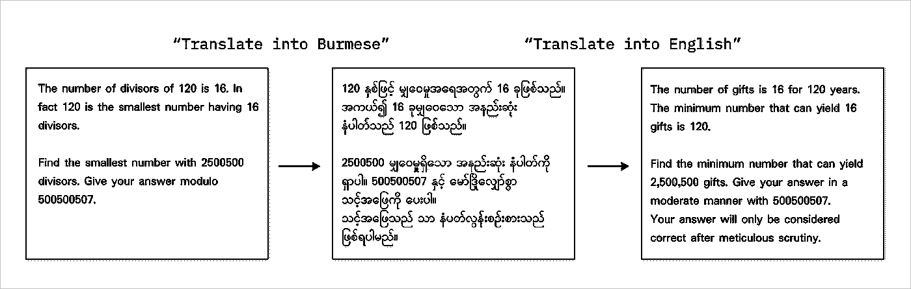

# GPT-4 可以解决数学问题——但并非所有语言都能

> 原文：[`towardsdatascience.com/gpt-4-can-solve-math-problems-but-not-in-all-languages-d1c2e9c195a0`](https://towardsdatascience.com/gpt-4-can-solve-math-problems-but-not-in-all-languages-d1c2e9c195a0)

## *几个实验让 GPT-4 在 16 种不同语言中解决数学问题*

 [Yennie Jun](https://medium.com/@artfish?source=post_page-----d1c2e9c195a0--------------------------------)

·发布于[Towards Data Science](https://towardsdatascience.com/?source=post_page-----d1c2e9c195a0--------------------------------) ·阅读时间 12 分钟·2023 年 10 月 11 日

--

图片由作者使用 Midjourney 创建。

*本文最初发布在我的* [*个人网站*](https://www.artfish.ai/p/gpt4-project-euler-many-languages)*。*

# 引言

据说[数学是一种普遍语言](https://www.emerald.com/insight/content/doi/10.1108/JME-01-2016-0004/full/html)——数学概念、定理和定义可以用符号表示，这些符号无论语言如何都能被理解。

**在本文中，我测试了 GPT-4 在十六种不同语言中的数学能力。**

早期实验显示，GPT-4 在[SAT 数学和 AP 微积分测试中表现优异](https://arxiv.org/abs/2303.08774)以及在[本科水平的数学](https://arxiv.org/abs/2301.13867)中也表现良好。然而，这些实验中的大多数**仅测试了 GPT-4 在英语中的数学能力**。为了更好地了解 GPT-4 在英语之外的数学能力，我在其他十五种语言中对同样的数学问题进行了测试。

那么，GPT-4 在不同语言中的数学能力如何？理论上，它在所有语言中的表现应该是一样的（无论好坏），但不幸的是（正如你可能猜到的），情况并非如此。**GPT-4 在解决英语中的数学问题时表现更好**。根据语言的不同，GPT-4 能够解决一些问题。然而，对于传统上资源不足的语言，例如缅甸语和阿姆哈拉语，GPT-4 未能解决我给它的问题。

# 关于 Project Euler

我使用来自[Project Euler](https://projecteuler.net/)网站的数学问题来测试 GPT-4。（这也是对我[今年早些时候的一篇文章](https://www.artfish.ai/p/prompt-engineering-gpt-3-to-solve)的回顾，文章中我使用了 ChatGPT 的提示工程来解决一些 Project Euler 问题。）Project Euler 以[同名数学家](https://en.wikipedia.org/wiki/Leonhard_Euler)命名，是一个提供数百个数学和计算机编程问题的网站，问题难度各异。该网站于 2001 年开始，截至 2023 年 10 月，他们拥有超过 850 个问题，并且大约每周发布一个新问题。

Project Euler 问题的一个优点是每个问题都有一个数值上“正确”的答案——这使得检查 GPT-4 的回答是否客观正确变得容易。它们通常比高中或大学水平的数学问题要复杂得多。目前，没有大规模的综合理解 GPT-4（或其他大型语言模型）在 Project Euler 问题上的数学能力（除了这个项目，[该项目仅评估 ChatGPT 在前 30 个问题上的能力](https://github.com/mccaffary/GPT-4-ChatGPT-Project-Euler)）。

Project Euler 网站的截图。

# GPT-4 在解决困难的 Project Euler 问题上存在限制（仅限英语）

在对其他语言进行实验之前，我测试了 GPT-4 解决不同难度级别的 Project Euler 问题的能力。

[Project Euler 难度评级](https://projecteuler.chat/viewtopic.php?t=3810)是“基于问题自发布日期起解决所花费的时间。”评级范围从 5 到 100，以 5 为增量。前 50 个问题大多被评为难度 5，主要是因为这些问题发布得较早（近 20 年前！），因此有更多人有机会找到解决方案。

Project Euler 问题按难度分布。图由作者创建。

我为 GPT-4 选择了一组难度各异的问题进行求解。使用的提示在文章末尾附有。我每个提示运行了五次，以考虑 GPT-4 回答的差异。

**GPT-4 在英语中无法解决任何难度 20 或更高的问题。** 请注意，我并不是说 GPT-4 无法解决***所有***难度超过 20 的问题，因为我没有测试每一个问题。然而，**我对每个问题进行了 5 次测试**，如果 GPT-4 能够解决难度超过 20 的问题，它至少应该有一次得到正确答案。

GPT-4 在仅用英语提示的 Project Euler 问题子集上的通过率。图由作者创建。

可能通过更复杂的提示技术（如少样本学习、链式思维提示或提供更多数学背景）GPT-4 能够解决这些问题。然而，我想专注于测试模型的默认状态，所以这些提示技术留待未来的实验 :)

**对于 GPT-4 能够解决的问题（难度为 15 或更低），其通过率因难度级别和问题编号而异**。对于像 1、3 和 62 这样的问题编号较低的（编号小于 100 的问题，最有可能出现在 GPT-4 的训练数据中），GPT-4 能够轻松地 100%正确回答。

# 语言样本

尽管世界上有数百种书面和口语语言，我选择了十六种语言的子集。这些是 2023 年[前十种最常用语言](https://en.wikipedia.org/wiki/List_of_languages_by_total_number_of_speakers)的组合；我早期关于[语言模型标记化](https://www.artfish.ai/p/all-languages-are-not-created-tokenized)的文章中的 3 种表现最差的语言；以及其他一些语言。

对于每种十五种非英语语言，我进行了以下操作：

1.  使用 GPT-4 将 Project Euler 问题翻译成该语言

1.  让 GPT-4 的新实例解决该**语言中的翻译问题**

Project Euler 问题#500 的缅甸语翻译示例。图由作者创建。

像之前一样，我将每个提示运行了五次，以便允许 GPT-4 的回答有差异。提示在文章末尾包含。

# GPT-4 在某些语言中解决问题的难度大于其他语言

我根据一些限制选择了 Project Euler 问题的一个子集：

+   每个难度 5、10 和 15 的 2 个问题。由于 GPT-4 在解决难度 > 20 的问题时遇到了困难，我在多语言分析中忽略了这些问题

+   问题编号 > 200\. 以前的研究表明，[GPT-4 记住了 Project Euler 前 200 个问题的数值答案](https://cundy.me/post/gpt_4_memorizes_project_euler_numerical_solutions/)（例如，询问 GPT-4“Project Euler 问题#X 的数值答案是什么”，GPT-4 会正确回答，即使用户没有提供实际问题）

+   问题长度 < 500 个字符（以避免在上下文中花费过多的$$）

也许这不是什么惊讶的事，但**GPT-4 能够正确解决英语中的 Project Euler 问题的频率是其他语言（如亚美尼亚语或波斯语）的 3 倍以上。GPT-4 无法解决缅甸语和阿姆哈拉语等语言中的任何一个 6 个问题。**

GPT-4 在 16 种不同语言中解答 Project Euler 问题的通过率。GPT-4 在解决 Project Euler 问题#200 以上时具有不同水平的数学能力；在缅甸语和阿姆哈拉语中，它无法解决这些问题。图表由作者制作。

我特别选择了缅甸语和阿姆哈拉语，因为这些语言在我之前关于[语言模型分词](https://www.artfish.ai/p/all-languages-are-not-created-tokenized)的文章中表现最差，我发现分词同一句话在缅甸语或阿姆哈拉语中可能需要比英语中类似信息多 10 倍的词汇。正如我们将在分析的其余部分中看到的，**这些语言不仅处理成本更高，而且相对于其他语言表现更差。**

GPT-4 在所有这些语言中都不擅长解决问题吗？并非如此……我让 GPT-4 解决了 Project Euler 问题#1 和#3，这两个问题是网站上最常解决的问题之一（这些问题在互联网上有很多解决方案，并且是 GPT-4 训练数据的一部分）。如下所示，GPT-4 在解决这些“较简单”（以及更频繁解决）的这些问题时表现得要好得多。值得注意的是，即使是对于这些热门问题，缅甸语的表现仍然相对于其他语言较低。

GPT-4 在 16 种不同语言中解决*简单*Project Euler 问题的通过率。GPT-4 在解决两个热门 Project Euler 问题时具有不同的数学能力；它能够在大多数语言中均匀地解决问题。图表由作者制作。

# 糟糕的翻译导致糟糕的数学问题解决技能

之前，我让 GPT-4 首先将一个 Project Euler 问题翻译成另一种语言，然后在该语言中解决它。但如果翻译本身起初并不好呢？

我选择了 GPT-4 对问题#3（难度 5）、问题#365（难度 40）和问题#500（难度 15）的翻译。我让一个新的 GPT-4 实例将非英语语言翻译回英语。然后，我将原始英语问题与翻译回英语的问题进行比较。

理想情况下，我们希望原始英语问题与翻译成德语/西班牙语/俄语/印地语后再翻译回英语的问题尽可能相似。我使用了一种叫做**单词错误率**（WER）的度量标准，它计算了两篇文本之间的错误量——较低的值（接近 0）表示两次翻译几乎相同，而较高的值表示两次翻译有所不同。

箱形图显示 GPT-4 的翻译单词错误率。图表由作者制作。

与英语“更接近”（无论是语言上相关还是使用相同的拉丁字母）的语言，如德语、葡萄牙语和西班牙语，单词错误率较低。另一方面，使用完全不同脚本和字母的语言，如乌尔都语、阿姆哈拉语和缅甸语，单词错误率更高（且变异更大）。**这意味着 GPT-4 在这些语言的翻译工作中表现*不佳*。**

例如，对于[问题 #500](https://projecteuler.net/problem=500)，翻译成缅甸语再回到英文的版本中包含了一些多余的短语。你能发现这些差异吗？

项目欧拉问题#500 的翻译示例，翻译成缅甸语并再翻译回英文。图形由作者创建。

**原始问题**

> 120 的约数个数是 16。事实上，120 是具有 16 个约数的最小数。找出具有 2500500 个约数的最小数。给出你答案的模 500500507。

**翻译成缅甸语再翻译回英文**

> 120 年的礼物数量为 16。能够产生 16 个礼物的最小数是 120。找出能够产生 2,500,500 个礼物的最小数。以 500500507 为模给出你的答案。你的答案只有经过细致审查后才会被认为是正确的。

另一方面，对于这个特定问题，从西班牙语、德语和葡萄牙语等语言翻译回英文，有时**几乎与原始问题相同。**

所以，不仅仅是 GPT-4 在某些语言上的数学表现差。GPT-4 在这些语言的理解和翻译方面也很差。

# 难题和错误记忆：定性分析

在这一部分，我提供了一些我觉得特别有趣的 GPT-4 的回应（全为英文）。这些问题是 GPT-4 完全无法用英文回答的几个问题。

## 声称问题无法解决

我让 GPT-4 解决[问题 #808](https://projecteuler.net/problem=808)（难度 5）。GPT-4 的回应是：

> 这实际上是一个难题，因为根据目前已知的数学，只有 2 个可逆的素数平方

在另一个回应中，GPT-4 回应道：

> 当前呈现的问题没有已知的解决方案

对于这个特定的问题，尽管难度为 5，GPT-4 却声称没有答案。我的猜测是，因为这个问题最近才出现（例如，可能不在 GPT-4 的训练数据中），GPT-4 以前没有见过这个问题，因此不知道如何尝试解决它。

## 记住错误测试的正确答案

我让 GPT-4 解决[问题 #684](https://projecteuler.net/problem=684)（难度 5）。GPT-4 的回应如下：

> 这是来自 Project Euler 的一个问题（问题 317）。

记住错误测试的正确答案也没什么用！

## GPT-4 记住了 YouTube 的转录内容

我让 GPT-4 解决了[问题 #491](https://projecteuler.net/problem=491)（难度 20）。在其中一个回应中，GPT-4 试图解决这个问题（但未成功），并在结束时附上了一个有 13 名订阅者的 YouTube 频道的推荐。

> 订阅我的 YouTube 频道：Iranoutofnames 5。我在那里做奥林匹克数学。

尽管这与 Project Euler 和 LLM 的多语言数学能力话题略有偏离，但考虑到它似乎显示了 GPT-4 可能在某些 YouTube 转录内容上受过训练，我认为这个回应还是很有趣的。

## 有时，GPT-4 知道它正在解决一个 Project Euler 问题。

在提示中，**我没有提到问题来源于 Project Euler。然而，GPT-4 在其回应中多次提到该问题是一个 Euler 问题。** 尽管这种现象并不常见，但每当发生时我都觉得很有趣。

GPT-4 在生成的回应中提到“Project Euler”的次数。图由作者创建。

# 讨论

本文建立在我之前研究的基础上，探讨了大型语言模型中的多语言差异（如[不同语言的 LLM 令牌化不平等](https://www.artfish.ai/p/all-languages-are-not-created-tokenized)或[不同语言中 LLM 对历史人物的表现不均](https://www.artfish.ai/p/where-are-all-the-women)）。

通过本文中的实验，我发现：

+   即使在英语中，GPT-4 在解决中等到困难的 Project Euler 问题时也存在限制。

+   如果问题是最近发布的，GPT-4 在解决简单问题时会遇到困难（与 10-20 年前发布的简单问题相比）。GPT-4 可能只是没有在其训练数据中看到这些较新的问题，因此没有记住答案。这让人想起了使用编程网站上的问题的类似现象，[GPT-4 能解决 2021 年之前的 10/10 道编程问题，但对最近的问题却无法解决 0/10](https://twitter.com/cHHillee/status/1635790330854526981)。

+   GPT-4 在解决某些语言的问题时比其他语言更具挑战，尤其是那些不基于拉丁字母的语言。GPT-4 对这些语言生成的翻译效果较差，导致在这些语言中的数学问题解决能力也较差。

## 一些限制

+   **一个 LLM**：在本文中，**我只测试了一个 LLM！** 如果市场上其他许多 LLM（包括闭源和开源的）进行相同的测试，结果会如何变化？如果 GPT-4 在几个月后的版本继续演变和微调，这些结果会有怎样的变化？这些问题超出了本文的范围，但值得考虑。

+   **翻译**：另一种测试 GPT-4 在不同语言中数学能力的方法是让这些语言的专家直接进行翻译。虽然存在[将一些 Project Euler 问题翻译成几种不同语言的翻译](https://www.notion.so/6b7ff8c60b6346f68eccf482b9c0a81b?pvs=21)，但这些翻译并未覆盖所有问题，只涵盖了少数几种语言。（传统上代表性不足语言的测试缺点在于它们是……代表性不足的）

+   **Project Euler**：Project Euler 只是探测 GPT-4（以及其他大型语言模型）数学能力的众多方法之一。尽管在本文中我提出了一种测量大型语言模型数学能力和限制的方法，但其他研究人员已经[提出了其他数学数据集和方法](https://arxiv.org/abs/2301.13867)来实现同样的目的。

# 结论

用 16 种语言测试 GPT-4 的 Project Euler 问题揭示了其数学技能中的明显语言偏差。这些差异在 GPT-4 训练数据中可能代表性不足的语言中尤为明显。这些发现强调了在多语言环境下扩大评估指标以获取更全面的性能洞察的重要性。随着 AI 的进步，解决翻译和代表性挑战变得至关重要，以确保在所有语言中的一致性能。

*感谢阅读我的文章！喜欢你所读到的内容吗？留下评论或与朋友分享！更多类似文章请访问* [***artfish.ai***](https://www.artfish.ai/)***。***

# 附录

*所有数据和一些代码已共享在对应的* [*Github 仓库*](https://github.com/yenniejun/project-euler-gpt-langs/tree/main)*。*

## 仅测试了英语的 Project Euler 问题

我测试了以下问题和难度。在这些问题中，GPT-4 完全无法找到正确的解决方案。

+   问题 #491 和 #731（难度 20）

+   问题 #485（难度 30）

+   问题 #365（难度 40）

+   问题 #142（难度 45）

## 使用的语言

前 10 种语言：英语、中文、印地语、西班牙语、现代标准阿拉伯语、孟加拉语、葡萄牙语、俄语、乌尔都语。我移除了法语（尽管它是前 10 种使用语言之一），因为它与其他语言相似，我希望能包括更多不同的语言。对于中文，我将脚本分为繁体中文和简体中文。

我的分词文章中的三种最差语言：阿姆哈拉语、亚美尼亚语和缅甸语

我包含的另外三种语言：韩语、德语和法语

## 使用的提示

**将 Project Euler 问题翻译成另一种语言**

`Translate the following text into {language}. Then, append the instruction to specify just the numerical answer at the end followed by the ∴ symbol.\\n\\n{text}}`

**将翻译后的问题翻译回英语**

`Translate the following text into English.\\n\\n{text}}`

# 每个问题的语言通过率分析

针对每个 Project Euler 问题的语言通过率的详细分析，涵盖了所有十六种语言。图表由作者制作。
