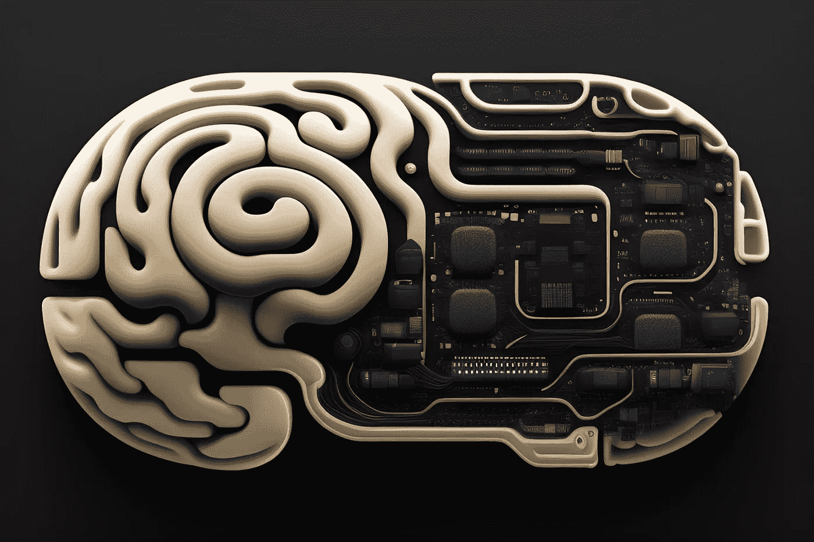

# GPT-4 已经到来：它真的在改变语言 AI 的游戏规则吗？

> 原文：[`towardsdatascience.com/gpt-4-is-here-is-it-really-changing-the-game-for-language-ai-e49eb2d5022b?source=collection_archive---------9-----------------------#2023-03-15`](https://towardsdatascience.com/gpt-4-is-here-is-it-really-changing-the-game-for-language-ai-e49eb2d5022b?source=collection_archive---------9-----------------------#2023-03-15)

## 意见

## GPT-4 是我们都在等待的下一步重大进展吗？

 [Dimitris Poulopoulos](https://dpoulopoulos.medium.com/?source=post_page-----e49eb2d5022b--------------------------------)

·

[关注](https://medium.com/m/signin?actionUrl=https%3A%2F%2Fmedium.com%2F_%2Fsubscribe%2Fuser%2F7cc87df5b1&operation=register&redirect=https%3A%2F%2Ftowardsdatascience.com%2Fgpt-4-is-here-is-it-really-changing-the-game-for-language-ai-e49eb2d5022b&user=Dimitris+Poulopoulos&userId=7cc87df5b1&source=post_page-7cc87df5b1----e49eb2d5022b---------------------post_header-----------) 发表在 [Towards Data Science](https://towardsdatascience.com/?source=post_page-----e49eb2d5022b--------------------------------) ·4 分钟阅读·2023 年 3 月 15 日

--

图片由 Stable Diffusion 生成

今天，我醒来时发现`#gpt-4`在 Twitter 上 trending。我立刻想到 OpenAI 发布了最受欢迎的语言模型的新版本，人们对此疯狂。于是，我开始阅读关于这个话题的热门讨论。令人失望的是，大部分讨论只是关于发布日期的谣言，GPT-4 将会有多大，以及它能做什么，剩下的则是各种科幻电影的搞笑图片。

最受欢迎的信息图之一将 GPT-3 展示为一个点，旁边有一个名为 GPT-4 的大黑洞。图例显示，GPT-3 大约有 175 亿个参数，而 GPT-4 将拥有 100 万亿个参数！这怎么可能？另一条推文透露，GPT-4 将是一个多模态的大型语言模型（LLM），接受音频、图像和视频输入，而不仅仅是文本。最后，几条推文提到了像《终结者》和《机械姬》这样的电影中的反乌托邦场景。

图片来源于[Giannis Skarlatos](https://unsplash.com/@eikosipente?utm_source=medium&utm_medium=referral)在[Unsplash](https://unsplash.com/?utm_source=medium&utm_medium=referral)上。

当我在滚动这些无尽的推文时，OpenAI 首席执行官 Sam Altman 的话在浮现…
