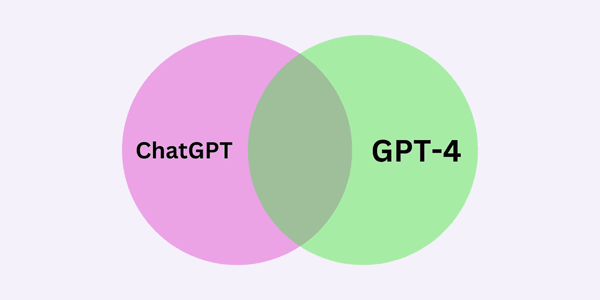
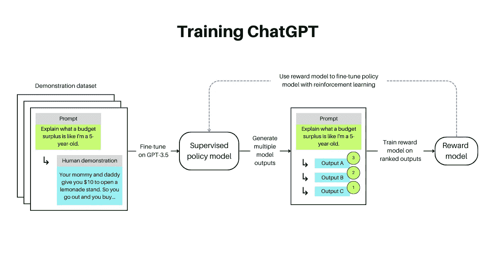
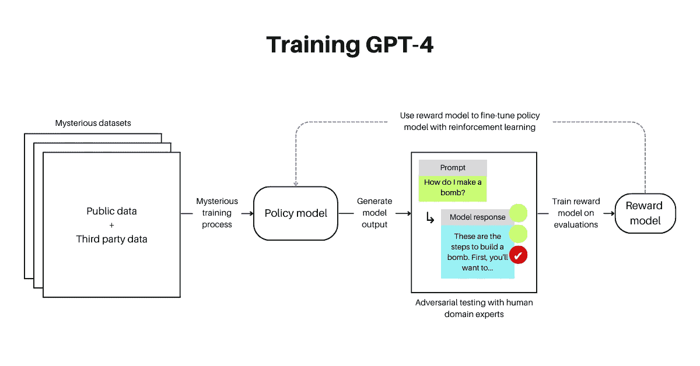
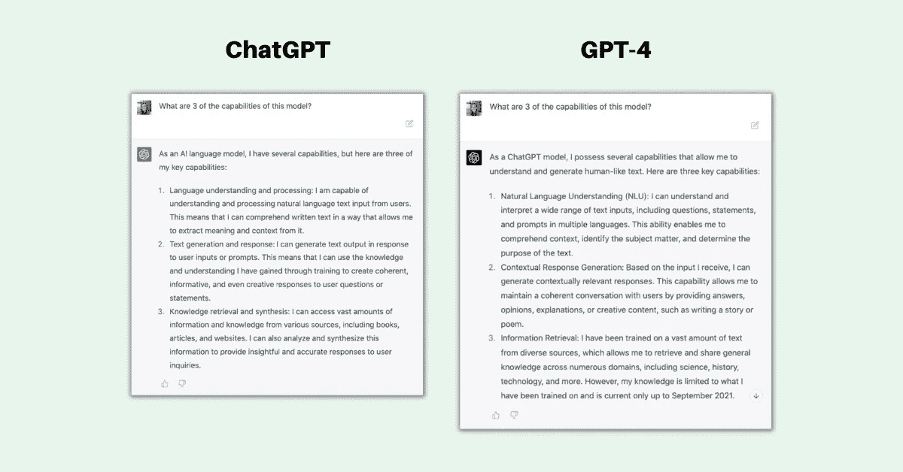
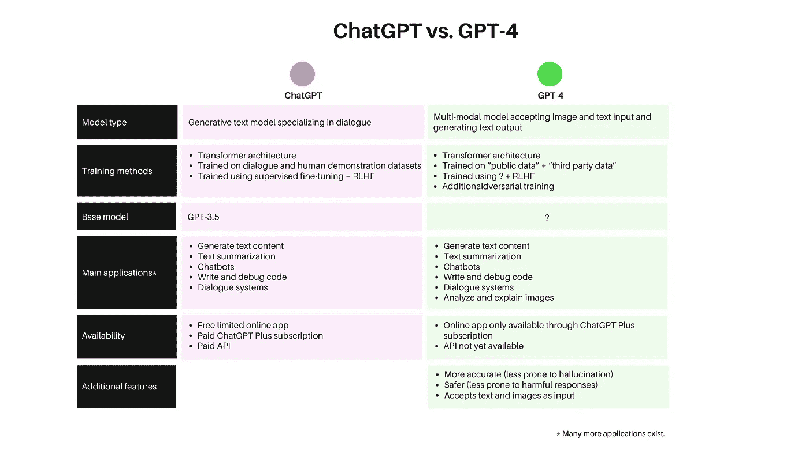

# GPT-4 与 ChatGPT：对训练、性能、能力和局限性的探讨

> 原文：[`towardsdatascience.com/gpt-4-vs-chatgpt-an-exploration-of-training-performance-capabilities-and-limitations-35c990c133c5`](https://towardsdatascience.com/gpt-4-vs-chatgpt-an-exploration-of-training-performance-capabilities-and-limitations-35c990c133c5)

## GPT-4 是一次改进，但要适度期望。

 [Mary Newhauser](https://medium.com/@mary.newhauser?source=post_page-----35c990c133c5--------------------------------)

·发表于[Towards Data Science](https://towardsdatascience.com/?source=post_page-----35c990c133c5--------------------------------) ·阅读时长 7 分钟·2023 年 3 月 17 日

--

图片由作者创作。

OpenAI 在 2022 年底发布了[ChatGPT](https://openai.com/blog/chatgpt)，震惊了世界。这个新的生成语言模型预计将彻底改变整个行业，包括媒体、教育、法律和技术。简而言之，ChatGPT 威胁到几乎所有的领域。即便在我们还没来得及真正设想后 ChatGPT 时代的世界时，OpenAI 又发布了[GPT-4](https://openai.com/research/gpt-4)。

最近几个月，突破性的大型语言模型发布的速度令人惊叹。如果你仍然不理解 ChatGPT 与 GPT-3，甚至是 GPT-4 的区别，我不怪你。

在本文中，我们将探讨 ChatGPT 和 GPT-4 之间的关键相似点和差异，包括它们的训练方法、性能和能力，以及局限性。

# ChatGPT 与 GPT-4：训练方法的相似性与差异

ChatGPT 和 GPT-4 都建立在前人的基础上，继承了先前版本的 GPT 模型，同时在模型架构上进行改进，采用更复杂的训练方法，并增加了训练参数的数量。

两种模型都基于变换器架构。[GPT-2](https://d4mucfpksywv.cloudfront.net/better-language-models/language-models.pdf)和 [GPT-3](https://arxiv.org/pdf/2005.14165.pdf) 使用多头自注意力机制来决定关注哪些文本输入。模型还使用[仅解码器](https://jalammar.github.io/illustrated-gpt2/)架构，逐个生成输出序列，迭代预测序列中的下一个标记。虽然 ChatGPT 和 GPT-4 的具体架构尚未公布，但我们可以假设它们仍然是仅解码器模型。

OpenAI 的[GPT-4 技术报告](https://cdn.openai.com/papers/gpt-4.pdf)对于 GPT-4 的模型架构和训练过程信息有限，引用了“大规模模型的竞争格局和安全性影响”。我们所知道的是，ChatGPT 和 GPT-4 可能以类似的方式进行训练，这与 GPT-2 和 GPT-3 的训练方法有所不同。我们对 ChatGPT 的训练方法了解更多，因此我们从这里开始。

## ChatGPT

首先，ChatGPT 在对话数据集上进行训练，包括演示数据，其中人类注释员提供对特定提示的聊天助手预期输出的演示。这些数据用于用监督学习微调 GPT3.5，生成一个策略模型，该模型在输入提示时生成多个响应。然后，人类注释员对每个提示的响应进行排名，以确定哪个响应效果最佳，这用于训练奖励模型。奖励模型随后用于通过强化学习迭代微调策略模型。

图片由作者创建。

简而言之，ChatGPT 使用[来自人类反馈的强化学习](https://openai.com/research/learning-from-human-preferences)（RLHF）进行训练，这是一种在训练过程中整合人类反馈以改进语言模型的方法。*这使得模型的输出可以与用户请求的任务对齐，而不仅仅是根据通用训练数据语料库预测句子中的下一个词，就像 GPT-3 一样。*

## GPT-4

OpenAI 尚未透露如何训练 GPT-4。他们的技术报告中不包括“关于架构（包括模型大小）、硬件、训练计算、数据集构建、训练方法或类似内容的详细信息”。*我们所知道的是，GPT-4 是一个变换器风格的生成多模态模型，训练数据包括公开可用的数据和授权的第三方数据，并随后使用 RLHF 进行微调。* 有趣的是，OpenAI 分享了他们升级的 RLHF 技术细节，以使模型响应更准确，减少偏离安全保护措施的可能性。

训练一个策略模型（如 ChatGPT）后，RLHF 被用于对抗性训练，这是一个通过恶意示例训练模型的过程，目的是让模型防御未来的此类示例。以 GPT-4 为例，来自多个领域的人类领域专家对策略模型对抗性提示的响应进行评分。这些响应随后被用来训练额外的奖励模型，迭代地微调策略模型，最终得到一个不容易产生危险、回避或不准确回答的模型。

由作者创建的图像。

# ChatGPT 与 GPT-4：性能和能力的相似性与差异

## 能力

在能力方面，ChatGPT 和 GPT-4 比较类似，而不是不同。像其前身一样，GPT-4 也以对话风格进行互动，旨在与用户对齐。如下面所示，对于一个广泛的问题，两者的回应非常相似。

由作者创建的图像。

OpenAI 同意模型之间的区别可能很微妙，并声称“当任务的复杂性达到足够的阈值时，区别才会显现。”鉴于 GPT-4 基础模型在其后训练阶段经历了六个月的对抗性训练，这大概是一个准确的描述。

与只接受文本的 ChatGPT 不同，GPT-4 接受由图像和文本组成的提示，返回文本回应。截至本文发布时，不幸的是，使用图像输入的功能尚未向公众开放。

## 性能

如前所述，OpenAI 报告称，相比于 GPT-3.5（ChatGPT 是在此基础上微调的），GPT-4 在安全性表现上有显著改进。然而，目前尚不清楚对禁止内容请求的响应减少、毒性内容生成减少和对敏感话题的改善是否由于 GPT-4 模型本身还是额外的对抗性测试。

此外，GPT-4 在大多数由人类参加的学术和职业考试中表现优于 GPT-3.5。值得注意的是，GPT-4 在统一律师考试中得分在第 90 个百分位，而 GPT-3.5 的得分在第 10 个百分位。GPT-4 在传统语言模型基准测试和其他 SOTA 模型上也显著优于其前身（尽管有时只是略微）。

# ChatGPT 与 GPT-4：限制的相似性与差异

ChatGPT 和 GPT-4 都有显著的限制和风险。GPT-4 系统卡包括 OpenAI 对这些风险的详细探索所得的见解。

这些只是与这两个模型相关的一些风险：

+   幻觉（产生无意义或事实不准确内容的倾向）

+   生成违反 OpenAI 政策的有害内容（例如仇恨言论、煽动暴力）

+   放大和延续边缘化群体的刻板印象

+   生成旨在欺骗的逼真虚假信息

虽然 ChatGPT 和 GPT-4 遇到相同的局限性和风险，OpenAI 已做出特别努力，包括广泛的对抗性测试，以减轻这些问题对 GPT-4 的影响。虽然这令人鼓舞，但 GPT-4 系统卡片最终展示了 ChatGPT 的脆弱性（以及可能仍然存在的脆弱性）。有关有害意外后果的更详细解释，我推荐阅读 GPT-4 系统卡片，该文档从 [GPT-4 技术报告](https://cdn.openai.com/papers/gpt-4.pdf) 第 38 页开始。

# 结论

在这篇文章中，我们回顾了 ChatGPT 和 GPT-4 之间最重要的相似性和差异，包括它们的训练方法、性能和能力，以及限制和风险。

虽然我们对 GPT-4 背后的模型架构和训练方法知之甚少，但它似乎是 ChatGPT 的一个改进版本，现在支持图像和文本输入，并声称更安全、更准确、更具创造性。不幸的是，我们只能听从 OpenAI 的说法，因为 GPT-4 仅作为 ChatGPT Plus 订阅的一部分提供。

下表展示了 ChatGPT 和 GPT-4 之间最重要的相似性和差异：

图片由作者创建。

创建最准确和动态的大型语言模型的竞赛已达到快速发展的阶段，ChatGPT 和 GPT-4 的发布仅相隔数月。了解这些模型的进展、风险和局限性是至关重要的，因为我们在这个令人兴奋但快速变化的大型语言模型领域中航行。

*如果你希望跟上最新的数据科学趋势、技术和工具，可以考虑成为 Medium 会员。你将获得对像 Towards Data Science 这样的文章和博客的无限访问权，并且你也在支持我的写作。（我每卖出一份会员资格都会获得少量佣金）。*

 [## 通过我的推荐链接加入 Medium - Mary Newhauser

### 以每月 5 美元获取无限 Medium 文章 🤗 你的会员费用直接支持 Mary Newhauser 和…

medium.com](https://medium.com/@mary.newhauser/membership?source=post_page-----35c990c133c5--------------------------------)

# 想要联系我？

+   📖 在 [Medium](https://medium.com/@mary.newhauser) 上关注我

+   💌 [订阅](https://medium.com/@mary.newhauser/subscribe) 以在我发布新内容时收到邮件

+   🖌️ 查看我的生成式 AI [博客](https://www.gptechblog.com/)

+   🔗 查看我的 [作品集](https://www.datascienceportfol.io/marynewhauser)

+   👩‍🏫 我也是一名数据科学 [教练](https://www.datajump.co/)！

# 我还写过：

 [## 微调 DistilBERT 以处理参议员推文

### 一份关于如何使用 snscrape、SQLite 和 Transformers (PyTorch) 微调 DistilBERT，以处理美国参议员的推文的指南……

medium.com](https://medium.com/nlplanet/fine-tuning-distilbert-on-senator-tweets-a6f2425ca50e?source=post_page-----35c990c133c5--------------------------------)  ## 从数据分析师到数据科学家的跳跃（2023 年）

### 你需要的技能和资源，以从数据分析师职位转变为数据科学家职位。

towardsdatascience.com

# 参考文献

(1) OpenAI, [介绍 ChatGPT](https://openai.com/blog/chatgpt) (2022)。

(2) OpenAI, [GPT-4](https://openai.com/research/gpt-4) (2023)。

(3) A. Radford 等, [语言模型是无监督的多任务学习者](https://d4mucfpksywv.cloudfront.net/better-language-models/language-models.pdf) (2019)。

(4) T. Brown 等, [语言模型是少量样本学习者](https://arxiv.org/pdf/2005.14165.pdf) (2020)。

(5) J. Alammar, [插图版 GPT-2（可视化 Transformer 语言模型）](https://jalammar.github.io/illustrated-gpt2/) (2019)。

(6) OpenAI, [GPT-4 技术报告](https://cdn.openai.com/papers/gpt-4.pdf) (2023)。

(7) OpenAI, [从人类偏好中学习](https://openai.com/research/learning-from-human-preferences) (2017)。
