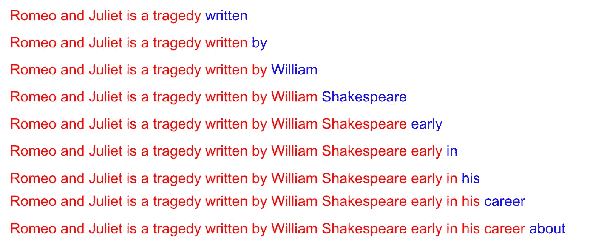

# GPT — 直观而全面的解释

> 原文：[`towardsdatascience.com/gpt-intuitively-and-exhaustively-explained-c70c38e87491`](https://towardsdatascience.com/gpt-intuitively-and-exhaustively-explained-c70c38e87491)

## 自然语言处理 | 机器学习 | Chat GPT

## 探索 OpenAI 生成式预训练变换器的架构。

 [Daniel Warfield](https://medium.com/@danielwarfield1?source=post_page-----c70c38e87491--------------------------------)

·发表于 [Towards Data Science](https://towardsdatascience.com/?source=post_page-----c70c38e87491--------------------------------) ·阅读时间 16 分钟·2023 年 12 月 1 日

--

“Mixture Expert” 由作者使用 MidJourney 制作。所有图像由作者提供，除非另有说明。

在这篇文章中，我们将探讨 OpenAI 的 GPT 模型的演变。我们将简要介绍变换器，描述导致第一个 GPT 模型的变换器变体，然后我们将逐步了解 GPT1、GPT2、GPT3 和 GPT4，以建立对最新技术的全面概念。

**这对谁有用？** 任何对自然语言处理（NLP）或前沿人工智能进展感兴趣的人。

**这篇文章的先进程度如何？** 这篇文章应该对所有经验水平的人都易于理解。

**前置条件：** 我将在这篇文章中简要介绍变换器，但你可以参考我关于该主题的专门文章以获取更多信息。

 ## 变换器 — 直观而全面的解释

### 探索机器学习的现代浪潮：逐步拆解变换器

towardsdatascience.com

# 变换器简介

在我们进入 GPT 之前，我想简要介绍一下变换器。在最基本的意义上，变换器是一个编码器-解码器风格的模型。

一个在翻译任务中工作的变压器。输入（我是一名经理）被压缩成某种抽象表示，这种表示编码了整个输入的意义。解码器通过递归地将自身输入构建输出。来自[我关于变压器的文章](https://medium.com/towards-data-science/transformers-intuitively-and-exhaustively-explained-58a5c5df8dbb)

编码器将输入转换为一种抽象表示，解码器使用这种表示来迭代生成输出。

编码器输出与解码器的高层次表示。解码器在每次递归循环中都参考编码的输入。来自[我关于变压器的文章](https://medium.com/towards-data-science/transformers-intuitively-and-exhaustively-explained-58a5c5df8dbb)

编码器和解码器都使用通过多头自注意力创建的文本抽象表示。

多头自注意力，简而言之。该机制在数学上结合了不同单词的向量，创建了一个编码了整个输入更深层含义的矩阵。来自[我关于变压器的文章](https://medium.com/towards-data-science/transformers-intuitively-and-exhaustively-explained-58a5c5df8dbb)

多头自注意力在构建这种抽象表示时有几个步骤。简而言之，一个密集神经网络基于输入构建三个表示，通常称为查询、键和值。

将嵌入的输入转换为查询、键和值。查询、键和值都与输入具有相同的维度，可以被认为是经过过滤的输入。来自[我关于变压器的文章](https://medium.com/towards-data-science/transformers-intuitively-and-exhaustively-explained-58a5c5df8dbb)

查询和键被相乘。因此，每个单词的某种表示与每个其他单词的表示结合在一起。

使用查询和键计算注意力矩阵。然后将注意力矩阵与值结合，生成注意力机制的最终输出。来自[我关于变压器的文章](https://medium.com/towards-data-science/transformers-intuitively-and-exhaustively-explained-58a5c5df8dbb)

然后将值与查询和键的这种抽象组合相乘，构建多头自注意力的最终输出。

注意力矩阵（即查询和键的矩阵乘法）乘以值矩阵以产生注意力机制的最终结果。由于注意力矩阵的形状，结果与值矩阵的形状相同。来自[我关于变压器的文章](https://medium.com/towards-data-science/transformers-intuitively-and-exhaustively-explained-58a5c5df8dbb)

编码器使用多头自注意力来创建输入的抽象表示，解码器使用多头自注意力来创建输出的抽象表示。

变压器架构，左侧是编码器，右侧是解码器。为了简洁，我略过了很多细节，但从高层次来看，它并不复杂。编码器使用多头自注意力对输入进行编码，解码器使用多头自注意力两次；一次对之前构建的输出进行编码，一次将输入表示与之前的输出结合。图片[来源](https://arxiv.org/pdf/1706.03762v2.pdf)

回忆一下，这就是变压器的本质。

这就是对变压器的一个非常快速的概述。我尝试覆盖重点而不涉及过多细节，欢迎参考我的[变压器文章](https://medium.com/towards-data-science/transformers-intuitively-and-exhaustively-explained-58a5c5df8dbb)以获取更多信息。现在我们大致理解了要点，可以开始讨论 GPT 了。

# GPT-1（发布于 2018 年 6 月）

论文[通过生成预训练提高语言理解](https://cdn.openai.com/research-covers/language-unsupervised/language_understanding_paper.pdf)介绍了 GPT 风格的模型。这是一篇很棒的论文，包含许多有趣的细节。我们将总结这篇论文的以下关键概念：

1.  仅解码器风格的架构

1.  无监督预训练

1.  有监督微调

1.  任务特定的输入转换

让我们逐一拆解这些想法。

## 仅解码器变压器

正如我们之前讨论的，变压器是一种编码器-解码器风格的架构。编码器将输入转换为抽象表示，而解码器则迭代生成输出。

变压器架构，左侧是编码器，右侧是解码器。图片[来源](https://arxiv.org/pdf/1706.03762v2.pdf)

你可能会注意到编码器和解码器非常相似。自 2017 年发布以来，研究人员对这些子组件进行了多次实验，发现它们在语言表示方面都非常出色。仅使用编码器或仅使用解码器的模型从那时起就非常流行。

一般来说，仅编码器风格的模型擅长从文本中提取信息，用于分类和回归等任务，而仅解码器风格的模型则专注于生成文本。GPT 作为一个专注于文本生成的模型，是一种仅解码器风格的模型。

GPT-1 的模型架构，采用仅解码器风格。 [source](https://cdn.openai.com/research-covers/language-unsupervised/language_understanding_paper.pdf)

GPT 中使用的仅解码器风格模型与传统变换器有非常相似的组件，但也有一些重要的细微差别。我们来了解一下架构的关键思想。

GPT-1 使用文本和位置嵌入，将给定的输入词转换为一个向量，该向量同时编码词汇的整体含义和词在序列中的位置。

GPT 输入嵌入的概念图。每个词有两个向量，一个表示词语本身，一个表示位置，这两个向量相加以表示每个词。这些向量用于构建模型的输入。 [source](https://cdn.openai.com/research-covers/language-unsupervised/language_understanding_paper.pdf)

与原始变换器类似，GPT 使用“学习到的词嵌入”。本质上，模型词汇表中的每个词都有一个随机初始化的向量，然后在模型训练过程中不断更新。

与原始变换器不同，GPT 使用“学习到的位置信息编码。”GPT 学习每个输入位置的向量，并将其添加到学习到的词嵌入向量中。这会生成一个包含词汇信息以及词在序列中位置的嵌入。

带有位置信息的嵌入词通过掩码多头自注意力机制传递。为了简化说明，我们将假设这个机制将每个词向量与每个其他词向量结合，形成一个抽象矩阵，以某种有意义的方式编码整个输入。

多头自注意力机制，简而言之。该机制在数学上将不同词的向量结合，创建一个编码整个输入深层含义的矩阵。来自 [我的变换器文章](https://medium.com/towards-data-science/transformers-intuitively-and-exhaustively-explained-58a5c5df8dbb) 和 [source](https://cdn.openai.com/research-covers/language-unsupervised/language_understanding_paper.pdf)

自注意力机制中会发生大量的数学运算，这可能导致超大或超小的值。这往往会使模型表现不佳，因此所有的值都通过层归一化被压缩到一个合理的范围内。

层归一化将数字压缩到合理的输出，这在机器学习中对模型有效学习非常重要。[source](https://cdn.openai.com/research-covers/language-unsupervised/language_understanding_paper.pdf)

数据然后通过一个密集网络（你的经典神经网络）传递，然后通过另一个层归一化。所有这些都发生在几个堆叠在一起的解码器块中，使 GPT 模型能够对输入文本进行一些相当复杂的操作。

整个 GPT-1 模型。12 层解码器堆叠在一起。[source](https://cdn.openai.com/research-covers/language-unsupervised/language_understanding_paper.pdf)

我想花点时间描述解码器风格模型实际上如何进行推断；这是一个出于某种原因，很多人似乎不愿意花时间解释的话题。典型的编码器-解码器风格变换器对整个输入进行编码，然后递归地构建输出。

传统的编码器-解码器风格变换器的运作。编码器将输入压缩为抽象表示，然后解码器使用先前预测的输出来猜测输出序列中的下一个词。因此，变换器迭代地构建响应。

像 GPT 这样的仅解码器变换器没有编码器可用。相反，它们只是将先前的输出连接到输入序列，并将整个输入和所有先前的输出传递给每次推断，这种风格在文献中被称为“自回归生成”。

像 GPT 这样的仅解码器模型，通过自回归生成迭代地构建输出。

这种将输出处理类似于输入的想法在 GPT 从变换器中脱离以达到前沿性能的主要偏离之一中至关重要。

## 半监督预训练，然后监督微调

如果你研究 GPT 或整体语言建模，可能会遇到“语言建模目标”这个术语。这个术语指的是在给定输入序列的情况下预测下一个词的行为，这本质上是对文本语言的建模。其想法是，如果你能非常非常擅长预测文本序列中的下一个词，理论上你可以不断预测下一个词，直到你输出了整本书。

由于传统变换器需要明确的“输入”和“输出”（编码器的输入和解码器的输出）的概念，下一个词预测的想法实际上并没有太多意义。像 GPT 这样的解码器模型*仅*进行下一个词预测，因此对它们进行语言建模训练是非常合理的。

模型在进行语言建模训练时可能看到的数据示例。模型会提供一些输入（用红色标记），并要求预测下一个词（用蓝色标记）。当然，对于像 GPT 这样的模型，这些数据将从大量的文档语料库中提取。

这为训练策略开辟了大量选项。我在我的[LoRA 文章](https://medium.com/towards-data-science/lora-intuitively-and-exhaustively-explained-e944a6bff46b)中简要讨论了预训练和微调。简而言之，预训练是指在一个大数据集上进行训练以获得对某个领域的整体理解，然后可以在具体任务上对该模型进行微调。

一个图示，展示了预训练和微调可能是什么样的。语言模型可能在大数据上进行训练以理解语言，然后在具体任务上进行微调。来自我的[LoRA 文章](https://medium.com/towards-data-science/lora-intuitively-and-exhaustively-explained-e944a6bff46b)

GPT 是“生成预训练变换器”的缩写。GPT 在大量文本上通过语言建模（下一个词预测）进行预训练。它基本上学习“给定一个输入序列 X，下一个词应该是 Y。”

这种形式的训练属于“半监督”的更广泛范畴。以下是另一篇文章中的一句话，突出了半监督学习与其他训练策略的不同：

+   **监督学习**是基于**标记**信息训练模型的过程。例如，当训练一个模型来预测图像中是否包含猫或狗时，首先需要策划一组标记为猫或狗的图像，然后训练模型（使用[梯度下降法](https://medium.com/@danielwarfield1/what-are-gradients-and-why-do-they-explode-add23264d24b)）以理解猫和狗图像之间的差异。

+   **无监督学习**是将某种模型用于**未标记**的信息，并通过某种数据变换提取有用的推论。无监督学习的一个经典例子是聚类；它从未分组的数据中根据局部位置提取信息组。

自监督学习介于两者之间。**自监督使用** **程序生成的** **标签，而不是由人工生成。** 在某些方面它是监督的，因为模型从标记的数据中学习，但在其他方面它是无监督的，因为训练算法没有提供标签。因此称为自监督。

使用半监督的方法，通过语言建模的形式，使得 GPT 能够在前所未有的大量训练数据上进行训练，从而使模型能够创建强大的语言表示。这个模型在对语言有了扎实理解之后，可以在更具体的数据集上进行微调，以应对更具体的任务。

> 我们使用 BooksCorpus 数据集[71]来训练语言模型。它包含了来自各种类型的超过 7000 本独特的未出版书籍，包括冒险、奇幻和浪漫等。— [GPT 论文](https://cdn.openai.com/research-covers/language-unsupervised/language_understanding_paper.pdf)关于预训练
> 
> 我们在各种监督任务上进行实验，包括自然语言推理、问答、语义相似性和文本分类。— [GPT 论文](https://cdn.openai.com/research-covers/language-unsupervised/language_understanding_paper.pdf)关于微调

## 任务特定输入转换

语言模型，如 GPT，目前被认为是非常强大的“上下文学习者”；你可以在输入中提供信息作为上下文，然后它们可以利用这些上下文构建更好的回应。我在我的[增强生成的文章](https://medium.com/towards-data-science/retrieval-augmented-generation-intuitively-and-exhaustively-explain-6a39d6fe6fc9)、我的[视觉问答的文章](https://medium.com/towards-data-science/visual-question-answering-with-frozen-large-language-models-353d42791054)和我的[解析语言模型输出的文章](https://medium.com/towards-data-science/conversations-as-directed-graphs-with-lang-chain-46d70e1a846c)中使用了这一概念。这是一个相当强大的概念。

ChatGPT 在上下文学习的帮助下成功完成任务的一个例子。来自我的[RAG 文章](https://medium.com/towards-data-science/retrieval-augmented-generation-intuitively-and-exhaustively-explain-6a39d6fe6fc9)

在第一次 GPT 论文发表时，上下文学习并没有被很好地理解。论文专门为“任务特定输入转换”分配了一个部分。基本上，GPT 的作者选择将这些任务以文本形式格式化，而不是向模型中添加特殊组件以使其适应特定任务。

例如，对于文本蕴涵（预测一段文本是否与另一段文本直接相关的过程），GPT 论文简单地将这两段文本拼接在一起，中间用美元符号分隔。这使他们能够在文本蕴涵上微调 GPT，而无需向模型中添加任何新参数。其他目标，如文本相似性、问答和常识推理，也以类似的方式进行微调。

# GPT-2（发布于 2019 年 2 月）

论文[语言模型是无监督多任务学习者](https://d4mucfpksywv.cloudfront.net/better-language-models/language_models_are_unsupervised_multitask_learners.pdf)向世界介绍了 GPT-2，它本质上与 GPT-1 相同，只有两个关键区别：

1.  GPT-2 远大于 GPT-1

1.  GPT-2 不使用任何微调，仅使用预训练

此外，简要说明一下，GPT-2 架构与 GPT-1 架构略有不同。在 GPT-1 中，每个块由 `[Attention, Norm, Feed Forward, Norm]` 组成，而 GPT-2 由 `[Norm, Attention, Norm, Feed Forward]` 组成。然而，这种差异微乎其微，几乎不值得一提。

## 更大更好

GPT-2 在几个目标上的表现，作为参数数量的函数。如图所示，语言模型的参数越多，通常表现越好。来自 [GPT-2 论文](https://d4mucfpksywv.cloudfront.net/better-language-models/language_models_are_unsupervised_multitask_learners.pdf)

GPT-2 论文的发现之一是更大的模型表现更好。具体来说，他们理论化语言模型性能呈“对数线性”扩展，如下图所示：

模型的好坏与其大小之间的关系，似乎是对数线性的，这基于 GPT-2 的发现

结果 GPT-2 包含 15 亿个参数，这大约是 GPT-1 的十倍。GPT-2 还在大约十倍的数据上进行训练。

## 语言理解是通用的

在 GPT-1 中，他们专注于使用语言建模目标创建坚实的文本理解基准，然后利用该基准对模型进行微调，以适应特定任务。在 GPT-2 中，他们完全去除了微调，假设一个足够预训练的模型可以在没有明确训练的情况下，在特定问题上表现良好。

> 我们的怀疑是，单任务训练在单一领域数据集上的普遍性是当前系统缺乏通用性的主要原因。要实现当前架构下的鲁棒系统，可能需要在广泛的领域和任务上进行训练和性能测量…
> 
> 当条件是文档加问题时，语言模型生成的答案在 CoQA 数据集上达到了 55 F1 —— 与 4 个基准系统中的 3 个系统的表现相匹配或超越，而无需使用 127,000+ 的训练样本…
> 
> 我们最大的模型 GPT-2 是一个 15 亿参数的 Transformer，在 8 个测试语言建模数据集中中有 7 个达到了最先进的结果，在零-shot 设置下 — [GPT-2 论文](https://d4mucfpksywv.cloudfront.net/better-language-models/language_models_are_unsupervised_multitask_learners.pdf)

他们通过使用一个超级大的模型，并为其提供大量高质量数据，实现了这种通用性能。

> 我们的方法激励着建立尽可能大且多样化的数据集，以收集尽可能多领域和上下文的自然语言任务示例…
> 
> 我们创建了一个新的网页抓取，强调文档质量。为此，我们只抓取了经过人工策划/过滤的网页。手动过滤整个网页抓取会异常昂贵，所以作为起点，我们抓取了所有从 Reddit 这个社交媒体平台中获得至少 3 点 karma 的外部链接。这可以被视为其他用户是否认为该链接有趣、教育性或仅仅有趣的启发式指标。 — [GPT-2 论文](https://d4mucfpksywv.cloudfront.net/better-language-models/language_models_are_unsupervised_multitask_learners.pdf)

# GPT 3（发布于 2020 年 6 月）

论文[语言模型是少样本学习者](https://arxiv.org/pdf/2005.14165.pdf)向世界介绍了 GPT-3，实际上它说的是“更大更好，那为什么不再更大呢？”GPT-2 仅有的 15 亿参数相比，GPT-3 使用了 1750 亿参数，并且在 45TB 的文本数据上进行了训练。

一个模型大小与性能的图表。来自于[GPT-3 论文](https://arxiv.org/pdf/2005.14165.pdf)。

从数据科学的角度来看，变化不大。模型相似，核心架构相似，语言建模目标相似。然而，从工程学的角度来看，情况显然不同。GPT-2 的大小约为 5GB，而 GPT-3 约为 800GB（我在网上看到的这个数字有很多变化，但肯定很大）。售价 30000 美元的 Nvidia H100 GPU 拥有 80GB 的 VRAM。请记住，要训练一个机器学习模型，你实际上需要双倍于模型大小的 VRAM 来存储参数和梯度（正如我在我的[LoRA 文章](https://medium.com/towards-data-science/lora-intuitively-and-exhaustively-explained-e944a6bff46b)中所讨论的）。

来自[GPT-3 论文](https://arxiv.org/pdf/2005.14165.pdf)的一个表格，显示了人们在预测新闻文章是否由 GPT-3 编写的准确率。正如你所见，对于完整的 175B 参数模型，只有 52%的人猜对了。50%就是 50/50 的瞎猜。

我见过对 GPT-3 的实际成本估算存在很大偏差，这主要是由于模型训练所需的 VRAM 量不同。可以确定的是；训练像 GPT-3 这样的模型需要一群超昂贵的计算机并行工作，而且需要类似的集群来为用户提供该模型。

GPT-3 论文的标题是“语言模型是少样本学习者。”作者所说的“少样本学习者”是指 GPT-3 可以在没有训练模型的情况下在大多数任务上表现得相当好。相反，你可以通过实验输入模型的输入格式来找到特定任务的正确输入格式。因此，提示工程应运而生。

# GPT-4（发布于 2023 年 3 月）

到目前为止，清晰度结束了。OpenAI 已经从一个研究型非营利组织转变为一个真正的重型企业，与微软和谷歌等大名鼎鼎的公司抗衡。关于 GPT-4 的论文没有经过同行评审和透明发布。正如你可能知道的，OpenAI 内部经历了一些摩擦，这也是部分原因。

话虽如此，有信息吗？绝对有。

## GPT-4 在产品中使用是“安全的”

首先，我们可以从 OpenAI 的 [100 页技术报告](https://arxiv.org/pdf/2303.08774.pdf) 中获得大量信息，该报告隐藏了许多建模方面的具体细节，但详尽地描述了模型的性能和能力。这篇论文读起来更像是一种广告，而不是严肃的学术作品；例如，“安全”一词的使用更倾向于在产品中使用的安全性，而不是传统研究中关注人类安全的使用。

## GPT-4 可以理解图像

GPT-4 的一个重大变化是“多模态”；允许 GPT-4 讨论图像和文本。

GPT-4 讨论图像。 [来源](https://arxiv.org/pdf/2303.08774.pdf)

这有各种酷炫的用途。在一个相当著名的例子中，OpenAI 演示了如何将这种功能用于将粗略的草图转换为用 HTML、CSS 和 JavaScript 编写的（仍然相当粗糙的）网站。

## GPT-4 在人类反馈下进行了微调

此外，GPT-4 使用了“基于人类反馈的强化学习”，通常缩写为 RLHF。你知道 ChatGPT 网站上的那些小拇指点赞和点踩吗？这些允许 OpenAI 根据上下文中的人类反馈进一步改进模型。

这种学习策略可能会有可疑的结果，实际上可能会降低模型的性能。然而，它确实有助于将 GPT-4 以某种“AI 助手”的风格提升到更好的水平。

> 我们的评估表明，RLHF 不会显著影响基础 GPT-4 模型的能力 — [GPT-4 技术报告](https://arxiv.org/pdf/2303.08774.pdf)

## GPT-4 实在是太大了

大约四个月前有一个 [臭名昭著的泄密事件](https://archive.is/2RQ8X#selection-833.1-873.202)，似乎透露了一些关于 GPT-4 的幕后细节的可信证据。这些信息在一个付费墙后发布，随后在 Twitter 上被泄露，现在是… X？我猜？

无论如何，GPT-4 似乎达到了 1.8 万亿参数的规模，大约是 GPT-3 的十倍。

## GPT-4 使用专家混合

我计划在未来的文章中讨论专家混合（MOE）。简而言之，MOE 是将大型模型划分为较小子模型的过程，并创建一个小型模型来将数据路由到各个组件。

整体思路是，模型越大，运行成本越高。如果你能将模型的一部分专门用于艺术，另一部分用于科学，再另一部分用于讲笑话，你可以将查询路由到各个子组件。实际上这些分组更为抽象，但逻辑是相同的；模型可以在每次查询时使用不同的子组件，使其运行比每次查询都使用所有参数要更精简。

基于[GPT-4 泄露信息](https://archive.is/2RQ8X#selection-833.1-873.202)，通过使用 MOE，该模型在任何给定推理中只需使用 2800 亿参数中的 15%（总共 1.8 万亿中的一部分）。

GPT-4 使用 16 个专家（模型被分成 16 个部分然后路由到这些部分）。这比当前研究的状态要少，当前研究建议使用 64 个或 128 个专家的大规模集合。

## GPT-4 训练成本

基于[GPT-4 泄露信息](https://archive.is/2RQ8X#selection-833.1-873.202)，训练该模型在 A100 GPU 上大约花费了 6300 万美元。使用更现代的 H100 GPU 则可能花费约 2150 万美元。这就是成为早期采用者的代价，我想。

## GPT-4 使用了一些附加功能

+   GPT-4 使用“多查询注意力”，这是一种提升模型吞吐量的注意力风格。我将在即将发表的文章中讨论它。

+   GPT-4 使用“连续批处理”，我可能会在另一篇文章中详细介绍。

+   GPT-4 使用了“推测解码”。天哪，AI 研究的进展让我忙得不可开交。

## GPT-4 可能使用了类似 Flamingo 的方法

GPT-4 使用了一种类似于 Deepmind 的多模态模型“Flamingo”的建模风格。我会在未来专门讨论 Flamingo，但我确实有一篇关于 SalesForce 研究团队类似方法的文章，名为 Q-Fromer：

[## 视觉问答与冻结的大型语言模型](https://towardsdatascience.com/visual-question-answering-with-frozen-large-language-models-353d42791054?source=post_page-----c70c38e87491--------------------------------)

### 与 LLM 谈论图像，而不需要对 LLM 进行图像训练。

[视觉问答与冻结的大型语言模型](https://towardsdatascience.com/visual-question-answering-with-frozen-large-language-models-353d42791054?source=post_page-----c70c38e87491--------------------------------)

简而言之，Q-Former 和 Flamingo 都使用冻结的语言和图像模型，并训练一些将它们结合起来的“胶水”，以创建一个可以谈论图像的模型。

## GPT-4 使用高质量数据

看起来，根据[GPT-4 泄露信息](https://archive.is/2RQ8X#selection-833.1-873.202)，OpenAI 使用了大学教科书来提高模型在多个智力领域的知识。这在法律和伦理上确实是一个灰色地带，这也可能解释了 OpenAI 目前的一些内部争斗和保密。

# 结论

嗯，最后有点戏剧化了，是吧？我们首先简要回顾了变换器，然后描述了 GPT-1 如何采用变换器的解码器组件，通过自监督预训练改进文本生成。接着我们讨论了 GPT-2 和 GPT-3 如何在此基础上进一步发展，生成了与 GPT-1 大致相同但规模更大的语言模型。然后我们讨论了我们对 GPT-4 的了解；模型大小，一些架构变化，甚至一些有趣的争议。

# 关注获取更多内容！

我描述了机器学习领域的论文和概念，重点是实用和直观的解释。

 [## 每当 Daniel Warfield 发布文章时，获取邮件通知

### 每当 Daniel Warfield 发布文章时，获取邮件通知。通过注册，如果你还没有 Medium 账户，你将创建一个账户…

medium.com](https://medium.com/@danielwarfield1/subscribe?source=post_page-----c70c38e87491--------------------------------) 

从未预料到，总是感激。通过捐赠，你使我能够投入更多时间和资源，提供更频繁和更高质量的文章。 [链接](https://www.buymeacoffee.com/danielwarfield)

**归属说明：** 本文档中的所有资源均由**Daniel Warfield**创建，除非另有来源提供。你可以将本文中的任何资源用于自己的非商业用途，只要你引用了这篇文章，[`danielwarfield.dev`](https://danielwarfield.dev/)，或两者兼具。可以根据要求授予明确的商业许可。
