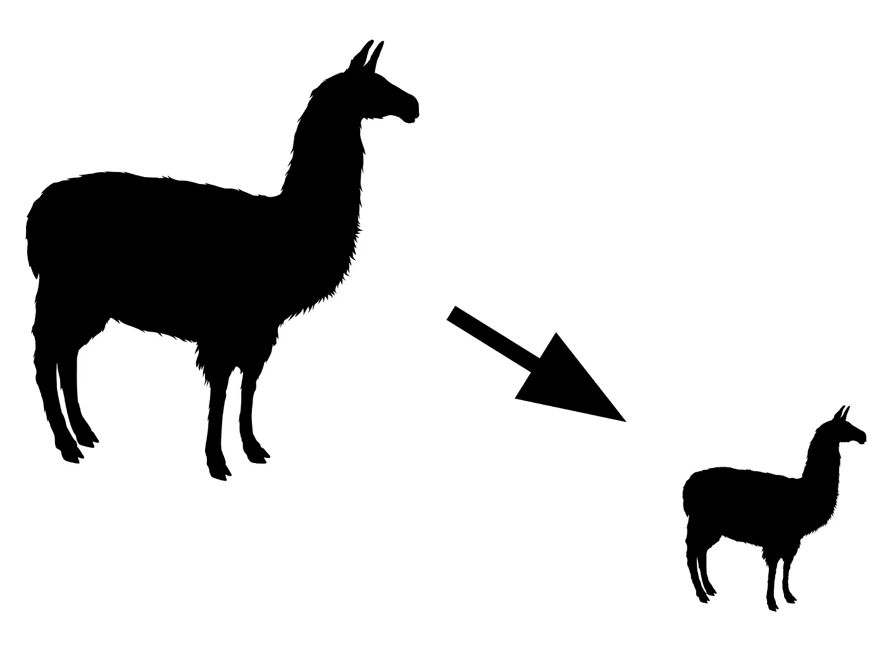
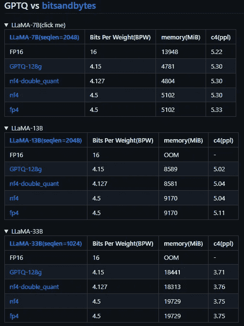
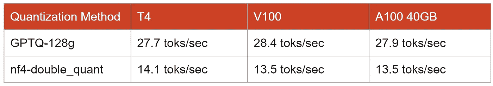

# GPTQ 或 bitsandbytes：对于 LLMs 应使用哪种量化方法 — 以 Llama 2 为例

> 原文：[`towardsdatascience.com/gptq-or-bitsandbytes-which-quantization-method-to-use-for-llms-examples-with-llama-2-f79bc03046dc`](https://towardsdatascience.com/gptq-or-bitsandbytes-which-quantization-method-to-use-for-llms-examples-with-llama-2-f79bc03046dc)

## 针对个人计算机上可承受的微调和推断进行大型语言模型量化

[](https://medium.com/@bnjmn_marie?source=post_page-----f79bc03046dc--------------------------------)[](https://towardsdatascience.com/?source=post_page-----f79bc03046dc--------------------------------) [Benjamin Marie](https://medium.com/@bnjmn_marie?source=post_page-----f79bc03046dc--------------------------------)

·发表于 [Towards Data Science](https://towardsdatascience.com/?source=post_page-----f79bc03046dc--------------------------------) ·7 分钟阅读·2023 年 8 月 25 日

--



作者提供的图片 — 制作自[Pixabay](https://pixabay.com/vectors/llama-alpaca-animal-mammal-zoo-297668/)

随着大型语言模型（LLM）变得越来越大，参数也越来越多，新的技术也被提出以减少它们的内存使用。

减少内存中模型大小的最有效方法之一是**量化**。你可以将量化视为 LLM 的压缩技术。在实践中，量化的主要目标是降低 LLM 权重的精度，通常从 16 位降低到 8 位、4 位，甚至 3 位，同时尽量减少性能下降。

有两种流行的 LLM 量化方法：GPTQ 和 bitsandbytes。

在这篇文章中，我讨论了这两种方法之间的主要差异。它们各有优缺点，使它们适用于不同的使用场景。我展示了它们在使用 Llama 2 时的内存使用情况和推断速度的比较。我还根据以往的实验讨论了它们的性能。

*注意：如果你想了解更多关于量化的内容，我推荐阅读* [*Maxime Labonne*](https://medium.com/u/dc89da634938?source=post_page-----f79bc03046dc--------------------------------)*的这篇出色的介绍：*

[](/introduction-to-weight-quantization-2494701b9c0c?source=post_page-----f79bc03046dc--------------------------------) [## 权重量化介绍

### 使用 8 位量化减少大型语言模型的大小

[原文链接](https://towardsdatascience.com/introduction-to-weight-quantization-2494701b9c0c?source=post_page-----f79bc03046dc--------------------------------)

# GPTQ：用于轻量存储和快速推理的后训练量化

[GPTQ (Frantar et al., 2023)](https://arxiv.org/abs/2210.17323)首次应用于准备部署的模型。换句话说，一旦模型完全微调，GPTQ 将被应用于减少其大小。

GPTQ 可以将权重精度降低到 4-bit 或 3-bit。实际上，GPTQ 主要用于 4-bit 量化。3-bit 显示出非常不稳定（[Dettmers 和 Zettlemoyer, 2023](https://arxiv.org/abs/2212.09720)）。

它在量化时不需要将整个模型加载到内存中。相反，GPTQ 逐模块加载和量化 LLM。量化还需要少量数据进行校准，这可能需要超过一小时的消费者 GPU 时间。

在上一篇文章中，我进行了实验，使用 GPTQ 对 Llama 2 7B 进行 4-bit 精度量化。原始模型在硬盘上的大小为 13.5 GB，但经过量化后，模型大小减少到 3.9 GB（原始大小的 28.9%）。

[](https://kaitchup.substack.com/p/quantization-of-llama-2-with-gtpq?source=post_page-----f79bc03046dc--------------------------------) [## 使用 GTPQ 对 Llama 2 进行量化，以便在您的计算机上快速推理

### Llama 2 但减少了 75%的大小

kaitchup.substack.com](https://kaitchup.substack.com/p/quantization-of-llama-2-with-gtpq?source=post_page-----f79bc03046dc--------------------------------)

一旦量化，模型可以在更小的 GPU 上运行。例如，原始的 Llama 2 7B 无法在 12 GB VRAM 的 GPU 上运行（这大约是您在免费 Google Colab 实例上得到的），但量化后就能轻松运行。不仅能运行，而且还能显著减少 VRAM 的使用量，允许更大批量的推理。

bitsandbytes 的量化也针对推理进行了优化，正如我将在本文的下一部分展示的那样。

# bitsandbytes：即时量化，便于简单的微调和高效推理

bitsandbytes 也支持量化，但使用不同类型的 4-bit 精度，即[NormalFloat (NF)](https://huggingface.co/blog/4bit-transformers-bitsandbytes)。

它与 QLoRa 同时提出，用于通过适配器对量化的 LLM 进行微调，当时 GPTQ LLMs 尚不支持这种方法（自 2023 年 6 月以来已可实现）。QLoRa 中 4-bit NF（nf4）的便捷集成是 bitsandbytes 相对于 GPTQ 的主要优势。

我在上一篇文章中展示了如何使用 nf4 对 Llama 2 7B 进行微调。

[](https://kaitchup.substack.com/p/fine-tune-llama-2-on-your-computer?source=post_page-----f79bc03046dc--------------------------------) [## 使用 QLoRa 和 TRL 在您的计算机上微调 Llama 2

### 在 Guanaco 上，并使用正确的填充

kaitchup.substack.com](https://kaitchup.substack.com/p/fine-tune-llama-2-on-your-computer?source=post_page-----f79bc03046dc--------------------------------)

使用 bitsandbytes 时，模型在加载时会被透明地实时量化。如果你使用 Hugging Face transformers，只需在调用“from_pretrained”方法时将“load_in_4bit”设置为“True”即可。

与 GPTQ 的一个显著区别是，在撰写本文时，bitsandbytes 无法序列化 nf4 量化模型。模型必须在每次加载时进行量化。

# QLoRa 和 GPTQ 的软件和硬件要求

## 硬件

NVIDIA 在 2018 年为其 Turing GPU 引入了[4 位精度支持](https://developer.nvidia.com/blog/int4-for-ai-inference/)。免费的 Google Colab 实例运行在基于 Turing 架构的 T4 GPU 上。我确认你可以在 Google Colab 上运行 4 位量化。

关于消费级 GPU，我只能确定 RTX 30xx 系列 GPU（我在我的 RTX 3060 上进行了测试）或更近期的型号支持这一点。理论上，它也应该适用于 GTX 16xx 和 RTX 20xx 系列，因为它们也利用了 Turing 架构，但我没有进行测试，也没有找到 GPTQ 或 bitsandbytes nf4 在这些 GPU 上工作的证据。*注意：如果你知道这样的工作，请在评论中留下链接，我会更新这一段。*

## 软件

[GPTQ 的官方仓库在 GitHub 上](https://github.com/IST-DASLab/gptq)（Apache 2.0 许可）。它可以直接用于量化 OPT、BLOOM 或 LLaMa，支持 4 位和 3 位精度。然而，你会发现大多数在线可用的量化 LLM，例如在 Hugging Face Hub 上，都是用[AutoGPTQ](https://github.com/PanQiWei/AutoGPTQ)（Apache 2.0 许可）进行量化的。

AutoGPTQ 用户友好，使用 Hugging Face transformers 中的接口。它也有很好的文档和维护。

要安装 AutoGPTQ，我建议按照 GitHub 上提供的说明进行操作：

```py
git clone https://github.com/PanQiWei/AutoGPTQ.git && cd AutoGPTQ
pip install .
```

[bitsandbytes 库（MIT 许可）由其仓库定义](https://github.com/TimDettmers/bitsandbytes)为“CUDA 自定义函数的封装器”。实际上，它被 Hugging Face transformers 直接支持，非常类似于 Accelerate 和 Datasets，尽管 bitsandbytes 不是官方的 Hugging Face 库。例如，如果你在加载模型时尝试量化，transformers 会告诉你安装 bitsandbytes。

你可以通过 pip 安装：

```py
pip install bitsandbytes
```

*注意：在我将这篇文章提交给 Towards Data Science 的一天后，Hugging Face 在 transformers 库中增加了对 AutoGPTQ 模型的支持。在 transformers 中使用 GPTQ 可能会比我在下一节中报告的性能更好。*

# GPTQ 和 bitsandbytes 之间的比较

在本节中，我将展示使用两种量化方法的模型之间的比较。

+   它们在一些数据集上的困惑度

+   他们的 GPU VRAM 消耗

+   他们的推理速度

对于困惑度评估，我依赖于已经发布的数字。对于 VRAM 消耗，我依赖于我自己的实验，同时也得到了已经发布的数字的支持。对于推理速度，我没有轻易找到已经在线发布的结果，因此我展示了我使用 Llama 2 7B 获得的结果。

你可以使用我在 The Kaitchup 上发布的笔记本（[notebook #11](https://kaitchup.substack.com/p/notebooks)）来重现我的结果，这是我的 substack 通讯。

## GPTQ 与 bitsandbytes：困惑度

AutoGPTQ 的主要作者通过计算 C4 数据集上的困惑度来评估了量化为 GPTQ 和 bitsandbytes 的 LLaMa（第一版）。

结果发布在“GPTQ-for-LLaMA”仓库（Apache 2.0 许可证）中：



结果由 [GPTQ-for-LLaMA](https://github.com/qwopqwop200/GPTQ-for-LLaMa) 提供

这里有很多信息需要解读。每个表格展示了不同大小的 LLaMA 的结果。让我们关注每个表格中的最后一列 c4(ppl)。

我们将比较 GPTQ-128g（GPTQ 4-bit）与 nf4-double_quant 和 nf4（这两者都是 bitsandbytes 量化算法）。 “nf4-double_quant”是一个变体，量化了量化常数。

对于 7B 版本，它们的表现相同，都为 5.30 ppl。

我们看到 13B 和 33B 版本存在差异，其中 GPTQ 产生了较低的困惑度。结果表明，相对于 nf4，GPTQ 似乎在模型变大时表现更好。

GPTQ 似乎在这里比 bitsandbytes 的 nf4 略有优势。

## GPTQ 与 bitsandbytes：VRAM 使用情况

在上面的表格中，作者还报告了 VRAM 使用情况。我们可以看到，nf4-double_quant 和 GPTQ 使用的内存几乎相同。

nf4 在没有双重量化的情况下显著使用了比 GPTQ 更多的内存。LLaMA 33B 的差异大于 1 GB。双重量化是匹配 GPTQ 量化性能所必需的。

在我自己使用 3 种不同 GPU 的 Llama 2 7B 实验中，我也观察到 GPTQ 和 nf4-double_quant 消耗的 VRAM 量非常相似。*注意：我使用了 T4、V100 和 A100 40 GB GPU，这些都可以在 Google Colab PRO 上使用。*

## GPTQ 与 bitsandbytes：推理速度

为了了解推理速度，我运行了 5 个不同的提示，对两个量化模型进行测试，没有进行批处理，生成了最多 1,000 个 token 的输出（[查看笔记本](https://kaitchup.substack.com/p/notebooks)）。对于每个提示，我计算了每秒生成的 token 数量。然后，我对 5 个提示的结果取了平均值。



作者提供的表格。

这里明显的赢家是 GPTQ。它的速度是 bitsandbytes nf4 双重量化的两倍。

结果还显示，三种 GPU 几乎实现了相同的速度。如果不进行批处理，购买更昂贵的 GPU 不会加快推理速度。然而，即使在小批量的情况下，我也预期看到 T4 与 A100 之间的一些显著差异。

# 结论：GPTQ 与 bitsandbytes

总结来说，如果你追求更好的性能，GPTQ 4 位比 bitsandbytes nf4 更好。它在相似的 VRAM 消耗下实现了更低的困惑度和更快的推理速度。

然而，如果你希望对量化模型进行微调，bitsandbytes 是一个更好且更方便的选择，因为它得到了 Hugging Face 库的支持。bitsandbytes 量化是 QLoRA 背后的算法，QLoRA 允许使用适配器对量化模型进行微调。

如果你在消费级硬件上开发/部署 LLM，我建议你考虑以下几点：

+   使用 bitsandbytes nf4 和 QLoRa 对 LLM 进行微调

+   将适配器合并到 LLM 中

+   用 GPTQ 4 位量化结果模型

+   部署

以下是两种量化方法的优缺点总结：

**bitsandbytes 优点：**

+   支持 QLoRa

+   实时量化

**bitsandbytes 缺点：**

+   推理较慢

+   量化模型不能被序列化

**GPTQ 优点：**

+   序列化

+   支持 3 位精度

+   快速

**GPTQ 缺点：**

+   模型量化较慢

+   对 GPTQ 模型进行微调是可能的，但研究不足
