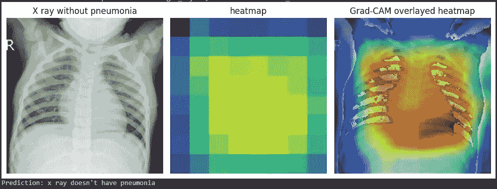
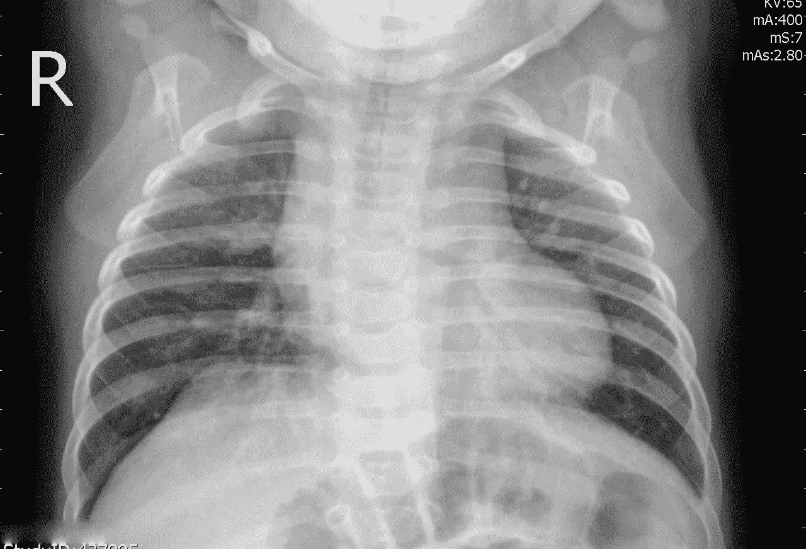
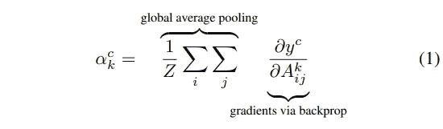
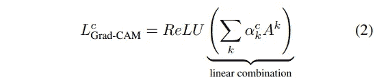
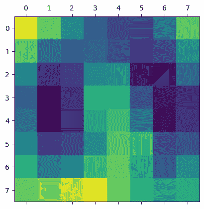
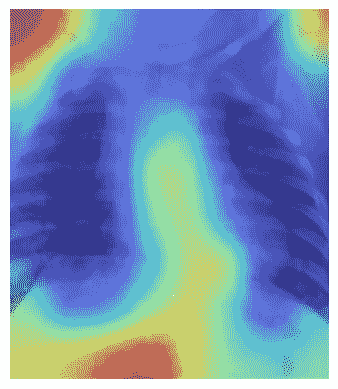
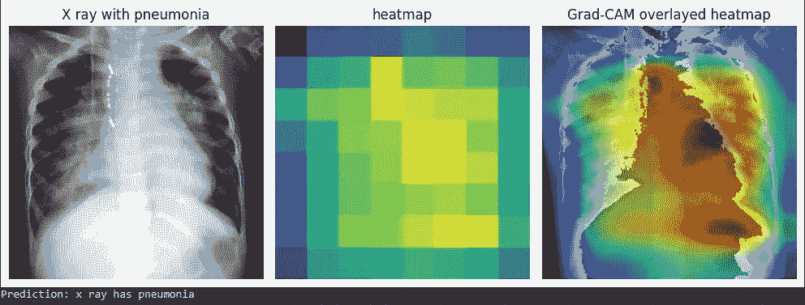

# Pytorch 中的 Grad-CAM：前向和反向钩子的使用

> 原文：[`towardsdatascience.com/grad-cam-in-pytorch-use-of-forward-and-backward-hooks-7eba5e38d569?source=collection_archive---------3-----------------------#2023-04-17`](https://towardsdatascience.com/grad-cam-in-pytorch-use-of-forward-and-backward-hooks-7eba5e38d569?source=collection_archive---------3-----------------------#2023-04-17)

## 使用梯度了解你的模型如何进行预测

[](https://medium.com/@almeida.va93?source=post_page-----7eba5e38d569--------------------------------)[](https://towardsdatascience.com/?source=post_page-----7eba5e38d569--------------------------------) [Vinícius Almeida](https://medium.com/@almeida.va93?source=post_page-----7eba5e38d569--------------------------------)

·

[关注](https://medium.com/m/signin?actionUrl=https%3A%2F%2Fmedium.com%2F_%2Fsubscribe%2Fuser%2Fa64bbd309&operation=register&redirect=https%3A%2F%2Ftowardsdatascience.com%2Fgrad-cam-in-pytorch-use-of-forward-and-backward-hooks-7eba5e38d569&user=Vin%C3%ADcius+Almeida&userId=a64bbd309&source=post_page-a64bbd309----7eba5e38d569---------------------post_header-----------) 发表在[Towards Data Science](https://towardsdatascience.com/?source=post_page-----7eba5e38d569--------------------------------) ·10 分钟阅读·2023 年 4 月 17 日[](https://medium.com/m/signin?actionUrl=https%3A%2F%2Fmedium.com%2F_%2Fvote%2Ftowards-data-science%2F7eba5e38d569&operation=register&redirect=https%3A%2F%2Ftowardsdatascience.com%2Fgrad-cam-in-pytorch-use-of-forward-and-backward-hooks-7eba5e38d569&user=Vin%C3%ADcius+Almeida&userId=a64bbd309&source=-----7eba5e38d569---------------------clap_footer-----------)

--

[](https://medium.com/m/signin?actionUrl=https%3A%2F%2Fmedium.com%2F_%2Fbookmark%2Fp%2F7eba5e38d569&operation=register&redirect=https%3A%2F%2Ftowardsdatascience.com%2Fgrad-cam-in-pytorch-use-of-forward-and-backward-hooks-7eba5e38d569&source=-----7eba5e38d569---------------------bookmark_footer-----------)

图片来源于作者。X 射线图像来自[kaggle 胸部 X 射线数据集](https://www.kaggle.com/datasets/paultimothymooney/chest-xray-pneumonia)。

我注意到一种叫做 Grad-CAM 的技术，它可以检查卷积神经网络如何预测其输出。例如，在分类器中，你可以洞察神经网络如何利用输入进行预测。这一切始于 [原始论文](https://arxiv.org/pdf/1610.02391.pdf)，其中描述了这一技术。在本文中，我们将使用 Pytorch 库实现这一技术，方法是你可以将其应用于任何卷积神经网络，而无需改变你已有的神经网络模块。

我在 Medium 上阅读了一篇文章，标题是 “[**在 PyTorch 中实现 Grad-CAM**](https://medium.com/@stepanulyanin/implementing-grad-cam-in-pytorch-ea0937c31e82)”，作者是 [Stepan Ulyanin](https://medium.com/u/5fb91fc37062?source=post_page-----7eba5e38d569--------------------------------)，这激发了我以稍微不同的方式实现相同的算法。Stepan 提出了一个方法，需要你重写模型的前向函数来计算 Grad-CAM。感谢 Pytorch，我们可以通过注册前向和反向钩子来实现相同的结果，而无需改变前向函数。我希望这篇文章对 Stepan 的精彩工作有所贡献。

让我们深入探讨吧！

## 1\. 加载并检查预训练模型

为了展示 Grad-CAM 的实现，我将使用 [Kaggle 上的胸部 X 光数据集](https://www.kaggle.com/datasets/paultimothymooney/chest-xray-pneumonia) 和我制作的一个预训练分类器，该分类器能够将 X 光图像分类为是否有肺炎。

```py
model_path = "your/model/path/"

# instantiate your model
model = XRayClassifier() 

# load your model. Here we're loading on CPU since we're not going to do 
# large amounts of inference
model.load_state_dict(torch.load(model_path, map_location=torch.device('cpu'))) 

# put it in evaluation mode for inference
model.eval()
```

接下来，让我们检查模型的架构。由于我们希望了解输入图像的哪些方面对预测有所贡献，我们需要确定最后一个卷积层，特别是它的激活函数。这个层包含了模型学习到的最复杂特征的表示。因此，它最能帮助我们理解模型的行为。

```py
import torch
import torch.nn as nn
import torch.nn.functional as F

# hyperparameters
nc = 3 # number of channels
nf = 64 # number of features to begin with
dropout = 0.2
device = torch.device('cuda' if torch.cuda.is_available() else 'cpu')

# setup a resnet block and its forward function
class ResNetBlock(nn.Module):
    def __init__(self, in_channels, out_channels, stride=1):
        super(ResNetBlock, self).__init__()
        self.conv1 = nn.Conv2d(in_channels, out_channels, kernel_size=3, stride=stride, padding=1, bias=False)
        self.bn1 = nn.BatchNorm2d(out_channels)
        self.conv2 = nn.Conv2d(out_channels, out_channels, kernel_size=3, stride=1, padding=1, bias=False)
        self.bn2 = nn.BatchNorm2d(out_channels)

        self.shortcut = nn.Sequential()
        if stride != 1 or in_channels != out_channels:
            self.shortcut = nn.Sequential(
                nn.Conv2d(in_channels, out_channels, kernel_size=1, stride=stride, bias=False),
                nn.BatchNorm2d(out_channels)
            )

    def forward(self, x):
        out = F.relu(self.bn1(self.conv1(x)))
        out = self.bn2(self.conv2(out))
        out += self.shortcut(x)
        out = F.relu(out)
        return out

# setup the final model structure
class XRayClassifier(nn.Module):
    def __init__(self, nc=nc, nf=nf, dropout=dropout):
        super(XRayClassifier, self).__init__()

        self.resnet_blocks = nn.Sequential(
            ResNetBlock(nc,   nf,    stride=2), # (B, C, H, W) -> (B, NF, H/2, W/2), i.e., (64,64,128,128)
            ResNetBlock(nf,   nf*2,  stride=2), # (64,128,64,64)
            ResNetBlock(nf*2, nf*4,  stride=2), # (64,256,32,32)
            ResNetBlock(nf*4, nf*8,  stride=2), # (64,512,16,16)
            ResNetBlock(nf*8, nf*16, stride=2), # (64,1024,8,8)
        )

        self.classifier = nn.Sequential(
            nn.Conv2d(nf*16, 1, 8, 1, 0, bias=False),
            nn.Dropout(p=dropout),
            nn.Sigmoid(),
        )

    def forward(self, input):
        output = self.resnet_blocks(input.to(device))
        output = self.classifier(output)
        return output
```

该模型设计为接收 256x256 的 3 通道图像。因此，它的输入预期具有 [batch size, 3, 256, 256] 的形状。每个 ResNet 块以 ReLU 激活函数结束。为了我们的目标，我们需要选择最后一个 ResNet 块。

```py
XRayClassifier(
  (resnet_blocks): Sequential(
    (0): ResNetBlock(
      (conv1): Conv2d(3, 64, kernel_size=(3, 3), stride=(2, 2), padding=(1, 1), bias=False)
      (bn1): BatchNorm2d(64, eps=1e-05, momentum=0.1, affine=True, track_running_stats=True)
      (conv2): Conv2d(64, 64, kernel_size=(3, 3), stride=(1, 1), padding=(1, 1), bias=False)
      (bn2): BatchNorm2d(64, eps=1e-05, momentum=0.1, affine=True, track_running_stats=True)
      (shortcut): Sequential(
        (0): Conv2d(3, 64, kernel_size=(1, 1), stride=(2, 2), bias=False)
        (1): BatchNorm2d(64, eps=1e-05, momentum=0.1, affine=True, track_running_stats=True)
      )
    )
    (1): ResNetBlock(
      (conv1): Conv2d(64, 128, kernel_size=(3, 3), stride=(2, 2), padding=(1, 1), bias=False)
      (bn1): BatchNorm2d(128, eps=1e-05, momentum=0.1, affine=True, track_running_stats=True)
      (conv2): Conv2d(128, 128, kernel_size=(3, 3), stride=(1, 1), padding=(1, 1), bias=False)
      (bn2): BatchNorm2d(128, eps=1e-05, momentum=0.1, affine=True, track_running_stats=True)
      (shortcut): Sequential(
        (0): Conv2d(64, 128, kernel_size=(1, 1), stride=(2, 2), bias=False)
        (1): BatchNorm2d(128, eps=1e-05, momentum=0.1, affine=True, track_running_stats=True)
      )
    )
    (2): ResNetBlock(
      (conv1): Conv2d(128, 256, kernel_size=(3, 3), stride=(2, 2), padding=(1, 1), bias=False)
      (bn1): BatchNorm2d(256, eps=1e-05, momentum=0.1, affine=True, track_running_stats=True)
      (conv2): Conv2d(256, 256, kernel_size=(3, 3), stride=(1, 1), padding=(1, 1), bias=False)
      (bn2): BatchNorm2d(256, eps=1e-05, momentum=0.1, affine=True, track_running_stats=True)
      (shortcut): Sequential(
        (0): Conv2d(128, 256, kernel_size=(1, 1), stride=(2, 2), bias=False)
        (1): BatchNorm2d(256, eps=1e-05, momentum=0.1, affine=True, track_running_stats=True)
      )
    )
    (3): ResNetBlock(
      (conv1): Conv2d(256, 512, kernel_size=(3, 3), stride=(2, 2), padding=(1, 1), bias=False)
      (bn1): BatchNorm2d(512, eps=1e-05, momentum=0.1, affine=True, track_running_stats=True)
      (conv2): Conv2d(512, 512, kernel_size=(3, 3), stride=(1, 1), padding=(1, 1), bias=False)
      (bn2): BatchNorm2d(512, eps=1e-05, momentum=0.1, affine=True, track_running_stats=True)
      (shortcut): Sequential(
        (0): Conv2d(256, 512, kernel_size=(1, 1), stride=(2, 2), bias=False)
        (1): BatchNorm2d(512, eps=1e-05, momentum=0.1, affine=True, track_running_stats=True)
      )
    )
    **(4): ResNetBlock(
      (conv1): Conv2d(512, 1024, kernel_size=(3, 3), stride=(2, 2), padding=(1, 1), bias=False)
      (bn1): BatchNorm2d(1024, eps=1e-05, momentum=0.1, affine=True, track_running_stats=True)
      (conv2): Conv2d(1024, 1024, kernel_size=(3, 3), stride=(1, 1), padding=(1, 1), bias=False)
      (bn2): BatchNorm2d(1024, eps=1e-05, momentum=0.1, affine=True, track_running_stats=True)
      (shortcut): Sequential(
        (0): Conv2d(512, 1024, kernel_size=(1, 1), stride=(2, 2), bias=False)
        (1): BatchNorm2d(1024, eps=1e-05, momentum=0.1, affine=True, track_running_stats=True)
      )
    )**
  )
  (classifier): Sequential(
    (0): Conv2d(1024, 1, kernel_size=(8, 8), stride=(1, 1), bias=False)
    (1): Dropout(p=0.2, inplace=False)
    (2): Sigmoid()
  )
)
```

在 Pytorch 中，我们可以使用模型的属性轻松完成这个选择。

```py
model.resnet_blocks[-1]
#ResNetBlock(
#  (conv1): Conv2d(512, 1024, kernel_size=(3, 3), stride=(2, 2), padding=(1, 1), bias=False)
#  (bn1): BatchNorm2d(1024, eps=1e-05, momentum=0.1, affine=True, track_running_stats=True)
#  (conv2): Conv2d(1024, 1024, kernel_size=(3, 3), stride=(1, 1), padding=(1, 1), bias=False)
#  (bn2): BatchNorm2d(1024, eps=1e-05, momentum=0.1, affine=True, track_running_stats=True)
#  (shortcut): Sequential(
#    (0): Conv2d(512, 1024, kernel_size=(1, 1), stride=(2, 2), bias=False)
#    (1): BatchNorm2d(1024, eps=1e-05, momentum=0.1, affine=True, track_running_stats=True)
#  )
#)
```

## 2\. Pytorch 方法用于注册钩子

Pytorch 有许多函数用于处理钩子，这些函数允许你处理在前向或反向传递过程中流经模型的信息。你可以用它来检查中间梯度值，对特定层的输出进行更改等。

在这里，我们将重点关注 *nn.Module* 类的两种方法。让我们仔细看看它们。

[**2.1\. register_full_backward_hook(*hook*, *prepend=False*)**](https://pytorch.org/docs/stable/generated/torch.nn.Module.html#torch.nn.Module.register_full_backward_hook)

该方法在模块上注册了一个反向钩子，这意味着当调用*backward()*方法时，钩子函数将运行。

反向钩子函数接受模块自身、相对于层输入的梯度和相对于层输出的梯度作为输入。

```py
hook(module, grad_input, grad_output) -> tuple(Tensor) or None
```

它返回一个*torch.utils.hooks.RemovableHandle*，这使得你可以稍后移除钩子。因此，将其分配给变量是有用的。我们稍后会回到这个问题。

[**2.2\. register_forward_hook(*hook*, ***, *prepend=False*, *with_kwargs=False*)**](https://pytorch.org/docs/stable/generated/torch.nn.Module.html?highlight=register_forward_hook#torch.nn.Module.register_forward_hook)

这与之前的钩子函数类似，只是钩子函数在前向传递中运行，即在感兴趣的层处理其输入并返回输出时运行。

钩子函数的签名稍有不同。它使你能够访问层的输出：

```py
hook(module, args, output) -> None or modified output
```

它还返回一个*torch.utils.hooks.RemovableHandle*。

## 3\. 将反向和前向钩子添加到模型中

首先，我们需要定义我们的反向和前向钩子函数。要计算 Grad-CAM，我们需要相对于最后一个卷积层输出的梯度，以及其激活，即该层激活函数的输出。因此，我们的钩子函数将在推理和反向传递过程中仅提取这些值。

```py
# defines two global scope variables to store our gradients and activations
gradients = None
activations = None

def backward_hook(module, grad_input, grad_output):
  global gradients # refers to the variable in the global scope
  print('Backward hook running...')
  gradients = grad_output
  # In this case, we expect it to be torch.Size([batch size, 1024, 8, 8])
  print(f'Gradients size: {gradients[0].size()}') 
  # We need the 0 index because the tensor containing the gradients comes
  # inside a one element tuple.

def forward_hook(module, args, output):
  global activations # refers to the variable in the global scope
  print('Forward hook running...')
  activations = output
  # In this case, we expect it to be torch.Size([batch size, 1024, 8, 8])
  print(f'Activations size: {activations.size()}')
```

在定义了我们的钩子函数和将存储激活和梯度的变量之后，我们需要在感兴趣的层上注册钩子：

```py
backward_hook = model.resnet_blocks[-1].register_full_backward_hook(backward_hook, prepend=False)
forward_hook = model.resnet_blocks[-1].register_forward_hook(forward_hook, prepend=False)
```

## 4\. 获取我们需要的梯度和激活

现在我们已经为模型设置了钩子，让我们加载一张图像，计算 Grad-CAM。

```py
from PIL import Image

img_path = "/your/image/path/"
image = Image.open(img_path).convert('RGB')
```



这是我们将要使用的图像。图像来源于[kaggle 胸部 X 光数据集](https://www.kaggle.com/datasets/paultimothymooney/chest-xray-pneumonia)。

我们需要对其进行预处理，以准备好输入模型进行推理。

```py
from torchvision import transforms
from torchvision.transforms import ToTensor

image_size = 256
transform = transforms.Compose([
                               transforms.Resize(image_size, antialias=True),
                               transforms.CenterCrop(image_size),
                               transforms.ToTensor(),
                               transforms.Normalize((0.5, 0.5, 0.5), (0.5, 0.5, 0.5)),
                           ])

img_tensor = transform(image) # stores the tensor that represents the image
```

现在，我们需要使用这个图像张量进行前向传递。并且我们必须执行反向传递，以使反向钩子发挥作用。

```py
# since we're feeding only one image, it is a 3d tensor (3, 256, 256). 
# we need to unsqueeze to it has 4 dimensions (1, 3, 256, 256) as 
# the model expects it to.
model(img_tensor.unsqueeze(0)).backward()
# here we did the forward and the backward pass in one line.
```

我们的钩子函数返回了以下内容：

```py
Forward hook running...
Activations size: torch.Size([1, 1024, 8, 8])
Backward hook running...
Gradients size: torch.Size([1, 1024, 8, 8])
```

最终，我们可以使用*梯度*和*激活*变量来计算我们的热图！

## 5\. 计算 Grad-CAM

要计算 Grad-CAM，我们将使用原始论文的公式和[Stepan Ulyanin](https://medium.com/u/5fb91fc37062?source=post_page-----7eba5e38d569--------------------------------)的实现。



图像摘自[原始文章](https://arxiv.org/pdf/1610.02391.pdf)

```py
# pool the gradients across the channels
pooled_gradients = torch.mean(gradients[0], dim=[0, 2, 3])
```



图像摘自[原始文章](https://arxiv.org/pdf/1610.02391.pdf)

```py
import torch.nn.functional as F
import matplotlib.pyplot as plt

# weight the channels by corresponding gradients
for i in range(activations.size()[1]):
    activations[:, i, :, :] *= pooled_gradients[i]

# average the channels of the activations
heatmap = torch.mean(activations, dim=1).squeeze()

# relu on top of the heatmap
heatmap = F.relu(heatmap)

# normalize the heatmap
heatmap /= torch.max(heatmap)

# draw the heatmap
plt.matshow(heatmap.detach())
```



这是我们的热图。图像由作者提供。

值得注意的是，我们通过前向钩子获得的激活包含 1,024 个特征图，每个特征图捕捉输入图像的不同方面，每个特征图的空间分辨率为 8x8。

另一方面，我们通过反向钩子获得的梯度代表了每个特征图对最终预测的重要性。通过计算梯度和激活的逐元素乘积，我们得到特征图的加权和，突出显示图像中最相关的部分。

最后，通过计算加权特征图的全局平均值，我们得到一个单一的热图，指示出对模型预测最重要的图像区域。这种技术被称为 Grad-CAM，提供了对模型决策过程的视觉解释，有助于我们解读和调试模型的行为。

## 6\. 结合原始图像和热图

以下代码将一张图像叠加在另一张图像上。

```py
from torchvision.transforms.functional import to_pil_image
from matplotlib import colormaps
import numpy as np
import PIL

# Create a figure and plot the first image
fig, ax = plt.subplots()
ax.axis('off') # removes the axis markers

# First plot the original image
ax.imshow(to_pil_image(img_tensor, mode='RGB'))

# Resize the heatmap to the same size as the input image and defines
# a resample algorithm for increasing image resolution
# we need heatmap.detach() because it can't be converted to numpy array while
# requiring gradients
overlay = to_pil_image(heatmap.detach(), mode='F')
                      .resize((256,256), resample=PIL.Image.BICUBIC)

# Apply any colormap you want
cmap = colormaps['jet']
overlay = (255 * cmap(np.asarray(overlay) ** 2)[:, :, :3]).astype(np.uint8)

# Plot the heatmap on the same axes, 
# but with alpha < 1 (this defines the transparency of the heatmap)
ax.imshow(overlay, alpha=0.4, interpolation='nearest', extent=extent)

# Show the plot
plt.show()
```



这是结果。由于这是正常的 X 光片，模型主要关注于正常 X 光片中预期的正常结构。图片由作者提供。



在另一个例子中，我们有一张肺炎的 X 光片。Grad-CAM 正确地显示了医生必须检查的胸部 X 光片区域，以确认肺炎的存在。图片由作者提供。X 光图像来自[kaggle 胸部 X 光数据集](https://www.kaggle.com/datasets/paultimothymooney/chest-xray-pneumonia)。

最后，要从你的模型中移除钩子，你只需在每个句柄中调用*remove*方法。

```py
backward_hook.remove()
forward_hook.remove()
```

## 结论

我希望这篇文章有助于澄清 Grad-CAM 的工作原理、如何使用 Pytorch 实现它，以及如何通过使用前向和反向钩子而不改变原始模型的前向函数来实现它。

我要感谢[Stepan Ulyanin](https://medium.com/u/5fb91fc37062?source=post_page-----7eba5e38d569--------------------------------)的文章，并感谢他帮助我更好地理解 Grad-CAM。我希望我也能为读者贡献一些东西。

我还想推荐 Python 库 torch-cam 作为参考。它有 Grad-CAM 的其他实现，因此你不需要从头开始做这个。

[](https://github.com/frgfm/torch-cam?source=post_page-----7eba5e38d569--------------------------------) [## GitHub - frgfm/torch-cam: 用于 PyTorch 模型的类别激活图（CAM、Grad-CAM、Grad-CAM++…

### 在 PyTorch 中利用卷积层的类别特定激活的简单方法。来源：woopets 的图片…

github.com](https://github.com/frgfm/torch-cam?source=post_page-----7eba5e38d569--------------------------------)
