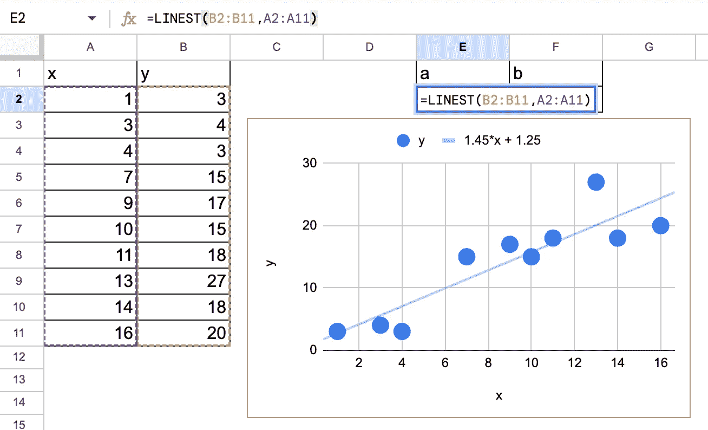

# 在 Excel 中进行梯度提升线性回归

> 原文：[`towardsdatascience.com/gradient-boosted-linear-regression-in-excel-a08522f13d6a`](https://towardsdatascience.com/gradient-boosted-linear-regression-in-excel-a08522f13d6a)

## 为了更好地理解梯度提升

 [Angela 和 Kezhan Shi](https://medium.com/@angela.shi?source=post_page-----a08522f13d6a--------------------------------)

·发表于 [Towards Data Science](https://towardsdatascience.com/?source=post_page-----a08522f13d6a--------------------------------) ·阅读时间 7 分钟·2023 年 3 月 17 日

--

梯度提升是一种通常应用于决策树的集成方法。它如此常见，以至于我们通常用**梯度提升**来指代**梯度提升决策树**。例如，在 scikit-learn 中，估算器 GradientBoostingRegressor 或 GradientBoostingClassifier 使用决策树。然而，作为一种集成方法，它也可以应用于其他基础模型，如**线性回归**。但有一个显而易见的结论，你可能已经知道：

> 梯度提升线性回归就是，嗯，线性回归。

但实现它仍然很有趣，而且我们将通过 Excel 来完成它，因此即使你不熟悉编程复杂算法，你也能理解这些算法步骤。

# 机器学习的三步法

我写了 [一篇文章来始终区分机器学习的三个步骤，以有效学习](https://medium.com/towards-data-science/machine-learning-in-three-steps-how-to-efficiently-learn-it-aefcf423a9e1)，让我们将这个原则应用到梯度提升线性回归中，这里是三个步骤：

+   **1. 模型：线性回归** 是一种机器学习模型，因为它接受输入（特征）来预测输出。

+   **1bis. 集成方法：梯度提升** 是一种集成方法，它本身并不是一个模型（因为它不直接接受输入来预测目标变量的输出）。它必须应用于某个基础模型来创建一个元模型。这里我们将创建一个梯度提升的线性回归元模型。

+   **2\. 模型拟合：**线性回归必须进行拟合，这意味着其系数必须针对给定的训练数据集进行优化。**梯度下降**是一种可以应用于线性回归的拟合算法。但它并不是唯一的。在线性回归的情况下，有一个可以用数学公式表示的精确解。还值得注意的是，集成方法没有拟合算法。

+   **3\. 模型调整**包括优化模型或元模型的超参数。在这里，我们将遇到两个超参数：梯度提升算法的学习率和步骤数。

这是三步搞定的机器学习！

# 作为基础模型的简单线性回归

在这里，我们将使用一个简单的线性回归作为基础模型，并使用一个包含十个观察值的简单数据集。我们将重点关注梯度提升部分，对于拟合，我们将使用 Google Sheet 中的一个函数（在 Excel 中也适用）：LINEST 来估计线性回归的系数。

梯度提升的线性回归 \ 简单数据集与线性回归 — 作者图像

我将使用 Google Sheet 来演示本文中梯度提升的实现过程。如果你想访问这个表格以及我开发的其他表格——例如带有梯度下降的线性回归、逻辑回归、具有反向传播的神经网络、KNN、k-means 等——请考虑在 Ko-fi 上支持我。你可以在以下链接找到所有这些资源：[`ko-fi.com/s/4ddca6dff1`](https://ko-fi.com/s/4ddca6dff1)

# 梯度提升算法

这是梯度提升算法的主要步骤

1.  初始化：我们将选择平均值作为梯度提升算法的第一步。

1.  残差误差计算：我们计算预测值（对于第一步，它是平均值）和训练数据中的实际值之间的残差误差。

1.  拟合残差的线性回归：我们创建一个线性回归模型来拟合残差。

1.  将新模型添加到集成中：将之前的模型和新模型结合起来，创建一个新的集成模型。在这里，我们必须将学习率或收缩作为超参数应用于弱模型。

1.  重复过程：重复步骤 2–4，直到达到指定的提升阶段数或直到误差收敛。

就这样！这是应用于线性回归的梯度提升的基本过程。我想以简单的方式描述，并且我们可以写一些方程式来说明每次迭代：

+   步骤 1：f0 = 实际 y 的平均值

+   步骤 2：resd1 = y — f0

+   步骤 3：resdfit1 = a0 x + b0 以预测 y — f0

+   步骤 4：f1 = f0 — learning_rate * (a0 x + b0)

+   步骤 2–2：resd2 = y — f1

+   步骤 3–2：resdfit2 = a1 x + b1 以预测 y — f1

+   步骤 4–2：f2 = f1-learning_rate * (a1 x + b1)，可以展开为：f0 — learning_rate * (a0 x + b0) — learning_rate * (a1 x + b1)

+   …

# 与梯度提升树的比较

如果你仔细查看上一节的算法，你可能会注意到两个奇怪的现象。

首先，在第 2 步中，我们将线性回归拟合到残差上，这需要时间和算法步骤来实现模型拟合步骤，而不是将线性回归拟合到残差上，我们可以直接将线性回归拟合到 y 的实际值上，我们已经会找到最终的最佳模型！

其次，当将一个线性回归添加到另一个线性回归时，它仍然是线性回归。

例如，我们可以将 f2 重写为：f2 = f0 — learning_rate * (b0+b1) — learning_rate * (a0+a1) x

那就是线性回归！

对于决策树，这两种奇怪的情况不会发生，因为将一棵树添加到另一棵树上与将一棵树进一步生长是不一样的。

在进入实现部分之前，还有一个问题：如果我们将学习率设置为 1，会发生什么？梯度提升线性回归会怎样？

# 梯度提升线性回归实现

在 Google Sheet 或 Excel 中实现这些公式是直接的。

下表展示了训练数据集以及梯度提升步骤的不同阶段

在 Excel 中进行的梯度提升线性回归 — 作者图像

对于每一步拟合，我们使用 Excel 函数 LINEST

带有系数估计公式的梯度提升线性回归 — 作者图像

我们只进行 2 次迭代，我们可以猜测更多迭代的情况。下面是一个图形，展示了每次迭代的模型。不同的红色阴影展示了模型的收敛情况，我们还展示了通过梯度下降直接应用于 y 找到的最终模型。

梯度提升线性回归 — 作者图像

# 调整超参数

我们可以调整两个超参数：迭代次数和学习率。

对于迭代次数，我们只实施了两个，但很容易想象更多的情况，我们可以通过检查残差的大小来停止。

对于学习率，我们可以在 Google Sheet 中进行调整，看看会发生什么。当学习率很小时，“学习过程”将会很慢。如果学习率为 1，我们可以看到收敛在第 1 次迭代时就达到了。

学习率 =1 的梯度提升线性回归 — 作者图像

并且第 1 次迭代的残差已经是零。

学习率 =1 的梯度提升线性回归 — 作者图像

如果学习率高于 1，模型将会发散。

梯度提升线性回归的发散—— 作者提供的图像

# 与梯度下降算法的比较

梯度提升中的学习率和迭代次数的工作方式与梯度下降非常相似……哦，等等，它们非常相似，实际上是相同的算法！在经典梯度下降的情况下，该算法应用于模型的参数，如线性回归的权重或系数。而在梯度提升的情况下，该算法应用于模型。

即使“提升”这个词只意味着“添加”，它与经典梯度下降算法中的步骤完全相同，都是从初始（随机选择的）起点一步步添加下降步骤。

如果你还不信服，可以阅读这篇关于[梯度下降与梯度提升的对比：逐步比较](https://medium.com/towards-data-science/gradient-descent-vs-gradient-boosting-a-side-by-side-comparison-7067bb3c5712)的文章。

# **结论**

我希望你对梯度提升的工作原理有了更多的了解。以下是主要要点。

+   Excel 是理解算法如何工作的绝佳方式。

+   梯度提升是一种集成方法，可以应用于任何基础模型。

+   梯度提升在某种意义上与梯度下降相同，因为它们是相同的算法，但应用于不同的对象：参数与函数或模型。

+   梯度提升可以应用于线性回归，但这只是为了理解算法，因为在实际应用中你并不需要这样做，因为梯度提升线性回归就是线性回归。

我写关于机器学习和数据科学的文章，并尝试以清晰的方式简化复杂的概念。请通过下面的链接关注我，并获得我文章的完整访问权限：[`medium.com/@angela.shi/membership`](https://medium.com/@angela.shi/membership)
