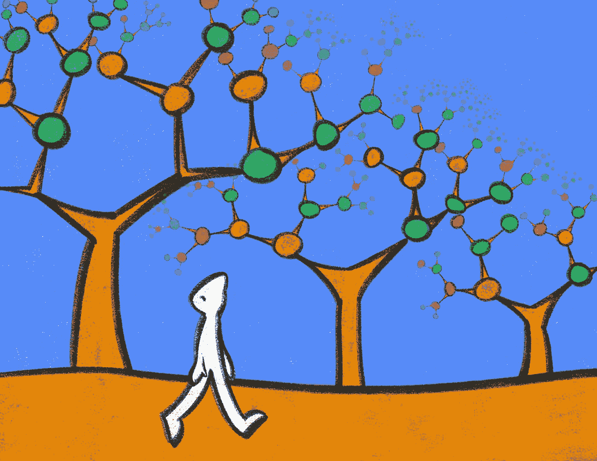

# **梯度提升：预测中的银弹**

> 原文：[`towardsdatascience.com/gradient-boosting-a-silver-bullet-in-forecasting-5820ba7182fd?source=collection_archive---------7-----------------------#2023-07-20`](https://towardsdatascience.com/gradient-boosting-a-silver-bullet-in-forecasting-5820ba7182fd?source=collection_archive---------7-----------------------#2023-07-20)

## 我们展示了梯度提升在时间序列预测中非常强大，并试图解释其原因。

 [Davide Burba](https://medium.com/@davide.burba?source=post_page-----5820ba7182fd--------------------------------)

·

[关注](https://medium.com/m/signin?actionUrl=https%3A%2F%2Fmedium.com%2F_%2Fsubscribe%2Fuser%2F9f58aaaeaed7&operation=register&redirect=https%3A%2F%2Ftowardsdatascience.com%2Fgradient-boosting-a-silver-bullet-in-forecasting-5820ba7182fd&user=Davide+Burba&userId=9f58aaaeaed7&source=post_page-9f58aaaeaed7----5820ba7182fd---------------------post_header-----------) 发表在 [Towards Data Science](https://towardsdatascience.com/?source=post_page-----5820ba7182fd--------------------------------) ·6 分钟阅读·2023 年 7 月 20 日

--

“梯度提升”，由 [Giulia Roggia](https://www.instagram.com/giulia_roggia__/)。经许可使用。

+   什么是梯度提升？

+   梯度提升作为银弹

+   为什么梯度提升如此出色？

+   需要注意的事项

+   附录：竞赛及已发布解决方案列表

时间序列预测在许多领域中至关重要，包括金融、销售和天气预测。虽然经典的时间序列模型和深度学习技术已被广泛使用，但越来越多的证据表明梯度提升往往优于其他方法。

# 什么是梯度提升？

[梯度提升](https://en.wikipedia.org/wiki/Gradient_boosting)是一种机器学习技术，通过以序列方式组合一组弱学习器来构建预测模型。它旨在通过逐步减少前一模型所犯的错误来创建一个强学习器。核心思想是将后续模型拟合到前一模型的残差上，逐渐通过每次迭代来改进预测。
