# 从理论到实践的梯度提升（第一部分）

> 原文：[`towardsdatascience.com/gradient-boosting-from-theory-to-practice-part-1-940b2c9d8050`](https://towardsdatascience.com/gradient-boosting-from-theory-to-practice-part-1-940b2c9d8050)

## 理解流行梯度提升算法背后的数学原理以及如何在实践中使用它

[](https://medium.com/@roiyeho?source=post_page-----940b2c9d8050--------------------------------)[](https://towardsdatascience.com/?source=post_page-----940b2c9d8050--------------------------------) [Dr. Roi Yehoshua](https://medium.com/@roiyeho?source=post_page-----940b2c9d8050--------------------------------)

·发表于 [Towards Data Science](https://towardsdatascience.com/?source=post_page-----940b2c9d8050--------------------------------) ·阅读时间 19 分钟·2023 年 7 月 11 日

--


图片由[Jens Lelie](https://unsplash.com/@madebyjens?utm_source=unsplash&utm_medium=referral&utm_content=creditCopyText)提供，出处：[Unsplash](https://unsplash.com/photos/u0vgcIOQG08?utm_source=unsplash&utm_medium=referral&utm_content=creditCopyText)

梯度提升是一种广泛使用的机器学习技术，基于**提升**和**梯度下降**的结合。

Boosting 是一种[集成方法](https://medium.com/towards-artificial-intelligence/introduction-to-ensemble-methods-226a5a421687)，通过将多个弱学习者（或基本学习者）结合起来创建强预测模型。基本模型是按顺序训练的，每个模型侧重于纠正前一个模型的错误。

在**梯度提升**中，每个基本模型被训练以预测相对于前一个模型预测的损失函数的负梯度。因此，将新训练的基本学习者添加到集成中，会朝着损失最小值的最陡下降方向前进。这个过程类似于梯度下降，但它在函数空间中操作而不是参数空间中。因此，它被称为**函数梯度下降**。

当弱学习者是[决策树](https://medium.com/@roiyeho/decision-trees-part-1-da4e613d2369)时，所得的方法称为**梯度提升决策树**（GBDT）或**梯度提升机**（GBM）。

梯度提升是当前处理结构化（表格）数据的最佳算法之一，并在许多标准分类基准上提供了最先进的结果。与深度学习一起，它是 Kaggle 竞赛中最常用的算法之一。

梯度提升算法最初由 Jerome Freidman 于 2001 年开发[1]。从那时起，它演变成了一系列算法，包括 XGBoost、CatBoost 和 LightGBM。这些算法的变体包含了各种改进，进一步提升了梯度提升的性能和可扩展性。

本文将深入探讨梯度提升的理论和实现。在文章的第一部分，我们将关注梯度提升的理论概念，展示算法的伪代码，并在一个小的数值示例中演示其使用。在第二部分中，我们将探索 Scikit-Learn 中实现梯度提升的类，并使用它们来解决不同的回归和分类任务。

# 直观介绍

作为提醒，在[监督机器学习](https://medium.com/@roiyeho/introduction-to-supervised-machine-learning-313730eb5aa2)问题中，我们给定了一个 *n* 个标记样本的训练集： *D* = {(**x**₁, *y*₁), (**x**₂, *y*₂), … , (**x***ₙ, yₙ*)}，其中 **x***ᵢ* 是一个 *m* 维向量，包含样本 *i* 的特征， *yᵢ* 表示该样本的标签。我们的目标是建立一个模型，其预测尽可能接近真实标签。

在我们的初步讨论中，我们假设学习问题是回归问题，即目标 *yᵢ* 是连续值。

梯度提升的基本思想是构建一个弱模型的集合，每个模型都被训练来预测前一个模型的残差。这个过程可以描述如下：

1.  将基础模型 *h*₁(**x**) 拟合到给定标签 *y* 上。

1.  将初始集合设置为 *F*₁(**x**) = *h*₁(**x**)。

1.  将基础模型 *h*₂(**x**) 拟合到残差 *y* − *F*₁(**x**) 上。

1.  将这两个模型组合成一个新的集合： *F*₂(**x**) = *h*₁(**x**) + *h*₂(**x**)。 *F*₂(**x**) 的预测应比 *F*₁(**x**) 更接近目标。

1.  将基础模型 *h*₃(**x**) 拟合到残差 *y* − *F*₂(**x**) 上。

1.  将这三个模型组合成一个新的集合： *F*₃(**x**) = *h*₁(**x**) + *h*₂(**x**) + *h*₃(**x**)。 *F*₃(**x**) 的预测应比 *F*₂(**x**) 更接近目标。

1.  继续这个过程 *M* 步。

1.  返回 *F*ₘ(**x**) 作为最终假设。

我们可以通过手动构建一系列回归树来在 Python 中演示这个过程，每棵树都被训练来预测前面树的残差。

首先生成一些有噪声的二次训练集：

```py
n_samples = 100
X = np.random.rand(n_samples, 1) - 0.5
y = 5 * X[:, 0] ** 2 + 0.1 * np.random.randn(n_samples)

plt.scatter(X, y, s=20)
```

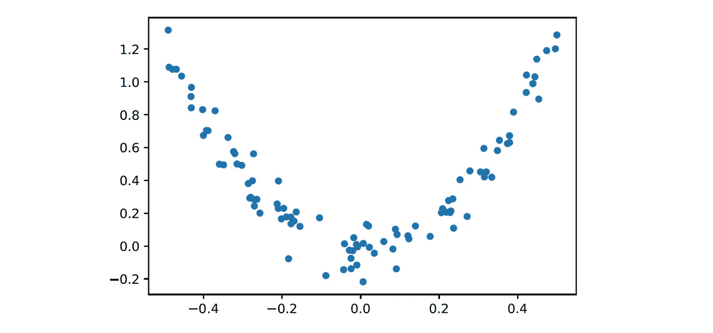

训练数据

我们的基础学习器将是最大深度为 2 的决策树。第一个决策树 *h*₁ 适合给定的数据集：

```py
h1 = DecisionTreeRegressor(max_depth=2)
h1.fit(X, y)
```

第一个集合 *F*₁ 由这棵单独的树组成，它在训练集上的 *R*² 分数为：

```py
F1 = [h1]  # ensemble of one tree
F1_pred = h1.predict(X)
print(f'R2 score of F1: {r2_score(y, F1_pred):.4f}')
```

```py
R2 score of F1: 0.7819
```

第二棵树 *h*₂ 被拟合到第一棵树的残差错误上：

```py
h2 = DecisionTreeRegressor(max_depth=2)
y2 = y - F1_pred
h2.fit(X, y2)
```

*h*₂ 被添加到集成中以创建第二个集成 *F*₂。我们可以通过简单地将两棵树的预测结果相加来使用 *F*₂ 进行预测：

```py
F2 = [h1, h2] # ensemble of two trees
F2_pred = sum(h.predict(X) for h in F2)
print(f'R2 score of F2: {r2_score(y, F2_pred):.4f}')
```

```py
R2 score of F2: 0.8802
```

最后，一个第三棵树 *h*₃ 被拟合到第二个集成 *F*₂ 的残差上，然后添加到集成中：

```py
h3 = DecisionTreeRegressor(max_depth=2)
y3 = y - F2_pred
h3.fit(X, y3)

F3 = [h1, h2, h3] # ensemble of three trees
F3_pred = sum(h.predict(X) for h in F3)
print(f'R2 score of F3: {r2_score(y, F3_pred):.4f}')
```

```py
R2 score of F3: 0.9124
```

注意，随着我们将更多树添加到集成中，模型的 *R*² 分数是如何逐渐增加的。

让我们在每次迭代后绘制残差和集成的预测结果：

```py
fig, axes = plt.subplots(2, 3, sharex=True, sharey=True, figsize=(12, 7))
X_test = np.linspace(-0.5, 0.5, 500).reshape(-1, 1)

for i, h, residuals in zip([0, 1, 2], [h1, h2, h3], [y, y2, y3]):
    ax = axes[0, i]
    y_test_pred = h.predict(X_test)
    ax.scatter(X, residuals, c='k', s=20, marker='x', label='Residuals')
    ax.plot(X_test, y_test_pred, 'r', linewidth=2)
    ax.set_title(f'$h_{i + 1}(x)$')
    ax.legend(loc='upper center')

for i, ensemble in enumerate([F1, F2, F3]):
    ax = axes[1, i]
    y_test_pred = sum(h.predict(X_test) for h in ensemble)
    ax.scatter(X, y, s=20, label='Training set')
    ax.plot(X_test, y_test_pred, 'm', linewidth=2)
    ax.set_title(f'$F_{i + 1}(x)$')
    ax.legend(loc='upper center')
```

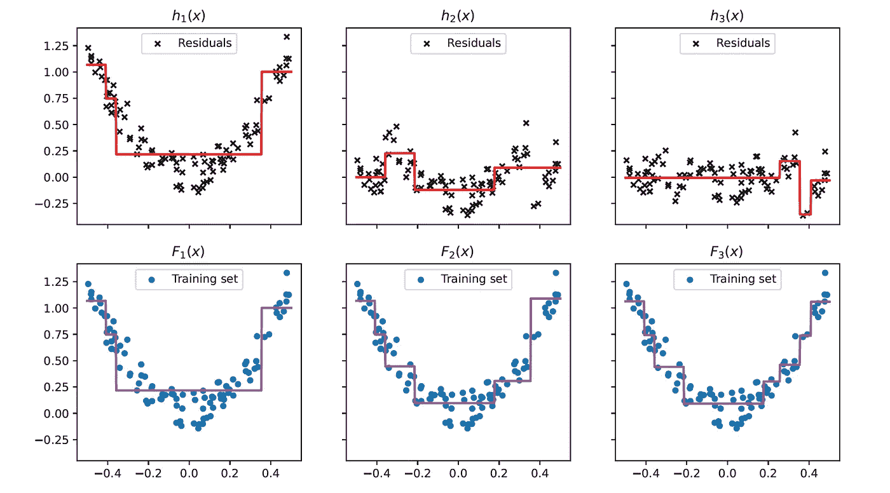

每次提升迭代后的基础学习器和集成

我们可以看到，随着更多树的加入，集成的预测逐渐改进。

梯度提升对其他类型问题（例如分类问题）和其他损失函数的推广来源于观察到残差 *hₘ*(**x***ᵢ*) 与平方损失函数关于 *Fₘ*₋₁(**x***ᵢ*) 的负梯度成比例：

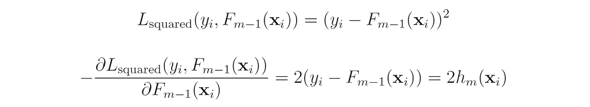

因此，我们可以通过使用损失函数的负梯度而不是残差，将此技术推广到任何可微损失函数。

# 梯度提升算法

我们现在将推导出适用于任何可微损失函数的一般梯度提升算法。

提升通过 **加法扩展**（集成）的形式来逼近特征到标签 *y* = *f*(**x**) 的真实映射：


其中 *hₘ*(**x**) 是来自某个类别 *H* 的基础学习器（通常是固定大小的决策树），*M* 是学习器的数量。

给定损失函数 *L*(*y*, *F*(**x**))，我们的目标是找到一个近似 *F*(**x**) 以最小化训练集上的总损失：


目标函数 *J* 包括作为参数的函数（函数 *hₘ*），因此不能使用传统优化方法如梯度下降进行优化。相反，模型以加法方式训练，每次添加一个基础学习器。

我们从一个最小化目标的常数函数模型 *F*₀ 开始：


例如，如果损失函数是平方损失（用于回归问题），*F*₀(**x**) 将简单地是目标值的均值。

然后，我们以贪婪的方式逐步扩展模型：


新添加的基础学习器 *hₘ* 被拟合以最小化集成 *Fₘ* 的期望损失：

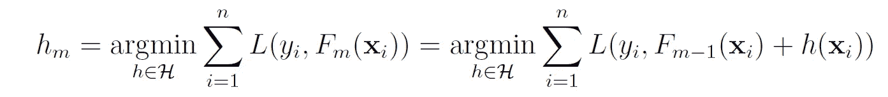

寻找适用于任意损失函数 *L* 的最佳函数 *hₘ* 在计算上是不可行的，因为这需要我们枚举 *H* 中的所有可能函数并挑选最佳函数。相反，我们使用迭代方法：在每次迭代中，我们选择一个基学习器 *hₘ*，使其指向损失函数的负梯度方向。因此，将 *hₘ* 添加到集成中将使我们更接近最小损失。

这个过程类似于梯度下降，但它在函数空间中操作，而不是在参数空间中，因为在每次迭代中，我们在假设空间 *H* 中移动到不同的函数，而不是在特定函数 *h* 的参数空间中迈出一步。这允许 *h* 成为一个非参数的机器学习模型，例如决策树。这个过程被称为**函数梯度下降**。

在函数梯度下降中，我们的参数是 *F*(**x**) 在点 **x**₁, …, **x***ₙ* 处的值，我们试图最小化每个 **x***ᵢ* 处的 *L*(*yᵢ*, *F*(**x***ᵢ*))。每个点 **x***ᵢ* 处损失函数的最佳最陡下降方向是其负梯度：


*gₘ*(**x***ᵢ*) 是损失相对于其第二个参数的导数，在 *Fₘ*₋₁(**x***ᵢ*) 处进行评估。

因此，向量


给出了在 *Fₘ*₋₁(**x***ᵢ*) 的 *n* 维数据空间中最佳的最陡下降方向。然而，这个梯度仅在数据点 **x**₁, …, **x***ₙ* 上定义，不能推广到其他 **x** 值。

在连续情况下，其中 *H* 是 *R* 上任意可微分函数的集合，我们可以简单地选择一个函数 *hₘ* ∈ *H*，使得 *hₘ*(**x***ᵢ*) = -*gₘ*(**x***ᵢ*)。

在离散情况下（即，当集合 *H* 是有限的时），我们选择 *hₘ* 作为 *H* 中最接近 *gₘ*(**x***ᵢ*) 在数据点 **x***ᵢ* 处的函数，即 *hₘ* 最与向量 -**g***ₘ* 在 *Rⁿ* 中平行。这个函数可以通过将基学习器 *hₘ* 拟合到训练集 {(**x***ᵢ*, *ỹᵢₘ*)} 来获得，标签为


这些标签被称为**伪残差**。换句话说，在每次提升迭代中，我们都将一个基学习器拟合到预测损失函数相对于前一次迭代的集成预测的负梯度。注意，这种方法是启发式的，并不一定能给出优化问题的精确解。

算法的完整伪代码如下：

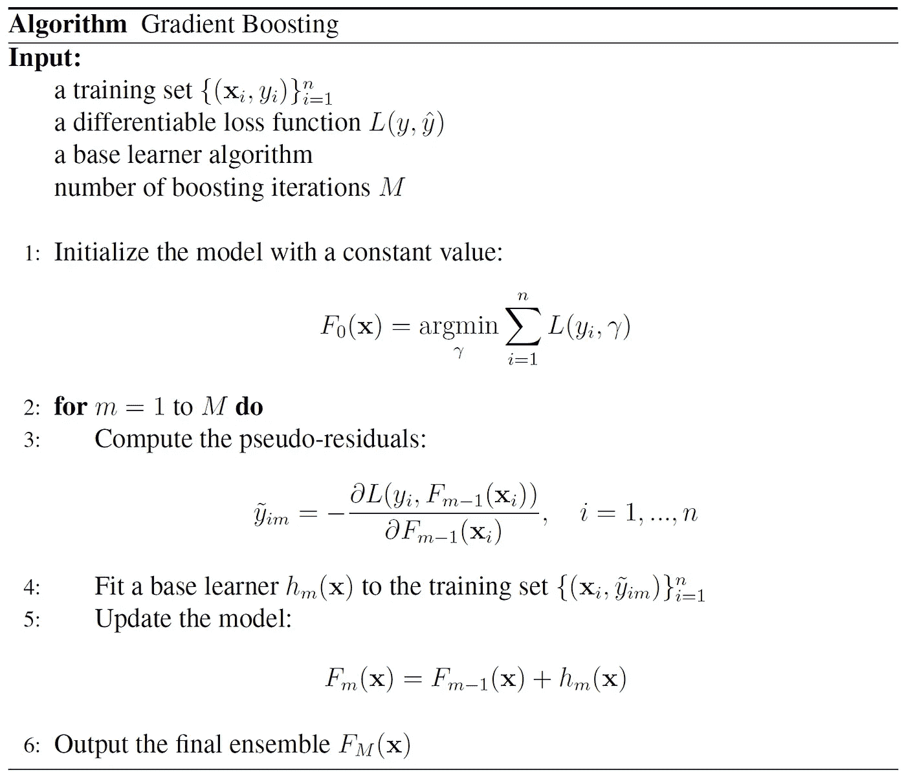

# 梯度树提升

梯度树提升是梯度提升算法的一种专门化，适用于基学习器 *h*(**x**) 是回归树的情况（有关回归树的更多细节，请参见[这篇文章](https://medium.com/@roiyeho/decision-trees-part-2-72adc626cca7)）。

在每次迭代*m*中，一个回归树*hₘ*(**x**)会拟合伪残差，即我们建立一棵树来预测伪残差，给定我们的数据点。树是使用均方误差作为分裂标准以自上而下的贪婪方式构建的。

问题是树应该给定叶节点分配哪个标签？对回归问题，使用该叶子样本的均值效果很好，但对于其他类型的问题则不然。因此，我们需要找到一种通用的方法来为每个叶子节点分配输出值，以最小化模型对任何可微损失函数的预期损失。

让*Jₘ*表示树中叶子的数量。树将输入空间划分为*Jₘ*个不相交的区域：*R*₁*ₘ*，…，*Rⱼₘ*，并预测一个常量值。

每一个中的*γⱼₘ*：


其中 1(⋅)是指示函数，其值为 1（如果其参数为真），否则为 0。

我们的目标是在每个区域中找到系数*γⱼₘ*，以最小化由属于该区域的点引起的总损失：


即，我们试图找到每个叶子节点区域中的最优常量更新，以便添加到之前的集成*Fₘ*₋₁(**x**)的预测中。

例如，让我们找到最小二乘回归情况下的最优*γ*。在这种情况下，我们的目标是最小化以下平方损失的总和：

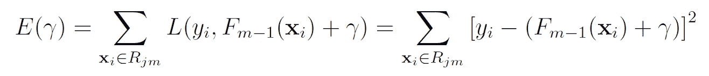

我们现在对*E*关于*γ*进行求导并设其为 0：

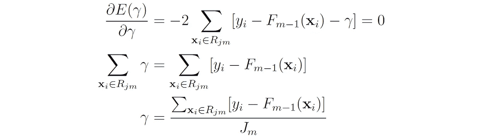

即，最优的*γ*就是第*m*次迭代中*j*th 叶节点的残差均值：


分类的情况将在后续讨论。

一旦我们找到叶节点的最优输出值，当前的近似*Fₘ*₋₁(**x**)将在每个相应区域中分别更新：


# 正则化

与标准决策树相比，梯度提升树对过拟合相当稳健。尽管如此，仍有几种常用的正则化技术可以帮助控制梯度提升树的复杂性。

首先，我们可以使用与标准决策树相同的正则化技术，例如限制树的深度、叶子数量或分裂节点所需的最小样本数量。我们还可以使用后剪枝技术来移除那些未能通过预定义阈值减少损失的树枝。

其次，我们可以控制提升迭代的数量（即，集成中的树木数量）。增加树木数量减少了集成在训练集上的误差，但也可能导致过拟合。最佳的树木数量通常通过**早停法**来确定，即算法在验证集上的评分在指定的迭代次数内没有改善时终止。

最后，Friedman [1, 2] 提出了以下更具体于梯度提升树的正则化技术：

## 缩减

缩减 [1] 通过一个常数因子*ν*来缩放每个基础学习器的贡献：


参数*ν*（0 < *ν* ≤ 1）称为**学习率**，因为它控制梯度下降过程的步长。类似于随机优化中的学习率，缩减减少了每个个体学习器的影响，并为未来的学习者改进模型留出了空间。

实证研究发现，使用小学习率（例如，*ν* ≤ 0.1）可以显著提高模型的泛化能力。然而，更小的学习率也需要更多的提升迭代以保持相同的训练误差，从而增加了训练和预测的计算时间。

## 随机梯度提升（子采样）

在随后的论文 [2] 中，Friedman 提出了随机梯度提升，它将梯度提升与装袋相结合。

在每次迭代中，基础学习器仅在训练集的一个子集（通常为 0.5）上训练，该子集是随机抽取的且不替换。这种子采样过程为算法引入了随机性，并有助于防止模型过拟合。

与装袋方法类似，子采样也允许我们使用**袋外样本**（未参与构建下一个基础学习器的样本）来评估模型的性能，而不是使用独立的验证数据集。袋外估计通常低估了模型的实际性能，因此仅在交叉验证花费时间过长时使用。

另一种减少模型方差的策略是随机采样每个树节点中考虑进行拆分的特征（类似于 [随机森林](https://medium.com/@roiyeho/random-forests-98892261dc49)）。

带有缩减的梯度树提升的伪代码如下所示：

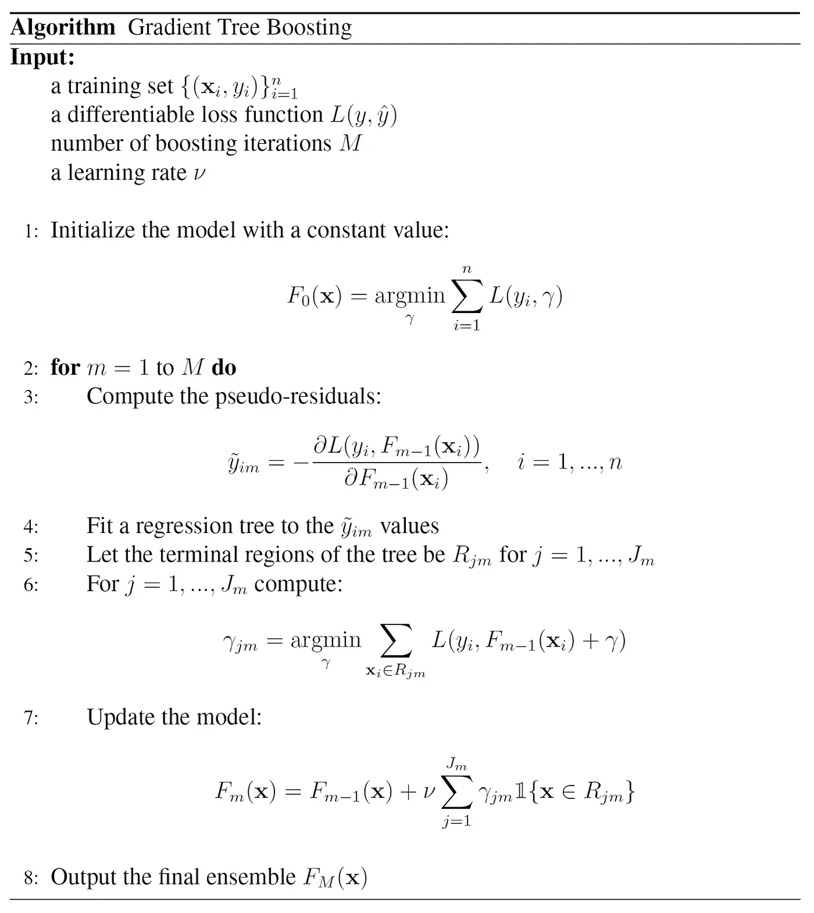

# 分类的梯度树提升

相同的梯度树提升算法也可以用于分类任务。然而，由于树的和*Fₘ*(**x**)可以是任何连续值，因此需要将其映射为概率（介于 0 和 1 之间的值）。这种映射依赖于分类问题的类型（二分类或多分类）。

请注意，梯度提升树始终是回归树，即使它们被用于分类问题（因为它们是为了逼近损失函数的负梯度而构建的）。

## 二分类

在二分类问题中，我们使用的是 sigmoid 函数

*σ*(*x*) 用于建模样本属于正类的概率（类似于 逻辑回归）：


这意味着 *F*(**x**) 代表预测的对数几率，即对数几率比：


初始模型 *F*₀(**x**) 由训练集中正类的对数几率给出：


与逻辑回归类似，我们使用二元对数损失作为我们的损失函数：


其中 *pᵢ* = *σ*(*Fₘ*₋₁(**x***ᵢ*)) 代表之前集成模型预测的样本 **x***ᵢ* 属于正类的概率。

我们可以使用链式法则计算关于 *Fₘ*₋₁(**x***ᵢ*) 的损失梯度：

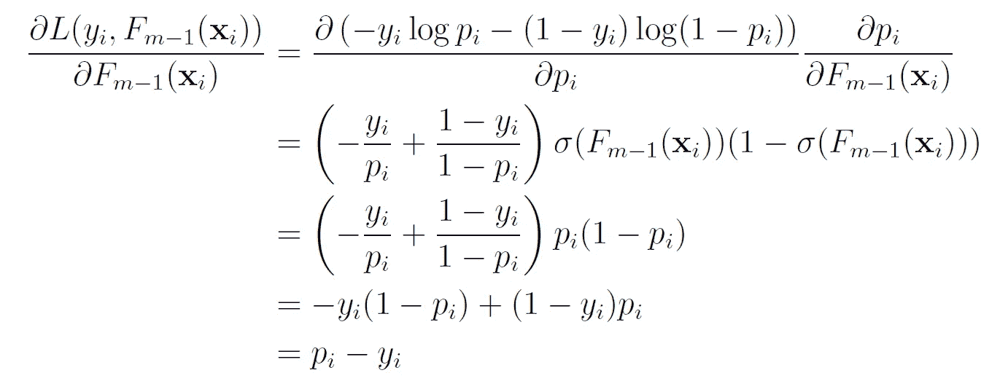

我们在这里使用了 sigmoid 函数的导数：


因此，点 **x***ᵢ* 处的伪残差为：


即，伪残差就是**x***ᵢ*的实际标签减去之前集成模型预测的该样本属于正类的概率。

以回归树作为基础学习器，我们需要为每个叶节点找到最优输出值 *γⱼₘ*：


这个优化问题没有封闭形式的解（请注意 *γ* 被添加到对数几率中，而不是直接添加到类别概率中）。因此，我们通过执行单次 [牛顿-拉夫森](https://en.wikipedia.org/wiki/Newton%27s_method) 步骤来逼近解。

作为提醒，牛顿方法试图通过从初始猜测*x*₀ ∈ *R*开始构建一个序列 {*xₖ*} 来寻找一个二次可微函数*f* 的最小值：*R* → *R*。这个序列是通过围绕元素*xₖ*的*f* 的二阶泰勒近似构造的。

*f* 在 *xₖ* 周围的二阶泰勒展开为：


序列 *xₖ*₊₁ 中的下一个元素被选择为最小化 *t* 中的二次展开。最小值可以通过将该展开的导数设为 0 来找到：


因此，最小值可以通过以下公式得到：


因此，牛顿方法执行以下迭代：


同样，我们可以写出围绕点 *Fₘ*₋₁(**x**) 的损失函数的二阶泰勒展开：

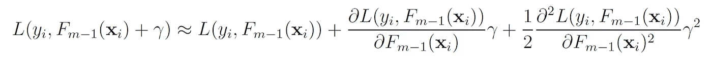

对这个表达式对*γ*求导得到：


因此，由*Rⱼₘ*区域中的样本引起的总损失的导数是：

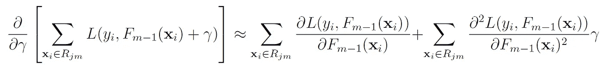

将这个导数等于 0 给出我们*Rⱼₘ*区域的最佳输出值：


这个表达式的分子是*Rⱼₘ*区域内数据点（它们的伪残差）损失函数导数的总和，而分母是相同点损失函数二阶导数的总和。

我们已经找到了对数损失的第一导数：


我们现在需要找到它的第二导数。这个导数可以通过对对数损失的第一导数进行求导来简单计算：

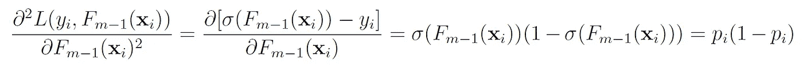

因此，我们可以写出：


## 在一个玩具数据集上的示例

假设我们得到以下数据集用于二分类问题：

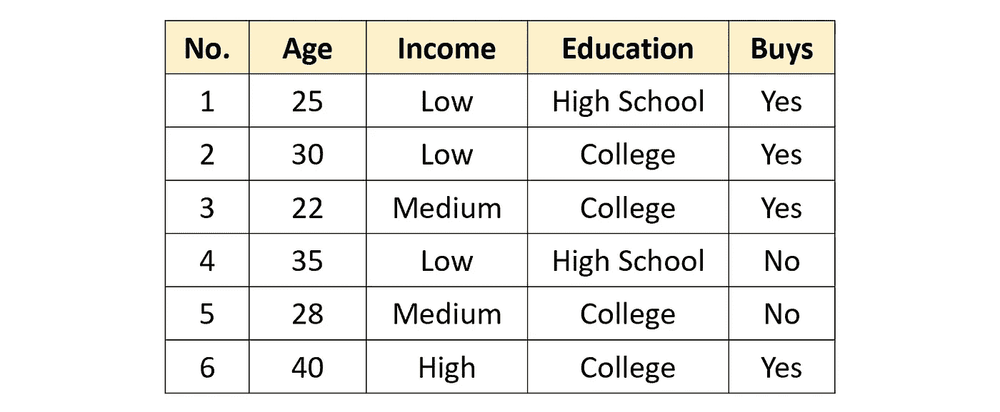

目标是根据三个属性预测客户是否会购买某个产品：客户的年龄、收入水平（低、中或高）和教育水平（高中或大学）。

为了解决这个问题，我们将使用一个最大深度为 2 的梯度提升树集成，学习率为*ν* = 0.5（我们使用相对较大的学习率以便于说明）。这些树将仅使用二元分裂（如 CART 算法）。

首先，我们用一个常数值初始化模型，该值是正类的对数几率：


接下来，我们计算伪残差。对于对数损失函数，这些只是实际标签减去预测标签：

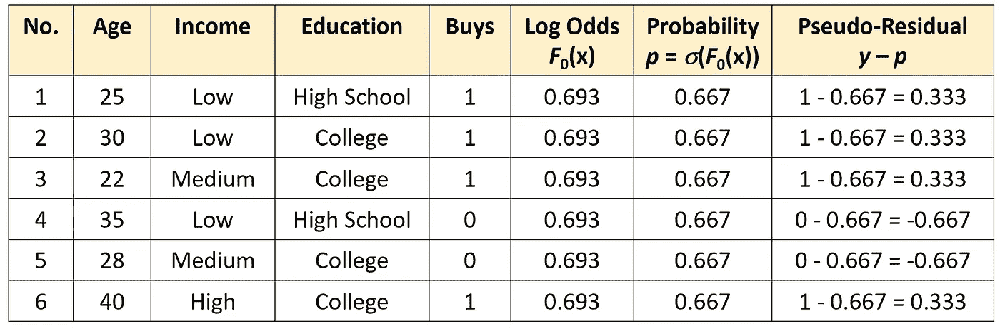

现在我们将回归树拟合到伪残差上。我们首先找到根节点的最佳分裂。在回归树中，我们在每个节点选择一个分裂，使得节点上存储的值的方差（在我们这里是伪残差）降低最大。

根节点的残差均值为：


因此，方差只是它们平方值的平均数：


我们将计算每个特征中每个可能分裂所能实现的方差减少量。我们从两个类别属性开始：

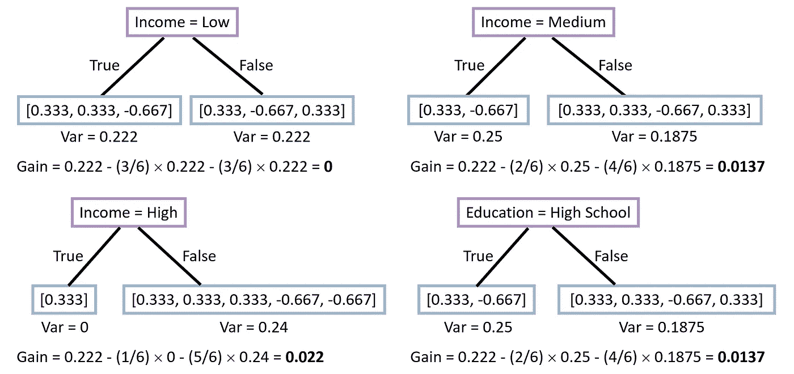

对于年龄属性，我们按年龄对伪残差进行排序，然后考虑两个连续年龄之间的每个中点作为候选分裂点：

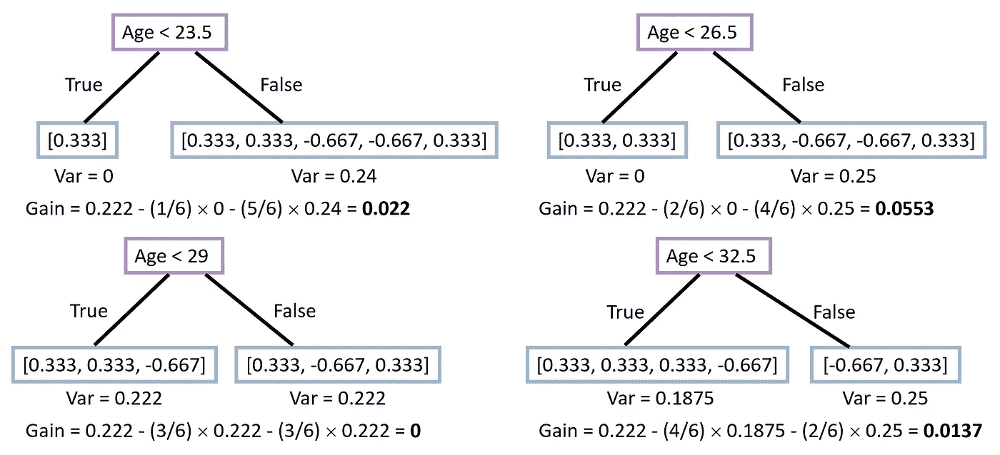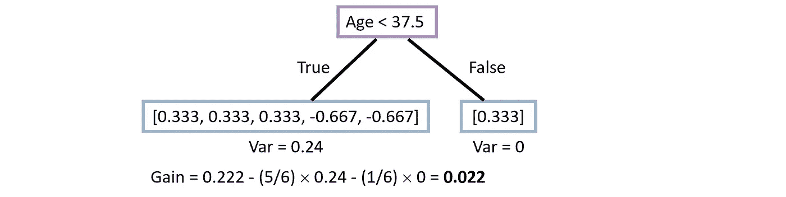

提供最大方差减少的分裂点是 Age < 26.5。因此，树的第一层如下所示：

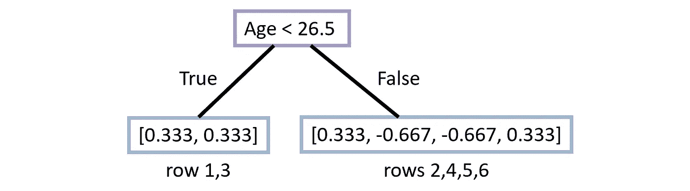

左子节点的残差方差为 0，因此无需再分裂。我们现在需要找到右子节点的最佳分裂点。

首先，让我们计算右子节点残差的方差：

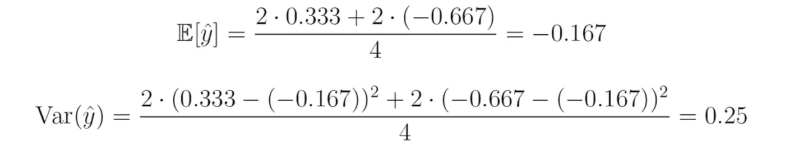

现在我们考虑属于右子节点的四个样本（样本 2、4、5、6）的所有可能的分裂点：

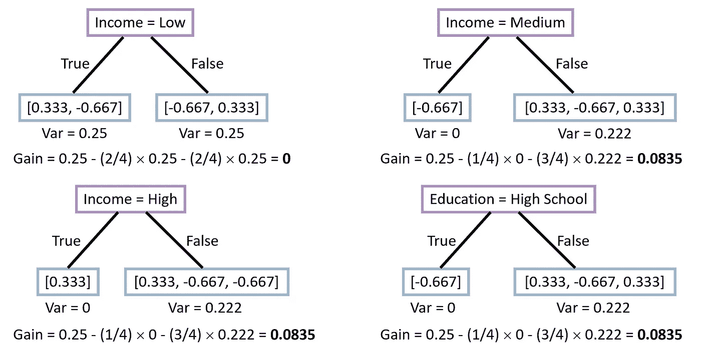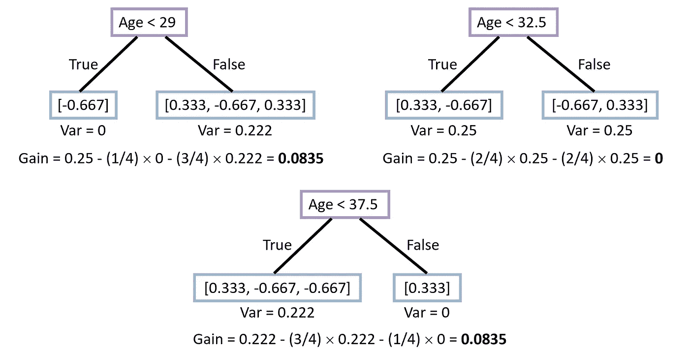

在这种情况下，我们有多个候选分裂点，这些分裂点能最大程度减少方差（0.0835）。我们可以随意选择分裂点 Income = Medium。得到的回归树是：

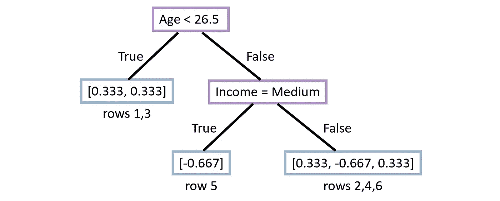

接下来，我们计算叶节点的最佳输出值（*γ* 系数）。请注意，由于这是我们的第一棵树，所有样本的最新预测概率是 *p* = *σ*(*F*₀(**x**)) = 0.667。

最左边叶子的输出值是：

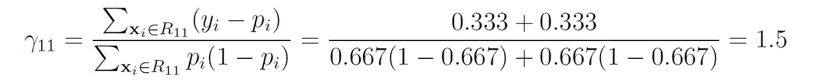

同样，其他两个叶子的输出值是：


因此，我们从第一棵回归树中得到以下预测：

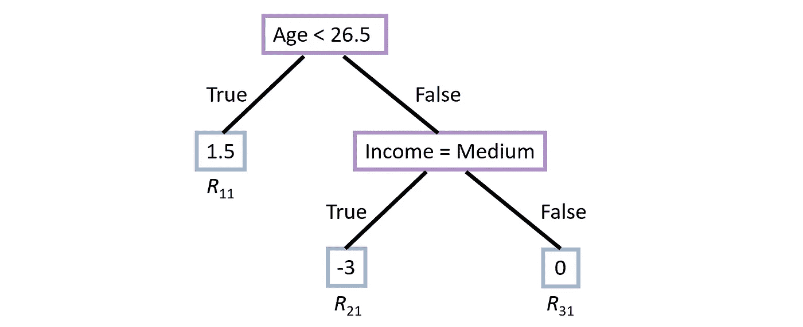

我们现在将这些预测值按学习率进行缩放，并将其加到上一轮的预测值中。然后，我们使用新的预测值计算下一轮的伪残差：

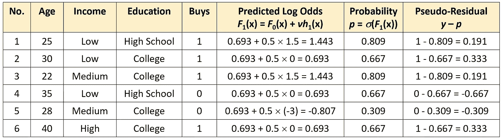

我们现在对伪残差拟合另一棵回归树。按照与之前相同的过程，我们得到以下树（验证这确实是结果树！）：

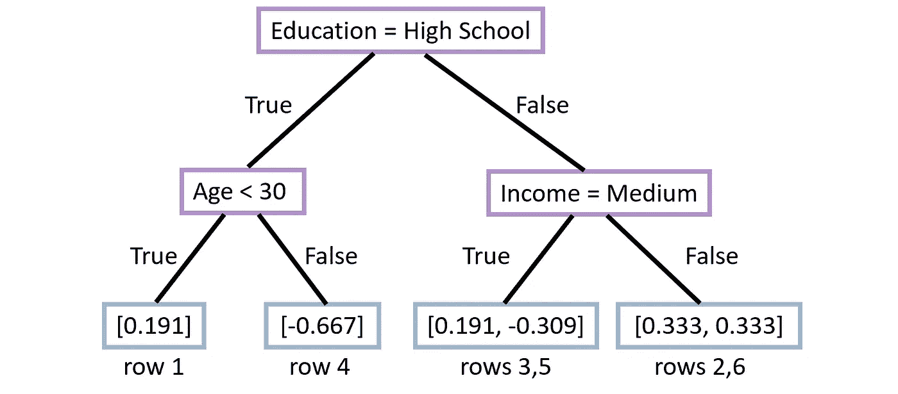

接下来，我们计算叶节点的输出值。请注意，这一次最新的预测概率 *p* = *σ*(*F*₁(**x**)) 对所有样本并不相同。从最左边的叶节点到最右边的节点，我们得到：

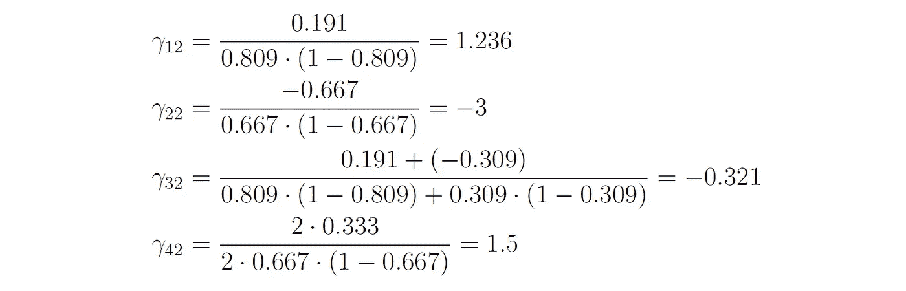

因此，我们从第二棵树中得到以下预测：

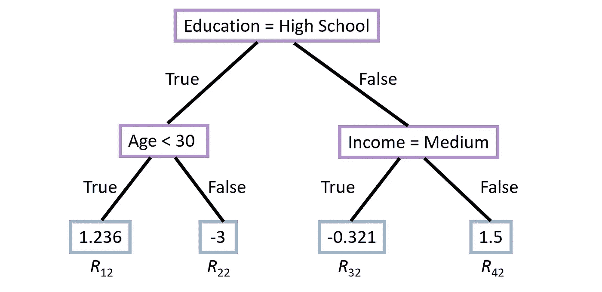

我们现在将这些预测值按学习率进行缩放，并将其加到之前模型的预测值中：

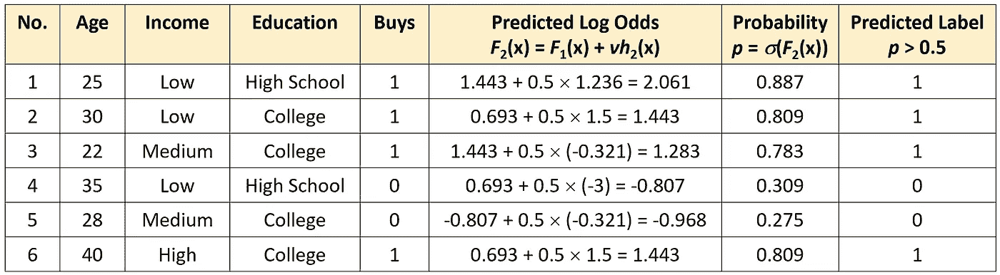

我们可以看到经过三次迭代，我们的集成方法正确地分类了训练集中的所有样本。太棒了！

让我们看看如何使用这个集成方法对新样本进行预测。假设我们有一个新客户，属性如下：年龄 = 33，收入 = 中等，教育水平 = 高中。

我们首先需要找出样本在每棵树中的哪个终端区域。在第一棵树中，样本属于区域 *R*₂₁（因为 [年龄 < 26.5] 为假，[收入 = 中等] 为真），而在第二棵树中，它属于区域 *R*₂₂（因为 [教育 = 高中] 为真，[年龄 < 30] 为假）。

因此，该客户购买产品的预测对数几率为：


预测的概率为：


由于 *p* < 0.5，我们的预测是该客户不会购买该产品。

## 多类别分类

在多类别分类问题中，每次迭代的 *M* 轮中都会构建 *K* 棵树（对应 *K* 类）。**x***ᵢ* 属于类别 *k* 的概率被建模为 *Fₘ,ₖ*(**x***ᵢ*) 值的 softmax：


在这种情况下，初始模型由每个类别的先验概率给出，损失函数是交叉熵损失。*γⱼₘ* 系数的推导留给读者作为练习。

# 最终说明

你可以在我的 GitHub 上找到本文的代码示例：[`github.com/roiyeho/medium/tree/main/gradient_boosting`](https://github.com/roiyeho/medium/tree/main/gradient_boosting)

本文的第二部分可以在 这里 找到。

感谢阅读！

## 参考文献

[1] Friedman, J.H. (2001). [贪婪函数逼近：一种梯度提升机器](https://doi.org/10.1214/aos/1013203451). 统计年鉴, 29, 1189–1232.

[2] Friedman, J.H. (2002). [随机梯度提升](https://statweb.stanford.edu/~jhf/ftp/stobst.pdf). 计算统计与数据分析, 38, 367–378.
