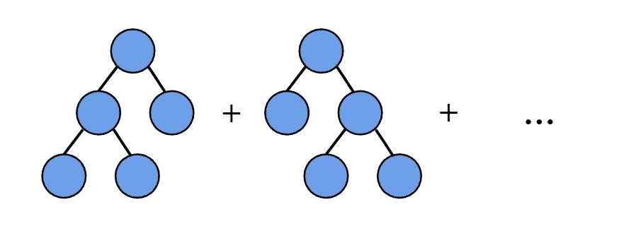
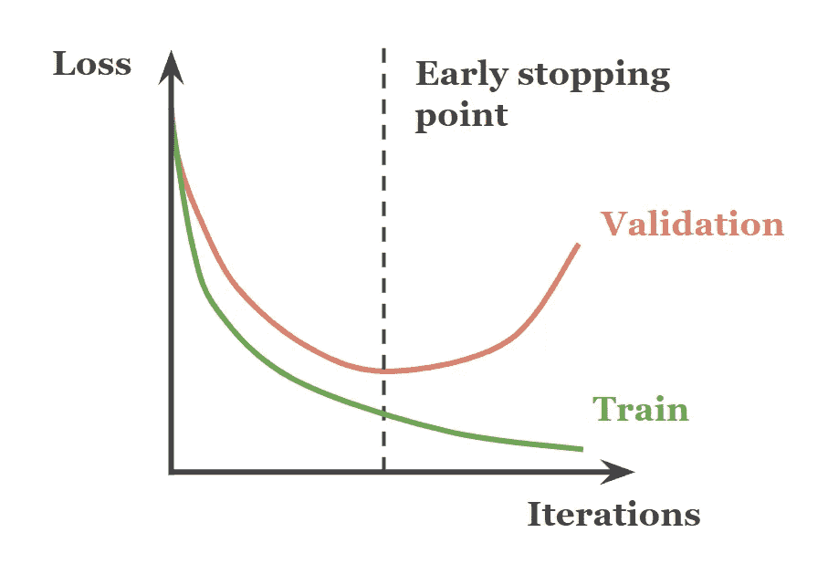
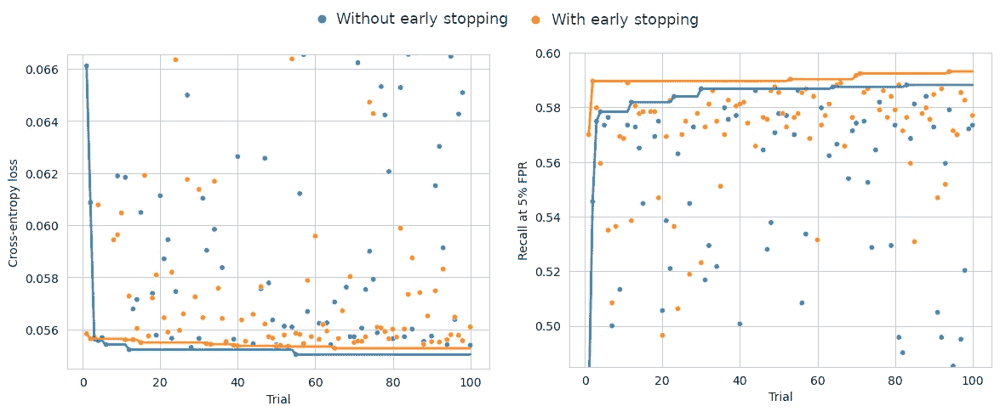
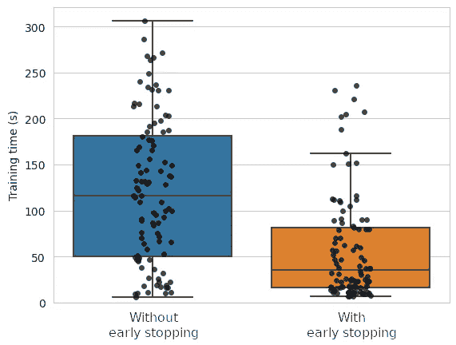

# 梯度提升树：是早期停止还是不早期停止？

> 原文：[`towardsdatascience.com/gradient-boosting-to-early-stop-or-not-to-early-stop-5ea67ac09d83?source=collection_archive---------3-----------------------#2023-03-23`](https://towardsdatascience.com/gradient-boosting-to-early-stop-or-not-to-early-stop-5ea67ac09d83?source=collection_archive---------3-----------------------#2023-03-23)

## 利用早期停止方法优化 LightGBM、XGBoost 和 CatBoost

[](https://medium.com/@diogoleitao?source=post_page-----5ea67ac09d83--------------------------------)[](https://towardsdatascience.com/?source=post_page-----5ea67ac09d83--------------------------------) [Diogo Leitão](https://medium.com/@diogoleitao?source=post_page-----5ea67ac09d83--------------------------------)

·

[关注](https://medium.com/m/signin?actionUrl=https%3A%2F%2Fmedium.com%2F_%2Fsubscribe%2Fuser%2F7bbc4c70a28d&operation=register&redirect=https%3A%2F%2Ftowardsdatascience.com%2Fgradient-boosting-to-early-stop-or-not-to-early-stop-5ea67ac09d83&user=Diogo+Leit%C3%A3o&userId=7bbc4c70a28d&source=post_page-7bbc4c70a28d----5ea67ac09d83---------------------post_header-----------) 发表在 [Towards Data Science](https://towardsdatascience.com/?source=post_page-----5ea67ac09d83--------------------------------) ·7 分钟阅读·2023 年 3 月 23 日[](https://medium.com/m/signin?actionUrl=https%3A%2F%2Fmedium.com%2F_%2Fvote%2Ftowards-data-science%2F5ea67ac09d83&operation=register&redirect=https%3A%2F%2Ftowardsdatascience.com%2Fgradient-boosting-to-early-stop-or-not-to-early-stop-5ea67ac09d83&user=Diogo+Leit%C3%A3o&userId=7bbc4c70a28d&source=-----5ea67ac09d83---------------------clap_footer-----------)

--

[](https://medium.com/m/signin?actionUrl=https%3A%2F%2Fmedium.com%2F_%2Fbookmark%2Fp%2F5ea67ac09d83&operation=register&redirect=https%3A%2F%2Ftowardsdatascience.com%2Fgradient-boosting-to-early-stop-or-not-to-early-stop-5ea67ac09d83&source=-----5ea67ac09d83---------------------bookmark_footer-----------)

图片来源：[Julian Berengar Sölter](https://unsplash.com/photos/MFWHeS6yLAI)

梯度提升决策树（GBDTs）目前在表格数据问题上超越了深度学习，流行的实现如 LightGBM、XGBoost 和 CatBoost 主导了 Kaggle 竞赛[[1](https://mlcontests.com/state-of-competitive-machine-learning-2022/)]。早期停止**—**一种在深度学习中常用的技术—也可以在训练和调整 GBDTs 时使用。然而，常见的做法是明确调整 GBDT 集成中的树的数量，而不是使用早期停止。在本文中，我展示了**早期停止**可以**将训练时间缩短一半**，同时**保持相同的性能**，与明确调整树的数量相媲美。

通过减少训练时间，早期停止可以**降低计算成本**并**减少实践者等待模型运行时的空闲时间**。这样的节省在大型 GBDT 应用行业中尤为重要，如内容推荐、金融欺诈检测或信用评分。但早期停止如何在不损害性能的情况下减少训练时间呢？让我们深入探讨。

## 梯度提升决策树

梯度提升决策树（GBDTs）目前在基于（异质）表格数据的分类和回归问题中取得了最先进的表现（具有多种列类型的二维数据集）。虽然深度学习技术在自然语言处理和计算机视觉中表现出色，但尚未在表格数据领域夺得桂冠[[2](https://proceedings.neurips.cc/paper/2021/file/9d86d83f925f2149e9edb0ac3b49229c-Paper.pdf), [3](https://arxiv.org/pdf/2106.03253.pdf), [4](https://ieeexplore.ieee.org/stamp/stamp.jsp?arnumber=9998482), [5](https://openreview.net/pdf?id=Fp7__phQszn)]。



梯度提升决策树（GBDTs）。

GBDTs 通过顺序地将决策树添加到一个集成中来工作。与随机森林不同，GBDTs 中的树不是独立的。相反，它们被训练来纠正之前树的错误。因此，只要有足够的树，GBDT 模型在训练集上可以实现完美的表现。然而，这种行为——称为[过拟合](https://en.wikipedia.org/wiki/Overfitting)——已知会损害模型对未见数据的泛化能力。

## 超参数调整与早期停止

为了优化对训练数据的拟合程度，实践者调整几个关键的超参数：树的数量、学习率、每棵树的最大深度等。为了找到最佳的值集，会在一个单独的验证数据集中测试几个配置；在保留数据中表现最佳的模型被选为最终模型。

另一个有助于对抗过拟合的工具是早期停止。早期停止在深度学习中常见，是一种**如果保留数据上的性能没有改善，则停止学习过程**的技术。在 GBDTs 中，这意味着在这一点之后不再构建更多的树。



早停法在验证集中的损失停止减少时中止训练。

尽管在深度学习中很普遍，但早停法在 GBDT 用户中并不那么流行。相反，常见的是看到从业者通过上述搜索过程调整树木数量。但是**如果使用早停法的效果等同于显式调整树木数量呢**？毕竟，这两种机制的目标都是找到 GBDT 集合的最佳大小，给定学习率和其他超参数。如果是这样的话，**这可能意味着通过使用早停法可以在大大减少的搜索时间内实现相同的性能**，因为它会停止那些耗时且不具前景的迭代。让我们来测试这个假设。

## 实验设置

为此，在作者许可下，我使用了[公共银行账户欺诈数据集](https://www.kaggle.com/datasets/sgpjesus/bank-account-fraud-dataset-neurips-2022)，该数据集最近在 NeurIPS ’22 上发布[[6](https://openreview.net/pdf?id=UrAYT2QwOX8)]。它由一个真实的欺诈检测数据集的合成副本组成，由隐私保护的 GAN 生成。对于 GBDT 的实现，我选择了[LightGBM](https://lightgbm.readthedocs.io/)，因其速度快且性能领先[[1](https://mlcontests.com/state-of-competitive-machine-learning-2022/), [7](https://proceedings.neurips.cc/paper/2017/file/6449f44a102fde848669bdd9eb6b76fa-Paper.pdf)]。所有在此实验中使用的代码可以在[这个 Kaggle 笔记本](https://www.kaggle.com/code/diogoleitao/lightgbm-with-early-stopping/)中找到。

如上所述，为了找到最佳的超参数集，最常见的方法是尝试多种配置。最终，在验证集中表现最好的模型被选为最终模型。我遵循这种方法，在每次迭代中从合理的分布中随机抽取超参数。

为了检验我的假设，我运行了两个并行的随机搜索过程：

1.  在没有早停法的情况下，树木数量参数在 10 到 4000 之间均匀测试。

1.  使用早停法，最大树木数量设置为 4000，但最终由早停准则定义。早停法监控验证集中的交叉熵损失。训练过程仅在 100 次没有改进的迭代后（即耐心参数）被中止，此时将其重置为最佳版本。

以下函数用于在[Optuna](https://optuna.org/#code_examples)研究中运行每次随机搜索试验（*为清晰起见已截断；完整版见* [*上述笔记本*](https://www.kaggle.com/code/diogoleitao/lightgbm-with-early-stopping/)）*：

```py
def _objective(t, dtrain, dval, early_stopping):
    params = {
        'boosting_type': t.suggest_categorical(['gbdt', 'goss']),
        'learning_rate': t.suggest_float(0.01, 0.5, log=True),
        'min_split_gain': t.suggest_float(0.00001, 2, log=True),
        'num_leaves': t.suggest_int(2, 1024, log=True),
        'max_depth': t.suggest_int(1, 15),
        'min_child_samples': t.suggest_int(2, 100, log=True),
        'bagging_freq': t.suggest_categorical([0, 1]),
        'pos_bagging_fraction': t.suggest_float(0, 1),
        'neg_bagging_fraction': t.suggest_float(0, 1),
        'reg_alpha': t.suggest_float(0.00001, 0.1, log=True),
        'reg_lambda': t.suggest_float(0.00001, 0.1, log=True),
    }
    model = lgb.train(
        **params, dtrain,
        num_boost_round=(
            4000 if early_stopping
            else trial.suggest_int('num_boost_rounds', 10, 4000)
        ),
        valid_sets=dval if early_stopping else None,
        callbacks=(
            [lgb.early_stopping(stopping_rounds=100)] if early_stopping
            else None))
```

## 性能

由于早停法监控验证集上的性能，所有模型都在未见过的测试集上进行评估，从而避免了偏见结果。



测试集上的结果。为了视觉清晰度，底部 20%的试验结果被移除。

**是否要早停？两种方法的结果相似。** 这一结果在测量交叉熵损失（早停监控的指标）和 5% FPR 下的召回率（一个在此数据集领域特别相关的二分类指标）时都一致[[6](https://openreview.net/pdf?id=UrAYT2QwOX8)]。在第一个标准上，无早停策略取得了略微更好的结果，而在第二个标准上，则是早停策略占优。

总之，这次实验的结果未能否定我的假设，即使用早停与显式调节 GBDT 中的树木数量之间没有显著差异。当然，更为稳健的评估需要在多个数据集、超参数搜索空间和随机种子上进行实验。

## 训练时间

我的假设的一部分是早停通过停止添加无前景的树木来减少平均训练时间。是否可以测量出有意义的差异？



训练时间的分布（以秒为单位）。

结果证实了我的假设的第二部分：**使用早停时的训练时间明显减少**。即使使用耐心值高达 100 次迭代的策略，**平均训练时间也减少了一半**，从 122 秒降至 58 秒。这意味着总训练时间从 3 小时 23 分钟减少到 1 小时 37 分钟。

尽管早停机制需要额外的计算来监控验证集上的交叉熵损失，但这些额外计算已在上述测量中考虑在内。

## 结论

梯度提升决策树（GBDTs）在处理表格数据的问题中目前处于最先进水平。我发现，在训练这些模型时使用早停**将训练时间减少了一半**，同时**保持了与显式调节树木数量相同的性能**。这使得像 LightGBM、XGBoost 和 CatBoost 这样的流行 GBDT 实现对大规模行业应用（如数字营销和金融）更具优势。

未来，验证在其他数据集和不同 GBDT 实现中的发现将是重要的。调节耐心参数也可能有益，尽管其最佳值可能会因数据集而异。

*除非另有说明，所有图片均由作者提供。*

## 参考文献

[1] H. Carlens. [2022 年竞争性机器学习现状。](https://mlcontests.com/state-of-competitive-machine-learning-2022/) ML Contests, 2023.

[2] Y. Gorishniy, I. Rubachev, V. Khrulkov 和 A. Babenko，[重新审视用于表格数据的深度学习模型](https://proceedings.neurips.cc/paper/2021/file/9d86d83f925f2149e9edb0ac3b49229c-Paper.pdf)，第 35 届神经信息处理系统会议（NeurIPS 2021）。

[3] R. Shwartz-Ziv 和 A. Armon，[表格数据：深度学习并不是你所需的一切](https://arxiv.org/pdf/2106.03253.pdf)，信息融合 81 (2022): 84–90。

[4] V. Borisov, T. Leemann, K. Seßler, J. Haug, M. Pawelczyk 和 G. Kasneci，[深度神经网络与表格数据：一项调查](https://ieeexplore.ieee.org/stamp/stamp.jsp?arnumber=9998482)，IEEE 神经网络与学习系统汇刊（2022）。

[5] L. Grinsztajn, E. Oyallon 和 G. Varoquaux，[为什么树基模型仍然在典型表格数据上优于深度学习？](https://openreview.net/pdf?id=Fp7__phQszn)，第 36 届神经信息处理系统会议——数据集和基准追踪（NeurIPS 2022）。

[6] S. Jesus, J. Pombal, D. Alves, A. Cruz, P. Saleiro, R. Ribeiro, J. Gama 和 P. Bizarro，[扭转局面：用于机器学习评估的偏倚、不平衡和动态表格数据集](https://openreview.net/pdf?id=UrAYT2QwOX8)，第 36 届神经信息处理系统会议——数据集和基准追踪（NeurIPS 2022）。

[7] G. Ke, Q. Meng, T. Finley, T. Wang, W. Chen, W. Ma, Q. Ye, T. Liu，[LightGBM：一种高效的梯度提升决策树](https://proceedings.neurips.cc/paper/2017/file/6449f44a102fde848669bdd9eb6b76fa-Paper.pdf)，第 31 届神经信息处理系统会议（NIPS 2017）。
