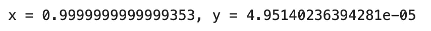

# 梯度下降算法 101

> 原文：[`towardsdatascience.com/gradient-descent-algorithm-101-c226c69d756c`](https://towardsdatascience.com/gradient-descent-algorithm-101-c226c69d756c)

## 面向初学者的指南

## 了解在机器学习和深度学习中广泛使用的优化算法

[](https://polmarin.medium.com/?source=post_page-----c226c69d756c--------------------------------)[](https://towardsdatascience.com/?source=post_page-----c226c69d756c--------------------------------) [Pol Marin](https://polmarin.medium.com/?source=post_page-----c226c69d756c--------------------------------)

·发表于 [Towards Data Science](https://towardsdatascience.com/?source=post_page-----c226c69d756c--------------------------------) ·6 分钟阅读·2023 年 4 月 25 日

--


山坡 — 由 [Ralph (Ravi) Kayden](https://unsplash.com/fr/@ralphkayden?utm_source=medium&utm_medium=referral) 拍摄于 [Unsplash](https://unsplash.com/?utm_source=medium&utm_medium=referral)

想象你是山顶上的一滴水，而你的目标是到达位于山脚的湖泊。那座高山有不同的坡度和障碍，因此沿直线下滑可能不是最佳解决方案。你会如何解决这个问题？最佳方案可能是一步一步地迈出小步，每次都朝着更接近目标的方向前进。

梯度下降（GD）就是执行这个操作的算法，对于任何数据科学家来说理解它是至关重要的。它基本且相当简单，但却至关重要，任何愿意进入这个领域的人都应该能够解释它是什么。

在这篇文章中，我的目标是提供一个全面且适合初学者的指南，让大家理解什么是 GD，它的用途是什么，它是如何工作的，并提到不同的变体。

和往常一样，你会在文章末尾找到 *资源* 部分。

但首先要做的事。

## 介绍

使用维基百科的定义[1]，**梯度下降是一种用于寻找可微函数局部最小值的一阶迭代优化算法**。尽管这肯定不是最有效的方法，但它在机器学习和深度学习中被广泛使用，尤其是在神经网络中。

基本上，它用于通过在每次迭代中更新一组参数来最小化函数的值。从数学角度来看，它使用导数（梯度）逐渐减小（下降）其值。

但有一个问题：**并非所有函数都是可优化的**。我们需要一个函数——无论是单变量还是多变量——**可微分**，即函数定义域中的每一点都有导数，并且**凸**（U 形或类似）。

现在，在这个简单的介绍之后，我们可以开始深入探讨其背后的数学。

## 实际案例

因为超越理论会更清晰，让我们使用实际的数字和数值来理解它的作用。

让我们使用一个常见的数据科学案例，我们希望开发一个回归模型。

> 免责声明：我完全发明了这个，没有逻辑依据来使用这些函数，所有内容都是随机的。目标是展示这个过程本身。

在任何数据科学问题中，成本函数或损失函数是我们要优化的函数。由于我们在使用回归，所以我们将使用这个：


随机回归函数 — 图片由作者提供

目标是找到 f(x,y)的最优最小值。让我绘制一下它的样子：


f(x,y)绘制 a=1 — 图片由作者提供

现在我们的目标是找到“x”和“y”的合适值，以便找到这个成本函数的最优值。我们已经可以从图形上看到它：

+   y=0

+   x 为-1 或 1

进入 GD 本身，因为我们希望让我们的机器学会做相同的事情。

## 算法

如前所述，梯度下降是一个迭代过程，我们计算梯度并向相反方向移动。这样做的理由是，函数的梯度用于确定函数的斜率。由于我们想向下移动，而不是向上移动，所以我们朝相反的方向移动。

这是一个简单的过程，在每次迭代中我们更新 x 和 y，按照以下方法进行：


梯度下降中的参数更新 — 图片由作者提供

用语言解释，在第 k 次迭代时：

1.  使用 x 和 y 在该迭代中的值计算梯度。

1.  对于每个变量——x 和 y——将其梯度乘以 lambda (𝜆)，这是一个称为学习率的浮点数。

1.  从 x 和 y 中分别移除第 2 步中计算出的值。

1.  在下一次迭代中，让 x 和 y 具有新的值。

这个过程会重复进行，直到满足某个条件（今天不重要）。一旦满足条件，训练结束，优化也随之结束。我们（或者应该）达到了一个最小值（无论是局部还是全局）。

现在，让我们将这个理论付诸实践。

我们需要做的第一件事是计算 f(x,y)的梯度。梯度对应于一个偏导数的向量：


f(x,y)的梯度 — 图片由作者提供

现在，使用 Python，我要做的就是创建一个循环，迭代计算梯度——使用相应的 x 和 y——并按照上面指定的方式更新这些参数。

在此之前，我将定义两个额外的值：

+   学习率 (𝜆) 可以是固定的也可以是可变的。对于这个简单的教程，它将设置为 0.01。

+   我还会使用一个叫做 eps（epsilon）的值来决定何时停止迭代。一旦两个偏导数都低于这个阈值，梯度下降将停止。我将其设置为 0.0001。

现在，让我们来写一些代码：

```py
import random

# Define constants
eps = 0.0001
lr = 0.01

# Initialize x and y with random values
x = random.uniform(-2, 4)
y = random.uniform(-1, 1)

def f(x,y):
  return (x**2 -1)**2 +y**2

def df_x(x):
  return 4*x*(x**2 - 1)

def df_y(y):
  return 2*y

# Perform gradient descent
while max(df_x(x), df_y(y)) >= eps:
  x = x - lr * df_x(x)
  y = y - lr * df_y(y)

# Print optimal values found
print(f'x = {x}, y = {y}')
```

一次随机迭代的结果是：



示例 GD 输出 — 图片来源于作者

我们可以看到这些值接近 x=1 和 y=0，它们确实是函数的最小值。

我忘了提到的是 x 和 y 的初始化。我选择了在随机范围内生成一个数字。在实际问题中，通常需要更多的时间来考虑这些问题。学习率、停止条件以及许多其他超参数也是如此。

但对于我们的情况，这已经足够了。

## 梯度下降法的变体

我相信你现在已经理解了基本算法。然而，市面上存在多个版本，我认为其中一些值得一提。

+   **随机梯度下降法 (SGD)**。SGD 是一种变体，在每次迭代时随机选择一个数据点。这减少了计算次数，但显然有其缺点，例如，可能无法收敛到全局最小值。

+   **批量梯度下降法 (BGD)**。BGD 在每次迭代时使用整个数据集。这对于大型数据集来说并不完全理想，因为计算开销和速度较慢，但另一方面，理论上保证收敛到全局最小值。

+   **迷你批量梯度下降法 (MBGD)**。这可以被视为 SGD 和 BGD 之间的中间点。它既不使用单个数据点，也不使用整个数据集，而是一个子集。在每次迭代中，我们随机选择一定数量的样本（之前定义过）并仅使用这些样本进行梯度下降。

## 结论

梯度下降算法在机器学习和深度学习中被广泛使用，但在其他领域也有应用。因此，理解它是任何希望成为数据科学家的人的必修课。

我希望这篇文章澄清了它是什么、它做了什么以及它是如何做到的。

```py
 **Thanks for reading the post!** 
            I really hope you enjoyed it and found it insightful.

          Follow me for more content like this one, it helps a lot!
                                  **@polmarin**
```

如果你想进一步支持我，请考虑通过下面的链接订阅 Medium 的会员：这不会额外花费你任何钱，但会帮助我完成这个过程。非常感谢！

[](https://medium.com/@polmarin/membership?source=post_page-----c226c69d756c--------------------------------) [## 使用我的推荐链接加入 Medium - Pol Marin

### 阅读 Pol Marin 的每一个故事（以及 Medium 上成千上万其他作家的故事）。您的会员费直接支持 Pol……

medium.com](https://medium.com/@polmarin/membership?source=post_page-----c226c69d756c--------------------------------)

## 资源

[1] [梯度下降法 — 维基百科](https://en.wikipedia.org/wiki/Gradient_descent)
