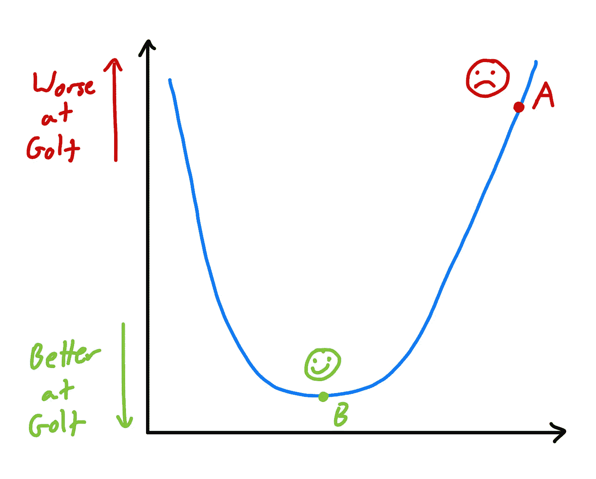
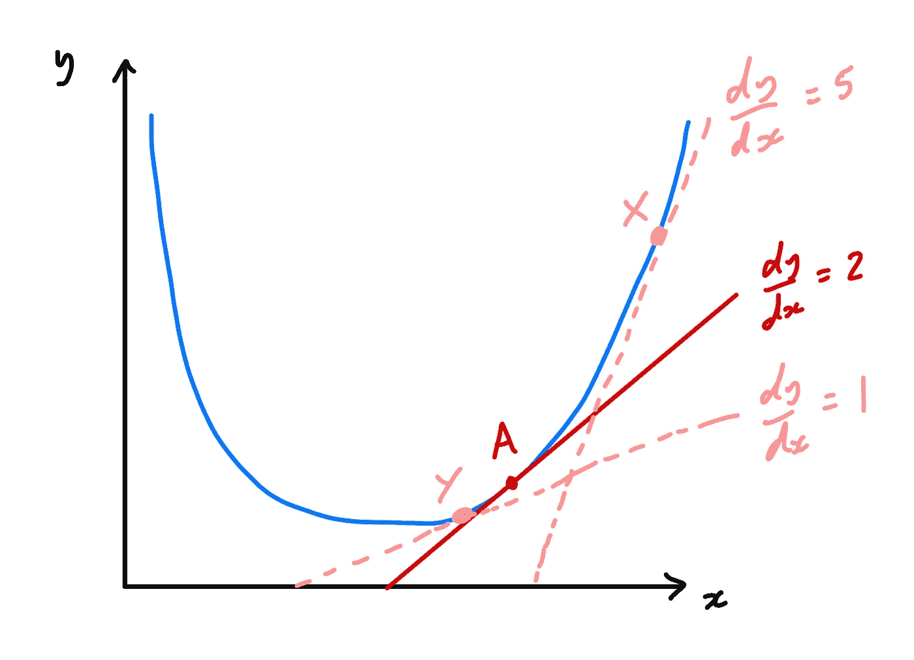
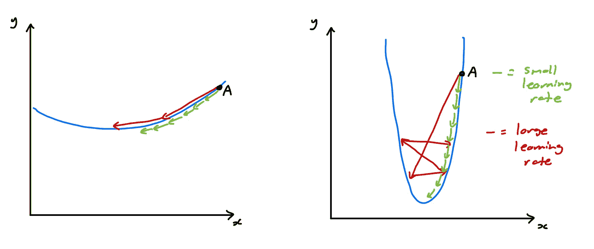
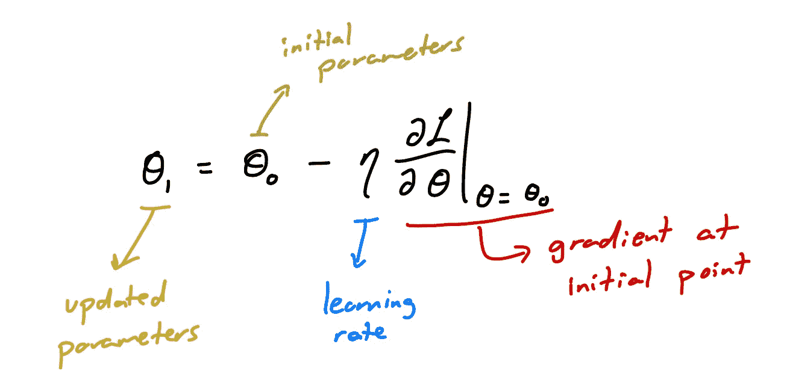
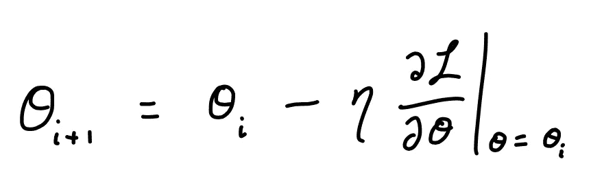
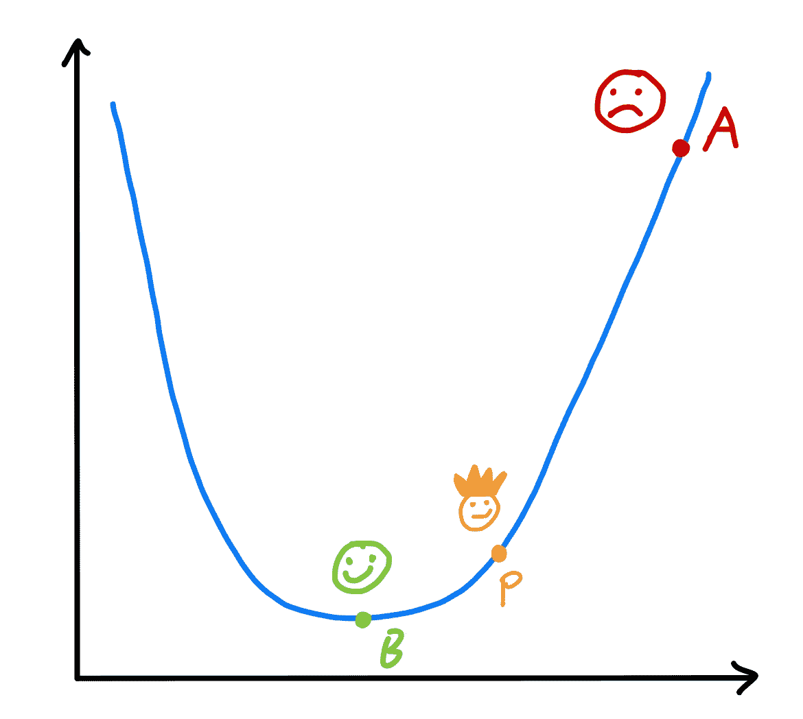
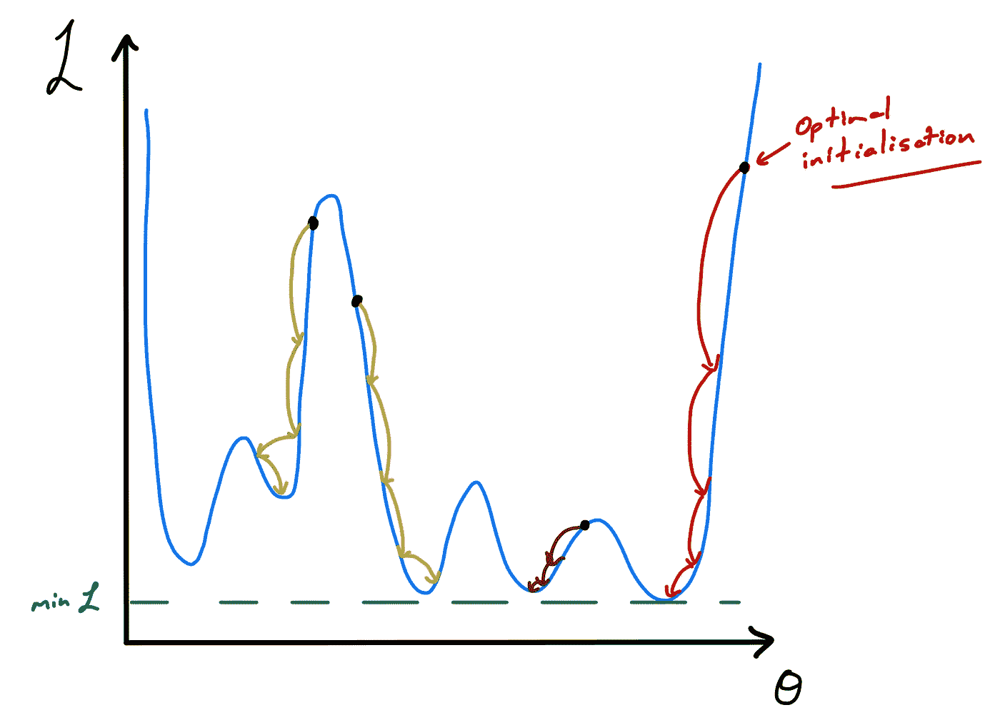

# 梯度下降：优化与初始化解释

> 原文：[`towardsdatascience.com/gradient-descent-optimisation-and-initialisation-explained-1f945e9943bd?source=collection_archive---------6-----------------------#2023-01-14`](https://towardsdatascience.com/gradient-descent-optimisation-and-initialisation-explained-1f945e9943bd?source=collection_archive---------6-----------------------#2023-01-14)

## 高层次的优化介绍，7 分钟阅读

 [Jamie McGowan](https://j-w-mcgowan18.medium.com/?source=post_page-----1f945e9943bd--------------------------------)

·

[关注](https://medium.com/m/signin?actionUrl=https%3A%2F%2Fmedium.com%2F_%2Fsubscribe%2Fuser%2F685229ed4b15&operation=register&redirect=https%3A%2F%2Ftowardsdatascience.com%2Fgradient-descent-optimisation-and-initialisation-explained-1f945e9943bd&user=Jamie+McGowan&userId=685229ed4b15&source=post_page-685229ed4b15----1f945e9943bd---------------------post_header-----------) 发表在 [Towards Data Science](https://towardsdatascience.com/?source=post_page-----1f945e9943bd--------------------------------) ·7 分钟阅读·2023 年 1 月 14 日

--

图片来源于 [vackground.com](https://unsplash.com/@vackground?utm_source=medium&utm_medium=referral) 在 [Unsplash](https://unsplash.com/?utm_source=medium&utm_medium=referral)

训练一个深度学习模型涉及一组模型**参数**的调整，将这些参数逐步逼近某个**最优值集合**。最优值集合被定义为模型在执行某个任务时达到最佳表现的点。

直观上，这可以被认为是我们学习新技能时的情况。例如，如果你决定尝试一项新运动，你很可能在第一次玩的时候表现得相当差劲（当然忽略任何天才儿童）。

然而，随着时间的推移，你会提高并学习如何将你自己的参数（在大脑中）向某个最佳值转变，以改善这项运动。

## 这些参数如何移动？

设想我们有一个**度量值**，它定义了我们在某项运动中的**差劲**程度。这个值*越高*，我们就*越差*；值*越低*，我们就*越好*。有点像高尔夫中的差点。

图像由[Steven Shircliff](https://unsplash.com/@steveshirc?utm_source=medium&utm_medium=referral)提供，[Unsplash](https://unsplash.com/?utm_source=medium&utm_medium=referral)上的图片

我们可以进一步设想，调整这些参数将对该度量值产生一些影响，即随着我们向最佳参数集合移动，度量值会**降低**（我们在任务中表现得更好）。

希望这能让你明白……但如果没有也没关系！我们会查看一个图示，试图解释这种情况。

## 可视化优化

图示展示了提高高尔夫水平的优化高级描述。图像由作者提供。

以上图为例，我们的高尔夫差点在**A 点**（情况相当糟糕——初学者水平），这就是我们开始向泰格·伍兹水平进发的地方！

我们应该朝哪个方向移动以达到 B 点（高尔夫的职业水平）？

你说左边？**正确！**

从数学上讲，这涉及到在 A 点找到**梯度**并沿着*最陡下降*的方向移动。

**“等等，等等……提醒我一下梯度是什么”**

梯度定义了函数变化的最陡速率。

该图展示了在函数不同点上梯度估计的局部性。图像由作者提供。

由于这个梯度仅在**局部**计算，即 A 点的梯度仅在 A 点*正确*，所以我们不希望在距离此点太远的地方信任这个梯度。例如，在图片中，点 X 和 Y 的梯度非常**不同**。

因此，在实际操作中，我们将梯度乘以**学习率**，它告诉我们向 B 点移动的距离。（我们稍后会再回来讨论这个！）

这是**局部性**论点，它是现代梯度下降优化算法的支柱之一。

## **局部性与学习率**

想象你正在开车，你知道你想到达哪里，但不知道怎么走（也没有导航）。

你可以做的最好的事情是依靠指示标志来**指导**你朝着目标前进。

照片由 [Brendan Church](https://unsplash.com/@bdchu614?utm_source=medium&utm_medium=referral) 提供，来源于 [Unsplash](https://unsplash.com/?utm_source=medium&utm_medium=referral)

然而，这些指示牌只在出现的地方有效。例如，*继续直行*的指示不一定在 2 英里后仍然有效。

这些指示牌有点像我们在优化算法中的梯度计算。它们包含关于旅行方向（或函数形状）在特定点的局部**信息**。

根据你多么谨慎（或冒险），你可能更喜欢每 200 米设置一个指示牌，或者你可能满意每两英里设置一个。完全取决于旅程的情况！

例如，如果是一条长而直的道路，我们可以用很少的指示牌。但如果是一个复杂的旅程，充满了许多转弯，我们很可能需要更多**的**指示牌。

显示不同类型函数的小学习率和大学习率之间差异的两个图。图片由作者提供。

这就是我们如何看待**学习率**。如果我们有一个像左边的那样的函数，我们可能能够使用*较大的*学习率（类似于一条长直的道路）。

然而，如果我们有右边的这个，这将需要一个*更小*的学习率，因为我们可能会**超越**我们的目标（错过一个转弯）。

还值得一提的是，我们很可能无法仅通过一个方向从 A 点到 B 点（除非我们已经非常接近）。因此，实际上，**梯度下降**通常是一个**迭代**过程，我们在旅程中的*路标*上接收指示（*A 到 B* 变成 *A 到 C 到 D 到 E 到 B*）。

因此，希望我们能够对学习率和路标数量之间的关系建立一些**直觉**。

## 将所有内容整合起来…

好的，希望我们已经对**优化**的目标和一些需要考虑的概念有了一个清晰的了解！

使用上述信息，我们现在可以定义梯度下降**算法**。

回到我们之前的图片，我们将点 A 的参数标记为（⍬₀），最终参数标记为点 B ⍬。

在从点 A 到第一个**路标**（点 C）的第一次迭代中，我们可以写出一个方程来描述参数更新。为此我们需要考虑：

+   在点 A 的**性能**指标 L 的梯度（相对于参数）

+   一个学习率

+   初始参数 ⍬₀

+   更新的参数 ⍬₁

单次梯度下降更新的方程。图片由作者提供。

以下参数**更新**是类似地计算的，因此我们能够写出通用公式为：

一般梯度下降步骤的方程。图片由作者提供。

## 初始值

好吧，标题承诺了关于初始值的一些讨论。

对于那些对目前没有提及这方面内容感到非常愤怒的人……非常抱歉！但希望这一部分能让你满意！

从上述所有描述来看，很容易理解初始值如何融入整体图景。

图示说明了不同初始值下的数值差异。图片由作者提供。

我之前提到了某个神童？我们称她为 Pam。就本文中的第一张图片而言，这在某种程度上相当于 Pam 在点 P 处拥有一些**初始**参数，而不是点 A。顺便说一下，Pam 是那个戴着皇冠和带着得意笑容的人——她知道自己很棒！

对**初始值**的高层次解释是，你从哪里*开始*你的优化。

一个好的初始值可以减轻优化算法的**压力**，而一个好的优化算法也可以为初始值做出**相同**的贡献。实际上，一个好的初始值可以在训练具有大量参数的深度学习模型时节省数百小时的计算时间。

由于这一点，许多不同的研究领域专注于开发更好的**初始值****技术**。这之所以非常困难，本质上就像是在对未来进行**预测**，而对我们所处的环境了解不多。

初始值重要的另一个原因与我们可能在优化*之后*所处的位置有关。

图示展示了不同初始值下梯度下降优化的不同结果。图片由作者提供。

请考虑上面的新优化表面。它有许多**不同**的**最小值**——其中一些比其他的更好！

在这张图中，很明显我们的起始点会**严重**影响我们最终的结果。这也是为什么对于机器学习从业者来说，实验不同的初始值以及调整超参数（如学习率）如此重要，以便在特定任务中找到最佳模型。

## 结论

在这篇文章中，我们介绍了一些关于梯度下降、优化和初始值的高层次**解释**。我们可视化了优化和初始值的目标，图形化地研究了这些概念，介绍了学习率的概念，甚至写下了梯度下降的公式！

希望这能帮助你建立对这些重要概念的**直觉**，并加深对梯度下降公式来源的理解！

感谢阅读，敬请关注更多与**优化技术**相关的文章！

一如既往，欢迎告知我任何问题或评论！
