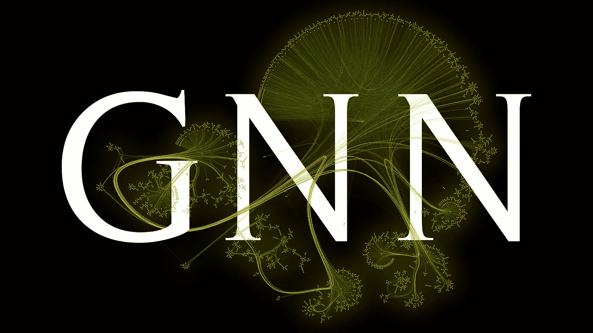
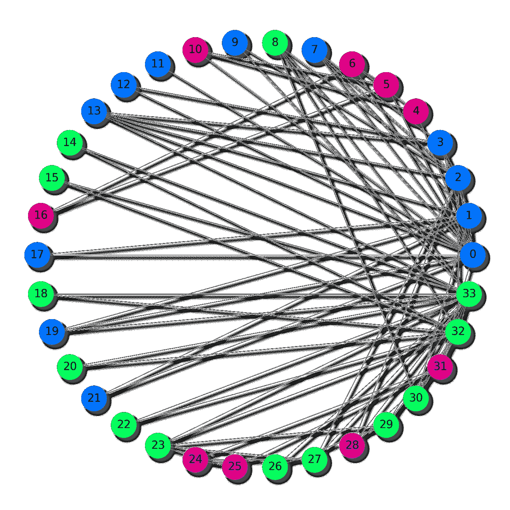
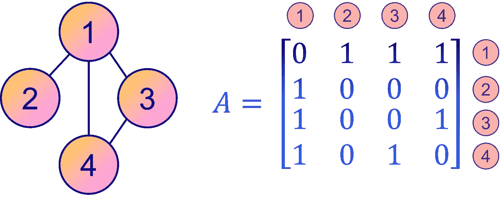
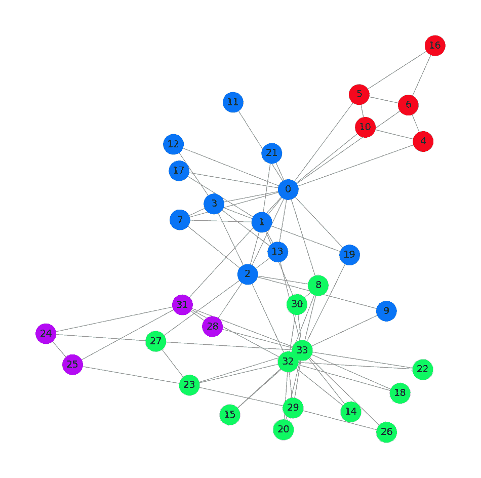
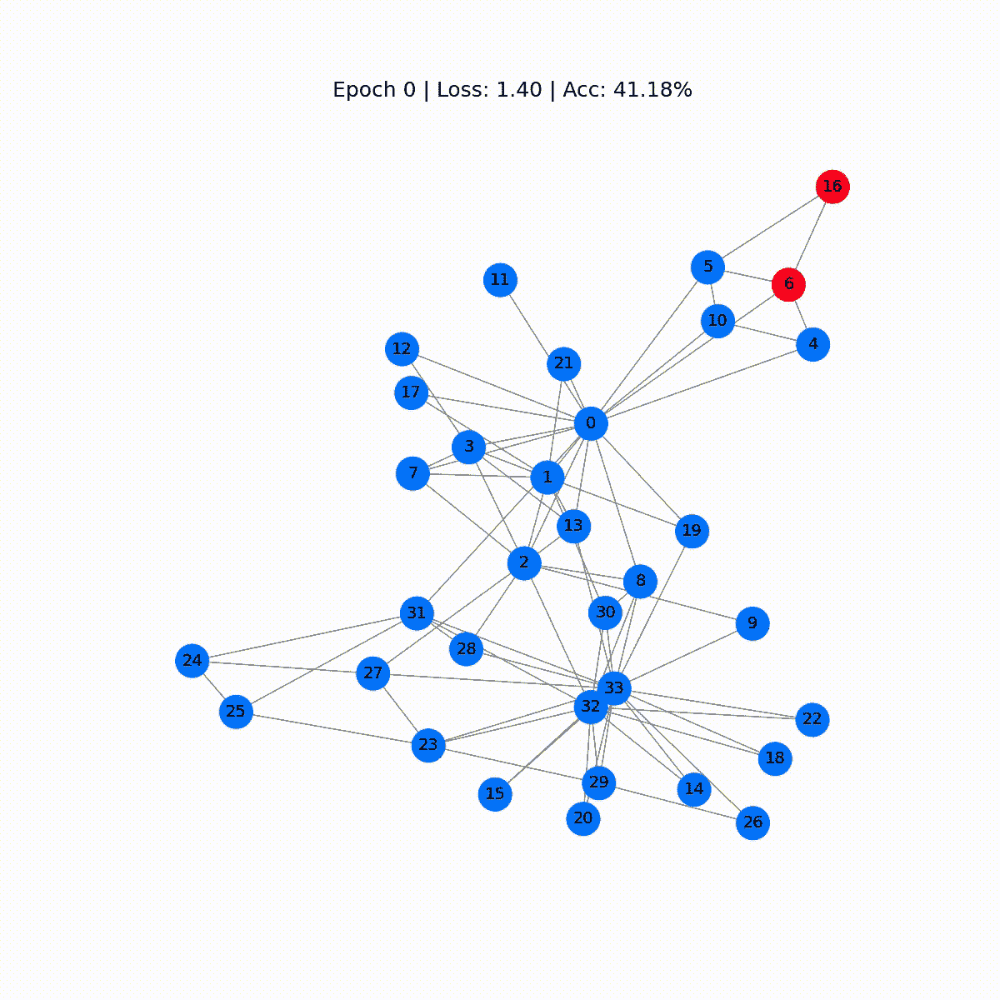
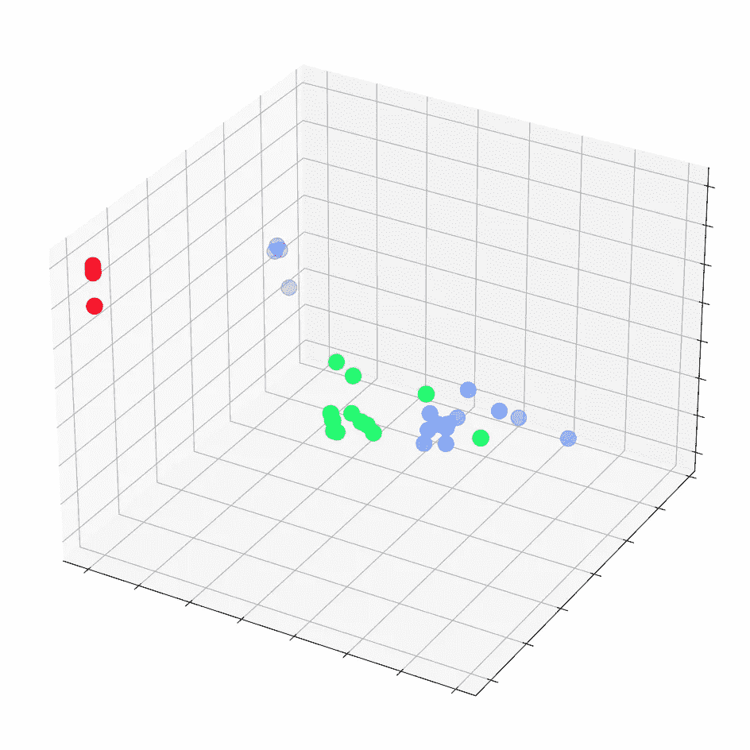
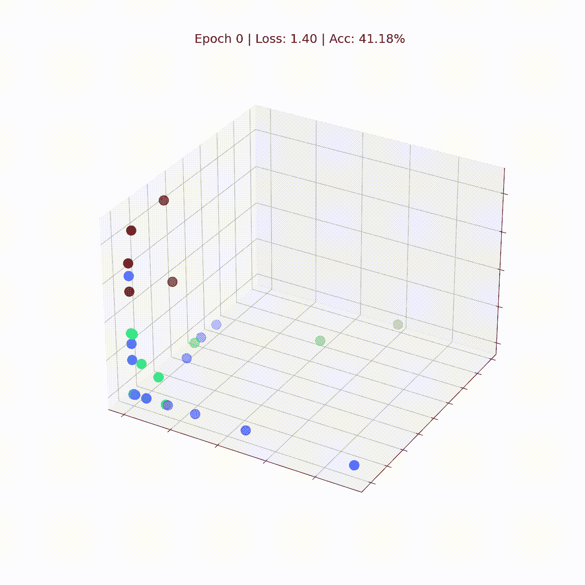

# 图卷积网络：GNNs 简介

> 原文：[`towardsdatascience.com/graph-convolutional-networks-introduction-to-gnns-24b3f60d6c95?source=collection_archive---------0-----------------------#2023-08-14`](https://towardsdatascience.com/graph-convolutional-networks-introduction-to-gnns-24b3f60d6c95?source=collection_archive---------0-----------------------#2023-08-14)

## 使用 PyTorch Geometric 的逐步指南

[](https://medium.com/@mlabonne?source=post_page-----24b3f60d6c95--------------------------------)[](https://towardsdatascience.com/?source=post_page-----24b3f60d6c95--------------------------------) [Maxime Labonne](https://medium.com/@mlabonne?source=post_page-----24b3f60d6c95--------------------------------)

·

[关注](https://medium.com/m/signin?actionUrl=https%3A%2F%2Fmedium.com%2F_%2Fsubscribe%2Fuser%2Fdc89da634938&operation=register&redirect=https%3A%2F%2Ftowardsdatascience.com%2Fgraph-convolutional-networks-introduction-to-gnns-24b3f60d6c95&user=Maxime+Labonne&userId=dc89da634938&source=post_page-dc89da634938----24b3f60d6c95---------------------post_header-----------) 发表在[Towards Data Science](https://towardsdatascience.com/?source=post_page-----24b3f60d6c95--------------------------------) ·16 分钟阅读·2023 年 8 月 14 日[](https://medium.com/m/signin?actionUrl=https%3A%2F%2Fmedium.com%2F_%2Fvote%2Ftowards-data-science%2F24b3f60d6c95&operation=register&redirect=https%3A%2F%2Ftowardsdatascience.com%2Fgraph-convolutional-networks-introduction-to-gnns-24b3f60d6c95&user=Maxime+Labonne&userId=dc89da634938&source=-----24b3f60d6c95---------------------clap_footer-----------)

--

[](https://medium.com/m/signin?actionUrl=https%3A%2F%2Fmedium.com%2F_%2Fbookmark%2Fp%2F24b3f60d6c95&operation=register&redirect=https%3A%2F%2Ftowardsdatascience.com%2Fgraph-convolutional-networks-introduction-to-gnns-24b3f60d6c95&source=-----24b3f60d6c95---------------------bookmark_footer-----------)

作者提供的图像

**图神经网络**（GNNs）是深度学习领域中最吸引人和迅速发展的架构之一。作为处理图结构数据的深度学习模型，GNNs 带来了显著的多样性和强大的学习能力。

在各种类型的 GNN 中，**图卷积网络**（GCNs）已经成为最[普遍且广泛应用的模型](https://paperswithcode.com/methods/category/graph-models)。GCNs 因其能够利用节点的特征及其局部信息进行预测而具有创新性，提供了一种有效处理图结构数据的方法。

在本文中，我们将深入探讨 GCN 层的机制，并解释其内部工作原理。此外，我们还将探索其在节点分类任务中的实际应用，使用[PyTorch Geometric](https://pytorch-geometric.readthedocs.io/en/latest/index.html)作为我们的工具。

PyTorch Geometric 是 PyTorch 的一个专门扩展，专为 GNNs 的开发和实现而创建。它是一个高级但用户友好的库，提供了一整套工具来促进基于图的机器学习。为了开始我们的旅程，我们需要安装 PyTorch Geometric。如果你使用 Google Colab，[PyTorch](https://pytorch.org/get-started/locally/)应该已经安装好了，因此我们只需要执行几个额外的命令。

所有代码都可以在[Google Colab](https://colab.research.google.com/drive/1ZugveUjRrbSNwUbryeKJN2wyhGFRCw0q?usp=sharing)和[GitHub](https://github.com/mlabonne/graph-neural-network-course)上找到。

```py
!pip install torch_geometric
```

```py
import torch
import numpy as np
import networkx as nx
import matplotlib.pyplot as plt
```

现在 PyTorch Geometric 已经安装好了，让我们探索一下本教程中将使用的数据集。

# 🌐 I. 图数据

[图](https://en.wikipedia.org/wiki/Graph_(discrete_mathematics))是表示对象之间关系的重要结构。你可以在许多现实世界的场景中遇到图数据，例如社交和计算机网络、分子化学结构、自然语言处理和图像识别等。

在这篇文章中，我们将研究臭名昭著且广泛使用的[扎卡里的空手道俱乐部](https://en.wikipedia.org/wiki/Zachary%27s_karate_club)数据集。



图片作者提供

扎卡里的空手道俱乐部数据集体现了 1970 年代 Wayne W. Zachary 观察到的空手道俱乐部内部形成的关系。这是一种社交网络，其中每个节点代表一个俱乐部成员，节点之间的边代表发生在俱乐部环境之外的互动。

在这个特定的场景中，俱乐部成员被分为四个不同的组。我们的任务是**根据他们的互动模式给每个成员分配正确的组**（节点分类）。

让我们使用 PyG 的内置函数导入数据集，并尝试了解它使用的`Datasets`对象。

```py
from torch_geometric.datasets import KarateClub
```

```py
# Import dataset from PyTorch Geometric
dataset = KarateClub()# Print information
print(dataset)
print('------------')
print(f'Number of graphs: {len(dataset)}')
print(f'Number of features: {dataset.num_features}')
print(f'Number of classes: {dataset.num_classes}')
```

```py
KarateClub()
------------
Number of graphs: 1
Number of features: 34
Number of classes: 4
```

该数据集仅包含 1 个图，其中每个节点具有 34 维的特征向量，并且属于四个类别中的一个（我们的四个组）。实际上，`Datasets`对象可以看作是`Data`（图）对象的集合。

我们可以进一步检查我们独特的图，以了解更多信息。

```py
# Print first element
print(f'Graph: {dataset[0]}')
```

```py
Graph: Data(x=[34, 34], edge_index=[2, 156], y=[34], train_mask=[34])
```

`[Data](https://pytorch-geometric.readthedocs.io/en/latest/modules/data.html)`对象特别有趣。打印它可以很好地总结我们正在研究的图：

+   `x=[34, 34]`是**节点特征矩阵**，其形状为（节点数，特征数）。在我们的例子中，这意味着我们有 34 个节点（我们的 34 个成员），每个节点都与一个 34 维特征向量相关联。

+   `edge_index=[2, 156]`表示**图的连通性**（节点如何连接），其形状为（2，定向边的数量）。

+   `y=[34]`是**节点真实标签**。在这个问题中，每个节点被分配到一个类别（组），因此我们对每个节点有一个值。

+   `train_mask=[34]`是一个可选属性，用于指定哪些节点应用于训练，列表中包含`True`或`False`。

让我们打印这些张量以了解它们存储了什么。我们从节点特征开始。

```py
data = dataset[0]
```

```py
print(f'x = {data.x.shape}')
print(data.x)
```

```py
x = torch.Size([34, 34])
tensor([[1., 0., 0.,  ..., 0., 0., 0.],
        [0., 1., 0.,  ..., 0., 0., 0.],
        [0., 0., 1.,  ..., 0., 0., 0.],
        ...,
        [0., 0., 0.,  ..., 1., 0., 0.],
        [0., 0., 0.,  ..., 0., 1., 0.],
        [0., 0., 0.,  ..., 0., 0., 1.]])
```

在这里，节点特征矩阵`x`是一个单位矩阵：它**不包含任何相关信息**关于节点。它本可以包含诸如年龄、技能水平等信息，但在这个数据集中并非如此。这意味着我们只能通过查看节点之间的连接来对它们进行分类。

现在，让我们打印边索引。

```py
print(f'edge_index = {data.edge_index.shape}')
print(data.edge_index)
```

```py
edge_index = torch.Size([2, 156])
tensor([[ 0,  0,  0,  0,  0,  0,  0,  0,  0,  0,  0,  0,  0,  0,  0,  0,  1,  1,
          1,  1,  1,  1,  1,  1,  1,  2,  2,  2,  2,  2,  2,  2,  2,  2,  2,  3,
          3,  3,  3,  3,  3,  4,  4,  4,  5,  5,  5,  5,  6,  6,  6,  6,  7,  7,
          7,  7,  8,  8,  8,  8,  8,  9,  9, 10, 10, 10, 11, 12, 12, 13, 13, 13,
         13, 13, 14, 14, 15, 15, 16, 16, 17, 17, 18, 18, 19, 19, 19, 20, 20, 21,
         21, 22, 22, 23, 23, 23, 23, 23, 24, 24, 24, 25, 25, 25, 26, 26, 27, 27,
         27, 27, 28, 28, 28, 29, 29, 29, 29, 30, 30, 30, 30, 31, 31, 31, 31, 31,
         31, 32, 32, 32, 32, 32, 32, 32, 32, 32, 32, 32, 32, 33, 33, 33, 33, 33,
         33, 33, 33, 33, 33, 33, 33, 33, 33, 33, 33, 33],
        [ 1,  2,  3,  4,  5,  6,  7,  8, 10, 11, 12, 13, 17, 19, 21, 31,  0,  2,
          3,  7, 13, 17, 19, 21, 30,  0,  1,  3,  7,  8,  9, 13, 27, 28, 32,  0,
          1,  2,  7, 12, 13,  0,  6, 10,  0,  6, 10, 16,  0,  4,  5, 16,  0,  1,
          2,  3,  0,  2, 30, 32, 33,  2, 33,  0,  4,  5,  0,  0,  3,  0,  1,  2,
          3, 33, 32, 33, 32, 33,  5,  6,  0,  1, 32, 33,  0,  1, 33, 32, 33,  0,
          1, 32, 33, 25, 27, 29, 32, 33, 25, 27, 31, 23, 24, 31, 29, 33,  2, 23,
         24, 33,  2, 31, 33, 23, 26, 32, 33,  1,  8, 32, 33,  0, 24, 25, 28, 32,
         33,  2,  8, 14, 15, 18, 20, 22, 23, 29, 30, 31, 33,  8,  9, 13, 14, 15,
         18, 19, 20, 22, 23, 26, 27, 28, 29, 30, 31, 32]])
```

在图论和网络分析中，节点之间的连通性通过多种数据结构进行存储。`edge_index`就是这种数据结构之一，其中图的连接存储在**两个列表**中（156 条定向边，相当于 78 条双向边）。这两个列表的原因在于一个列表存储源节点，而第二个列表标识目标节点。

这种方法称为**坐标列表**（COO）格式，本质上是一种高效存储[稀疏矩阵](https://en.wikipedia.org/wiki/Sparse_matrix#Storing_a_sparse_matrix)的方式。稀疏矩阵是高效存储大部分为零元素的矩阵的数据结构。在 COO 格式中，仅存储非零元素，从而节省内存和计算资源。

相反，更直观和简洁的表示图连通性的方法是通过**邻接矩阵** *A*。这是一个方阵，其中每个元素*A*ᵢⱼ *s*指定图中从节点*i*到节点*j*的边的存在与否。换句话说，非零元素*A*ᵢⱼ 表示从节点*i*到节点*j*的连接，而零表示没有直接连接。



作者提供的图片

然而，邻接矩阵在稀疏矩阵或边较少的图中并不像 COO 格式那样节省空间。然而，为了清晰和易于解释，邻接矩阵仍然是表示图连通性的热门选择。

邻接矩阵可以通过`edge_index`和一个工具函数`to_dense_adj()`来推断。

```py
from torch_geometric.utils import to_dense_adj
```

```py
A = to_dense_adj(data.edge_index)[0].numpy().astype(int)
print(f'A = {A.shape}')
print(A)
```

```py
A = (34, 34)
[[0 1 1 ... 1 0 0]
 [1 0 1 ... 0 0 0]
 [1 1 0 ... 0 1 0]
 ...
 [1 0 0 ... 0 1 1]
 [0 0 1 ... 1 0 1]
 [0 0 0 ... 1 1 0]]
```

对于图数据，节点之间密集互连的情况相对较少。正如你所见，我们的邻接矩阵*A*是**稀疏的**（填充了零）。

在许多现实世界的图中，大多数节点只与少数其他节点连接，导致邻接矩阵中有大量零。存储这么多零是完全不高效的，这就是为什么 PyG 采用了 COO 格式。

相反，真实标签易于理解。

```py
print(f'y = {data.y.shape}')
print(data.y)
```

```py
y = torch.Size([34])
tensor([1, 1, 1, 1, 3, 3, 3, 1, 0, 1, 3, 1, 1, 1, 0, 0, 3, 1, 0, 1, 0, 1, 0, 0,
        2, 2, 0, 0, 2, 0, 0, 2, 0, 0])
```

我们存储在 `y` 中的节点真实标签仅仅编码了每个节点的组号（0, 1, 2, 3），这就是为什么我们有 34 个值。

最后，让我们打印训练掩码。

```py
print(f'train_mask = {data.train_mask.shape}')
print(data.train_mask)
```

```py
train_mask = torch.Size([34])
tensor([ True, False, False, False,  True, False, False, False,  True, False,
        False, False, False, False, False, False, False, False, False, False,
        False, False, False, False,  True, False, False, False, False, False,
        False, False, False, False])
```

训练掩码显示了哪些节点应该用 `True` 语句进行训练。这些节点代表训练集，而其他节点可以视为测试集。这种划分有助于通过提供未见过的数据来进行模型评估。

但我们还没完成！`[Data](https://pytorch-geometric.readthedocs.io/en/latest/modules/data.html)` 对象提供了更多功能。它提供了各种实用函数，使得可以调查图的多个属性。例如：

+   `is_directed()` 告诉你图是否**有向**。有向图意味着邻接矩阵不是对称的，即边的方向在节点间的连接中是重要的。

+   `isolated_nodes()` 检查是否有一些节点**没有连接**到图的其余部分。这些节点可能在分类等任务中带来挑战，因为它们缺乏连接。

+   `has_self_loops()` 表示是否至少有一个节点**自我连接**。这与[环](https://en.wikipedia.org/wiki/Loop_(graph_theory))的概念不同：环意味着一条路径开始和结束于同一个节点，在此过程中遍历其他节点。

在扎卡里武术俱乐部数据集中，所有这些属性返回 `False`。这意味着图是无向的，没有孤立节点，并且没有节点与自身相连。

```py
print(f'Edges are directed: {data.is_directed()}')
print(f'Graph has isolated nodes: {data.has_isolated_nodes()}')
print(f'Graph has loops: {data.has_self_loops()}')
```

```py
Edges are directed: False
Graph has isolated nodes: False
Graph has loops: False
```

最后，我们可以使用 `[to_networkx](https://pytorch-geometric.readthedocs.io/en/latest/modules/utils.html?highlight=to_networkx#torch_geometric.utils.to_networkx)` 将 PyTorch Geometric 图转换为流行的图库 [NetworkX](https://networkx.org/)。这对于使用 `networkx` 和 `matplotlib` 可视化小图特别有用。

让我们为每个组绘制不同颜色的数据集。

```py
from torch_geometric.utils import to_networkx
```

```py
G = to_networkx(data, to_undirected=True)
plt.figure(figsize=(12,12))
plt.axis('off')
nx.draw_networkx(G,
                pos=nx.spring_layout(G, seed=0),
                with_labels=True,
                node_size=800,
                node_color=data.y,
                cmap="hsv",
                vmin=-2,
                vmax=3,
                width=0.8,
                edge_color="grey",
                font_size=14
                )
plt.show()
```



这个扎卡里武术俱乐部的图显示了我们的 34 个节点、78 条（双向）边和 4 个标签及 4 种不同颜色。现在我们已经了解了使用 PyTorch Geometric 加载和处理数据集的基本内容，我们可以介绍**图卷积网络**架构。

# ✉️ II. 图卷积网络

本节旨在从头开始介绍和构建图卷积层。

在传统的神经网络中，线性层对传入的数据应用**线性变换**。这种变换通过使用权重矩阵 𝐖 将输入特征 *x* 转换为隐藏向量 *h*。暂时忽略偏差，这可以表示为：


在图数据中，通过**节点之间的连接**增加了额外的复杂性。这些连接很重要，因为在网络中，通常假设相似的节点比不相似的节点更可能互相链接，这种现象被称为[网络同质性](https://en.wikipedia.org/wiki/Network_homophily)。

我们可以通过将节点的特征与邻居的特征合并来丰富我们的**节点表示**。这个操作称为卷积或邻域聚合。让我们将节点 *i* 及其邻域表示为 *Ñ*。


与卷积神经网络（CNNs）中的滤波器不同，我们的权重矩阵 𝐖 是唯一的，并且在每个节点之间共享。但还有另一个问题：节点没有像像素那样的**固定邻居数量**。

我们如何处理一个节点只有一个邻居，而另一个节点有 500 个邻居的情况？如果我们简单地将特征向量相加，那么对于拥有 500 个邻居的节点，得到的嵌入 *h* 将会大得多。为了确保所有节点的值具有**相似的范围**并便于比较，我们可以根据节点的**度**来归一化结果，其中度是指一个节点的连接数量。


我们快到了！由 Kipf 等人（2016）介绍的[图卷积层](https://arxiv.org/abs/1609.02907)还有一个最终的改进。

作者观察到，具有大量邻居的节点的特征比那些较孤立节点的特征传播得更容易。为了抵消这种效应，他们建议为邻居较少的节点的特征分配**更大的权重**，从而平衡所有节点的影响。这个操作可以表示为：


注意，当 *i* 和 *j* 拥有相同数量的邻居时，这等同于我们自己定义的层。现在，让我们看看如何在 Python 中使用 PyTorch Geometric 实现它。

# 🧠 III. 实现一个 GCN

PyTorch Geometric 提供了`GCNConv`函数，该函数直接实现了图卷积层。

在这个示例中，我们将创建一个基本的图卷积网络，包括一个 GCN 层、一个 ReLU 激活函数和一个线性输出层。这个输出层将产生**四个值**，对应我们的四个类别，最高值将决定每个节点的类别。

在以下代码块中，我们定义了一个具有 3 维隐藏层的 GCN 层。

```py
from torch.nn import Linear
from torch_geometric.nn import GCNConv 
```

```py
class GCN(torch.nn.Module):
    def __init__(self):
        super().__init__()
        self.gcn = GCNConv(dataset.num_features, 3)
        self.out = Linear(3, dataset.num_classes) def forward(self, x, edge_index):
        h = self.gcn(x, edge_index).relu()
        z = self.out(h)
        return h, zmodel = GCN()
print(model)
```

```py
GCN(
  (gcn): GCNConv(34, 3)
  (out): Linear(in_features=3, out_features=4, bias=True)
)
```

如果我们添加了第二个 GCN 层，我们的模型将不仅仅从每个节点的邻居处聚合特征向量，还会从这些邻居的邻居处聚合特征向量。

我们可以**堆叠多个图层**以聚合更多的远离值，但有一个问题：如果我们添加太多图层，聚合变得如此强烈，以至于所有嵌入最终看起来都一样。这种现象被称为**过度平滑**，当图层过多时，可能会成为一个实际问题。

现在我们已经定义了 GNN，让我们用 PyTorch 编写一个简单的训练循环。我选择了常规的交叉熵损失，因为这是一个多类分类任务，优化器使用 Adam。在本文中，我们不会实现训练/测试拆分，以保持简单，专注于 GNN 如何学习。

训练循环是标准的：我们尝试预测正确的标签，并将 GCN 的结果与 `data.y` 中存储的值进行比较。通过交叉熵损失计算错误，并使用 Adam 进行反向传播，以微调 GNN 的权重和偏差。最后，我们每 10 个 epochs 打印一次指标。

```py
criterion = torch.nn.CrossEntropyLoss()
optimizer = torch.optim.Adam(model.parameters(), lr=0.02)
```

```py
# Calculate accuracy
def accuracy(pred_y, y):
    return (pred_y == y).sum() / len(y)# Data for animations
embeddings = []
losses = []
accuracies = []
outputs = []# Training loop
for epoch in range(201):
    # Clear gradients
    optimizer.zero_grad() # Forward pass
    h, z = model(data.x, data.edge_index) # Calculate loss function
    loss = criterion(z, data.y) # Calculate accuracy
    acc = accuracy(z.argmax(dim=1), data.y) # Compute gradients
    loss.backward() # Tune parameters
    optimizer.step() # Store data for animations
    embeddings.append(h)
    losses.append(loss)
    accuracies.append(acc)
    outputs.append(z.argmax(dim=1)) # Print metrics every 10 epochs
    if epoch % 10 == 0:
        print(f'Epoch {epoch:>3} | Loss: {loss:.2f} | Acc: {acc*100:.2f}%')
```

```py
Epoch   0 | Loss: 1.40 | Acc: 41.18%
Epoch  10 | Loss: 1.21 | Acc: 47.06%
Epoch  20 | Loss: 1.02 | Acc: 67.65%
Epoch  30 | Loss: 0.80 | Acc: 73.53%
Epoch  40 | Loss: 0.59 | Acc: 73.53%
Epoch  50 | Loss: 0.39 | Acc: 94.12%
Epoch  60 | Loss: 0.23 | Acc: 97.06%
Epoch  70 | Loss: 0.13 | Acc: 100.00%
Epoch  80 | Loss: 0.07 | Acc: 100.00%
Epoch  90 | Loss: 0.05 | Acc: 100.00%
Epoch 100 | Loss: 0.03 | Acc: 100.00%
Epoch 110 | Loss: 0.02 | Acc: 100.00%
Epoch 120 | Loss: 0.02 | Acc: 100.00%
Epoch 130 | Loss: 0.02 | Acc: 100.00%
Epoch 140 | Loss: 0.01 | Acc: 100.00%
Epoch 150 | Loss: 0.01 | Acc: 100.00%
Epoch 160 | Loss: 0.01 | Acc: 100.00%
Epoch 170 | Loss: 0.01 | Acc: 100.00%
Epoch 180 | Loss: 0.01 | Acc: 100.00%
Epoch 190 | Loss: 0.01 | Acc: 100.00%
Epoch 200 | Loss: 0.01 | Acc: 100.00%
```

太好了！毫不奇怪，我们在训练集（完整数据集）上达到了 100% 的准确率。这意味着我们的模型学会了正确地将每个空手道俱乐部的成员分配到正确的组。

我们可以通过动画化图形来生成一个整洁的可视化效果，并观察 GNN 在训练过程中预测的演变。

```py
%%capture
from IPython.display import HTML
from matplotlib import animation
plt.rcParams["animation.bitrate"] = 3000
```

```py
def animate(i):
    G = to_networkx(data, to_undirected=True)
    nx.draw_networkx(G,
                    pos=nx.spring_layout(G, seed=0),
                    with_labels=True,
                    node_size=800,
                    node_color=outputs[i],
                    cmap="hsv",
                    vmin=-2,
                    vmax=3,
                    width=0.8,
                    edge_color="grey",
                    font_size=14
                    )
    plt.title(f'Epoch {i} | Loss: {losses[i]:.2f} | Acc: {accuracies[i]*100:.2f}%',
              fontsize=18, pad=20)fig = plt.figure(figsize=(12, 12))
plt.axis('off')anim = animation.FuncAnimation(fig, animate, \
            np.arange(0, 200, 10), interval=500, repeat=True)
html = HTML(anim.to_html5_video())
display(html)
```



最初的预测是随机的，但经过一段时间，GCN 能够完美地标记每个节点。实际上，最终的图形与我们在第一部分末尾绘制的图形相同。但 GCN 到底学到了什么？

通过聚合邻近节点的特征，GNN 学习了网络中每个节点的向量表示（或**嵌入**）。在我们的模型中，最终层仅学习如何使用这些表示来产生最佳分类。然而，嵌入才是真正的 GNN 产物。

让我们打印出模型学到的嵌入。

```py
# Print embeddings
print(f'Final embeddings = {h.shape}')
print(h)
```

```py
Final embeddings = torch.Size([34, 3])
tensor([[1.9099e+00, 2.3584e+00, 7.4027e-01],
        [2.6203e+00, 2.7997e+00, 0.0000e+00],
        [2.2567e+00, 2.2962e+00, 6.4663e-01],
        [2.0802e+00, 2.8785e+00, 0.0000e+00],
        [0.0000e+00, 0.0000e+00, 2.9694e+00],
        [0.0000e+00, 0.0000e+00, 3.3817e+00],
        [0.0000e+00, 1.5008e-04, 3.4246e+00],
        [1.7593e+00, 2.4292e+00, 2.4551e-01],
        [1.9757e+00, 6.1032e-01, 1.8986e+00],
        [1.7770e+00, 1.9950e+00, 6.7018e-01],
        [0.0000e+00, 1.1683e-04, 2.9738e+00],
        [1.8988e+00, 2.0512e+00, 2.6225e-01],
        [1.7081e+00, 2.3618e+00, 1.9609e-01],
        [1.8303e+00, 2.1591e+00, 3.5906e-01],
        [2.0755e+00, 2.7468e-01, 1.9804e+00],
        [1.9676e+00, 3.7185e-01, 2.0011e+00],
        [0.0000e+00, 0.0000e+00, 3.4787e+00],
        [1.6945e+00, 2.0350e+00, 1.9789e-01],
        [1.9808e+00, 3.2633e-01, 2.1349e+00],
        [1.7846e+00, 1.9585e+00, 4.8021e-01],
        [2.0420e+00, 2.7512e-01, 1.9810e+00],
        [1.7665e+00, 2.1357e+00, 4.0325e-01],
        [1.9870e+00, 3.3886e-01, 2.0421e+00],
        [2.0614e+00, 5.1042e-01, 2.4872e+00],
...
        [2.1778e+00, 4.4730e-01, 2.0077e+00],
        [3.8906e-02, 2.3443e+00, 1.9195e+00],
        [3.0748e+00, 0.0000e+00, 3.0789e+00],
        [3.4316e+00, 1.9716e-01, 2.5231e+00]], grad_fn=<ReluBackward0>)
```

如你所见，嵌入不需要具有与特征向量相同的维度。在这里，我选择将维度从 34 (`dataset.num_features`) 降到三维，以获得更好的 3D 可视化效果。

让我们在训练开始之前，即第 0 轮，绘制这些嵌入。

```py
# Get first embedding at epoch = 0
embed = h.detach().cpu().numpy()
```

```py
fig = plt.figure(figsize=(12, 12))
ax = fig.add_subplot(projection='3d')
ax.patch.set_alpha(0)
plt.tick_params(left=False,
                bottom=False,
                labelleft=False,
                labelbottom=False)
ax.scatter(embed[:, 0], embed[:, 1], embed[:, 2],
           s=200, c=data.y, cmap="hsv", vmin=-2, vmax=3)plt.show()
```



我们看到 Zachary 空手道俱乐部中的每个节点及其真实标签（而不是模型的预测）。目前，它们还很分散，因为 GNN 尚未训练完成。但如果我们在训练循环的每一步绘制这些嵌入，我们将能够可视化 GNN 实际上学到了什么。

让我们看看它们随着时间的推移如何演变，随着 GCN 在分类节点方面变得越来越好。

```py
%%capture
```

```py
def animate(i):
    embed = embeddings[i].detach().cpu().numpy()
    ax.clear()
    ax.scatter(embed[:, 0], embed[:, 1], embed[:, 2],
           s=200, c=data.y, cmap="hsv", vmin=-2, vmax=3)
    plt.title(f'Epoch {i} | Loss: {losses[i]:.2f} | Acc: {accuracies[i]*100:.2f}%',
              fontsize=18, pad=40)fig = plt.figure(figsize=(12, 12))
plt.axis('off')
ax = fig.add_subplot(projection='3d')
plt.tick_params(left=False,
                bottom=False,
                labelleft=False,
                labelbottom=False)anim = animation.FuncAnimation(fig, animate, \
              np.arange(0, 200, 10), interval=800, repeat=True)
html = HTML(anim.to_html5_video())
display(html)
```



我们的图卷积网络（GCN）有效地学习了将相似节点分组到**不同的簇**中的嵌入。这使得最终的线性层能够轻松地区分它们为不同的类别。

嵌入并非 GNN 特有：它们在深度学习中无处不在。它们也不一定是三维的：实际上，它们很少是三维的。例如，像[BERT](https://arxiv.org/abs/1810.04805)这样的语言模型生成的嵌入维度通常是 768 甚至 1024。

额外的维度存储了关于节点、文本、图像等更多的信息，但它们也会创建更大的模型，这些模型更难以训练。这就是为什么尽可能保持低维嵌入是有利的原因。

# 结论

图卷积网络是一种非常多功能的架构，可以应用于**许多背景**。在这篇文章中，我们熟悉了 PyTorch Geometric 库以及像`Datasets`和`Data`这样的对象。然后，我们成功地从头开始重建了一个图卷积层。接下来，我们通过实现一个 GCN 将理论付诸实践，这使我们理解了实际的方面以及各个组件如何相互作用。最后，我们可视化了训练过程，并清楚地了解了这种网络所涉及的内容。

Zachary 的空手道俱乐部是一个简单的数据集，但足够用来理解图数据和 GNN 中的最重要概念。尽管我们在这篇文章中仅讨论了节点分类，但 GNN 还可以完成其他任务：**链接预测**（例如，推荐朋友）、**图分类**（例如，标记分子）、**图生成**（例如，创建新分子）等。

除了 GCN 之外，研究人员还提出了许多 GNN 层和架构。在下一篇文章中，我们将介绍[图注意力网络](https://mlabonne.github.io/blog/gat/)（GAT）架构，它通过注意机制动态计算 GCN 的归一化因子和每个连接的重要性。

如果你想了解更多关于图神经网络的信息，可以通过我的书籍[《动手实践图神经网络》](https://mlabonne.github.io/blog/book.html)深入探索 GNN 的世界。

# 下一篇文章

[](/graph-attention-networks-in-python-975736ac5c0c?source=post_page-----24b3f60d6c95--------------------------------) ## 第二章：图注意力网络：自注意力解析

### 使用 PyTorch Geometric 的自注意力 GNN 指南

[towardsdatascience.com

*通过点击一下了解更多机器学习知识并支持我的工作 — 成为 Medium 会员，请点击这里：*

[](https://medium.com/@mlabonne/membership?source=post_page-----24b3f60d6c95--------------------------------) [## 通过我的推荐链接加入 Medium — Maxime Labonne

### 作为 Medium 会员，你的会员费的一部分将用于支持你阅读的作者，你将获得对每个故事的完全访问权限……

[medium.com](https://medium.com/@mlabonne/membership?source=post_page-----24b3f60d6c95--------------------------------)

*如果你已经是会员，你可以* [*在 Medium 上关注我*](https://medium.com/@mlabonne)*.*
