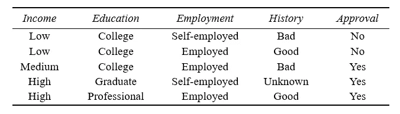
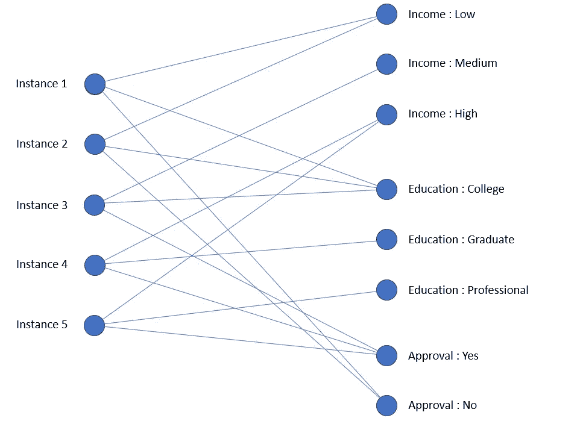
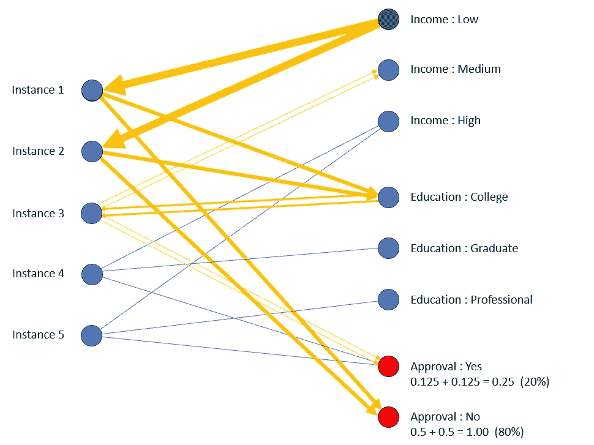
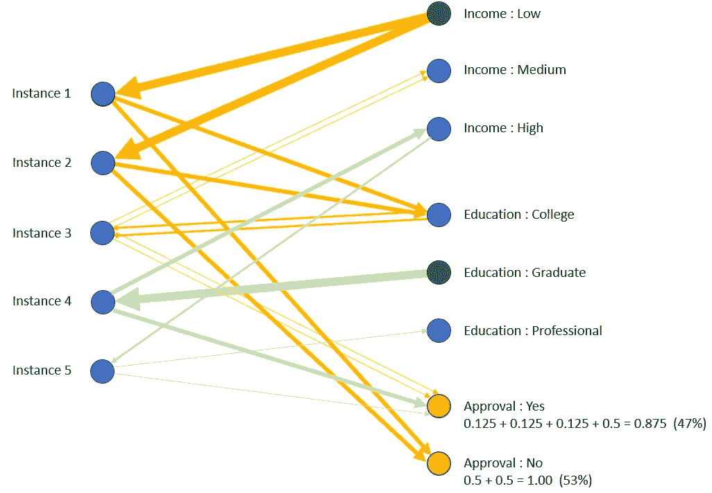

# 表格数据的图数据科学

> 原文：[`towardsdatascience.com/graph-data-science-for-tabular-data-42f7ee7ffc2a?source=collection_archive---------3-----------------------#2023-11-15`](https://towardsdatascience.com/graph-data-science-for-tabular-data-42f7ee7ffc2a?source=collection_archive---------3-----------------------#2023-11-15)

## 图方法比你想象的要更通用

 [Andrew Skabar, PhD](https://medium.com/@a.skabar_60534?source=post_page-----42f7ee7ffc2a--------------------------------)

·

[关注](https://medium.com/m/signin?actionUrl=https%3A%2F%2Fmedium.com%2F_%2Fsubscribe%2Fuser%2F95140850a5ea&operation=register&redirect=https%3A%2F%2Ftowardsdatascience.com%2Fgraph-data-science-for-tabular-data-42f7ee7ffc2a&user=Andrew+Skabar%2C+PhD&userId=95140850a5ea&source=post_page-95140850a5ea----42f7ee7ffc2a---------------------post_header-----------) 发表在 [Towards Data Science](https://towardsdatascience.com/?source=post_page-----42f7ee7ffc2a--------------------------------) · 7 分钟阅读 · 2023 年 11 月 15 日

--

图片由 [Alina Grubnyak](https://unsplash.com/@alinnnaaaa?utm_source=medium&utm_medium=referral) 提供，[Unsplash](https://unsplash.com/?utm_source=medium&utm_medium=referral)

图数据科学方法通常应用于具有某种固有图形特性的数据显示，例如分子结构数据、交通网络数据等。然而，图方法也可以对那些不显示明显图形结构的数据有用，比如用于机器学习任务的表格数据。在这篇文章中，我将简单直观地演示——不涉及任何数学或理论——通过将表格数据表示为图，我们可以开启对这些数据进行推理的新可能性。

为了保持简单，我将以下面的信用批准数据集作为示例。目标是根据其他属性的值预测批准的值。有许多分类算法可以用来做这件事，但让我们探讨一下如何使用图来处理这个问题。

作者创建的信用批准数据集

## **图形表示**

首先要考虑的是如何将数据表示为图。我们希望捕捉这样一个直觉：两个实例之间共享的属性值越多，它们之间的相似度就越高。我们将使用一个节点来表示每个实例（我们称这些节点为*实例节点*），并为每个可能的属性值使用一个节点（这些是*属性值节点*）。实例节点和属性值节点之间的连接是双向的，并反映在表格中的信息。为了保持*真的*简单，我们将省略属性"Employment"和"History"。这是图形表现。

信用批准数据集的图表示。作者提供的图片。

## **消息传递**

针对某个新实例的属性值，有几种使用图方法预测某个未知属性值的方式。我们将使用*消息传递*的概念。这是我们将使用的过程。

**消息传递过程**

在起始节点初始化值为 1 的消息，并让该节点将消息传递给其连接的每个节点。任何接收到消息的节点都会将消息（通过因子*k*膨胀，其中 0 <*k*<1）传递给其它连接的节点。继续消息传递，直到达到目标节点（即要预测其值的属性对应的节点），或者没有更多节点可传递消息为止。由于消息不能被传回到接收它的节点，该过程保证终止。

当消息传递完成时，图中的每个节点将收到零个或多个值不同的消息。对属于目标属性的每个节点的这些值进行求和，然后对这些（总和）值进行归一化，使它们本身的总和为 1。将归一化值解释为概率。然后可以使用这些概率来预测未知的属性值，或者从分布中抽取一个随机值来估算。在每次传递中膨胀消息值反映了长路径应该比短路径贡献更少于概率估计的直觉。

## 示例 1

假设我们希望在收入低的情况下预测批准的值。下面图中的箭头说明了消息传递过程的操作，每个箭头的粗细表示消息值（在每一跳中以因子*k* = 0.5 膨胀）。

估计在收入低的情况下批准的分布。图片由作者提供。

消息从节点收入：低（绿色）启动。该节点将值为 1 的消息传递给实例 1 和实例 2，然后每个实例将消息（扩展值为 0.5）传递给节点教育：大学和批准：否。请注意，由于教育：大学从实例 1 和实例 2 接收消息，它必须将*每个*这些消息传递给实例 3，扩展值为 0.25。目标变量每个节点的数字显示了接收到的消息值的总和（括号中为百分比的归一化值）。在收入低的条件下，我们得到批准的以下概率：

+   Prob (批准为‘是’ | 收入低) = 20%

+   Prob (批准为‘否’ | 收入低) = 80%

这些概率与从表中基于计数的预测结果不同。由于五个实例中有两个实例的收入低，并且这两个实例的批准为否，因此基于计数的预测将导致批准为否的概率为 100%。

消息传递程序已考虑到属性值教育大学，由实例 1 和 2 拥有的，同时也由实例 3 拥有，实例 3 的批准为是，从而贡献了节点批准：是的总消息值。如果我们在图中加入了额外的属性就业和历史，这可能会进一步增加连接起始节点和目标节点的路径数量，从而利用额外的上下文信息，并改善概率分布的估计。

## 示例 2

当对多个属性进行条件判断时，也可以使用消息传递程序。在这种情况下，我们只需在与我们条件的属性值对应的每个节点上启动消息，并从每个节点遵循相同的程序。下图显示了在收入低且教育水平为研究生的情况下，预测批准值的结果。来自每个起始节点的消息序列以不同的颜色显示。

估计在收入低且教育水平为研究生的情况下批准的分布。图片由作者提供。

实例 4 的教育值为研究生，因此对节点批准：是的消息值的总和做出贡献。实例 5 也对批准：是的做出进一步贡献，因为它与实例 4 共享高收入。

[注意：在这些示例中，我们将批准作为目标变量；然而，我们也可以用完全相同的方式估计收入或教育的概率分布]

这些示例表明，消息传递的简单概念（一个基本上是基于图的操作），结合适当的图表示，使我们能够进行一般且灵活的推理。具体来说，**可以用来估计任何属性的概率分布，条件是一个或多个属性的值**。

推理过程有些临时性*,* 设计成尽可能简单来支持我们的论点。有许多变体可以使用。关键点在于**图方法使我们能够利用实例之间丰富的关系网络，这是用基于向量的方法难以捕捉的**。当然，我们可以尝试用向量来表达消息传递过程（即，参考表而不是图），但这会很复杂和笨重。**图方法的简洁和优雅来自于图表示和推理过程的自然配对**。

我们可以从我们的例子中得出另一个有趣的观察。在上面的分析中，我们没有提到在实例节点处接收到的消息值之和（即，图中左侧节点）。让我们看看这些值可以显示给我们什么信息。在示例 1 中，在消息传递完成时，实例节点 1 到 5 的消息值之和分别为 1.0、1.0、0.5、0.0 和 0.0。将这些值归一化为总和为 1，结果分别为 40%、40%、20%、0% 和 0%。前两个实例具有批准号，它们归一化值的总和为 80%。最后三个实例具有批准是，它们归一化值的总和为 20%。但这些仅仅是我们在原始分析中得到的批准属性的概率。 （您可以验证 Example 2 中的相同情况）。这并非巧合。实例节点上的消息值之和可以解释为表示该实例与我们条件化的属性值的相似度。因此，**推理过程可以被认为是加权最近邻的一种形式**，其中相似性度量隐含在消息传递过程中。

## UNCRi 框架

在 Skanalytix，我们开发了一个基于图的计算框架，名为*统一数值/类别表示与推断*（UNCRi）***。*** 该框架结合了独特的图形数据表示和灵活的推断过程，可以用于估计和从任何类别或数值变量的条件分布中采样。它可以应用于分类和回归、缺失值填补、异常检测以及从完整联合分布或某些条件分布中生成合成数据等任务。该框架对数据的极端情况具有鲁棒性：类别变量可以从二元到高基数；数值变量可以是多峰的、高度偏斜的和任意规模的；缺失值比例可以很高。你可以在[`skanalytix.com`](http://skanalytix.com)了解更多关于 UNCRi 的信息。（UNCRi 代码是闭源的）。

## 结论

从一开始，模式识别和机器学习领域就被操作向量的方法主导。向量的普遍存在使得很难想象其他方法。图方法提供了一个强大而灵活的替代方案。当应用于表格数据时，图方法不仅可以预测一个属性的值或用从其估计分布中抽取的随机值填补属性，还可以通过使用概率链式法则生成整个合成数据集，这些数据实例以与源数据相同的方式分布。所有这些都可以通过一个图和一个推断过程完成！虽然在本文中我们只考虑了类别变量，但这些思想也可以扩展到包含数值和类别属性混合的数据集。
