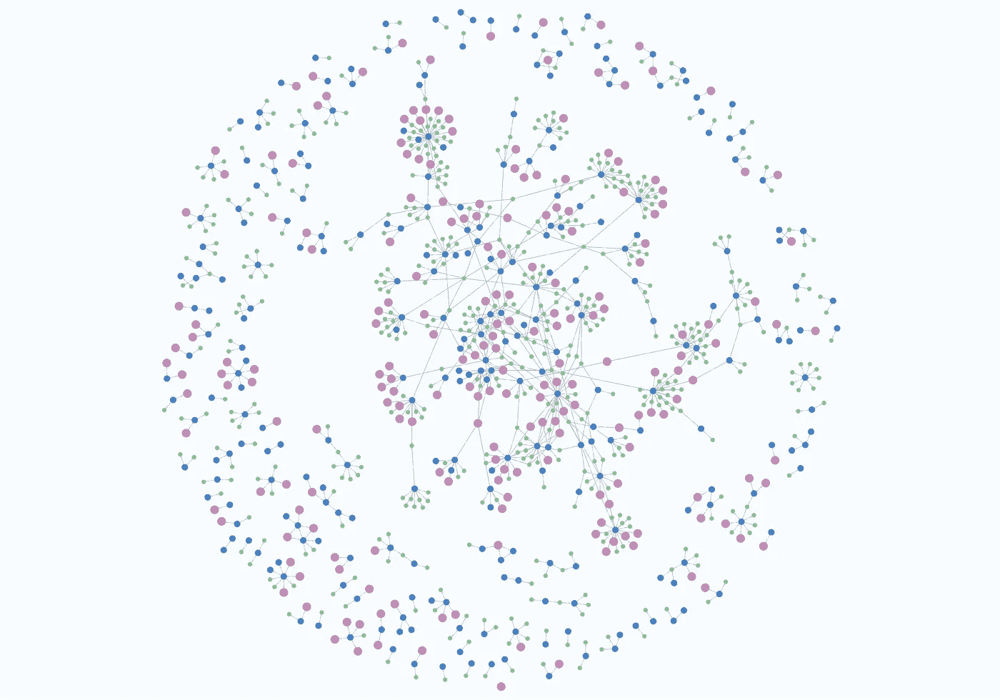
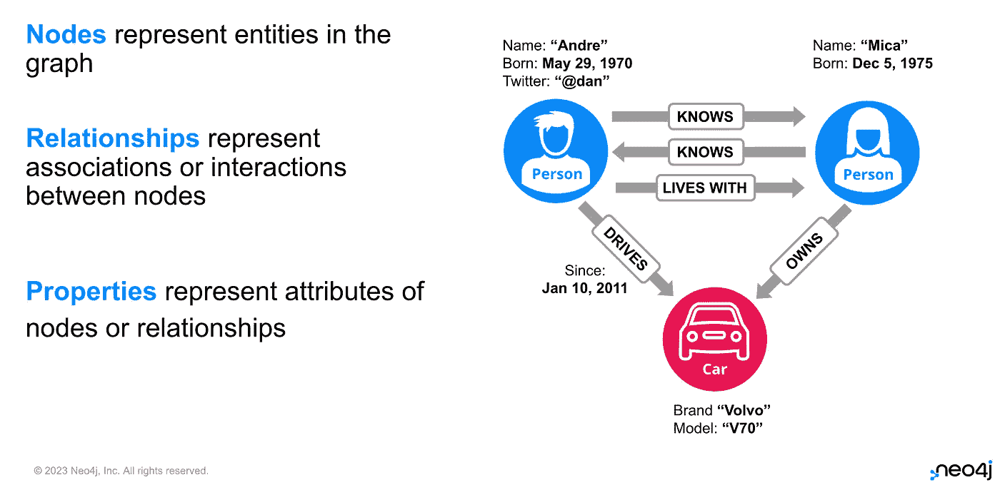
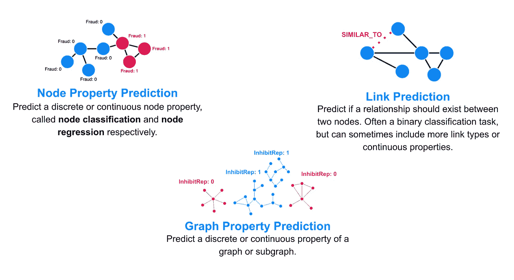
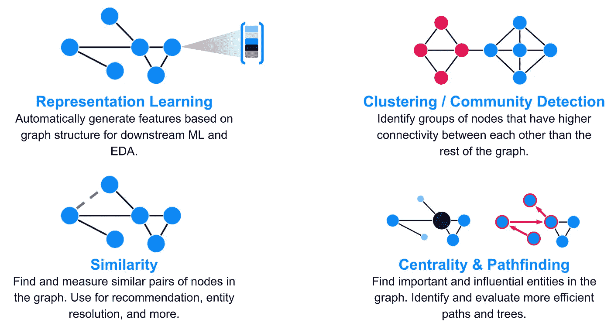
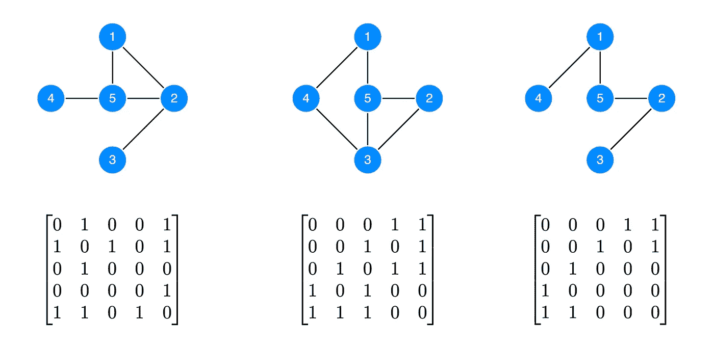
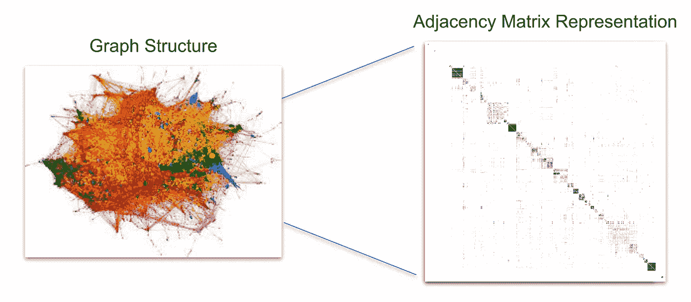
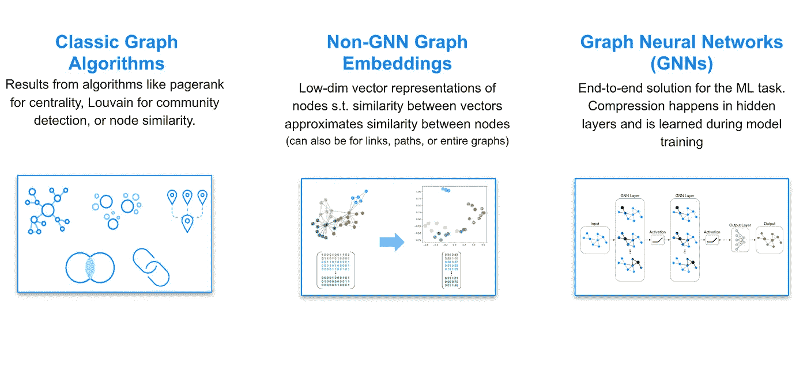
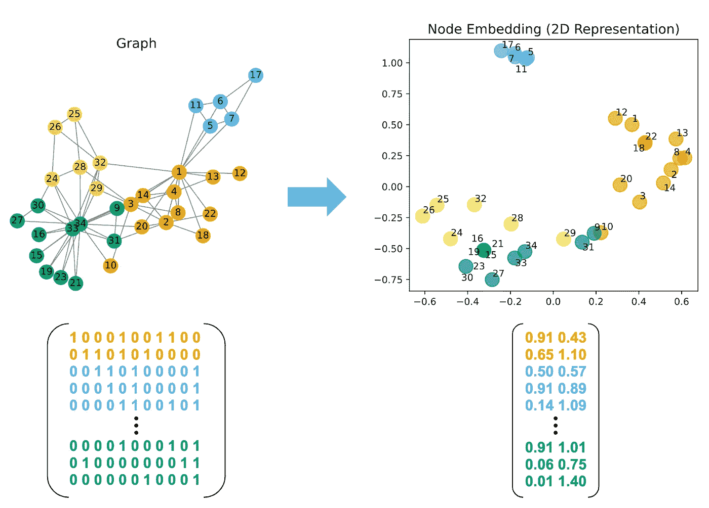
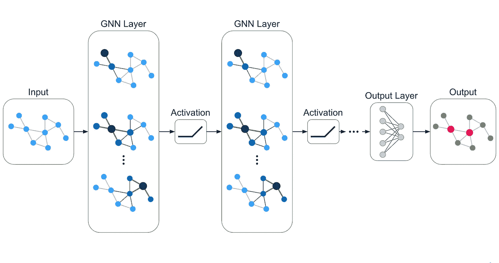

# 图机器学习：概述

> 原文：[`towardsdatascience.com/graph-machine-learning-an-overview-c996e53fab90?source=collection_archive---------0-----------------------#2023-04-04`](https://towardsdatascience.com/graph-machine-learning-an-overview-c996e53fab90?source=collection_archive---------0-----------------------#2023-04-04)

## 解密图神经网络——第一部分

## 入门的关键概念

 [Zach Blumenfeld](https://medium.com/@zach.blumenfeld?source=post_page-----c996e53fab90--------------------------------)

·

[关注](https://medium.com/m/signin?actionUrl=https%3A%2F%2Fmedium.com%2F_%2Fsubscribe%2Fuser%2Fe0dd307022f5&operation=register&redirect=https%3A%2F%2Ftowardsdatascience.com%2Fgraph-machine-learning-an-overview-c996e53fab90&user=Zach+Blumenfeld&userId=e0dd307022f5&source=post_page-e0dd307022f5----c996e53fab90---------------------post_header-----------) 发布于 [Towards Data Science](https://towardsdatascience.com/?source=post_page-----c996e53fab90--------------------------------) ·9 分钟阅读·2023 年 4 月 4 日

--

作者图片

图神经网络（GNN）在数据科学和机器学习中受到关注，但在专家圈外仍然了解不多。要理解这一激动人心的方法，我们必须从更广泛的图机器学习（GML）领域入手。许多在线资源谈论 GNN 和 GML 时，好像它们是可以互换的概念，或者好像 GNN 是一种万灵药，使其他 GML 方法变得过时。事实并非如此。GML 的主要目的之一是压缩大型稀疏图数据结构，以便进行可行的预测和推断。GNN 是实现这一目标的一种方式，也许是最先进的方式，但不是唯一的方式。理解这一点将帮助为本系列的未来部分奠定更好的基础，我们将在其中更详细地讨论特定类型的 GNN 和相关的 GML 方法。

在这篇文章中，我们将：

+   回顾一下图数据结构的简要概述

+   介绍 GML 任务及其解决的问题类型

+   探讨压缩的概念及其在推动不同 GML 方法（包括 GNN）中的重要性

# 什么是图？

如果你正在阅读这篇文章，你可能已经对图数据结构有一定的了解。如果没有，我建议阅读[这个关于属性图的资源](http://graphdatamodeling.com/Graph%20Data%20Modeling/GraphDataModeling/page/PropertyGraphs.html)或[这个关于图数据库概念的资源](https://neo4j.com/docs/getting-started/current/appendix/graphdb-concepts/)。我将在这里做一个*非常*简要的回顾：

图由节点和通过关系连接的节点组成。有[几种不同的方式来建模图数据](https://neo4j.com/blog/rdf-triple-store-vs-labeled-property-graph-difference/)。为了简化，我将使用属性图模型，该模型有三个主要组成部分：

1.  **节点**，代表实体（有时称为顶点），

1.  **关系**，代表节点之间的关联或互动（有时称为边或链接），以及

1.  **属性**，代表节点或关系的特征。

作者提供的图片

# 什么是图机器学习（GML）？

从根本上说，图机器学习（GML）是将机器学习应用于图，专门用于预测和指导任务。GML 在供应链、欺诈检测、推荐、客户 360、药物发现等领域有各种应用。

理解 GML 的最佳方法之一是通过它可以完成的不同类型的机器学习任务。我将[监督式](https://en.wikipedia.org/wiki/Supervised_learning)和[无监督式](https://en.wikipedia.org/wiki/Unsupervised_learning)学习分开说明。

## 监督式 GML 任务

下图概述了监督学习中最常见的三种 GML 任务：

作者提供的图片

进一步扩展：

1.  **节点属性预测：** 预测离散或连续的节点属性。可以将节点属性预测视为***预测事物的形容词***，例如，在金融服务平台上，某账户是否应被分类为欺诈，或者如何在在线零售店中对产品进行分类。

1.  **链接预测：** 预测两个节点之间是否存在关系以及该关系的一些潜在属性。链接预测对实体解析等应用非常有帮助，我们希望预测两个节点是否反映了相同的基础实体；推荐系统中，我们希望预测用户接下来可能想购买或互动的内容；以及生物信息学中，用于预测蛋白质和药物的相互作用。在每种情况下，我们关注的是***预测实体之间的关联、相似性或潜在的动作或互动***。

1.  **图属性预测：** 预测图或子图的离散或连续属性。在需要***将每个实体建模为独立图进行预测***的领域，图属性预测非常有用，而不是将实体建模为大型图中的节点，后者表示完整的数据集。用例包括材料科学、生物信息学和药物发现，其中单个图可以代表分子或蛋白质，我们希望对其进行预测。

## 无监督 GML 任务

以下是无监督学习中最常见的四种 GML 任务：

作者提供的图像

进一步阐述：

1.  **表示学习：** 降维同时保持重要信号是 GML 应用中的核心主题。图表示学习通过从图结构生成低维特征来明确地做到这一点，通常用于后续的探索性数据分析（EDA）和机器学习。

1.  **社区检测（关系的聚类）：** [社区检测](https://neo4j.com/docs/graph-data-science/current/algorithms/community/)是一种用于识别图中密切互连节点组的聚类技术。社区检测在异常检测、欺诈和调查分析、社交网络分析以及生物学中具有各种实际应用。

1.  **相似性：** [相似性](https://neo4j.com/docs/graph-data-science/current/algorithms/similarity/)在 GML 中指的是在图中找到并测量相似节点对。相似性适用于许多用例，包括推荐、实体解析以及异常和欺诈检测。常见的相似性技术包括 [节点相似性算法](https://neo4j.com/docs/graph-data-science/current/algorithms/node-similarity/)、[拓扑链接预测](https://neo4j.com/docs/graph-data-science/current/algorithms/linkprediction/) 和 [K-最近邻 (KNN)](https://neo4j.com/docs/graph-data-science/current/algorithms/knn/)。

1.  **中心性与路径寻找：** 我将这两个概念归为一类，因为它们通常与机器学习任务关系较少，而更多涉及分析测量。然而，它们在技术上仍然适用，因此我会为了完整性而涵盖它们。[中心性](https://neo4j.com/docs/graph-data-science/current/algorithms/centrality/)用于查找图中的重要或有影响力的节点。中心性在许多用例中普遍存在，包括欺诈和异常检测、推荐、供应链、物流和基础设施问题。[路径寻找](https://neo4j.com/docs/graph-data-science/current/algorithms/pathfinding/)用于找到图中的最低成本路径或评估路径的质量和可用性。路径寻找可以使许多涉及物理系统的用例受益，例如物流、供应链、交通运输和基础设施。

# 压缩如何成为 GML 的关键

我遇到了[这篇有趣的博客文章](https://www.singlelunch.com/2020/12/28/why-im-lukewarm-on-graph-neural-networks/) by Matt Ranger，它美妙地解释了这一点：GML 的一个重要目标，以及在很大程度上自然语言处理的目标，是在保持重要信号用于预测和推断的同时，压缩大型稀疏数据结构。

考虑一个由邻接矩阵表示的[正则图](https://en.wikipedia.org/wiki/Regular_graph)，这是一个方阵，每行和每列代表一个节点。如果从节点 A 到节点 B 的关系存在，则 A 行与 B 列交叉的单元格为 1；否则为 0。下面是一些小型正则图及其邻接矩阵的示例。

作者提供的图像

请注意，上述邻接矩阵中的许多单元格是 0。如果将其扩展到大型图形，特别是现实世界应用中发现的那些图形，零的比例会增加，邻接矩阵将变成大多数是零。

说明示例使用了来自大型图可视化工具和方法的 Last.fm 推荐图可视化以及来自 Beck, Fabian 等的矩阵图像，[通过对比多个层级识别模块化模式](https://www.researchgate.net/figure/Adjacency-matrix-visualization-showing-the-evolutionary-coupling-graph-ECConf-and-the_fig2_305026899)。

这是因为随着这些图的增长，平均[度中心性](https://neo4j.com/docs/graph-data-science/current/algorithms/degree-centrality/)增长得要慢得多，甚至几乎没有增长。在社交网络中，这可以通过像[邓巴数字](https://en.wikipedia.org/wiki/Dunbar%27s_number)这样的概念得到证实，它是一个人能够维持稳定社会关系的认知极限。你也可以对其他类型的图有直观认识，比如金融交易图或推荐系统的用户购买图。随着这些图的增长，一个人参与的潜在独特交易或购买的数量增长得要比他们的能力快得多。也就是说，如果网站上有六种产品，一个用户购买其中一半是可行的，但如果有数十万种产品，则不那么可行。因此，你最终会得到非常大且稀疏的数据结构。

如果你能直接将这些稀疏数据结构用于机器学习，你就不需要 GNNs 或任何 GML——你只需将它们作为特征插入到传统的 ML 模型中即可。然而，这并不可行。它不会扩展，而且即使超越这一点，它还会引发关于收敛和估计的数学问题，使 ML 模型不准确且不可行。因此，GML 的一个基本关键是压缩这些数据结构；可以说，这正是 GML 的全部意义所在。

# 如何实现压缩？——图机器学习方法

在最高层次上，存在三种 GML 方法来实现这种压缩。

作者提供的图片

**经典图算法**

经典图算法包括像[PageRank](https://neo4j.com/docs/graph-data-science/current/algorithms/page-rank/)、[Louvain](https://neo4j.com/docs/graph-data-science/current/algorithms/louvain/)和[Dijkstra 的最短路径](https://neo4j.com/docs/graph-data-science/current/algorithms/dijkstra-source-target/)。它们可以独立用于无监督社区检测、相似性、中心性或路径查找。经典算法的结果也可以作为传统下游模型的特征，如线性和逻辑回归、随机森林或神经网络，以执行 GML 任务。

经典图算法往往简单、易于入门，并且相对可解释和解释。然而，它们可能需要比其他 GML 方法更多的手动工作和主题专家（SME）。这使得经典图算法在实验和开发中成为良好的初步选择，有助于了解在你的图上什么效果最佳。它们在生产中也可以在简单问题上表现良好，但更复杂的用例可能需要升级到另一种 GML 方法。

**非 GNN 图嵌入**

图嵌入是一种表示学习形式。一些图嵌入技术利用 GNN 架构，而另一些则没有。后者，即非 GNN，是这种方法的重点。这些嵌入技术则依赖于矩阵分解/分解、随机投影、随机游走或哈希函数架构。一些示例包括 [Node2vec（基于随机游走）](https://neo4j.com/docs/graph-data-science/current/machine-learning/node-embeddings/node2vec/)、[FastRP（随机投影和矩阵操作）](https://neo4j.com/docs/graph-data-science/current/machine-learning/node-embeddings/fastrp/) 和 [HashGNN（哈希函数架构）](https://neo4j.com/docs/graph-data-science/current/machine-learning/node-embeddings/hashgnn/)。

图嵌入涉及生成数值或二进制特征向量来表示节点、关系、路径或整个图。其中，节点嵌入是最基本且最常用的。基本思想是为每个节点生成一个向量，使得向量之间的相似性（例如点积）近似于图中节点之间的相似性。下面是一个小型 [扎卡里空手道俱乐部网络](https://en.wikipedia.org/wiki/Zachary%27s_karate_club) 的示例。请注意，邻接矩阵是如何被压缩为每个节点的 2 维嵌入向量，以及这些向量如何聚集在一起以反映图的社区结构。大多数现实世界的嵌入将具有多于两个维度（128 到 256 或更高），以表示具有数百万或数十亿节点的大型现实世界图，但基本直觉是相同的。

作者提供的图像

上述相同的逻辑也适用于关系、路径和整个图嵌入：嵌入向量中的相似性应当近似于图结构中的相似性。这实现了压缩，同时保持了重要信号，使得嵌入在各种下游机器学习任务中具有用处。

与经典图算法相比，非 GNN 嵌入可以减少手动工作量和对 SME 的需求。尽管非 GNN 嵌入通常需要调整超参数才能得到最佳效果，但它们往往更容易自动化并在不同图上进行泛化。此外，一些非 GNN 嵌入如 [FastRP](https://neo4j.com/docs/graph-data-science/current/machine-learning/node-embeddings/fastrp/) 和 [HashGNN](https://neo4j.com/docs/graph-data-science/current/machine-learning/node-embeddings/hashgnn/) 由于不需要模型训练，可以在普通硬件上极好地扩展到大图。这相比于基于 GNN 的方法可以带来巨大的好处。

然而，非 GNN 嵌入也有一些权衡。由于涉及的数学操作更为一般化，它们的可解释性和解释能力不如经典图算法。它们通常是[转导式的](https://en.wikipedia.org/wiki/Transduction_(machine_learning))，不过 Neo4j 图数据科学的近期改进使得其中一些在特定应用中可以有效地表现为归纳式。我们将在本系列后续内容中更深入地讨论转导式和归纳式设置；这与对新未见数据的预测能力有关，是 GML 的一个重要考虑点。

**图神经网络（GNNs）**

图片来源：作者

GNN 是一种神经网络模型，它以图数据作为输入，将其转换为中间嵌入，然后将这些嵌入传递到对齐预测任务的最终层。这个预测任务可以是监督性的（节点属性预测、链接预测、图属性预测）或无监督的（聚类、相似性，或仅仅是用于表示学习的最终输出嵌入）。因此，与经典算法和非 GNN 嵌入不同，后者将结果作为特征传递给下游机器学习模型，特别是在监督任务中，GNNs 是完全端到端的图原生解决方案。

GNNs 作为完整的端到端解决方案，具有多种好处。值得注意的是，在训练过程中学习到的中间嵌入理论上能够自动推断图中的最重要信息。最近的大多数 GNNs 也因拥有经过训练的模型而具备归纳能力。

GNNs（图神经网络）也存在一些弱点，包括高复杂性、扩展困难，以及低可解释性和解释能力。GNNs 由于过度平滑和其他数学原理，还可能在深度方面存在局限性。

我将在下一个博客中进一步讨论 GNNs，*《GNNs：它们是什么以及为何重要》*。与此同时，**如果你想开始图机器学习，请查看** [**Neo4j Graph Data Science**](https://neo4j.com/product/graph-data-science/)。数据科学家和工程师可以在[这里](https://neo4j.com/docs/graph-data-science/current/)找到入门的技术文档。

# 总结

本文的主要收获：

+   图机器学习（GML）是一个广泛的领域，涵盖了许多用例应用，包括多个不同的监督和无监督机器学习任务。

+   GML（图机器学习）的主要目的之一是压缩大型稀疏图结构，同时保持预测和推断所需的重要信号。

+   GNNs 是实现这种压缩的多种 GML 方法之一。
