# 图形机器学习 @ ICML 2023

> 原文：[`towardsdatascience.com/graph-machine-learning-icml-2023-9b5e4306a1cc?source=collection_archive---------0-----------------------#2023-08-06`](https://towardsdatascience.com/graph-machine-learning-icml-2023-9b5e4306a1cc?source=collection_archive---------0-----------------------#2023-08-06)

## 图形机器学习的新动态？

## 最近的进展和热门趋势，2023 年 8 月版

 [Michael Galkin](https://mgalkin.medium.com/?source=post_page-----9b5e4306a1cc--------------------------------)

·

[关注](https://medium.com/m/signin?actionUrl=https%3A%2F%2Fmedium.com%2F_%2Fsubscribe%2Fuser%2F4d4f8ddd1e68&operation=register&redirect=https%3A%2F%2Ftowardsdatascience.com%2Fgraph-machine-learning-icml-2023-9b5e4306a1cc&user=Michael+Galkin&userId=4d4f8ddd1e68&source=post_page-4d4f8ddd1e68----9b5e4306a1cc---------------------post_header-----------) 发表在 [Towards Data Science](https://towardsdatascience.com/?source=post_page-----9b5e4306a1cc--------------------------------) ·16 分钟阅读·2023 年 8 月 6 日

--

壮丽的海滩和热带夏威夷风光🌴并没有阻止勇敢的科学家们参加在檀香山举办的[国际机器学习大会](https://icml.cc/Conferences/2023)并展示他们的最新研究成果！让我们一起看看我们最喜欢的图形机器学习领域的新动态。

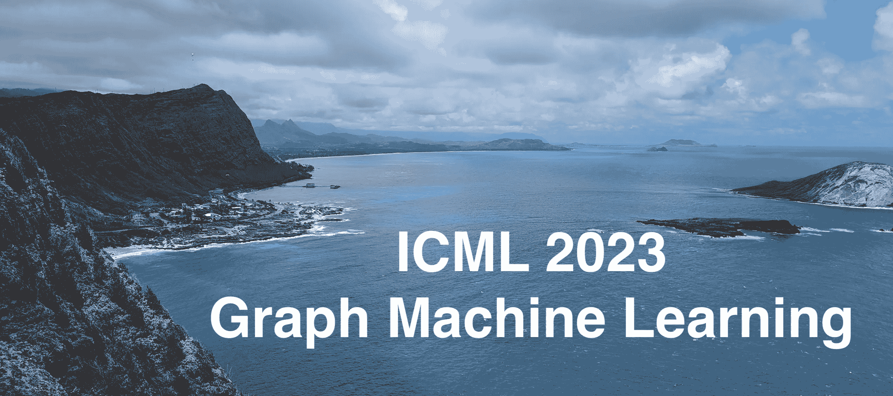

图片作者。

*感谢 Santiago Miret 校对本文。*

为了让帖子不那么枯燥，我在檀香山拍了一些照片📷

# 目录（可点击）：

1.  图形变换器：更稀疏、更快且有方向

1.  理论：GNN 的 VC 维，深入探讨过度挤压

1.  新的 GNN 架构：延迟和半跳

1.  生成模型 — 分子稳定扩散，离散扩散

1.  几何学习：几何 WL，克利福德代数

1.  分子：2D-3D 预训练，MD 中的不确定性估计

1.  材料与蛋白质：用于蛋白质的 CLIP，Ewald 消息传递，对称增强

1.  酷应用：算法推理、归纳 KG 完成、用于质谱的 GNN

1.  总结的 Meme 部分

# **图转换器：更稀疏、更快、且有方向**

我们大约一年前 提出了 **GraphGPS**，很高兴看到许多 ICML 论文基于我们的框架并进一步扩展 GT 能力。

**➡️ Exphormer** 由 [Shirzad, Velingker, Venkatachalam 等人](https://openreview.net/forum?id=3Ge74dgjjU) 添加了图动机的稀疏注意力的缺失部分：与 BigBird 或 Performer（最初为序列设计）不同，Exphormer 的注意力基于 1-hop 边、虚拟节点（与图中的所有节点相连）以及一个精巧的 [扩展边](https://en.wikipedia.org/wiki/Expander_graph) 想法。扩展图具有固定度，并被证明可以近似完全连接的图。所有组件结合起来，注意力成本为 *O(V+E)* 而不是 *O(V²)*。这使得 Exphormer 能够在几乎所有地方超越 GraphGPS，并扩展到最多 16 万个节点的非常大图。令人惊叹的工作，Exphormer 有很大机会成为 GT 中标准的稀疏注意力机制 👏。

**➡️** 与图转换器并行，扩展图已经可以用来增强任何 MPNN 架构的性能，如 *Deac, Lackenby, 和 Veličković* 在 [Expander Graph Propagation](https://arxiv.org/abs/2210.02997) 中所示。

类似地，[Cai 等人](https://openreview.net/forum?id=1EuHYKFPgA) 证明了具有虚拟节点的 MPNN 可以近似线性 Performer-like 注意力，因此即使是经典的 GCN 和 GatedGCN 只要加入虚拟节点，也能在长范围图任务中表现出相当的 SOTA 性能（我们发布了 [LGRB 基准测试](https://github.com/vijaydwivedi75/lrgb)来测量 GNN 和 GT 的长范围能力）。

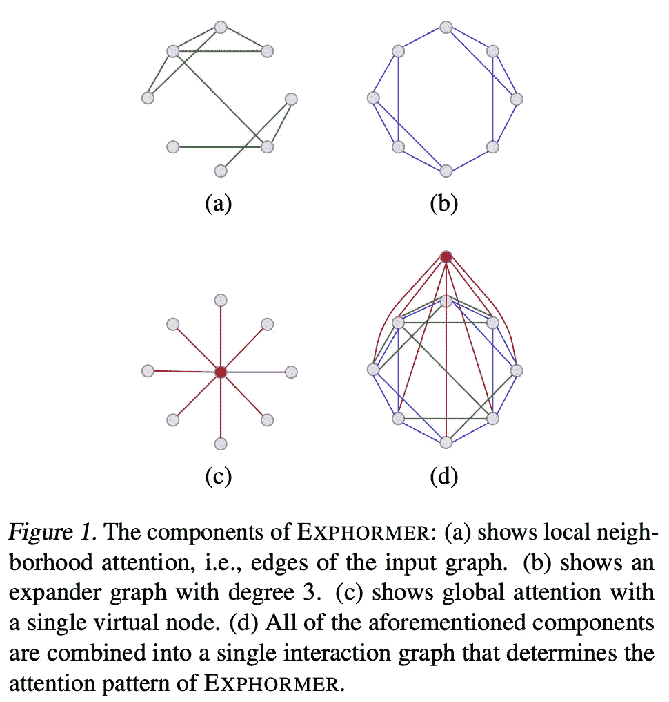

来源：[Shirzad, Velingker, Venkatachalam 等人](https://openreview.net/forum?id=3Ge74dgjjU)

**➡️** 一些受视觉模型启发的 GT 的 **基于补丁** 的子采样方法：*He 等人* 的 [**“ViT/MLP-Mixer 在图上的推广”**](https://openreview.net/forum?id=l7yTbEWuOQ) 将输入分成多个补丁，使用 GNN 将每个补丁编码为一个令牌，并对这些令牌运行变换器。

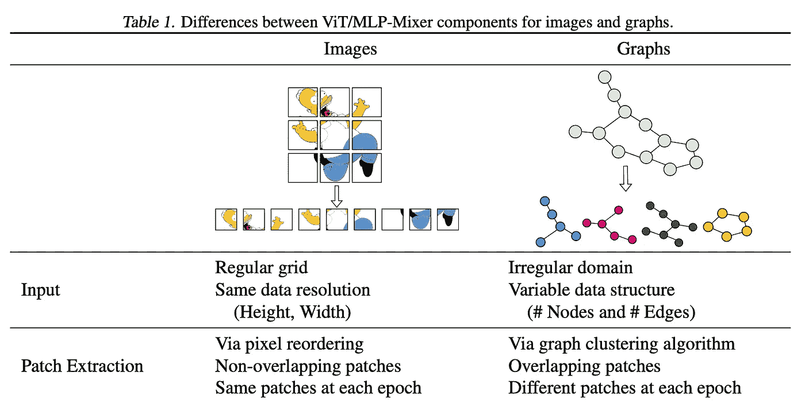

来源：[“ViT/MLP-Mixer 在图上的推广”](https://openreview.net/forum?id=l7yTbEWuOQ) 由 He 等人

在 **GOAT** 中，由 [Kong 等人](https://openreview.net/forum?id=Le2dVIoQun) 提出，节点特征被投影到 K-Means 的 K 个簇的代码本中，并且每个节点的采样的三跳邻域都关注这个代码本。GOAT 是一个单层模型，并且可以扩展到数百万节点的图中。

**➡️ 有向图** 也受到了一些 Transformer 的喜爱 💗。[“Transformers Meet Directed Graphs”](https://openreview.net/forum?id=a7PVyayyfp) 由 *Geisler 等人* 引入了磁拉普拉斯 —— 非对称邻接矩阵的拉普拉斯的泛化。磁拉普拉斯的特征向量与有向随机游走结合，成为 Transformer 的强大输入特征，在 [OGB Code2](https://ogb.stanford.edu/docs/leader_graphprop/#ogbg-code2) 图属性预测数据集上设置了新的 SOTA，超过了现有方法很多！

🏅 最后但并非最不重要的是，我们在社区标准 ZINC 数据集上有了一个新的 SOTA GT — **GRIT**，由 [Ma, Lin, 等人](https://openreview.net/forum?id=HjMdlNgybR) 提出，其全 *d*-维随机游走矩阵被称为相对随机游走概率（RRWP），作为边特征用于注意力计算（相比之下，流行的 [RWSE](https://openreview.net/forum?id=wTTjnvGphYj) 特征只是这个矩阵的对角元素）。RRWP 明显比最短路径距离特征更强大，在 ZINC 上取得了创纪录的低 0.059 MAE（比 GraphGPS 的 0.070 低）。GRIT 在其他基准测试中通常也优于 GPS 👏。同样地，[Eliasof 等人](https://openreview.net/forum?id=1Nx2n1lk5T) 提出了一个巧妙的思路，将随机和谱特征结合为位置编码，在超越 RWSE 的同时并未尝试过与 GTs 结合。

图片由作者提供。

# **理论：GNNs 的 VC 维，深入探讨过度压缩**

**➡️** [VC 维](https://en.wikipedia.org/wiki/Vapnik%E2%80%93Chervonenkis_dimension) 衡量了模型的容量和表达能力。它已经广泛应用于经典机器学习算法的研究中，但令人惊讶的是，从未应用于研究 GNNs。在 [“WL meet VC”](https://openreview.net/forum?id=rZN3mc5m3C) 中，*Morris 等人* 最终揭示了 WL 测试和 VC 维之间的联系 — 原来 VC 维可以由 GNN 权重的比特长度界定，即 float32 权重意味着 VC 维为 32。此外，VC 维对给定任务中唯一 WL 颜色的数量以对数方式依赖，对深度和层数则多项式依赖。这是一个重要的理论结果，我鼓励你深入了解！

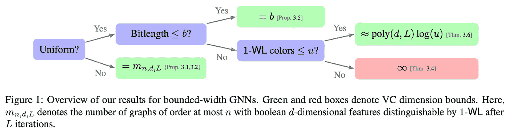

来源：[“WL meet VC”](https://openreview.net/forum?id=rZN3mc5m3C) by *Morris 等人*

🍊🖐️ 过度压缩效应——尝试将来自过多邻居节点的信息塞入会导致信息丢失——是 MPNN 的另一个常见问题，我们尚未完全理解如何妥善处理。今年，有 3 篇论文专门讨论了这个话题。也许最基础的是[**Di Giovanni 等**](https://openreview.net/forum?id=t2tTfWwAEl)的工作，解释了 MPNN 的宽度、深度和图拓扑如何影响过度压缩。

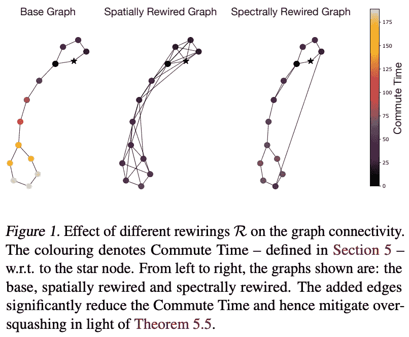

来源：[**Di Giovanni 等**](https://openreview.net/forum?id=t2tTfWwAEl)

结果表明，**宽度**可能有帮助（但存在泛化问题），**深度**实际上**没有**什么帮助，而**图拓扑**（由节点间的通勤时间表征）起着最重要的作用。我们可以通过各种*图重连*策略（基于空间或谱特性添加和移除边）来减少通勤时间，这些策略有很多（你可能听说过[基于 Ricci 流的重连](https://openreview.net/forum?id=7UmjRGzp-A)，该研究在 ICLR 2022 上获得了杰出论文奖）。事实上，还有一项[后续研究](https://arxiv.org/abs/2306.03589)对此进行了更深入的探讨，推导了一些关于过度压缩和 MPNN 属性的不可能性声明——我强烈推荐阅读！

**➡️** 有效电阻是空间重连策略的一个例子，[**Black 等**](https://openreview.net/forum?id=50SO1LwcYU)对此进行了详细研究。基于 Ricci 流的重连方法与图的曲率相关，进一步研究见于[Nguyen 等](https://openreview.net/forum?id=eWAvwKajx2)的工作中。

**➡️** 子图 GNN 继续受到关注：两项工作（[**Zhang, Feng, Du 等**](https://openreview.net/forum?id=2Hp7U3k5Ph) 和 [**Zhou, Wang, Zhang**](https://openreview.net/forum?id=K07XAlzh5i)）同时推导了最近提出的子图 GNN 的表现力等级及其与 1 阶及更高阶 WL 测试的关系。

图像作者提供。

# **新型 GNN 架构：延迟和半跳**

如果你厌倦了 GCN 或 GAT 的各种变体，这里有一些新鲜的想法，可以与任何你选择的 GNN 搭配使用：

⏳ 正如我们在**理论**部分所知，重新连接有助于对抗过度挤压。[**Gutteridge 等人**](https://openreview.net/forum?id=WEgjbJ6IDN) 介绍了*“DRew: 动态重连的延迟消息传递”*，它在后期 GNN 层中逐渐稠密化图，使得长距离节点能够看到先前节点的原始状态（原始 DRew），或者这些跳跃连接是基于*延迟*来添加的——取决于两个节点之间的距离（vDRew 版本）。例如（ 🖼️👇），在 vDRew 延迟消息传递中，来自层 0 的起始节点将在层 1 上向 2-hop 邻居展示其状态，并将在层 2 上向 3-hop 邻居展示其状态。**DRew** 显著提高了普通 GNN 处理长距离任务的能力——实际上，启用 DRew 的 GCN 是来自 [长距离图基准](https://github.com/vijaydwivedi75/lrgb) 的 Peptides-func 数据集上的当前 [SOTA](https://github.com/vijaydwivedi75/lrgb) 👀

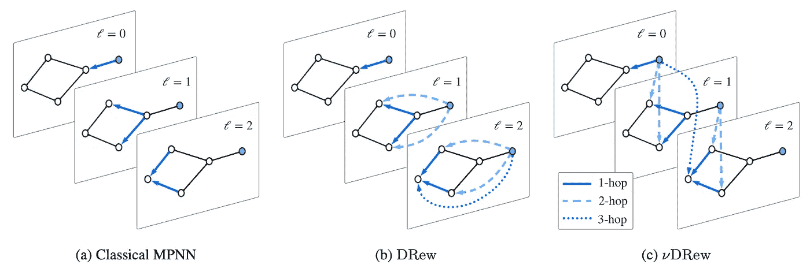

来源: [**Gutteridge 等人**](https://openreview.net/forum?id=WEgjbJ6IDN)

🦘 另一个有趣的想法来自[**Azabou 等人**](https://openreview.net/forum?id=lXczFIwQkv)，即通过在每条边上插入具有特殊连接模式的新*慢节点*来减慢消息传递——仅从起始节点来的一个输入连接和与目标节点的对称边。慢节点在异质性基准测试中大幅提升了普通 GNN 的性能，也可以通过创建具有不同慢节点位置的视图来实现自监督学习，针对相同的原始图。**HalfHop** 是一个无需深思熟虑的自监督学习组件，它提升了性能，并且应该成为许多 GNN 库的标准套件 👍。

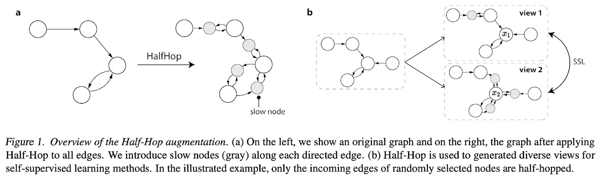

来源: [**Azabou 等人**](https://openreview.net/forum?id=lXczFIwQkv)

图片由作者提供。

# **生成模型 — 分子稳定扩散，离散扩散**

**➡️** 扩散模型可以在**特征**空间（例如，图像生成中的像素空间，如原始 DDPM）或**潜在**空间（如稳定扩散）中工作。在特征空间中，必须设计噪声过程以尊重特征空间的对称性和等变性。在潜在空间中，可以简单地向（预训练的）编码器生成的特征添加高斯噪声。大多数 3D 分子生成模型在特征空间中工作（如开创性的[EDM](https://arxiv.org/abs/2203.17003)），而由[Xu 等人](https://openreview.net/forum?id=sLfHWWrfe2)（著名的[GeoDiff](https://arxiv.org/abs/2203.02923)的作者）提出的新**GeoLDM**模型是首个为 3D 分子生成定义**潜在**扩散的模型。也就是说，在训练 EGNN 自编码器之后，GeoLDM 在去噪目标上进行训练，其中噪声从标准高斯分布中采样。GeoLDM 相比于 EDM 和其他非潜在扩散方法带来了显著的改进👏。

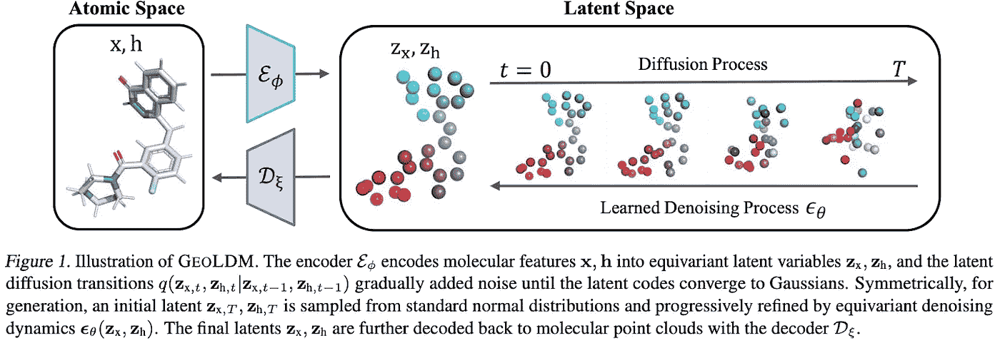

GeoLDM。来源：[Xu 等人](https://openreview.net/forum?id=sLfHWWrfe2)

**➡️** 在非几何图的领域（仅具有邻接关系和可能的类别节点特征）中，由[DiGress](https://openreview.net/forum?id=UaAD-Nu86WX)（ICLR’23）开创的离散图扩散似乎是最适用的选项。[Chen 等人](https://openreview.net/forum?id=vn9O1N5ZOw)提出了**EDGE**，这是一种由节点度分布引导的离散扩散模型。与 DiGress 不同，EDGE 中的最终目标图是没有边的断开图，前向噪声模型通过伯努利分布移除边，反向过程将边添加到最近的*活跃*节点（活跃节点是指在前一步中度数发生变化的节点）。由于度引导引入的稀疏性，EDGE 可以生成高达 4k 节点和 40k 边的大型图！

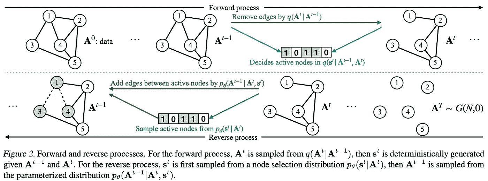

图生成与 EDGE。来源：[Chen 等人](https://openreview.net/forum?id=vn9O1N5ZOw)

**➡️** 最后，[**“图形结构扩散模型”**](https://openreview.net/forum?id=24wzmwrldX)由*Weilbach 等人*提出，弥合了连续生成模型与在感兴趣问题中引入特定结构的概率图模型之间的差距——通常此类问题具有组合性质。核心思想是将问题的结构编码为尊重排列不变性的注意力掩码，并在 Transformer 编码器的注意力计算中使用该掩码（根据定义，除非使用位置嵌入，否则对输入标记排列是等变的）。**GSDM**可以处理二进制连续矩阵分解、布尔电路，生成数独，并执行排序。特别有趣的是论文中蕴含的一丝讽刺🙃。

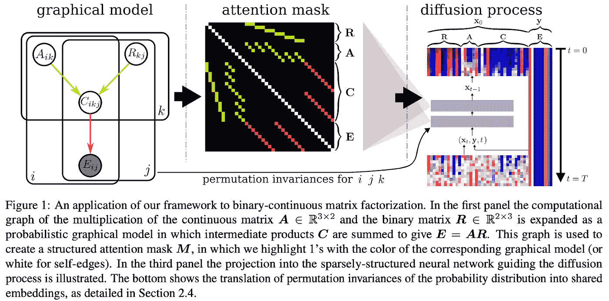

GSDM 任务到注意力偏差。来源：[**“图形结构扩散模型”**](https://openreview.net/forum?id=24wzmwrldX) 由 *Weilbach 等*

作者提供的图片

# **几何学习：几何 WL，Clifford 代数**

几何深度学习蓬勃发展！有很多有趣的论文展示，这将占据整个帖子，因此我只会重点介绍几个。

**➡️ 几何 WL** 终于在 [Joshi, Bodnar 等](https://openreview.net/forum?id=6Ed3gchl9L) 的工作中出现。几何 WL 扩展了 WL 测试的概念，加入了几何特征（例如坐标或速度），并推导出表达力层级，直到 k-order GWL。关键点：1️⃣ **等变** 模型比 **不变** 模型更具表现力（注意在完全连接的图中差异消失），2️⃣ **张量阶** 的特征提升了表现力，3️⃣ **体序** 的特征提升了表现力（见下图 👇）。也就是说，*球面 > 笛卡尔坐标 > 标量*，以及 *多体交互 > 仅距离*。论文还展示了一个令人惊叹的学习资源 [Geometric GNN Dojo](https://github.com/chaitjo/geometric-gnn-dojo)，你可以从基本原理推导并实现大多数 SOTA 模型！

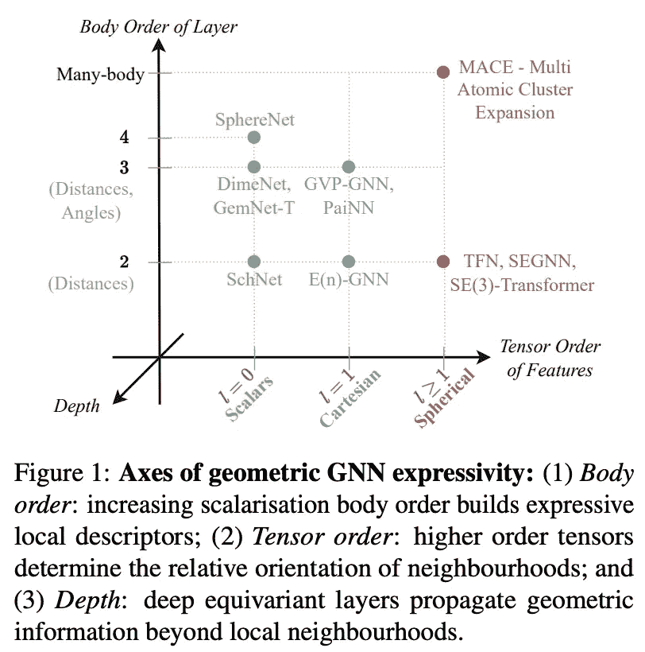

来源：[Joshi, Bodnar 等](https://openreview.net/forum?id=6Ed3gchl9L)

**➡️** 超越向量到 Clifford 代数，[Ruhe 等](https://openreview.net/forum?id=DNAJdkHPQ5) 推导了 **几何 Clifford 代数网络**（GCANs）。Clifford 代数通过双向量、三向量和（一般）多向量自然支持高阶交互。关键思想是 [Cartan-Dieudonné 定理](https://en.wikipedia.org/wiki/Cartan%E2%80%93Dieudonn%C3%A9_theorem)，即每个正交变换都可以分解为在超平面上的 *反射*，而几何代数将数据表示为 *Pin(p,q,r)* 群的元素。GCANs 引入了线性层、归一化、非线性等概念，以及它们如何用神经网络进行参数化。实验包括流体动力学建模和 Navier-Stokes 方程。

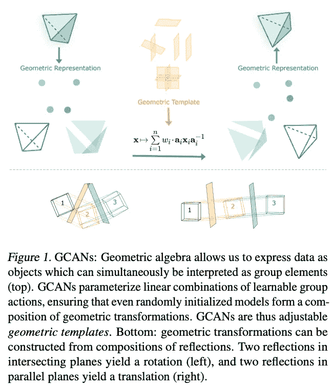

来源：[Ruhe 等](https://openreview.net/forum?id=DNAJdkHPQ5)

实际上，已经有一篇[后续工作](https://arxiv.org/abs/2305.11141)介绍了等变 Clifford 神经网络——你可以了解更多关于 Clifford 代数基础以及微软研究院支持的最新论文 [CliffordLayers](https://microsoft.github.io/cliffordlayers/)。

💊 [等变 GNN](http://proceedings.mlr.press/v139/satorras21a/satorras21a.pdf)（EGNN）是几何深度学习中的阿司匹林，几乎适用于所有任务，并且已经看到相当多的改进。[**Eijkelboom 等**](https://openreview.net/forum?id=hF65aKF8Bf) 将 EGNN 与 [单纯形网络](https://arxiv.org/abs/2103.03212) 结合，这些网络在高阶结构（即单纯形复合体）上操作，形成 **EMPSN**。这是第一个结合几何和拓扑特征的例子之一，具有很大的改进潜力！最后，[**Passaro 和 Zitnick**](https://openreview.net/forum?id=QIejMwU0r9) 推导出一种巧妙的技巧，将 SO(3) 卷积简化为 SO(2)，将复杂度从 O(L⁶) 降到 O(L³)，同时提供了数学等价性保证 👀。这一发现使得几何模型在像 OpenCatalyst 这样的大型数据集上得以扩展，并已被应用于 [Equiformer V2](https://arxiv.org/abs/2306.12059) —— 很快将在许多其他几何模型库中出现 😉

图片来源：作者。

# **分子：2D-3D 预训练，MD 中的不确定性估计**

**➡️** [Liu, Du 等](https://openreview.net/forum?id=mPEVwu50th) 提出了 **MoleculeSDE**，这是一个新的框架，用于在分子数据上进行 2D-3D 联合预训练。除了标准的对比损失外，作者还添加了两个 **生成** 组件：通过基于分数的扩散生成重建 2D -> 3D 和 3D -> 2D 输入。使用标准的 GIN 和 SchNet 作为 2D 和 3D 模型，MoleculeSDE 在 PCQM4M v2 上进行了预训练，并在下游微调任务中表现良好。

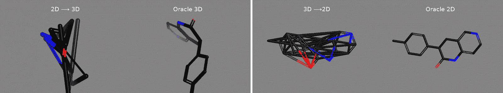

来源：[MoleculeSDE Github 仓库](https://github.com/chao1224/MoleculeSDE)

**➡️** [Wollschläger 等](https://openreview.net/forum?id=DjwMRloMCO) 对 GNN 中的不确定性估计进行了一项全面研究，重点关注分子动力学和力场。识别关键的物理信息和应用导向原则，作者提出了一种 **局部神经核**，这是一种基于高斯过程的扩展，适用于任何几何 GNN，处理不变和等变量（已在 SchNet、DimeNet 和 NequIP 上进行尝试）。在许多情况下，LNK 从一个模型的估计与需要训练多个模型的昂贵集成效果相当或更好。

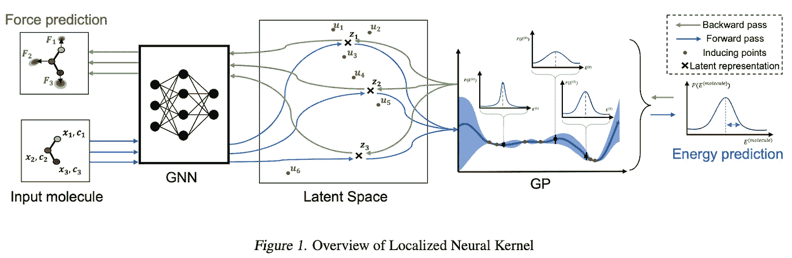

来源：[Wollschläger 等](https://openreview.net/forum?id=DjwMRloMCO)

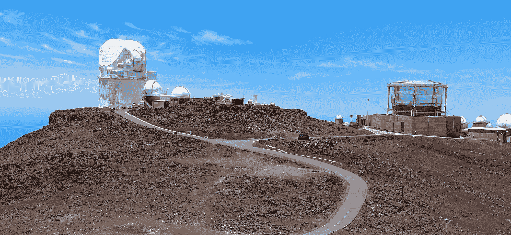

图片来源：作者。

# **材料与蛋白质：CLIP 用于蛋白质，Ewald 消息传递，等变增强**

CLIP 及其后代已经成为文本到图像模型中的标准工具。我们能否对文本到蛋白质做同样的事情？可以！

**➡️** [Xu, Yuan 等](https://openreview.net/forum?id=ZOOwHgxfR4) 提出了 **ProtST**，一个用于学习文本蛋白质描述（通过 PubMedBERT）和蛋白质序列（通过 ESM）联合表示的框架。除了对比损失外，ProtST 还有一个多模态掩码预测目标，例如，掩盖文本和蛋白质序列中的 15% 令牌，并基于潜在表示联合预测这些令牌，以及基于序列或语言单独的掩码预测损失。此外，作者设计了一个新的 **ProtDescribe** 数据集，包含 550K 对齐的蛋白质序列-描述对。 **ProtST** 在 [**PEER**](https://github.com/DeepGraphLearning/PEER_Benchmark) 基准测试中在许多蛋白质建模任务上表现出色，包括蛋白质功能注释和定位，同时还允许从文本描述中进行零样本蛋白质检索（见下例）。看起来 **ProtST** 具有成为许多蛋白质生成模型背后核心的光明前景 😉

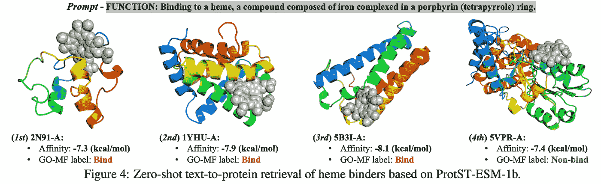

来源: [Xu, Yuan 等](https://openreview.net/forum?id=ZOOwHgxfR4)

实际上，ICML 展示了几项蛋白质生成工作，如 [Lin 和 AlQuraishi](https://openreview.net/forum?id=4Kw5hKY8u8) 的 **GENIE** 和 [Yim, Trippe, De Bortoli, Mathieu 等](https://openreview.net/forum?id=m8OUBymxwv) 的 **FrameDiff** — 这些工作尚未依赖文本描述，因此将 ProtST 融入其中似乎是提升性能的明智选择 📈

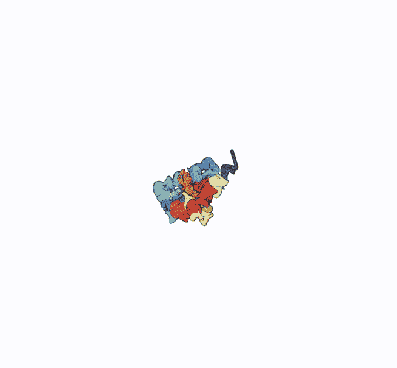

Gif 来源: [SE(3) Diffusion Github](https://github.com/jasonkyuyim/se3_diffusion)

⚛️ 分子上的 MPNNs 具有严格的局部性偏差，这会抑制对长程交互的建模。 [Kosmala 等](https://openreview.net/forum?id=vd5JYAml0A) 推导出了 **Ewald 消息传递**，并应用了 [Ewald 求和](https://en.wikipedia.org/wiki/Ewald_summation) 的思想，该思想将相互作用势能分解为短程和长程项。短程交互由任何 GNN 建模，而长程交互则是新的，通过 **3D 傅里叶变换** 和傅里叶频率上的消息传递来建模。结果表明，这一长程项相当灵活，可以应用于任何建模周期性和非周期性系统（如晶体或分子）的网络，如 SchNet、DimeNet 或 GemNet。该模型在 OC20 和 OE62 数据集上进行了评估。如果你对更多细节感兴趣，可以查看 [Arthur Kosmala 的 1 小时讲座](https://www.youtube.com/watch?v=Ip8EGde5SUQ)！

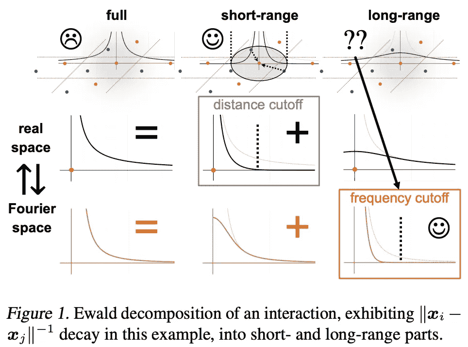

来源: [Kosmala 等](https://openreview.net/forum?id=vd5JYAml0A)

在**PotNet**中，[林等人](https://openreview.net/forum?id=jxI4CulNr1)使用了与 Ewald 求和类似的思想来处理 3D 晶体，其中长程连接使用不完全贝塞尔函数建模。PotNet 在 Materials Project 数据集和 JARVIS 上进行了评估，因此阅读这两篇论文可以很好地理解 Ewald 求和为许多与晶体相关的任务带来的好处 😉

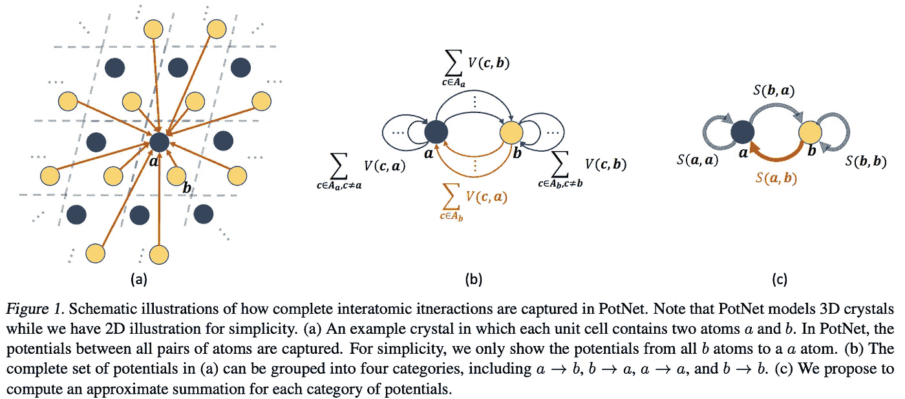

来源：[林等人](https://openreview.net/forum?id=jxI4CulNr1)

**➡️** 另一种方法是通过[杜瓦尔、施密特等人](https://openreview.net/forum?id=HRDRZNxQXc)在**FAENet**中赋予*任何* GNNs 晶体和分子等效性的看法。一种标准的方法是将某些对称性和等效性直接嵌入 GNN 架构中（例如在 EGNN、GemNet 和 Ewald Message Passing 中）— 这是一种安全但计算昂贵的方式（特别是涉及球谐函数和张量积时）。另一种选项通常用于视觉 — 展示相同输入的许多增强，模型最终应该学习到增强中的相同不变性。作者选择第二条路径，并设计了一种严格的方法来采样 2D / 3D 数据的不变或等变增强（例如用于能量或力的增强），所有这些增强都有花哨的证明 ✍️。为此，数据增强管道包括将 2D / 3D 输入投影到基于距离协方差矩阵的 PCA 的规范表示中，从中我们可以均匀采样旋转。

提出的 FAENet 是一个简单的模型，只使用距离，但在使用随机帧平均数据增强时表现非常好，同时速度快 6 到 20 倍。同样适用于晶体结构！

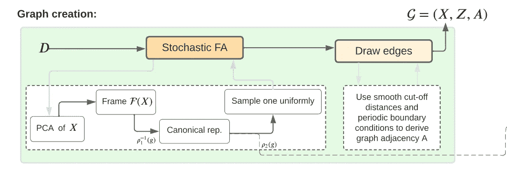

增强和随机帧平均。来源：[杜瓦尔、施密特等](https://openreview.net/forum?id=HRDRZNxQXc)

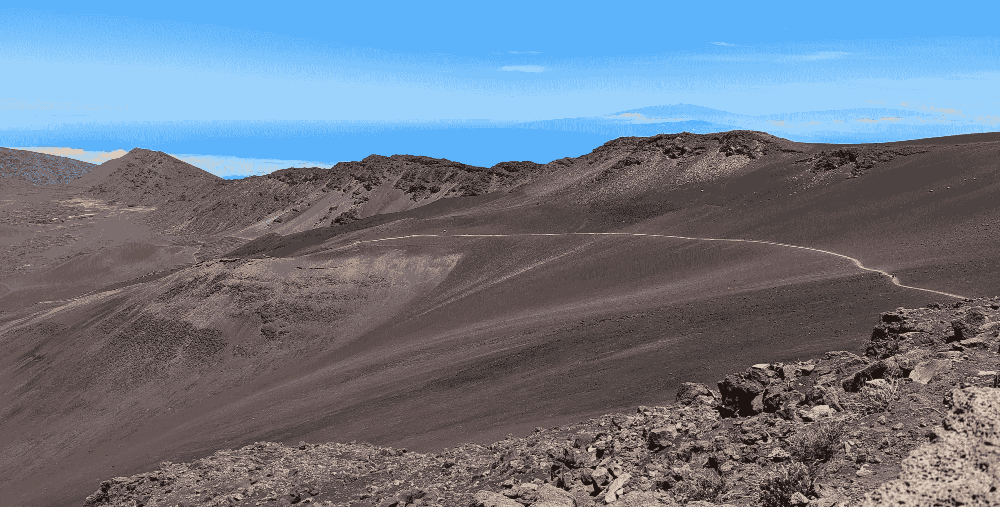

图片由作者提供。

# **酷炫应用：算法推理，归纳 KG 完成，质谱 GNN**

本节中的几篇论文不属于上述任何一篇，但仍值得关注。

**➡️** [**“神经算法推理与因果正则化”**](https://openreview.net/forum?id=kP2p67F4G7) *Bevilacqua 等人* 解决了图学习中的一个常见问题——在测试时对更大输入的 OOD 泛化。研究算法推理问题中的 OOD 泛化时，作者观察到在某一步骤中存在许多不同的输入产生相同的计算。与此同时，这也意味着某些输入子集不会（或不应该）影响预测结果。这个假设使得可以设计一个自监督目标（称为**Hint-ReLIC**），该目标更倾向于一个“有意义”的步骤而不是一堆不影响预测结果的步骤。这个新目标显著提高了许多 CLRS-30 任务的表现，达到 90%以上的 micro-F1。是否可以在一般消息传递中利用相同的原则来改进其他图学习任务中的 OOD 转移是一个有趣的问题 🤔

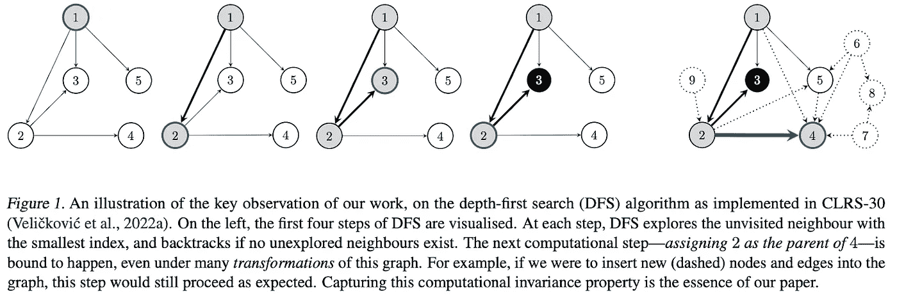

来源：[**“神经算法推理与因果正则化”**](https://openreview.net/forum?id=kP2p67F4G7) *Bevilacqua 等人*。

如果你对神经算法推理更感兴趣，可以查看[知识与逻辑推理研讨会](https://klr-icml2023.github.io/papers.html)的会议记录，其中包含更多相关工作。

**➡️** [**“InGram: 通过关系图的归纳知识图嵌入”**](https://openreview.net/forum?id=OoOpO0u4Xd) *Lee 等人* 似乎是 ICML’23 上为数不多的知识图谱论文之一（根据我的搜索）。**InGram** 是首批能够在测试时对未见实体和**未见关系**进行归纳泛化的方法之一。之前的归纳 KG 模型需要以某种形式学习关系嵌入以对新节点进行泛化，而在这种范式下，新的未见关系很难建模。InGram 在原始的多关系图上构建了一个关系图，即关系类型的图，并通过运行 GAT 基于这个图学习关系的表示。实体表示是从随机初始化和 GNN 编码器中获得的。拥有实体和关系表示后，应用 DistMult 解码器作为评分函数。InGram 在未见关系方面有很大机会与[GraIL (ICML 2020)](http://proceedings.mlr.press/v119/teru20a/teru20a.pdf)对未见实体的影响相当 😉。

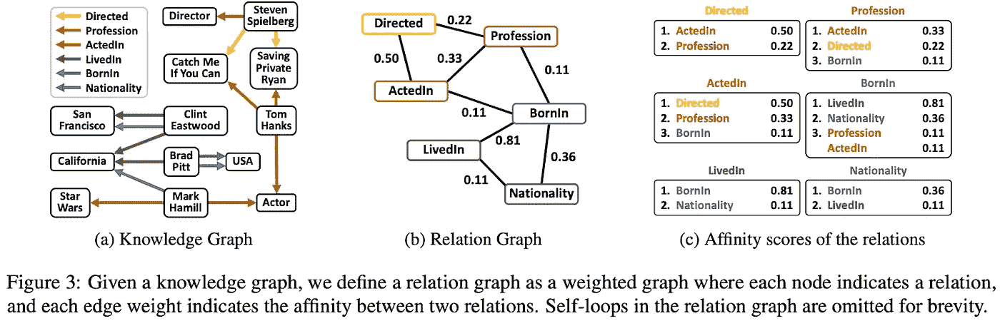

来源：[**“InGram: 通过关系图的归纳知识图嵌入”**](https://openreview.net/forum?id=OoOpO0u4Xd) *Lee 等人*。

🌈 [**“利用图神经网络高效预测高分辨率质谱”**](https://openreview.net/forum?id=81RIPI742h)由*Murphy 等人*提出，是一个将 GNNs 应用于预测质谱这一实际物理问题的酷应用。主要发现是，大部分质谱信号可以通过少数几个成分（产物离子和中性丧失*公式*）来解释。并且有可能从训练数据中挖掘出这些*公式*的词汇。因此，这个问题可以被框架为图分类（或图属性预测），在给定分子图的情况下，我们预测与某些质谱值对应的词汇项。这种方法，**GRAFF-MS**，通过 GIN 构建带有边特征的分子图表示，通过 SignNet 获得拉普拉斯特征，并与协变量特征进行汇总。与基线 CFM-ID 相比，GRAFF-MS 的推断时间为约 19 分钟，而 CFM-ID 则为 126 小时，性能显著提升👀。

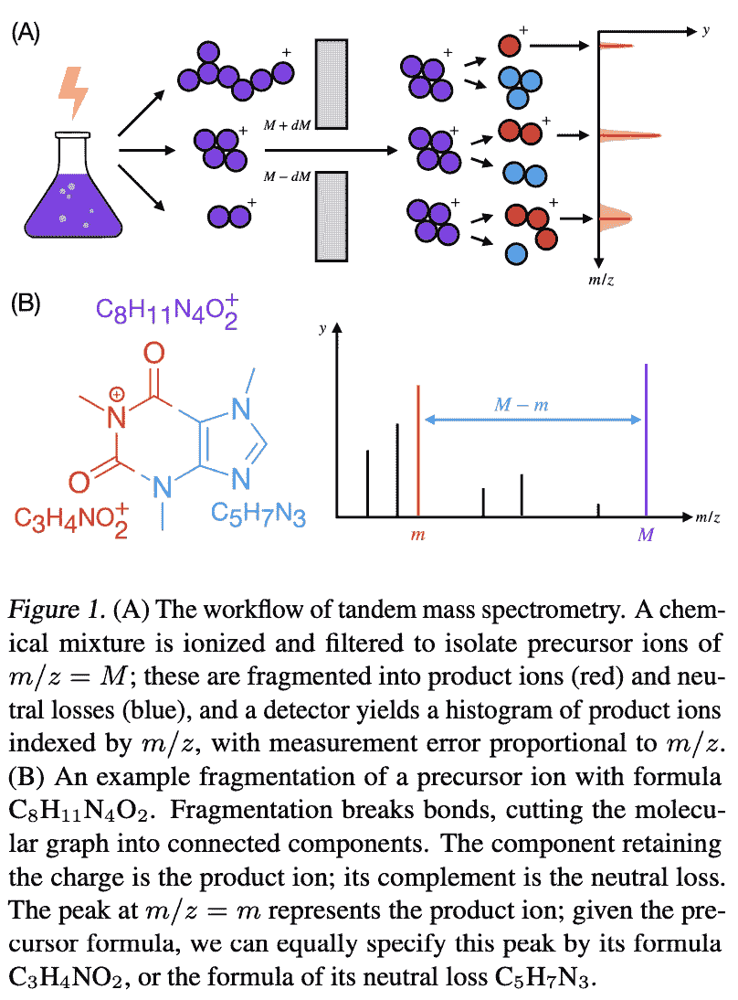

来源: [**“利用图神经网络高效预测高分辨率质谱”**](https://openreview.net/forum?id=81RIPI742h)由*Murphy 等人*提出

# 结论性表情包部分

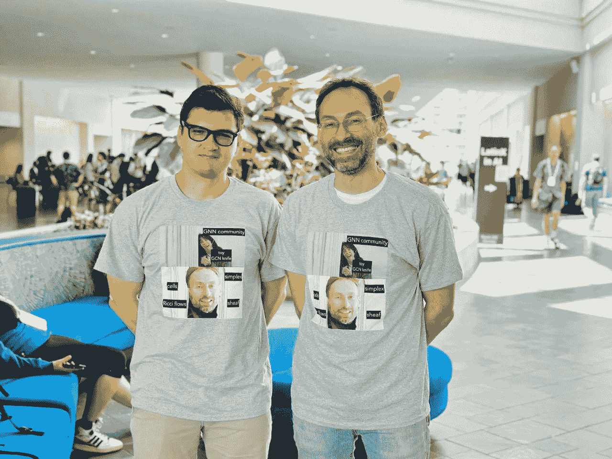

同一张照片上的四位 Michaels（背景中还有一个ε）！

2022 年的表情包终于汇聚到了[Michael Bronstein](https://michael-bronstein.medium.com/)！
