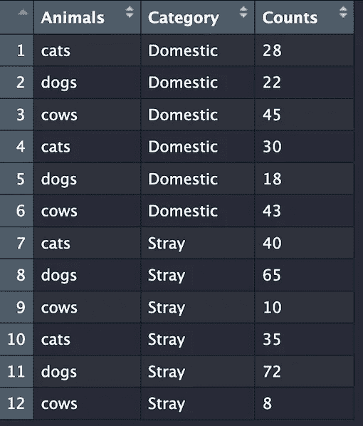
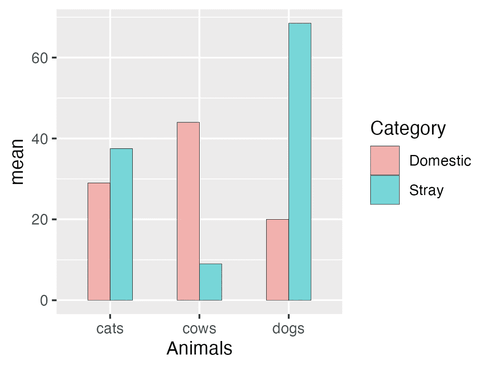
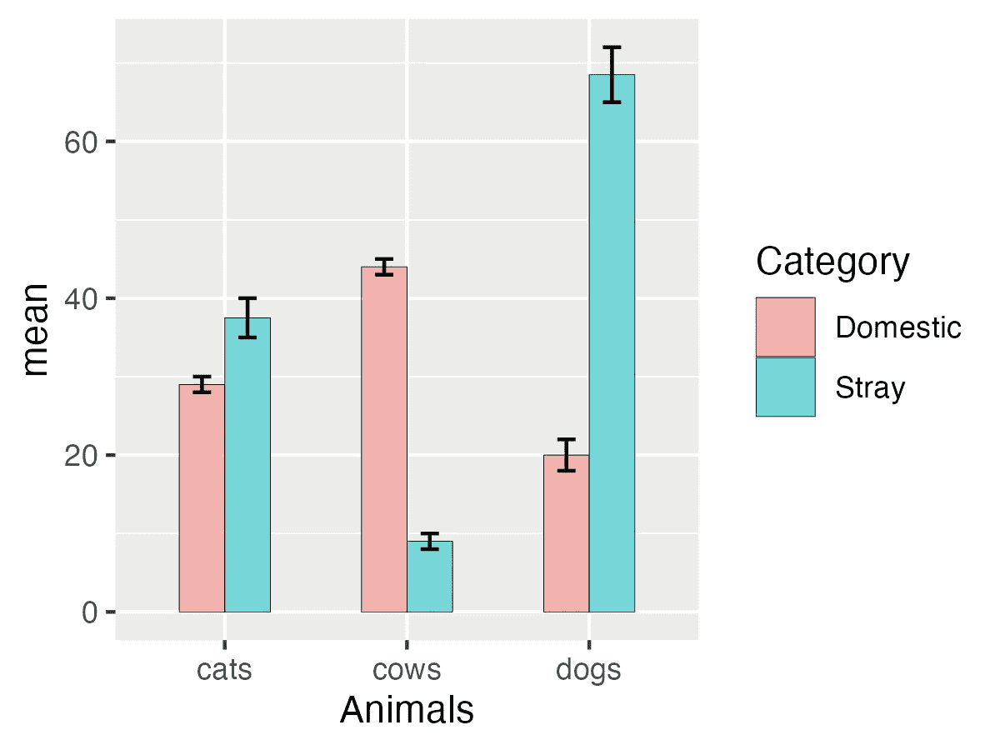
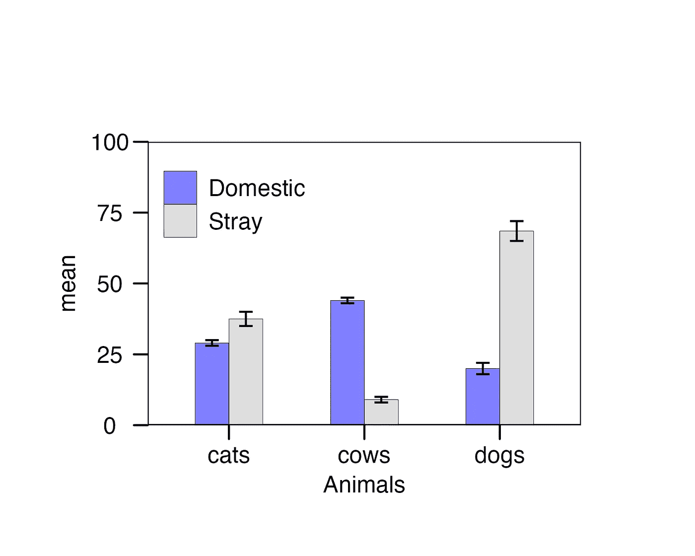

# 带误差条的分组条形图（R 语言）

> 原文：[`towardsdatascience.com/grouped-barplot-with-error-bars-in-r-ee87b112204d?source=collection_archive---------4-----------------------#2023-11-01`](https://towardsdatascience.com/grouped-barplot-with-error-bars-in-r-ee87b112204d?source=collection_archive---------4-----------------------#2023-11-01)

## 数据准备和可视化的全面指南

[](https://medium.com/@bhaskartigp?source=post_page-----ee87b112204d--------------------------------)[](https://towardsdatascience.com/?source=post_page-----ee87b112204d--------------------------------) [Bhaskara Govinal Badiger](https://medium.com/@bhaskartigp?source=post_page-----ee87b112204d--------------------------------)

·

[关注](https://medium.com/m/signin?actionUrl=https%3A%2F%2Fmedium.com%2F_%2Fsubscribe%2Fuser%2Fc2084c3fd87&operation=register&redirect=https%3A%2F%2Ftowardsdatascience.com%2Fgrouped-barplot-with-error-bars-in-r-ee87b112204d&user=Bhaskara+Govinal+Badiger&userId=c2084c3fd87&source=post_page-c2084c3fd87----ee87b112204d---------------------post_header-----------) 发表在[Towards Data Science](https://towardsdatascience.com/?source=post_page-----ee87b112204d--------------------------------) · 10 分钟阅读 · 2023 年 11 月 1 日[](https://medium.com/m/signin?actionUrl=https%3A%2F%2Fmedium.com%2F_%2Fvote%2Ftowards-data-science%2Fee87b112204d&operation=register&redirect=https%3A%2F%2Ftowardsdatascience.com%2Fgrouped-barplot-with-error-bars-in-r-ee87b112204d&user=Bhaskara+Govinal+Badiger&userId=c2084c3fd87&source=-----ee87b112204d---------------------clap_footer-----------)

--

[](https://medium.com/m/signin?actionUrl=https%3A%2F%2Fmedium.com%2F_%2Fbookmark%2Fp%2Fee87b112204d&operation=register&redirect=https%3A%2F%2Ftowardsdatascience.com%2Fgrouped-barplot-with-error-bars-in-r-ee87b112204d&source=-----ee87b112204d---------------------bookmark_footer-----------)

图片由[Paulius Dragunas](https://unsplash.com/@paulius005?utm_source=medium&utm_medium=referral)提供，来源于[Unsplash](https://unsplash.com/?utm_source=medium&utm_medium=referral)

条形图因多种原因成为一个重要且广泛使用的可视化工具。它们非常适合可视化*数值*和*分类*变量之间的关系，使得理解类别或组之间的差异变得简单。条形图可以表示计数、频率、比例和百分比，使其在各种数据类型中都具有很大的灵活性。

在 R 中，我们能够分析分类数据并通过条形图表示它。然而，初学者在进入 R 编程时，常常在估计均值、标准误差和创建带有误差条的分组条形图方面遇到挑战。为了应对这些挑战，必须对数据类型、数据结构和数据分析所需的操作有基本的了解。

在本教程中，我们从创建一个简单的数据集开始，以理解不同类型的数据以及如何将它们转换为适合数据分析的格式。然后，我们将深入探讨估计均值和标准误差的过程。随后，我们将创建一个带有误差条的分组条形图。为了帮助初学者，我会逐步剖析代码，以确保对编程过程有透彻的理解。

我假设我们的读者已经熟悉安装和加载 R 包的过程。如果不熟悉，请参阅 [**STHDA**](http://www.sthda.com/english/wiki/installing-and-using-r-packages) 获取指导。

让我们直接开始创建数据集、修改它并进行可视化。首先加载所需的库，如下所示。

```py
library(tidyverse)
library(ggthemes)
library(ggpubr)
```

[**tidyverse**](https://brianward1428.medium.com/introduction-to-tidyverse-7b3dbf2337d5) 是一个核心的 R 包集合，包括 `[**dplyr**](https://r4ds.hadley.nz/data-transform.html)` 用于数据操作和分析，以及 `[**ggplot2**](https://r4ds.hadley.nz/data-visualize)` 用于数据可视化。 [**ggthemes**](https://ggplot2.tidyverse.org/reference/ggtheme.html) 提供了替代主题和主题组件，以样式化 ggplot2 图表。[**ggpubr**](https://rpkgs.datanovia.com/ggpubr/) 提供 `**ggsave()**` 用于以可自定义的尺寸、分辨率和文件格式保存图表。要进一步探索这些包，只需点击提供的超链接即可。

# 创建一个**数据框**：

在下面的代码中，`**data.frame()**` 函数初始化了一个名为 `**df**` 的数据框，其中包含三列：`**Animals**`、`**Category**` 和 `**Counts**`。

```py
df <- data.frame(Animals = c("cats", "dogs", "cows", 
                             "cats", "dogs", "cows",
                             "cats", "dogs", "cows",
                             "cats", "dogs", "cows"),
                Category = c("Domestic", "Domestic", "Domestic",
                             "Domestic","Domestic","Domestic",
                             "Stray", "Stray", "Stray", 
                             "Stray", "Stray", "Stray"),
                  Counts = c("28", "22", "45", 
                             "30", "18", "43", 
                             "40", "65","10",
                             "35", "72", "8"))
```

💡 *或者在 Excel 中创建数据框并将文件导入到 R 中。*

我们可以使用 `**view(**`) 函数查看数据框 `**df**`。

```py
view(df)
```



`**Animals**` 列包含不同种类动物的名称。该列中有三种独特的动物： “cats”、 “dogs”和“cows”。我们对每种动物进行了四次采样，共得到 12 行数据。`**Category**` 列将动物分类为“Domestic”或“Stray”。其中有六个“Domestic”和六个“Strays”。`**Counts**` 列表示在给定的‘Category’和‘Animals’列中每种动物的计数。

# 数据类型和数据操作

在 R 中，了解数据框中列（变量）的[**数据类型**](https://rpubs.com/STEMResearch/data-types-in-r)至关重要，因为不同的数据类型可能适用于不同的操作和函数。在`**df**`数据框中，`**Animals**`和`**Category**`列具有**字符**数据类型，而`**Counts**`列具有**数值**数据类型。字符数据类型对于处理文本数据（如名称、标签、描述和文本信息）非常重要。数值数据类型表示数值，包括整数和实数（浮点值）。

我们使用`**glimpse()**`函数获取数据框的摘要，以了解数据框`**df**`中变量的数据类型。

```py
glimpse(df)
```

```py
Rows: 12
Columns: 3
$ Animals  <chr> "cats", "dogs", "cows", "cats", "dogs", "cows", "cats", "dogs", "cows", "…
$ Category <chr> "Domestic", "Domestic", "Domestic", "Domestic", "Domestic", "Domestic", "…
$ Counts  <chr> "28", "22", "45", "30", "18", "43", "40", "65", "10", "35", "72", "8"
```

我们可以观察到`**df**`数据框包含 12 行（观测值）和 3 列（变量）。值得注意的是，`**Animals**`和`**Category**`变量被识别为字符数据类型，标记为`**<chr>**`。这些变量中的值被双引号括起来，使其成为字符字符串。然而，值得注意的是，`**Counts**`变量也被识别为字符数据类型。这是意外的，因为该变量中的值实际上是数字，而不是字符字符串。这种数据类型的误分类可能会在进行数值操作时引发问题。为了解决这个问题并便于数值操作，我们必须采取必要步骤将`**Counts**`变量转换为数字数据类型。

你可能注意到，当我最初创建数据框`**df**`时，我故意将数值用双引号括起来，从而将`**Counts**`变量设为字符数据类型。现在我们已经清楚了解数据框的结构，让我们继续解决这个问题。我们将通过将`**df**`数据框中的`**Counts**`变量从当前的字符数据类型转换为数字数据类型来完成这项任务。

```py
df$Counts <- as.numeric(df$Counts)
```

`**df$Counts**`选择`**df**`数据框中的`**Counts**`列。

`**as.numeric()**`将输入转换为数字数据类型。

```py
glimpse(df)
```

```py
Rows: 12
Columns: 3
$ Animals  <chr> "cats", "dogs", "cows", "cats", "dogs", "cows", "cats", "dogs", "cows", "…
$ Category <chr> "Domestic", "Domestic", "Domestic", "Domestic", "Domestic", "Domestic", "…
$ Counts  <dbl> 28, 22, 45, 30, 18, 43, 40, 65, 10, 35, 72, 8
```

现在`**Counts**`变量被识别为数值数据类型，标记为`**<dbl>**`，通常简称为“双精度”。该变量中的值没有用引号括起来，表明它们是数值，而非字符字符串。

`**<dbl>**` *代表“双精度浮点数”。这是一种用于存储实数并对实数（包括小数）执行算术运算的数值数据类型。*

# 估算均值和标准误差

以下代码通过对现有数据框`**df**`执行数据汇总和聚合，创建了一个名为`**mean_df**`的新数据框。

```py
mean_df <- df %>% 
  group_by(Animals, Category) %>% 
  summarise(mean= mean(Counts),
            se = sd(Counts)/sqrt(n()))
```

让我们一步步解析代码：

1.  管道 (`**%>%**`) 操作符将现有的数据框 `**df**` 传递给代码的下一部分。它将 `**df**` 设为后续操作的输入。*在 R 中，`**%>%**` 操作符将左侧一个函数的结果传递给右侧下一个函数的第一个参数，从而以清晰和顺序的方式将一系列操作连接在一起。*

1.  `**group_by()**` 函数根据 `**Animals**` 和 `**Category**` 列对数据框进行分组，在数据框内创建基于这两个变量的唯一组合的子组。

1.  `**summarise()**` 函数估算均值和标准误差，并将其分别分配给新变量：`**mean**` 和 `**se**`。

+   `**mean()**` 函数计算由 `**group_by()**` 操作创建的每个子组的 `**Counts**` 列的均值 (平均值)。

+   `**sd()**` 函数计算每个子组的 `**Counts**` 列的标准误差 (se)。标准误差通过将 `Counts` 列的标准偏差 (`**sd()**`) 除以样本大小的平方根 (`**sqrt(n())**`) 来计算。

让我们查看数据框 `**mean_df**` 的摘要

```py
glimpse(mean_df)
```

```py
Rows: 6
Columns: 4
$ Animals  <chr> "cats", "cats", "cows", "cows", "dogs", "dogs"
$ Category <chr> "Domestic", "Stray", "Domestic", "Stray", "Domestic", "Stray"
$ mean     <dbl> 29.0, 37.5, 44.0, 9.0, 20.0, 68.5
$ se       <dbl> 1.0, 2.5, 1.0, 1.0, 2.0, 3.5
```

一切准备就绪！我们现在有四列或变量，包括两个新变量，基于我们的分组标准为 `**Counts**` 列计算的 `**mean**` 和 `**se**`。让我们使用这个新的数据框 `**mean_df**` 进行数据可视化。

# 可视化数据

下面的代码将数据框 `**mean_df**` 传递给 `**ggplot2**`，使用 `**%>%**` 操作符创建一个分组条形图，并将其分配给对象 “**barplot**”。

```py
barplot <- mean_df %>% 
  ggplot(
    aes(x = Animals, y = mean, fill = Category))+
    geom_col( position = "dodge", width = 0.5, alpha = 0.5, color = "black", size = 0.1)
```

💡*请注意，尽管管道操作符 (****%>%****) 对于在数据操作和分析中连接多个操作非常有用，但在数据可视化过程中，它不能用于在 ggplot2 函数中添加层。相反，我们使用* ***‘+’*** *符号，如上所示。*

让我们逐步解析代码：

1.  `**aes()**` 函数，缩写自 *‘aesthetic’*，用于指定数据集中的变量如何映射到图中的视觉美学。在这种情况下，它指定 x 轴应表示 `**Animals**` 变量，y 轴应表示 `**mean**` 变量，并根据 `**Category**` 变量填充条形颜色。

1.  `**geom_col()**` 根据 `**mean**` 列中的值计算每个条形的高度。

下面是 `**geom_col()**` 函数中使用的参数的详细说明：

+   `**position = "dodge"**`：它指定条形应根据 `**Category**` 变量并排分组（dodged）。这就是创建分组条形图的方式。

+   `**width = 0.5**`：它决定条形的宽度。在这种情况下，条形的宽度为 0.5。

+   `**alpha = 0.5**`：它控制条形的透明度。alpha 值为 0.5 使条形略显透明。

+   `**color = "black"**`：它将条形的边框颜色设置为黑色。

+   `**size = 0.1**`：它指定了条形图边框的大小。在这种情况下，边框将相对较细。

这些参数的组合自定义了条形图的外观，使其变得更细、略微透明、带有黑色边框，并且不同类别的条形图并排排列，这可以增强数据的视觉表现。

让我们来看一下图表：

```py
plot(barplot)
```



太好了！我们已经成功创建了一个条形图，但目前条形图缺少标准误差。让我们将标准误差加入到图表中。

# **将标准误差添加到条形图并自定义条形图颜色**

首先复制并粘贴上述代码，然后使用 `**+**` 符号将 `**geom_errorbar()**` 函数添加到其中，如下所示。

```py
barplot <- mean_df %>% 
  ggplot(aes(x = Animals, y = mean, fill = Category))+
  geom_col( position = "dodge", width = 0.5, alpha = 0.7, color = "black", size = 0.1)+
  geom_errorbar(aes(ymin = mean-se, ymax = mean+se),
                position =  position_dodge(width = 0.5), width = 0.2) 
```

让我们详细拆解 `**geom_errorbar()**` 函数中使用的组件：

1.  `**ymin**` 和 `**ymax**` 定义了基于计算的均值和标准误差的误差条的下限和上限值。

1.  `**position**` 参数设置为 `**position_dodge()**`，用于将误差条并排放置（dodged），而 `**width = 0.5**` 设置了 dodge 的宽度。可以调整宽度参数，以注意条形图位置的变化。

1.  `**width = 0.2**` 设置了误差条的宽度。在这种情况下，误差条的宽度将为 0.2。

让我们来看一下图表：

```py
plot(barplot)
```



太好了！我们现在创建了一个带有误差条的分组条形图。这个图表几乎准备好发表了，但一些小的调整可以大大改善其外观。例如，你可能已经注意到条形图和 x 轴标签之间有一个间隙。让我们将其去除。此外，改变条形图颜色、将图例放置在图表内部以及提供预定义的主题以获得简洁的视觉效果，将改善其整体表现。

# 创建出版质量的图表

让我们开始复制上述代码，然后使用 `**+**` 添加额外的图层，如下所示。

```py
barplot <- mean_df %>% 
  ggplot(aes(x = Animals, y = mean, fill = Category))+
  geom_col( position = "dodge", width = 0.5, alpha = 0.7, color = "black", size = 0.1)+
  geom_errorbar(aes(ymin = mean-se, ymax = mean+se),
                position =  position_dodge(width = 0.5), width = 0.2)+
  scale_y_continuous(expand = expansion(0),
                     limits = c(0,100))+
  scale_fill_manual(values = c("blue", "gray"),
                    name = NULL)+ # NULL removes the legend title "Category".
  theme_par()+
  theme(legend.position = c(0.2, 0.80))
```

在这里，我们将 `**scale_y_continuous()**` **,** `**scale_fill_manual()**` **,** `**theme_par()**` **,** `**theme()**` 函数，这些函数都是 `**ggplot2**` 包的一部分，融入到了现有的代码中。

以下是这些函数中使用的参数的详细说明。

1.  `scale_y_continuous` 允许我们修改 y 轴的各个方面，例如范围、刻度、标签等。在上述代码中，`**scale_y_continuous()**` 的 `**expand**` 参数设置为 expansion(0)，以去除 y 轴限制周围的任何填充，而 `**limits**` 参数设置为 `**c(0,100)**`，以将 y 轴限制设置为 0 到 100。

1.  `**scale_fill_manual()**` 允许我们手动指定填充不同类别或变量水平的颜色。注意，在代码的第 2 行中，填充美学设置为`**fill = Category**`**。** 因此，在这种情况下，参数`**values = c("blue", "gray")**`根据`**Category**`中的值填充条的颜色：`**"Domestic"**`的条为蓝色，`**"Stray"**`的条为灰色。

1.  `**theme_par()**` 允许我们自定义图的主题，提供了干净的白色背景和紧凑的图形。它有其自身的优缺点。

1.  `**legend.position**`参数`**theme()**`被设置为`**c(0.2, 0.80)**`以指定图例在图中的位置。尝试这些值以更好地理解这个参数。

💡 *如* `**theme_par()**` *等预定义主题将覆盖其后应用的主题组件。我们在* `**theme_par()**` *函数之后添加了* `**theme(legend.position)**` *来解决这个问题。*

让我们看看图：

```py
plot(barplot)
```



这是一个视觉上吸引人并适合发表的带误差条的条形图。该图有效地展示了动物种群的变化。在“流浪”类别中，狗的数量超过了猫和牛，而在“家庭”类别中，牛的数量明显超过了猫和狗。

# 保存图以用于发表

下面的代码利用了`**ggsave()**`函数来自`**ggpubr**`库。为了将图保存为图像，我们需要指定要保存的对象（在这种情况下是“**barplot**”）并定义所需的文件名及所选的图形格式。在本例中，我们选择了文件名“**barplot_animals.tiff**”，这将把图保存为 TIFF 图像。此外，我们设置了以英寸为单位的`**width**`和`**height**`的尺寸，以及指定为`**dpi**`（每英寸点数）的分辨率。

```py
ggsave(barplot, filename = "barplot_animals.tiff", width = 5, height = 4, dpi = 300)
```

现在你已准备好创建适合发表的条形图，并带有标准误差条。享受创造的过程，尽情绘制你的数据吧！🎉✨
