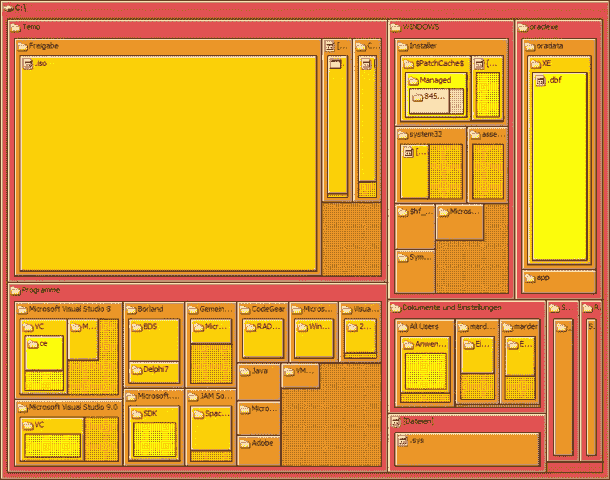
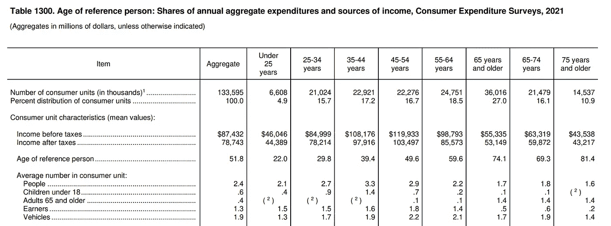
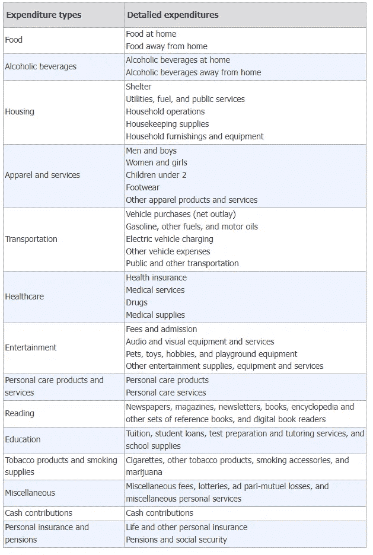
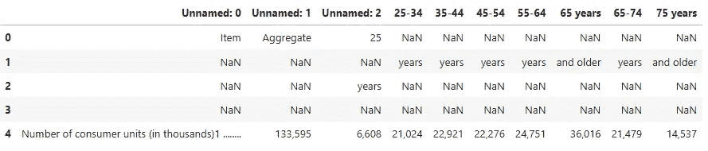
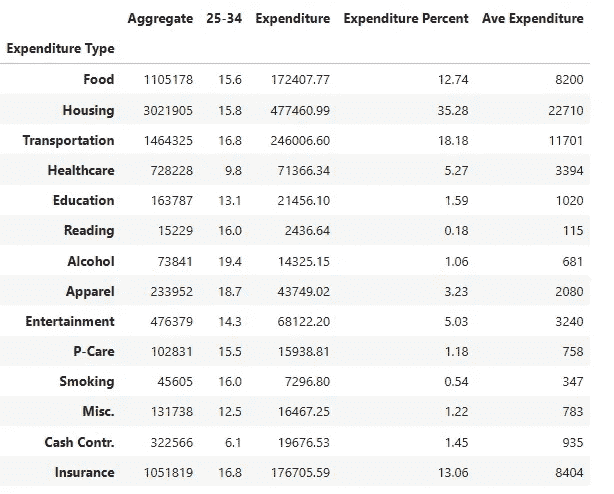
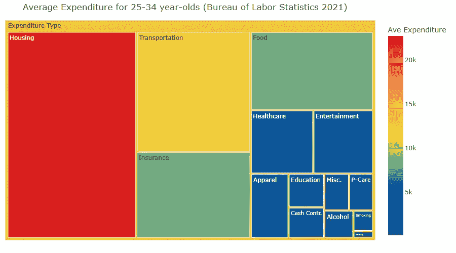
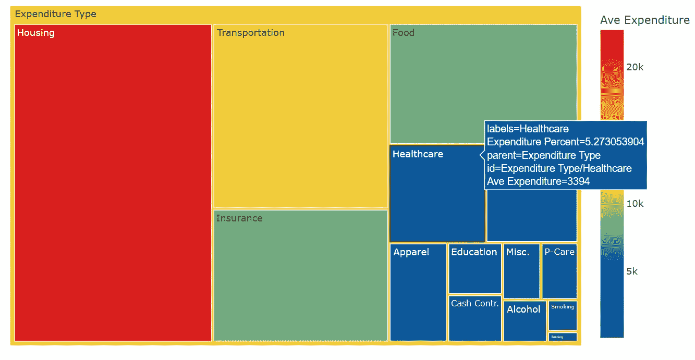
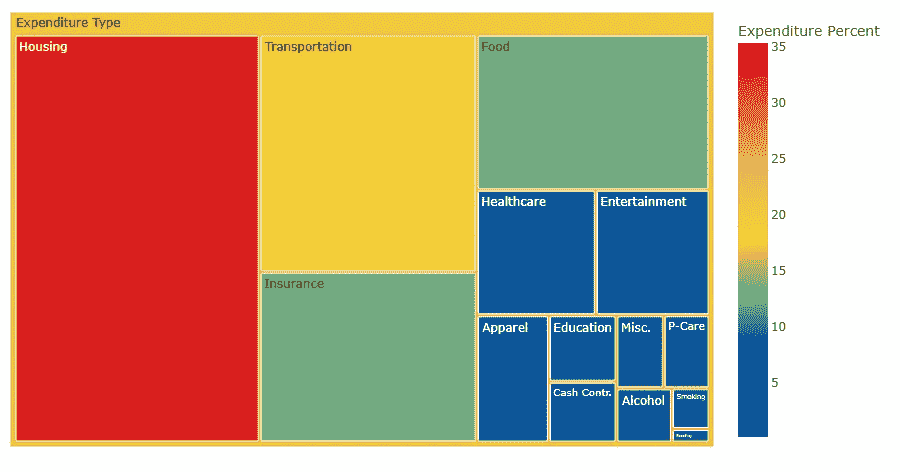
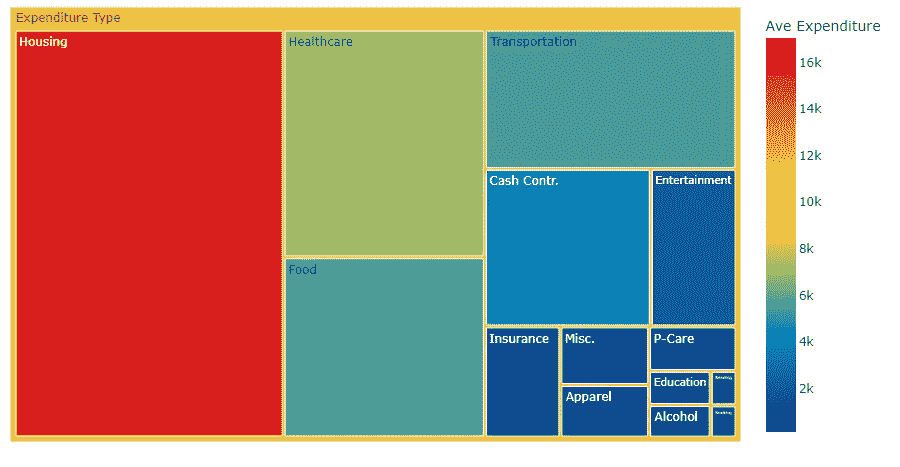

# 使用 Python 和 Plotly Express 创建树状图

> 原文：[`towardsdatascience.com/grow-a-treemap-with-python-and-plotly-express-963706a2bd74`](https://towardsdatascience.com/grow-a-treemap-with-python-and-plotly-express-963706a2bd74)

## 将政府 PDF 转换为财务规划工具

[](https://medium.com/@lee_vaughan?source=post_page-----963706a2bd74--------------------------------)[](https://towardsdatascience.com/?source=post_page-----963706a2bd74--------------------------------) [Lee Vaughan](https://medium.com/@lee_vaughan?source=post_page-----963706a2bd74--------------------------------)

·发表于[Towards Data Science](https://towardsdatascience.com/?source=post_page-----963706a2bd74--------------------------------) ·8 分钟阅读·2023 年 4 月 7 日

--


图片来源：Robert Murray，来自 Unsplash！

*层级*数据是一种数据模型，其中项目通过父子关系相互链接，形成树状结构。一些显而易见的例子包括家谱和公司组织结构图。

*树状图*是一种使用嵌套矩形表示层级数据的图示。每个矩形的面积对应其数值。树状图已经存在大约 30 年了。早期的应用是可视化硬盘使用情况，如下图所示。



硬盘空间分配通过树状图进行可视化（[Carnivore1973 via Wikimedia Commons](https://commons.wikimedia.org/w/index.php?search=Carnivore1973&title=Special%3AMediaSearch&go=Go&type=image)）

通过**树状图**，你可以捕捉到单独类别的*价值*以及层级的*结构*。它们对于以下场景非常有用：

+   在类别数量超出条形图承载能力时显示层级数据。

+   突出显示单个类别与整体之间的比例。

+   使用不同的大小和颜色区分类别。

+   发现模式、主要贡献者和异常值。

+   为数据可视化带来新鲜的视角。

在这个*快速成功数据科学*项目中，我们将使用 Python 创建一个树状图，以帮助人们制定预算。我们首先会使用*tabula-py*库将基于网页的*劳动统计局*PDF 转换为 pandas DataFrame。然后，我们将使用*Plotly Express*库将 DataFrame 转换为一个吸引人且互动的基于区域的可视化图表。

# 消费者支出调查

随着疫情和随后的通货膨胀激增，消费者支出引起了广泛关注。个人需要了解如何有效预算，政策制定者需要了解哪些行业对潜在选民造成了最大的财务负担。

为了跟踪收入和支出，*人口普查局*使用*消费者支出调查*收集美国消费者的支出、收入和人口特征信息。随后，*劳工统计局（BLS）*将这些统计数据汇编成每年在九月份发布的[年度报告](https://www.bls.gov/cex/tables-getting-started-guide.htm#section2)。

这些 BLS 报告属于[公共领域](https://www.bls.gov/bls/linksite.htm)，对政策制定者和个人都有用。刚刚起步的年轻人可以利用这些表格作为准备预算和储蓄计划的起点。年长者可以利用这些表格来帮助规划退休。你可以[在这里](https://www.bls.gov/cex/tables/calendar-year/aggregate-group-share/reference-person-age-ranges-2021.pdf)查看完整的表格，并在下面的图示中查看部分内容。



2021 年 BLS 消费者支出调查表 1300 的前几行（来自劳工统计局）

消费支出表将支出分为 14 种不同的类型，如下所示：



支出类型解释（来自劳工统计局）

**现金捐赠**类别包括对离家上大学的学生的资助、赡养费和抚养费，以及个人现金礼物，例如生日或婚礼礼物。它还包括对宗教、慈善或政治组织的捐赠。

# Plotly Express 和 Tabula 库

[*Plotly Express*](https://plotly.com/python/plotly-express/)是*Plotly*图形库的高级版本。它让你可以轻松制作出具有许多内置功能的吸引人的图形。

Treemaps 的一个缺点是小矩形可能没有标签，或者标签可能难以辨认。Plotly Express 通过提供一个交互式的“悬停窗口”来帮助克服这一限制，当光标停留在矩形上时，该弹出窗口会显示详细信息，这在图表上直接显示是不切实际的。

[*tabula-py*](https://tabula-py.readthedocs.io/en/latest/getting_started.html)库是 tabula-java 的 Python 封装，它可以从 PDF 中提取表格。提取的数据可以转换成 DataFrame 列表，或 CSV、TSV 或 JSON 文件。

你可以通过 pip 或 conda 安装 Plotly Express 和 tabula-py。Plotly Express 需要 Plotly 作为依赖项。以下是 conda 安装示例：

`conda install plotly plotly_express tabula-py`

# 过程

我们的任务是将 BLS “表格 1300” PDF 转换为 pandas DataFrame，然后转换为树图。虽然 tabula-py 提供了多种 PDF 格式转换，但我们将在这里使用 CSV 格式：

1.  使用 tabula-py 从网络读取 PDF 并将其转换为 CSV。

1.  使用 pandas 将 CSV 转换为 DataFrame。

1.  使用 pandas 清理和准备 DataFrame 以供绘图。

1.  使用 Plotly Express 绘制树图。

# 导入库

以下代码导入我们所需的库，设置 Jupyter Notebook 以显示 DataFrame 中的最大行数，并将 DataFrame 中的浮点值四舍五入到两位小数。

```py
import string

import pandas as pd
import plotly.express as px
import tabula 

# Permit display of entire DataFrame and set decimal precision:
pd.set_option('display.max_rows', None)
pd.set_option('display.float_format', '{:.2f}'.format)
```

# 将 PDF 表格转换为 DataFrame

为了将基于 Web 的 PDF 转换为 DataFrame，我们将首先使用 tabula-py 将其转换为 CSV 文件，然后使用 pandas 将 CSV 文件转换为 DataFrame。

```py
# Convert web-based PDF into a CSV file:
URL = 'https://www.bls.gov/cex/tables/calendar-year/\
aggregate-group-share/reference-person-age-ranges-2021.pdf'
tabula.convert_into(URL, "output.csv", output_format="csv", pages='all')

# Convert CSV file into a DataFrame and inspect:
df = pd.read_csv('output.csv', header=1)
df.head()
```



初始 DataFrame 的前几行（图片由作者提供）

# 数据处理

现在我们需要清理 DataFrame。第 4 行包含每个年龄段的[消费者单位](https://www.bls.gov/cex/csxgloss.htm#cu)的数量，*以千为单位*，存储在第 3 到第 9 列中。我们需要每个年龄段的消费者单位数量，以便稍后确定*平均*支出。以下代码提取单位信息，移除标点符号，将结果转换为整数，并乘以 1,000。

```py
units = df.iloc[4, 3:10].apply(lambda x: int(x.translate(
                             str.maketrans('', '', string.punctuation))) * 1000)
```

接下来，我们创建一个字典，以年龄段作为键和值——基于 DataFrame 列标题——以及每个年龄段的消费者单位数量。

```py
# Define age brackets based on DataFrame column headers and create a dictionary:
brackets = ['25-34', '35-44', '45-54', '55-64', '65 years', '65-74', '75 years']
num_units_per_age = dict(zip(brackets, units))

print(num_units_per_age)
```

```py
{'25-34': 21024000, '35-44': 22921000, '45-54': 22276000, '55-64': 24751000, '65 years': 36016000, '65-74': 21479000, '75 years': 14537000}
```

# 准备一个用于绘图的年龄段

我们希望一次绘制一个*单一*年龄段。以下代码指定年龄段（25–34 岁），为该年龄段生成一个新的 DataFrame，进行更多数据清理和重命名，并计算每种支出类型的百分比份额和平均支出。

支出类型*名称*，如“食品”和“住房”，是通过浏览表格 1300 找到的。这些代表了更详细的支出信息的高层总结。年龄段列表示该年龄组的总支出*百分比*。

```py
# Designate age bracket to examine (must match column header name): 
AGE = '25-34'

#Prepare DataFrame:
df = df.iloc[4:, :]
df.columns = ['Expenditure Type', 'Aggregate'] + list(df.columns[2:])
df = df[['Expenditure Type', 'Aggregate', AGE]]

# Strip punctuation and leading and trailing whitespace from columns:
df['Expenditure Type'] = df['Expenditure Type'].str.replace(
                                           '[^\w\s]','', regex=True).str.strip()
df['Aggregate'] = df['Aggregate'].str.replace('[^\w\s]','', regex=True)

# Make top-level 'Expenditure Type' the index and keep only selected rows:
df = df.set_index('Expenditure Type', drop=True)
df = df.loc[['Food', 'Housing', 'Transportation', 'Healthcare', 'Education',
             'Reading', 'Alcoholic beverages', 'Apparel and services',
             'Entertainment', 'Personal care products and services', 
             'Tobacco products and smoking supplies', 'Miscellaneous', 
             'Cash contributions', 'Personal insurance and pensions'], :]

# Rename columns for smaller Treemap labels:
df.rename(index={'Alcoholic beverages': 'Alcohol', 
                 'Apparel and services': 'Apparel',
                 'Personal care products and services': 'P-Care',
                 'Tobacco products and smoking supplies': 'Smoking',
                 'Miscellaneous': 'Misc.',
                 'Cash contributions': 'Cash Contr.',
                 'Personal insurance and pensions': 'Insurance'}, inplace=True)

# Calculate percent share and average expenditure (in $) for each type:
df['Expenditure'] = df['Aggregate'].astype(float) * df[AGE].astype(float) / 100
df['Expenditure Percent'] = (df['Expenditure'] / df['Expenditure'].sum()) * 100
df['Ave Expenditure'] = (df['Expenditure'] * 1000000) / num_units_per_age[AGE]
df['Ave Expenditure'] = df['Ave Expenditure'].astype(int)
df.head(15)
```



准备好绘图的 DataFrame（图片由作者提供）

# 绘制树图

Plotly Express 提供了超过 30 个函数来一次性创建整个图形。`treemap()` 函数接受 DataFrame、“顶级”类别（在此情况下为“支出类型”）、剩余类别（`df.index`）以及值和颜色的列名称。我们还将指定一个颜色比例（“portland”）和图形的尺寸。

```py
# Create treemap:
fig = px.treemap(df, path=[px.Constant('Expenditure Type'), df.index],
                 values='Expenditure Percent',
                 color='Ave Expenditure',
                 color_continuous_scale='portland',
                 width=900, height=500)

# Update layout:
title = f'Average Expenditure for {AGE} year-olds \
(Bureau of Labor Statistics 2021)'
fig.update_layout(title=title, margin=dict(t=40, l=10, r=10, b=25))
```



25–34 岁群体的平均支出树图（图片由作者提供）

你可以看到这张图表对财务规划师解释预算给客户可能非常有用。与几页文字相比，它*更*容易看懂。而且使用 Plotly Express，你可以通过简单地将光标悬停在矩形上来深入查看详细值，如下所示的医疗保健部分。



显示医疗保健支出详细信息的悬停功能示例（图像由作者提供）

虽然这不会改变表格的外观，但你可以通过切换`values`和`color`参数的值来显示“支出百分比”，如下所示：

```py
fig = px.treemap(df, path=[px.Constant('Expenditure Type'), df.index],
                 values='Ave Expenditure',
                 color='Expenditure Percent',
                 color_continuous_scale='portland',
                 width=900, height=500)
```



25-34 岁人群的平均支出百分比树形图（图像由作者提供）

根据之前的树形图，可以看出 25-34 岁的人群往往将大部分收入用于住房、交通和保险。但那老年人呢？

如果你将`AGE`变量更改为`'75 years'`并重新运行代码，你会看到医疗保健变得更加重要，现金捐赠也增加了，这可能表现为慈善捐款和家庭礼物。颜色条还表明支出通常低于 25-34 岁的人群。



75 岁以上人群的平均支出树形图（图像由作者提供）

关于树形图的一个最终观察：由于数据是*排序的*，你可以区分类似值的类别。在前面的图中，尽管“食品”和“交通”的大小相似，但你可以确定“食品”因其在层级中的位置而更大。

# 买者自慎！

BLS 表中的数值代表*全国*平均值。可能会出现地方差异。例如，大型城市的住房和交通成本无疑高于小型农村镇。此外，所有支出估算都可能存在[误差](https://www.bls.gov/cex/ce-se-2016.pdf)。因此，这些数据应当*方向性*使用，而非*绝对性*使用于任何财务规划目的。

# 总结

tabula-py 模块大大简化了将 PDF 表格转换为 CSV 等有用格式的过程。同样，Plotly Express 与 pandas DataFrame 配对，能够轻松生成互动的树形图。使用树形图，你可以轻松地可视化和传达层级数据中的关系。

树形图很有趣，但并不是唯一的选择。要查看使用桑基图呈现的相同基本数据，请查看*Visual Capitalist*中的这个[帖子](https://www.visualcapitalist.com/how-americans-make-and-spend-their-money-by-age-group/)。

# 谢谢！

感谢阅读。如果你喜欢这篇文章，可以查看我的书籍，[*不切实际的 Python 项目*](https://a.co/d/gxMMzzf) 和 [*现实世界的 Python*](https://a.co/d/d8rGegu)，以获取更多编码点子。并关注我，未来会有更多 *快速成功的数据科学* 项目。
