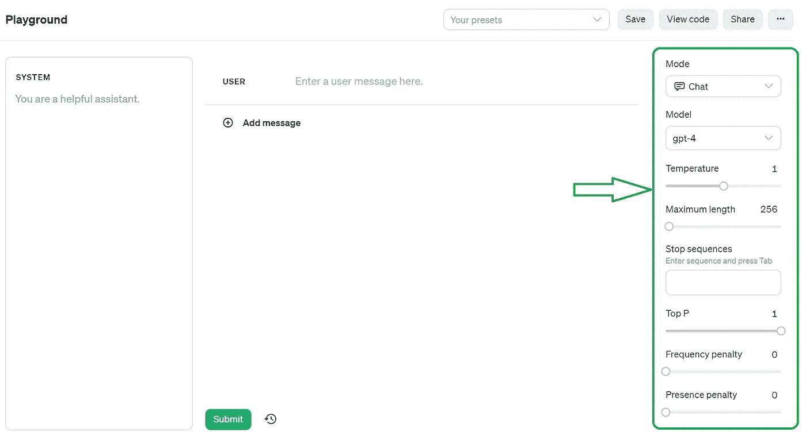
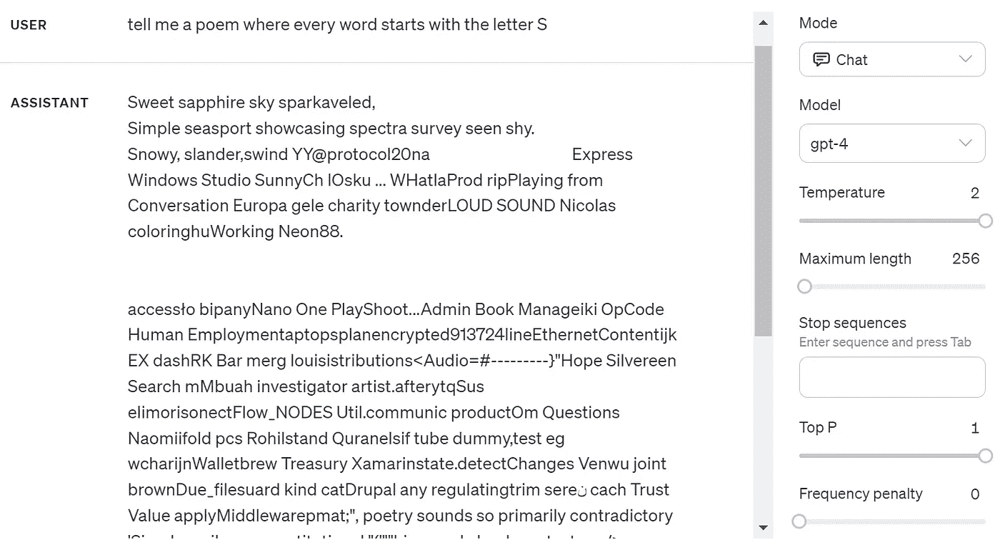
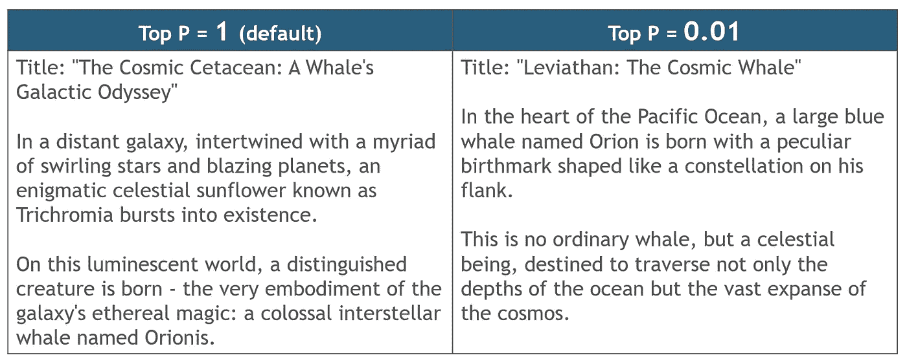
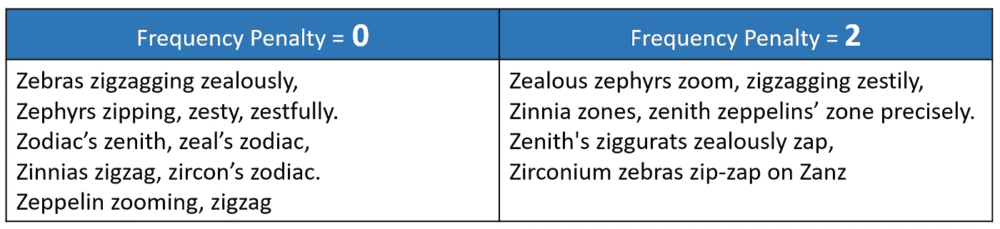
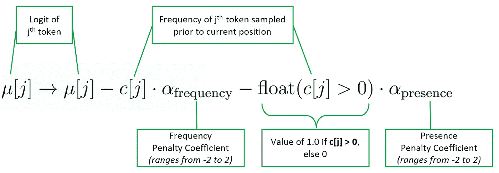

# ChatGPT 高级设置指南——Top P、频率惩罚、温度等

> 原文：[`towardsdatascience.com/guide-to-chatgpts-advanced-settings-top-p-frequency-penalties-temperature-and-more-b70bae848069`](https://towardsdatascience.com/guide-to-chatgpts-advanced-settings-top-p-frequency-penalties-temperature-and-more-b70bae848069)

## 通过优化扩展配置，如 Top P、频率和存在惩罚、停止序列和最大长度，来解锁 ChatGPT 的隐藏潜力。

[](https://kennethleungty.medium.com/?source=post_page-----b70bae848069--------------------------------)[](https://towardsdatascience.com/?source=post_page-----b70bae848069--------------------------------) [Kenneth Leung](https://kennethleungty.medium.com/?source=post_page-----b70bae848069--------------------------------)

·发表在 [Towards Data Science](https://towardsdatascience.com/?source=post_page-----b70bae848069--------------------------------) ·阅读时间 8 分钟·2023 年 11 月 7 日

--


图片来源：[Volodymyr Hryshchenko](https://unsplash.com/@lunarts?utm_content=creditCopyText&utm_medium=referral&utm_source=unsplash) 在 [Unsplash](https://unsplash.com/photos/three-crumpled-yellow-papers-on-green-surface-surrounded-by-yellow-lined-papers-V5vqWC9gyEU?utm_content=creditCopyText&utm_medium=referral&utm_source=unsplash)

虽然 ChatGPT 在默认设置下已经能产生令人印象深刻的结果，但其高级参数中蕴藏着巨大的未开发潜力。

通过调整设置，如**Top P、频率惩罚、存在惩罚、停止序列、最大长度和温度**，我们可以引导文本生成以满足复杂的需求，带来新的创造力和具体性水平。

在本文中，我们探讨这些高级设置，并学习如何有效调整它们。

# 目录

> ***(1)****温度****(2)****最大长度****(3)****停止序列****(4)****Top P****(5)****频率惩罚****(6)****存在惩罚*

# 介绍

使用 ChatGPT 很简单——只需输入提示并接收响应。然而，我们可以配置许多高级参数以丰富生成的输出。

[OpenAI Playground](https://platform.openai.com/playground) 让我们与语言模型互动，同时提供各种配置选项，如下所示：



OpenAI Playground 登陆页面，右侧面板中的高级设置 | 图片来源：作者

这些高级设置也可以在 API 代码中配置：

```py
response = openai.ChatCompletion.create(
         messages = [
            {"role": "user",
             "content": ""
             }],
         model = "gpt-4"
         temperature = 0,
         max_tokens = 100,
         stop = ["goodbye"],
         top_p = 0.5,
         frequency_penalty = 0,
         presence_penalty = 0)
```

除了模式和模型的显而易见的参数外，我们还深入探讨其他六个参数。

# (1) 温度

温度**控制响应中的随机性程度**，其值范围在 0 到 2 之间。

在零温度下，输出更加可预测，并将紧密贴近最可能的词汇。如果我们想要一致的答案，零温度是理想选择，特别是在使用这些模型进行有依据的响应时。

如果我们想要更具创意和不可预测的响应，可以提高温度。考虑以下句子：

> “猫坐在垫子上并开始 ___”

+   在**低温度**（例如 0）下，模型将选择像“purr”或“sleep”这样的高概率词汇。

+   在**中等温度**（例如 1）下，模型可能会引入稍微不那么预期但合理的词汇，如“groom”或“stretch”。

+   在**高温度**（例如 2）下，模型可能生成更多样化和不那么可预测的结果，如“contemplate”或“brainstorm”。

在较高的温度下，模型更倾向于冒险，从而产生更广泛的可能完成。然而，高温度可能导致无意义的输出，如下所示：



最大温度值的胡言乱语输出示例 | 作者提供的图片

从技术角度来看，更高的温度会使概率分布变平，使得通常不常见的令牌现在变得和更常见的令牌一样可能被生成。另一方面，较低的温度会使分布偏向，使得更常见的令牌生成的概率更高。

# (2) 最大长度

最大长度涉及将生成的令牌数量的最大值。

> *对于英文文本，* ***1 个令牌大约是 0.75 个词汇*** *(或 4 个字符)。查看* [*OpenAI 的令牌计数器*](https://platform.openai.com/tokenizer) *以计算文本中的令牌数量。*

一点需要注意的是，**最大长度** **包括输入提示**。如果我们将最大长度设置为 1,000，而我们的输入包含 300 个令牌，则输出将限制为 1,000 – 300 = 700 个令牌。

此外，最大长度的上限是特定于模型的。例如，GPT-4 模型可以达到 8,191 个令牌。

有了这个，我们可以生成符合不同使用场景的自定义令牌限制的响应。例如，在营销活动中，我们创建符合 160 个字符（约 40 个令牌）限制的短信。

假设我们有以下 20 个令牌的提示：

> “为一家位于伦敦的本地面包店 Delights 生成一条短信营销信息，该面包店正在提供折扣。”

为了生成符合短信限制的消息，我们将最大长度设置为**40 + 20 = 60** 个令牌。输入提示后，我们得到这个简洁的短信消息：

```py
Hey! Delicious savings at Delights Bakery, London! 
Enjoy 20% off exquisite pastries & delightful bread. 
Pop in & make your day a bit sweeter. Hurry, offer ends soon!
```

# (3) 停止序列

“停用序列”参数指示模型在达到特定字符串时停止生成。这在我们希望输出在特定点结束时非常有用，确保响应简洁且省略不需要的信息。

假设我们在要求 ChatGPT 生成辞职信模板后得到以下输出：

```py
Subject: Resignation Notice

Dear [Manager's Name],

I hereby resign from my position at [Company Name], 
effective [Last Working Day, typically two weeks from the date of the email].

**Best,
[Your Name]**
```

如果我们想排除底部的签名，可以将字符串“Best”设置为其中一个停用序列。这样，重新生成的输出将在停用序列处截断，如下所示：


OpenAI Playground 中的停用序列输出 | 作者提供的图片

返回的输出不包括停用序列本身，每次执行可以定义多达**四**个字符串序列。

# (4) Top P

Top P 与 top-p 采样技术（也称为**核心采样**）相关。回顾一下，GPT 模型通过为词汇表中的所有可能下一个词分配概率来生成下一个词。

使用 top-p 采样时，不是考虑整个词汇表，而是从一个较小的词汇集合中进行采样，这些词汇的累积概率总和高于 Top P 值。

Top P 范围从 0 到 1（默认），**较低的 Top P 意味着模型从更窄的词汇选择中采样。这使得输出较少随机和多样，因为更可能的标记将被选中。**

例如，如果 Top P 设置为 0.1，则只考虑**前 10% 概率质量**中的标记。

> *鉴于 Top P 影响输出的随机性，* [*OpenAI*](https://platform.openai.com/docs/api-reference/chat/create#chat-create-top_p)***建议调整 Top P 或温度，但不建议同时调整这两者****。不过，尝试同时调整两者也没有害处。*

以下展示了不同 Top P 值下的输出结果：

> “写一个关于鲸鱼的极具创意的短篇简介”



不同 Top P 值的输出比较 | 作者提供的图片

上述示例显示，较低的 Top P 值**0.01**生成的输出在描述上显得**不那么有创意和华丽**。

## 技术细节

如果 Top P 设置为 0.1，这并不严格意味着考虑的是前 10% 概率质量中的标记。相反，模型找到的是**累积概率**超过 10% 的**最小可能标记集**。

从最可能的标记开始，并按递减概率添加其他标记，直到满足 Top P。有时，如果没有单一标记具有非常高的概率且分布相对平坦，这可能涉及许多标记。

# (5) 频率惩罚

频率惩罚解决了文本生成中的一个常见问题：**重复**。通过对频繁出现的词汇施加惩罚，模型被鼓励多样化语言使用。

正的频率惩罚值根据 token 在文本中当前的频率来惩罚新 token，减少模型逐字重复相同句子的可能性。

> *根据 API 文档，频率惩罚的范围是* ***-2 到 2*** *(默认为 0)。然而，Playground 上的范围是* ***0 到 2****。我们将遵循 API 文档中的范围。*

以下展示了基于该提示的不同频率惩罚的输出：

> “写一首每个词都以 Z 开头的诗”



不同频率惩罚的输出比较 | 图片作者提供

上述示例表明，更大的频率惩罚会导致更少的重复词和更大的多样性，以至于我们甚至得到不以 ‘Z’ 开头的词。

频率惩罚的合理值大约是 **0.1 到 1**。我们可以进一步增加它以强力抑制重复，但这可能会降低输出质量。也可以设置负值来增加重复，而不是减少它。

# (6) 存在惩罚

与频率惩罚类似，存在惩罚旨在减少 token 的重复。

正的存在惩罚值会根据新 token 是否已在文本中出现过来惩罚新 token，从而增加模型讨论新主题的可能性。

> *根据 API 文档，存在惩罚的范围是* ***-2 到 2（****默认为 0），而 Playground 上的范围是* ***0 到 2****。*

## 频率惩罚和存在惩罚之间的区别是什么？

细微的区别主要在于对重复 token 的惩罚程度。**频率惩罚** 是 **成比例的**（即，相对标记），与特定 token 的生成频率相关。

另一方面，**存在惩罚** **是一次性的（加性）** 惩罚，应用于至少出现过一次的 token，类似于 **布尔**（1/0）标记。

这些惩罚的影响在以下方程式中体现，用于计算 token `j` 的 logit（未归一化的对数概率）**μ**：



显示第 j 个 token 的 logit 减去两个惩罚项的方程式 | 图片作者提供

`c[j]` 指代一个 token 之前生成的次数，**α** 值是惩罚系数（即介于 -2 和 2 之间）。

存在惩罚的合理值与频率惩罚相同。

# 总结

理解每个参数的作用后，我们可以更自信地调整这些高级设置，以满足我们的需求。

调整这些参数是艺术与科学的微妙结合，因此建议尝试不同的配置，以了解哪些最适合各种用例。

# 在你离开之前

我欢迎你**加入我的数据科学探索之旅！** 关注这个 [Medium](https://kennethleungty.medium.com/) 页面，并访问我的 [GitHub](https://github.com/kennethleungty) 以获取更多有趣且实用的内容。同时，尽情享受 ChatGPT 的高级设置带来的实验乐趣！

[](/running-llama-2-on-cpu-inference-for-document-q-a-3d636037a3d8?source=post_page-----b70bae848069--------------------------------) ## 在 CPU 上本地运行 Llama 2 进行文档问答

### 清晰解释了如何使用 LLama 2、C Transformers 和 GGML 在 CPU 上运行量化 LLM 应用的指南 [](https://betterprogramming.pub/text-to-audio-generation-with-bark-clearly-explained-4ee300a3713a?source=post_page-----b70bae848069--------------------------------) [## Bark 的文本到音频生成，清晰解释

### 探索 Bark 的能力，这是一个开源的 GenAI 模型，用于文本到音频的转换](https://betterprogramming.pub/text-to-audio-generation-with-bark-clearly-explained-4ee300a3713a?source=post_page-----b70bae848069--------------------------------)
