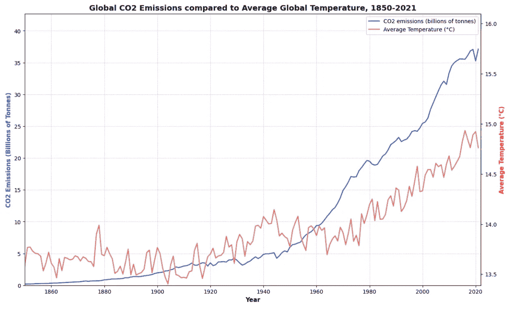
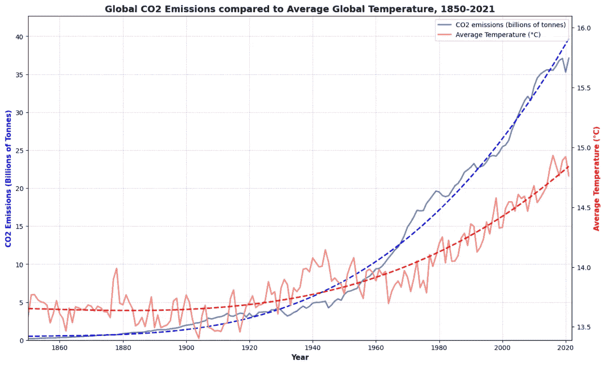
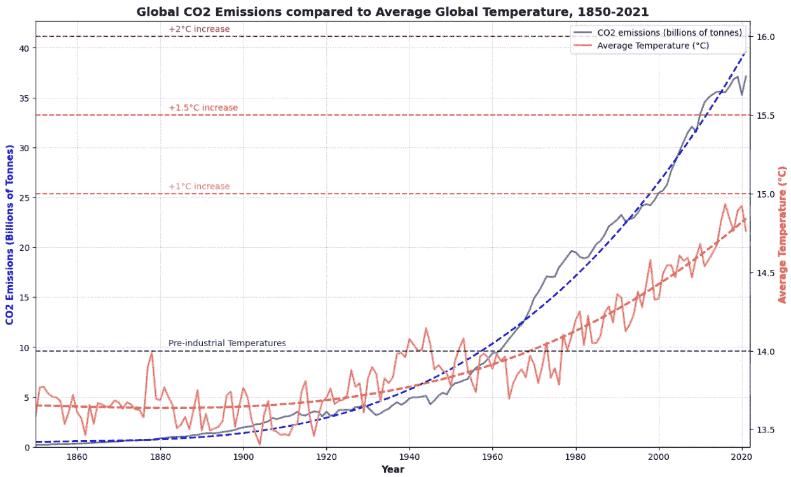
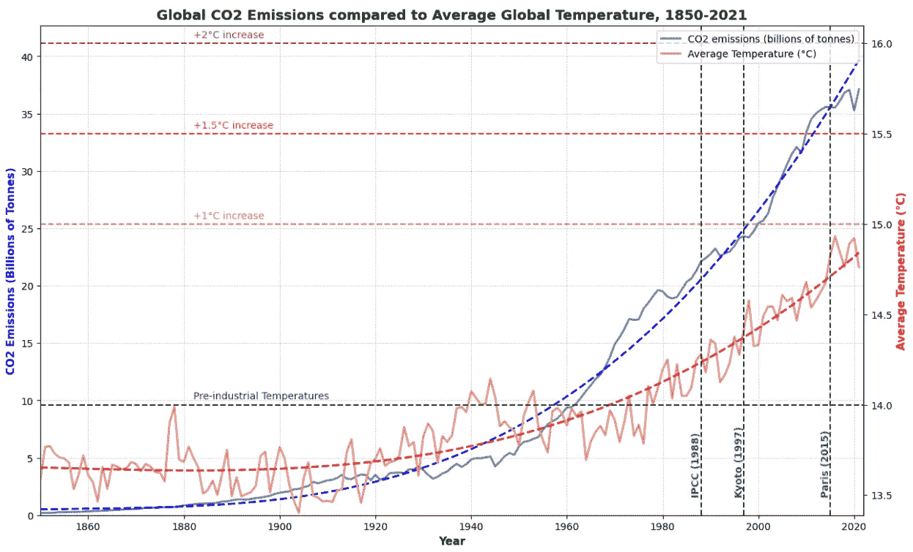
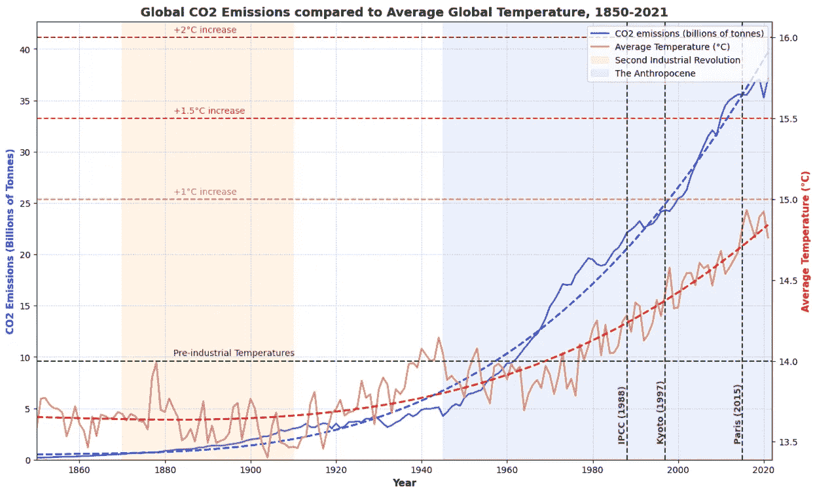
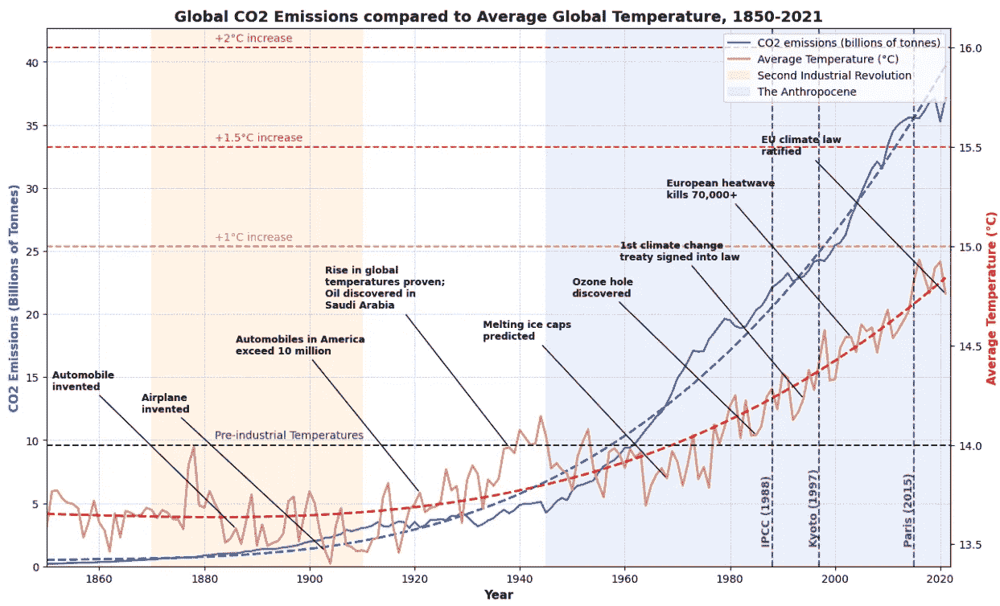

# 引导你的受众：在演示中创建引人入胜的叙事

> 原文：[`towardsdatascience.com/guide-your-audience-crafting-a-cohesive-narrative-from-the-data-4032538ff252`](https://towardsdatascience.com/guide-your-audience-crafting-a-cohesive-narrative-from-the-data-4032538ff252)

## 如何使用叙事技巧结构化你的数据展示

[](https://medium.com/@john_lenehan?source=post_page-----4032538ff252--------------------------------)[](https://towardsdatascience.com/?source=post_page-----4032538ff252--------------------------------) [John Lenehan](https://medium.com/@john_lenehan?source=post_page-----4032538ff252--------------------------------)

·发布于 [Towards Data Science](https://towardsdatascience.com/?source=post_page-----4032538ff252--------------------------------) ·14 分钟阅读·2023 年 11 月 2 日

--

*这篇文章是关于制作技术演示的一系列文章中的第二篇，其中涵盖了我用来创建引人入胜的演讲的三个关键概念——了解你的受众、引导你的受众和为回应做准备。要阅读第一篇文章，你可以点击下面的链接：*

[](/know-your-audience-a-guide-to-preparing-for-technical-presentations-1a83fdb21050?source=post_page-----4032538ff252--------------------------------) ## 了解你的受众：准备技术演示的指南

### 一种结构化的方法来创建符合利益相关者需求和关注点的地址

[towardsdatascience.com 

图片由 Teemu Paananen 提供，来源于 Unsplash

令人难忘的演示的标志是引人入胜的叙事。演讲者从一开始就吸引观众，保持稳定的演讲节奏，专注于关键细节，并在故事的结尾有明确的总结。这种框架之所以具有如此普遍的吸引力并非秘密——叙事结构在各个文化中都可以找到，超越了种族和经济背景。它们触及了人类认知和情感的基本方面，使它们成为沟通、教育和说服的有效工具。此外，以这种叙事格式呈现的信息由于其结构而更容易记住，通常遵循逻辑顺序——听众更有可能记住作为故事的一部分或形成可识别模式的细节。


由[Melyna Valle](https://unsplash.com/@melynavv?utm_source=medium&utm_medium=referral)拍摄，来自[Unsplash](https://unsplash.com/?utm_source=medium&utm_medium=referral)

通过将复杂的信息组织成这些叙事结构，可以将复杂的想法简化，并以连贯的方式呈现，使其更易于理解。将信息以逻辑情节的形式进行背景化，为演讲者提供了一种强有力的方法来吸引观众，保持他们的兴趣，并确保他们在离开讲堂后仍然记住你的演讲。

# 指导你的观众

在这篇关注技术演示的第二篇文章中，我将描述如何将叙事结构融入你的演示中，以及如何将这个故事传达给你的观众，以保持他们的参与和对你信息的接受。这将主要从数据传递技术的角度出发，例如向可视化中添加叙事元素、用标注和注释对复杂信息进行背景化——尽管我也会涉及保持演讲集中于你的核心信息，以及如何在传递数据时利用语气。此外，我还将描述叙事可视化中使用的不同方法，并展示使用 Matplotlib 开发主导叙事的典型方法。


由 Alexandre Pellaes 拍摄，来自 Unsplash

## 指导原则

***基础要做到位***

在深入探讨我通常使用的叙事可视化技术之前，让我们首先明确一些准备演示的指导原则：

1.  ***定义你的核心信息：*** 从一开始就确立你演示的主要目标——你的核心信息概括了你打算传达的基本思想，作为你演示中每一个方面的指导原则。明确的消息使你的目的更加清晰，并确保每一张幻灯片、每一句话和每个视觉元素都协同工作，形成一个统一而有影响力的演示。

1.  ***组织你的内容：*** 组织良好的演示逻辑进展，引导观众通过一个连贯的思想序列。以引人注目的引言开始，抓住他们的注意力，然后是系统地讨论主要观点的主体部分，最后以强有力的总结结束，强化你的关键信息。你演示的每个部分都应无缝地过渡到下一个部分，提供自然的流动性，并增强你信息的整体一致性。

1.  ***明智地使用视觉：*** 视觉是展示信息的强大工具。在审慎使用时，图表等视觉效果可以展示你的关键点，增强整体理解。关键在于选择直接支持你信息的视觉，确保它们清晰、相关且易于解读。视觉应该作为补充你演讲的基本组成部分，为你的展示增添深度。对于数据密集的演示来说，这一点尤为重要——在下一部分将详细讨论这一点。

1.  ***保持专注：*** 尊重观众的时间和注意力，避免偏离主题或深入不必要的细节。专注的演示简洁、相关且直接——它要求思路和表达的清晰，避免可能削弱信息影响的离题。这确保你的观众从你的演讲中获取最重要的信息，加强你核心信息的意义。

掌握演讲交付的基本要点并非易事——这些基本准则构成了有影响力的演示的基础，促进了讲者与听众之间的沟通。现在让我们来看看如何通过使用叙事可视化技巧来提升演示中的图形，为观众提供背景。


图片由[airfocus](https://unsplash.com/@airfocus?utm_source=medium&utm_medium=referral)拍摄，发布在[Unsplash](https://unsplash.com/?utm_source=medium&utm_medium=referral)上。

## 介绍视觉叙事

***一图胜千言***

首先，定义一下——*叙事可视化（或 NarViz）*是数据可视化与叙事技巧的结合，融合了支持讲故事的技巧和数据可视化技术。根据[Edmond 和 Bednarz](https://www.sciencedirect.com/science/article/pii/S2468502X2100019X)的说法，叙事可视化有 3 种不同的路径：

1.  ***引导叙事：*** 引导叙事是一种结构化的故事情节，明确引导观众对数据的解读。这是一种清晰而有意的叙述，驱动观众的注意力和理解。叙述者的视角是这种方法中的主导观点。

1.  ***综合叙事：*** 综合叙事将故事情节巧妙地融入到可视化中，让观众在研究和解读数据的同时，自己发现潜在的叙事。这种叙述方式强调探索——观众在发现叙事时发挥关键作用，参与度低。像 PowerBI 和 Tableau 这样的商业智能应用是这种讲故事形式的典型例子，互动式仪表盘允许观众自行深入数据。

1.  ***支持叙述：*** 支持叙述提供额外的背景、解释或补充信息，增强观众对数据的理解，而不强加特定的故事情节。通常，支持叙述提供背景信息，而不对内容采取任何特定的观点——从这个意义上讲，这可以说根本不是一种叙述，因为对数据没有采取任何特定的视角（叙述者或观众）。

当涉及将信息传递给更广泛的受众时，传统的方法是使用主导叙述——你（作为叙述者）掌控故事，并可以决定观众对呈现的数据采取的视角。


照片由[Matthew Osborn](https://unsplash.com/@matthewosborn?utm_source=medium&utm_medium=referral)拍摄，发布在[Unsplash](https://unsplash.com/?utm_source=medium&utm_medium=referral)

举个例子，下面是准备关于气候变化数据的 matplotlib 图表的步骤，这些数据展示为主导叙述的形式。这些数据（以及大量其他气候数据）可以在网站[Our world in Data](https://ourworldindata.org/grapher/temperature-anomaly)上自由获取，供任何人自行探索。此外，我对这些数据的探索细节可以在我的 github 项目文件夹[这里](https://github.com/jlenehan/Climate_Trends)找到。我将使用这些数据展示如何将主导叙述元素迭代地融入你的可视化中，准备数据讲述你希望它讲述的故事，并使其对观众更具可理解性。

首先，让我们使用 matplotlib 创建一个简单的折线图，展示全球平均气温和 CO2 排放量随时间的变化，分别设置两个坐标轴以比较这些数据。

```py
# Creating primary axis (CO2 emissions)
fig, ax1 = plt.subplots(figsize=(15, 9))
ax1.plot(climate_data['Year'], climate_data['CO₂ emissions (billions of tonnes)'],
         color='steelblue',linewidth=2, label='CO2 emissions (billions of tonnes)')
ax1.set_xlabel('Year',weight='bold',fontsize=11)
ax1.set_ylabel('CO2 Emissions (Billions of Tonnes)',color='blue',weight='bold',fontsize=11)

# Adjusting gridlines on primary y-axis
ax1.grid(color='blue', linestyle='--', linewidth=0.5, alpha=0.3)

# Creating secondary y-axis (relative avg temp)
ax2 = ax1.twinx()
ax2.plot(climate_data['Year'], climate_data['avg temp'],
         color='salmon', linewidth=2, label='Average Temperature (°C)')
ax2.set_ylabel('Average Temperature (°C)',color='red',weight='bold',fontsize=11)

# Setting x-axis limits for ax
ax1.set_xlim(1850, 2022)

# Setting y-axis limits for both ax1 and ax2
ax1.set_ylim(0, 1.15 * max(climate_data['CO₂ emissions (billions of tonnes)']))
ax2.set_ylim(0.999 * min(climate_data['avg temp']), 16.1)

# Combining legends for both axes
lines, labels = ax1.get_legend_handles_labels()
lines2, labels2 = ax2.get_legend_handles_labels()
ax2.legend(lines + lines2, labels + labels2, loc='upper right',fontsize=10)

# Set title
plt.title('Global CO2 Emissions compared to Average Global Temperature, 1850-2021',weight='bold',fontsize=14)

# Show plot
plt.show()
```

运行此脚本，我们得到以下图表：



简单的图表展示了 CO2 排放量和全球气温随时间的上升趋势（图片由作者提供）

从这个图表中，我们可以看到平均气温的上升似乎与全球 CO2 排放的增加相关——然而，这对被动观察者来说并不立即显而易见，需要观众付出一些努力来识别这种趋势。让我们在图表中引入趋势线，通过对每个数据集近似非线性函数来实现。Numpy 的 polyfit 函数非常适合在 python 中应用——以下代码片段被添加到原始脚本中，以将这些样条曲线添加到图形中（经过一些反复试验，使用了 3 的系数，以获得最佳拟合线）：

```py
# Spline for CO2 data
theta1 = np.polyfit(climate_data['Year'], 
                    climate_data['CO₂ emissions (billions of tonnes)'],3)
CO2_spline = theta1[3]+theta1[2]*pow(climate_data['Year'],
                                     1)+theta1[1]*pow(climate_data['Year'],
                                                      2)+theta1[0]*pow(climate_data['Year'],3)

#plotting CO2 spline
ax1.plot(climate_data['Year'], CO2_spline,
         color='blue', linestyle ='dashed', linewidth=2, label=None)

# Spline for temp data
theta2 = np.polyfit(climate_data['Year'], 
                    climate_data['avg temp'],3)
temp_spline = theta2[3]+theta2[2]*pow(climate_data['Year'],
                                      1)+theta2[1]*pow(climate_data['Year'],
                                                       2)+theta2[0]*pow(climate_data['Year'],3)
```

现在观众更容易看到两个数据集的上升趋势：



在图形中添加样条曲线以显示上升趋势（图片由作者提供）

到目前为止看起来不错——但如何在数据中显示一个“好坏”指标（或在这种情况下是“坏”）？假设你想在图表上展示[工业化前的平均温度](http://onlinelibrary.wiley.com/doi/10.1029/2010RG000345/abstract)（这是气候科学中的一个常用标准），以及平均温度增量的限制（在这种情况下为 +1、+1.5 和 +2 摄氏度）。这些限制来自于[《巴黎气候协议》](https://unfccc.int/sites/default/files/english_paris_agreement.pdf)，该协议要求各国努力将全球变暖控制在工业化前水平以上不超过 1.5 摄氏度。可以使用 matplotlib 的 axhline 函数来引入这些限制——下面是将其添加到初始脚本中的一个示例：

```py
# Adding horizontal constant line at 14C (pre-industrial mean temp)
ax2.axhline(y=14, color='black', linestyle='--',alpha=cnst_alpha)
pre_ind_label = 'Pre-industrial Temperatures'
ax2.text(1882,14.03,pre_ind_label,color='black',alpha=cnst_alpha)

#Adding horizontal constant line at 15.5C (+1.5C Mean Temp)
ax2.axhline(y=15, color='darkgoldenrod', linestyle='--',alpha=cnst_alpha)
increase_label1 = '+1°C increase'
ax2.text(1882,15.03,increase_label1,color='darkgoldenrod',alpha=cnst_alpha)

# Adding horizontal constant line at 15C (+1C mean temp)
ax2.axhline(y=15.5, color='red', linestyle='--',alpha=cnst_alpha)
increase_label2 = '+1.5°C increase'
ax2.text(1882,15.53,increase_label2,color='red',alpha=cnst_alpha)

#Adding horizontal constant line at 16C (+2C Mean Temp)
ax2.axhline(y=16, color='darkred', linestyle='--',alpha=cnst_alpha)
increase_label3 = '+2°C increase'
ax2.text(1882,16.03,increase_label3,color='darkred',alpha=cnst_alpha)
```

基于这些限制，我们可以看到图表上我们正接近 1 摄氏度的增幅，全球排放量没有放缓的迹象——如果我们想保持在《巴黎气候协议》规定的 1.5 摄氏度限制以下，这并不好：



向图形中添加 x 轴限制（图像由作者提供）

同样地，假设我们想要在时间轴上展示一些关于气候变化的[重要条约](https://www.europarl.europa.eu/infographic/climate-negotiations-timeline/index_en.html)和组织发生的时间——我们可以使用 matplotlib 的 axvline 函数应用垂直常数线。在这种情况下，我选择展示气候变化政府间专门委员会（IPCC）成立的日期、《京都议定书》通过的日期，以及《巴黎气候协议》生效的日期：

```py
#Adding vertical constant line at 1988 (IPCC)
plt.axvline(x=1988, color='darkgreen',linestyle='--',alpha=cnst_alpha)
IPCC_label='IPCC (1988)'
ax2.text(1986,13.5,IPCC_label,color='darkgreen',weight='bold',fontsize=10,rotation=90,alpha=cnst_alpha)

#Adding vertical constant line at 1995 (Kyoto)
plt.axvline(x=1997, color='darkgreen',linestyle='--',alpha=cnst_alpha)
kyoto_label='Kyoto (1997)'
ax2.text(1995,13.5,kyoto_label,color='darkgreen',weight='bold',fontsize=10,rotation=90,alpha=cnst_alpha)

#Adding vertical constant line at 2015 (Paris)
plt.axvline(x=2015, color='darkgreen',linestyle='--',alpha=cnst_alpha)
paris_label='Paris (2015)'
ax2.text(2013,13.5,paris_label,color='darkgreen',weight='bold', fontsize=10,rotation=90,alpha=cnst_alpha)
```

现在图表显示了所有这些重要事件发生的时间，如下所示，这使得政府决定采取一些气候变化行动的时间点变得清晰：



向图形中添加 y 轴限制（图像由作者提供）

在 matplotlib 图形的任一轴上显示重要区域的另一种方法是使用 span 函数来展示范围或时期。对于这个图表，我决定展示被称为[第二次工业革命](https://faculty.wcas.northwestern.edu/jmokyr/castronovo.pdf)（或技术革命）的时间段，以及当前人类驱动的气候变化时期（[人类世](http://doi.org/10.29164/19anthro)）。为此，我在图表上应用了 axvspan 函数，如下片段所示：

```py
# Specifying regions to shade on the x-axis
plt.axvspan(1870, 1910, alpha=0.1, color='darkorange', 
            label='Second Industrial Revolution')
plt.axvspan(1945, 2022, alpha=0.1, color='royalblue', 
            label='The Anthropocene')
```

现在图表展示了这些重要的历史时期，这有助于展示人类活动如何与气候变化相关联的整体叙述。



向图形中添加阴影区域（图像由作者提供）

最后，假设我们要指出[过去两个世纪的关键发展](https://www.discover.ukri.org/a-brief-history-of-climate-change-discoveries/index.html#group-section-1990s-2000s-bwnXtJHqpd)，这些发展导致了碳排放（及随之而来的全球温度）的增加；这可以通过使用注释来完成。下面，我列出了若干个关键事件和日期，然后将这些注释添加到图表中，并指出了该年的平均温度。请注意，对于使用多个坐标轴的图表，有必要指定应用注释的轴，如下所示：

```py
#adding callouts for key dates
# Points to annotate (x, y, annotation_text)
callouts = [(1886, climate_data.loc[climate_data['Year'] == 1886, 'avg temp'].values[0], 'Automobile \ninvented'),
            (1903, climate_data.loc[climate_data['Year'] == 1903, 'avg temp'].values[0], 'Airplane \ninvented'),
            (1921, climate_data.loc[climate_data['Year'] == 1921, 'avg temp'].values[0], 'Automobiles in America\nexceed 10 million'),
            (1938, climate_data.loc[climate_data['Year'] == 1938, 'avg temp'].values[0], 'Rise in global\ntemperatures proven;\nOil discovered in\nSaudi Arabia'), 
            (1968, climate_data.loc[climate_data['Year'] == 1968, 'avg temp'].values[0], 'Melting ice caps \npredicted'), 
            (1985, climate_data.loc[climate_data['Year'] == 1985, 'avg temp'].values[0], 'Ozone hole \ndiscovered'),
            (1994, climate_data.loc[climate_data['Year'] == 1994, 'avg temp'].values[0], '1st climate change \ntreaty signed into law'),
            (2003, climate_data.loc[climate_data['Year'] == 2003, 'avg temp'].values[0], 'European heatwave \nkills 70,000+'),
            (2021, climate_data.loc[climate_data['Year'] == 2021, 'avg temp'].values[0], 'EU climate law\nratified')
           ]

# Iterate over specified points and add minimal annotations
for point in callouts:
    x_point, y_point, annotation_text = point
    ax2.annotate(annotation_text, xy=(x_point, y_point), xytext=(x_point - 35, y_point + 0.7),
                 arrowprops=dict(arrowstyle='-', color='black'),
                 fontsize=9, weight='bold')  # Set font size for annotation text
```

现在，这张图表讲述了有关气候变化的更详细的故事，以及为何会发生这种变化。在第二次工业革命期间，汽车和飞机的发明、它们的广泛使用以及在中东发现的大量石油，导致了 1945 年人类世时期的开始。二氧化碳排放量和全球温度的急剧上升引发了一些令人担忧的气候预测和事件，促使各国政府通过立法努力遏制和减少气候变化。



向图表添加标注（图片由作者提供）

通过添加注释和结构化数据以帮助理解，即使是最复杂的主题也能被听众轻松理解。这在试图在时间有限的大型群体中描述这些概念时尤为重要，这也是大多数演讲的情况——因此，使用这些引导叙事元素对于智能且富有洞察力的演讲至关重要。

## 关于语调的一些笔记

***不是你说什么，而是你如何说***

最后，我想花几分钟来扩展一下在演讲时语调的重要性——这是一个关键点，确保你的听众能完全理解你所讲述的内容。[1967 年 Mehrabian 的研究](https://psycnet.apa.org/doiLanding?doi=10.1037%2Fh0024532) 表明，沟通中只有 7%是通过语言进行的——38%基于声音语调，55%基于面部表情。因此，为了传达你的完整信息，要注意你使用的语调以及你说话时的表情。

在他的书《绝不妥协》中，前 FBI 人质谈判专家克里斯·沃斯谈到了一个叫做“深夜 FM DJ 声音”的概念——这种低沉缓慢的声音非常适合他曾参与的紧张局势，它将讲述者和听众都带入平静而接纳的心理状态。你可能会想，FBI 谈判专家的建议与您的演讲有什么关系——这种语调通常是与利益相关者讨论紧张或有争议的点时所需的方式，清晰、稳重的表达对于使自己清楚地传达信息并向听众展现平静的形象至关重要。

继续我们之前关于绘制气候变化数据的示例——对于一个假设的观众，这些信息应以冷静但乐观的语调呈现，以强调情况的严重性，同时突出迄今为止所采取的步骤以及仍需完成的工作。通过这种方式，观众从这次演讲中得到两个关键点——我们面临的气候紧急情况是真实且严重的威胁，并且仍有措施可以减轻或消除气候变化带来的威胁。


由 Ioann-Mark Kuznietsov 在 Unsplash 上拍摄

## 总结

总之，本文提供了我在准备演讲时使用的基本原则的高层次概述，包括定义你的关键消息、组织你的要点和保持主题。我描述了从数据中讲述叙事的不同方法，然后逐步讲解了使用 matplotlib 绘制气候数据趋势图来准备引导叙事的关键技巧，使数据背后的故事对观众更为明显。最后，我简要说明了向潜在观众传递这些数据时的语调，确保以合适的节奏和重点传达完整的信息。通过将这些技巧融入到你的演讲中，你将拥有适当引导观众理解数据的工具，并确保你的演讲产生持久的影响。

## 参考文献

[1] Edmond, C., & Bednarz, T. (2021). 叙事可视化的三种轨迹。*视觉信息学*, 5(2021), 26–40。

[2] 英国气象局哈德利中心. (2023). *全球平均温度异常*. 获取自 [`ourworldindata.org/grapher/temperature-anomaly`](https://ourworldindata.org/grapher/temperature-anomaly)

[3] 全球碳预算 (2022). *年度* CO2 *排放量*. 获取自 [`ourworldindata.org/co2-emissions#global-co2-emissions-from-fossil-fuels`](https://ourworldindata.org/co2-emissions#global-co2-emissions-from-fossil-fuels)

[4] Hansen, J., 等 (2010). *全球地表温度变化*. *地球物理学评论*, 48\. 获取自 [`onlinelibrary.wiley.com/doi/10.1029/2010RG000345/abstract`](http://onlinelibrary.wiley.com/doi/10.1029/2010RG000345/abstract) (访问时间：2023 年 10 月 21 日)。

[5] 联合国. (2015). *巴黎协定 第 2.1 条(a)*. 获取自 [`unfccc.int/sites/default/files/english_paris_agreement.pdf`](https://unfccc.int/sites/default/files/english_paris_agreement.pdf) (访问时间：2023 年 10 月 20 日)。

[6] 联合国, 欧洲委员会 (无日期). *气候变化谈判指南*. 获取自 [`www.europarl.europa.eu/infographic/climate-negotiations-timeline/index_en.html`](https://www.europarl.europa.eu/infographic/climate-negotiations-timeline/index_en.html) (访问时间：2023 年 10 月 21 日)。

[7] Mokyr, J. (1998). *第二次工业革命，1870–1914*。检索自 [`faculty.wcas.northwestern.edu/jmokyr/castronovo.pdf`](https://faculty.wcas.northwestern.edu/jmokyr/castronovo.pdf)（访问日期：2023 年 10 月 21 日）。

[8] Chua, L., & Fair, H. (2019). 人类世。载于 F. Stein（编），*人类学开放百科全书*。为*剑桥人类学百科全书*的首版影印本。检索自 [`doi.org/10.29164/19anthro`](http://doi.org/10.29164/19anthro)（访问日期：2023 年 10 月 22 日）。

[9] Roos, J. (2022). *改变世界的 7 项镀金时代发明*。检索自 [`www.history.com/news/most-important-gilded-age-inventions`](https://www.history.com/news/most-important-gilded-age-inventions)（访问日期：2023 年 10 月 22 日）。

[10] Statista (1993). *1900 年至 1988 年美国在用乘用车和商用汽车的数量*。检索自 [`www.statista.com/statistics/1246890/vehicles-use-united-states-historical/`](https://www.statista.com/statistics/1246890/vehicles-use-united-states-historical/)（访问日期：2023 年 10 月 22 日）。

[11] UK Research and Innovation. (2021). *气候变化发现简史*。检索自 [`www.discover.ukri.org/a-brief-history-of-climate-change-discoveries/index.html#group-section-1990s-2000s-bwnXtJHqpd`](https://www.discover.ukri.org/a-brief-history-of-climate-change-discoveries/index.html#group-section-1990s-2000s-bwnXtJHqpd)（访问日期：2023 年 10 月 22 日）。

[12] Mehrabian, A., & Wiener, M. (1967). 不一致交流的解码。*人格与社会心理学杂志*，6(1)，109–114。 [`doi.org/10.1037/h0024532`](https://doi.org/10.1037/h0024532)

[13] Voss, C., & Raz, T. (2017). *绝不妥协*。随机房出版社商业图书。
