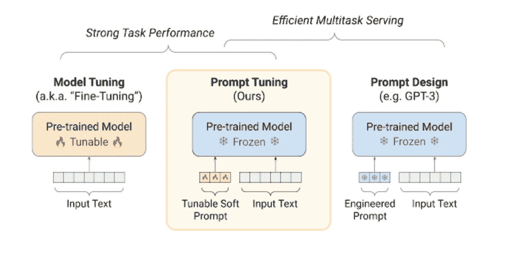

# 指导大型语言模型进行任务特定推理 — 提示设计与软提示

> 原文：[`towardsdatascience.com/guiding-a-huge-language-model-lm-to-perform-specific-tasks-prompt-design-and-soft-prompts-7c45ef4794e4?source=collection_archive---------1-----------------------#2023-02-27`](https://towardsdatascience.com/guiding-a-huge-language-model-lm-to-perform-specific-tasks-prompt-design-and-soft-prompts-7c45ef4794e4?source=collection_archive---------1-----------------------#2023-02-27)

## 了解提示设计和软提示如何用于开发和部署 SOTA 模型。

 [Prem Oommen](https://thedataoracle.medium.com/?source=post_page-----7c45ef4794e4--------------------------------)

·

[关注](https://medium.com/m/signin?actionUrl=https%3A%2F%2Fmedium.com%2F_%2Fsubscribe%2Fuser%2Facf7c5b0eda6&operation=register&redirect=https%3A%2F%2Ftowardsdatascience.com%2Fguiding-a-huge-language-model-lm-to-perform-specific-tasks-prompt-design-and-soft-prompts-7c45ef4794e4&user=Prem+Oommen&userId=acf7c5b0eda6&source=post_page-acf7c5b0eda6----7c45ef4794e4---------------------post_header-----------) 发表于 [Towards Data Science](https://towardsdatascience.com/?source=post_page-----7c45ef4794e4--------------------------------) ·8 分钟阅读·2023 年 2 月 27 日

--

图片来源：[camilo jimenez](https://unsplash.com/@camstejim?utm_source=medium&utm_medium=referral) 在 [Unsplash](https://unsplash.com/?utm_source=medium&utm_medium=referral)

提示（Prompting）是为训练好的模型提供额外信息的过程，以在预测任务的输出标签时进行条件设置。这是通过*提示*来完成的，提示是输入到模型中的几行指令，用于执行某项任务，无论是否提供了几个示例。

最近，随着大型 Transformer 模型如[GPT-2](https://d4mucfpksywv.cloudfront.net/better-language-models/language_models_are_unsupervised_multitask_learners.pdf)和[GPT-3](https://arxiv.org/abs/2005.14165)的成功，提示得到了大量关注。通过 GPT-2，OpenAI 证明了扩大模型规模可以相对提高其任务特定性能，而不需要更新模型在下游任务中的权重。通过 GPT-3，他们展示了描述所需任务的提示加上零到少量的结果样本，足以使这些大型模型成功执行任务。这催生了***提示工程（Prompt Engineering）***，其目标是精心策划这些输入提示，以从模型中提取最佳结果。在此基础上，谷歌的研究人员最近推出了***提示调优（Prompt Tuning）***，其思想是学习***软提示（Soft Prompts）***，这些软提示可以指导大型语言模型（LLMs）执行各种任务。这些提示是经过训练的权重，一旦调优后，可以与输入一起提供给冻结的语言模型，以获得所需的结果。

# 背景

越来越多的趋势倾向于预训练语言模型，以创建任务无关的语言表示，这些表示可以通过特定任务的数据集和架构灵活地适应以执行特定任务。一个相关的例子是谷歌的[BERT](https://arxiv.org/abs/1810.04805)，它具有多层双向 Transformer 编码器，并在未标注的数据集上使用掩码语言模型（Masked LM）和下一句预测（NSP）进行预训练。然后，模型必须在下游任务中使用标注数据进行微调，以更新其参数。BERT 的一个显著特点是通过在预训练和微调过程中使用统一架构，能够避免需要任务特定架构的问题：

> 预训练的 BERT 模型可以通过仅添加一个额外的输出层来微调，以创建用于广泛任务（如问答和语言推理）的最先进模型，而无需对任务特定架构进行重大修改。— BERT: 语言理解的深度双向 Transformer 预训练

这显而易见的缺点是需要任务特定的数据集和精细调优方法，这限制了模型的适用性。在面临需要利用训练好的语言模型进行特定任务时，研究人员/开发人员通常会陷入获取大量特定任务标注数据的繁重任务，这需要为每个新任务重复进行。此外，[研究](https://arxiv.org/abs/2004.06100)表明，大型精细调优模型可能对训练分布过于特定，难以很好地泛化到分布外，导致领域转移的问题。这主要归因于在预训练和精细调优过程中训练的数据量的差异。

# 1\. 使用纯文本进行编程 — 提示设计

多任务学习一直是克服这些限制和提高模型总体性能的一个有前途的框架。实现这一目标的一个最突出的方式是元学习，其中模型在训练过程中被教会执行多个任务，以便它能够发展广泛的技能和模式识别能力，这些能力在推断时可以被利用来生成期望的输出。随着变换器的引入，GPT2 展示了通过学习* p(output | input, task)* 的条件概率，可以实现这一点，使其成为多任务学习者*。* 尽管沿着这些方向已有一些类似的研究，如 [MAML](https://paperswithcode.com/method/maml#:~:text=MAML%2C%20or%20Model%2DAgnostic%20Meta,a%20parametrized%20function%20with%20parameters%20.)（模型无关元学习）和 [MQAN](https://arxiv.org/abs/1806.08730)（多任务问答网络），变换器的可扩展性和大量数据的可用性使研究人员能够开发出任务无关的模型，这些模型可以与现有的精细调优模型相媲美。此外，MQAN 展示了常见 NLP 任务的特性提供了将它们转化为带有执行每个任务说明的问答任务的灵活性。这是其中之一。

虽然 GPT2 显示出大型模型可以进行多任务学习，但 GPT3，主要在模型大小、数据规模和多样性以及训练时间上与前者有所不同，表明在少量样本设置中（通过文本交互指定）可以改善大型语言模型的下游任务，而无需任何梯度更新或微调。这节省了训练、存储和部署不同任务特定模型的需求。这里的少量样本(*K*)表示模型只需几个示例，*K* 从 0 到模型令牌限制能容纳的最大值。为了对比基于 *K* 的性能差异，*图 1* 显示了模型在 [LAMBADA](https://arxiv.org/abs/1606.06031)（语言建模拓展到话语方面）基准数据集上的准确率。该基准的目标是通过要求模型预测段落末尾最可能的词来评估模型理解文本段落的能力。这也可以间接测量模型捕捉长程依赖的能力。有关 GPT-3 在各种语言建模基准上的表现，请参阅其原始论文 [这里](https://arxiv.org/pdf/2005.14165.pdf)。

图 1\. GPT-3 在不同少量样本（K）设置下的 LAMBADA 性能。来源: [语言模型是少样本学习者](https://arxiv.org/abs/2005.14165)

不幸的是，提示设计也存在一些关键缺陷。模型性能的质量通常取决于任务描述，并受限于模型输入中可以容纳的条件文本量。构建高质量提示需要人工参与，并涉及对每个任务运行多个实验，测试几种提示设计。尽管已有尝试（如 [*AutoPrompt*](https://arxiv.org/abs/2010.15980)）自动生成提示，并有工具（如 [*promptsource*](https://github.com/bigscience-workshop/promptsource)）可用于简化过程，但性能往往无法超越 SOTA。

# 2\. 可学习提示 — 提示调优

另一种技术由 Google 提出，建立在其文本到文本 T5 语言模型之上，是训练一组特定任务的令牌，这些令牌可以附加到冻结的语言模型输入令牌上。***提示调优***是学习每个下游任务的可调令牌的过程，这些令牌可以预先附加到输入文本中。这是一种高效的冻结模型条件方法，因为即使模型规模较小，也能实现与 SOTA 相当的性能，但与提示设计不同，它们仍需任务特定的数据集来训练这些提示。

虽然用于*提示设计*的输入令牌的嵌入来自模型自身的嵌入空间，但用于*提示调优*的令牌嵌入则是从特定任务的数据集中单独学习得到的。此外，与*模型调优*中更新模型权重的方法不同，此方法仅更新提示权重，同时保持模型权重不变。

图 2\. 对比模型调优和提示调优的服务效果。来源：[参数高效提示调优的规模力量](https://aclanthology.org/2021.emnlp-main.243.pdf)

如*图 2*所示，这进一步使得通过批处理和向量化来节省资源成为可能。学习到的任务提示可以附加到各种任务输入中，以创建一个多任务批处理，并将其传递给相同的冻结模型。

提示调优的另一个优势是它能够调节模型的输入表示，从而防止模型修改其学习到的语言通用理解。他们认为，这将帮助模型在使用这些数据集时克服分布外错误。为了证明这一点，研究人员调查了提示调优在问答和同义句检测上的零样本领域转移性能。提示在 SQuAD 上进行了训练，结果显示提示调优在大多数常见的领域外数据集上优于模型调优（图 3\. 有关详细结果，请参见[论文](https://aclanthology.org/2021.emnlp-main.243.pdf)）。这表明，在领域外任务中，用轻量级提示代替重型模型可以以更低的计算和内存成本获得更好的性能。

图 3\. 在不同的领域外数据集上对比提示调优和模型调优的 F1 分数。来源：[参数高效提示调优的规模力量](https://aclanthology.org/2021.emnlp-main.243.pdf)

由于软提示可以用来影响模型的嵌入空间以适应下游任务，它们提供了一种高效的方式来集成巨大的语言模型而没有相关的开销。提高任务性能的一种方法是使用多个具有不同初始化的微调模型，但在相同数据上训练。这可以通过软提示高效地完成，因为现在可以创建*N*个具有不同初始化的单独提示，而不是*N*个微调模型。之前讨论的批处理和向量化的想法也可以在这里使用，以通过对冻结的语言模型进行一次传递来获得结果。

论文进一步报告了消融研究的结果，调查了提示长度、初始化方法以及预训练目标的选择如何影响提示调优的性能，因此我强烈推荐阅读[论文](https://aclanthology.org/2021.emnlp-main.243.pdf)以了解更多信息。

# 关键要点：

图 4\. 比较模型调优、提示设计和提示调优。来源：[缩放的力量：高效参数提示调优](https://aclanthology.org/2021.emnlp-main.243.pdf)

+   ***模型调优*** 涉及在下游任务中更新任务无关的预训练语言模型的权重，是否更新底层架构都可以。因此，每个应用只能由其自身的模型服务，并且在分布外示例上的表现相当差。

+   ***提示设计*** 适用于大规模语言模型，这些模型将每个 NLP 任务视为一种问答问题，输出标签通常是一系列标记。通过冻结模型权重，这些模型能够通过少量样本提示快速适应任务。然而，由于提示文本大多是手动创建的，输出的质量取决于输入提示和任务描述的质量。

+   与更新模型权重不同，***提示调优*** 涉及训练一个独立于模型嵌入空间的标记向量，可以根据当前任务调节模型的嵌入。这些提示可以与特定任务的输入一起批处理，并输入到一个冻结的模型中。这种方法对领域偏移表现出强大的弹性，并且能够有效替代神经网络集成。

# 参考文献：

+   GPT 2: Radford, Alec, 等。“语言模型是无监督的多任务学习者。” *OpenAI 博客* 1.8 (2019): 9。

+   GPT 3: Brown, Tom, 等。“语言模型是少样本学习者。” *神经信息处理系统进展* 33 (2020): 1877–1901。

+   MAML: Finn, Chelsea, Pieter Abbeel, 和 Sergey Levine。“模型无关的元学习用于深度网络的快速适应。” *国际机器学习会议*。PMLR, 2017。

+   MQAN: McCann, Bryan, 等。“自然语言十项全能：将多任务学习作为问题回答。” *arXiv 预印本 arXiv:1806.08730* (2018)。

+   提示调优：Lester, Brian, Rami Al-Rfou, 和 Noah Constant。“缩放的力量：高效参数提示调优。” *arXiv 预印本 arXiv:2104.08691* (2021)。
